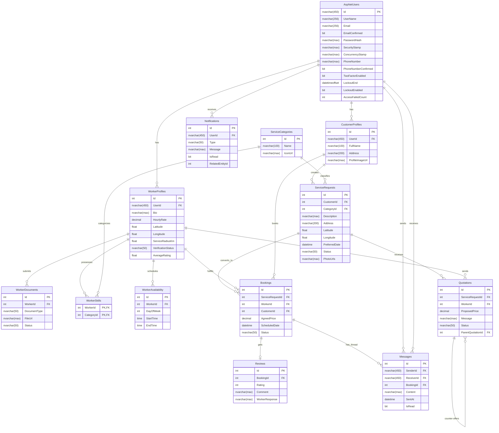

```mermaid
erDiagram
    AspNetUsers ||--o{ CustomerProfiles : has
    AspNetUsers ||--o{ WorkerProfiles : has
    AspNetUsers ||--o{ Notifications : receives
    WorkerProfiles ||--o{ WorkerDocuments : submits
    WorkerProfiles ||--o{ WorkerSkills : possesses
    ServiceCategories ||--o{ WorkerSkills : categorizes
    WorkerProfiles ||--o{ WorkerAvailability : schedules
    CustomerProfiles ||--o{ ServiceRequests : creates
    ServiceCategories ||--o{ ServiceRequests : classifies
    ServiceRequests ||--o{ Quotations : receives
    WorkerProfiles ||--o{ Quotations : sends
    Quotations ||--o{ Quotations : "counter-offers"
    ServiceRequests ||--o{ Bookings : converts_to
    WorkerProfiles ||--o{ Bookings : fulfills
    CustomerProfiles ||--o{ Bookings : books
    Bookings ||--o| Reviews : gets
    Bookings ||--o{ Messages : has_thread
    AspNetUsers ||--o{ Messages : sends
    AspNetUsers ||--o{ Messages : receives

    AspNetUsers {
        nvarchar(450) Id PK
        nvarchar(256) UserName
        nvarchar(256) Email
        bit EmailConfirmed
        nvarchar(max) PasswordHash
        nvarchar(max) SecurityStamp
        nvarchar(max) ConcurrencyStamp
        nvarchar(max) PhoneNumber
        bit PhoneNumberConfirmed
        bit TwoFactorEnabled
        datetimeoffset LockoutEnd
        bit LockoutEnabled
        int AccessFailedCount
    }

    CustomerProfiles {
        int Id PK
        nvarchar(450) UserId FK
        nvarchar(100) FullName
        nvarchar(200) Address
        nvarchar(max) ProfileImageUrl
    }

    WorkerProfiles {
        int Id PK
        nvarchar(450) UserId FK
        nvarchar(max) Bio
        decimal HourlyRate
        float Latitude
        float Longitude
        float ServiceRadiusKm
        nvarchar(50) VerificationStatus
        float AverageRating
    }

    WorkerDocuments {
        int Id PK
        int WorkerId FK
        nvarchar(50) DocumentType
        nvarchar(max) FileUrl
        nvarchar(50) Status
    }

    ServiceCategories {
        int Id PK
        nvarchar(100) Name
        nvarchar(max) IconUrl
    }

    WorkerSkills {
        int WorkerId PK,FK
        int CategoryId PK,FK
    }

    WorkerAvailability {
        int Id PK
        int WorkerId FK
        int DayOfWeek
        time StartTime
        time EndTime
    }

    ServiceRequests {
        int Id PK
        int CustomerId FK
        int CategoryId FK
        nvarchar(max) Description
        nvarchar(200) Address
        float Latitude
        float Longitude
        datetime PreferredDate
        nvarchar(50) Status
        nvarchar(max) PhotoUrls
    }

    Quotations {
        int Id PK
        int ServiceRequestId FK
        int WorkerId FK
        decimal ProposedPrice
        nvarchar(max) Message
        nvarchar(50) Status
        int ParentQuotationId FK
    }

    Bookings {
        int Id PK
        int ServiceRequestId FK
        int WorkerId FK
        int CustomerId FK
        decimal AgreedPrice
        datetime ScheduledDate
        nvarchar(50) Status
    }

    Reviews {
        int Id PK
        int BookingId FK
        int Rating
        nvarchar(max) Comment
        nvarchar(max) WorkerResponse
    }

    Messages {
        int Id PK
        nvarchar(450) SenderId FK
        nvarchar(450) ReceiverId FK
        int BookingId FK
        nvarchar(max) Content
        datetime SentAt
        bit IsRead
    }

    Notifications {
        int Id PK
        nvarchar(450) UserId FK
        nvarchar(50) Type
        nvarchar(max) Message
        bit IsRead
        int RelatedEntityId
    }
```
