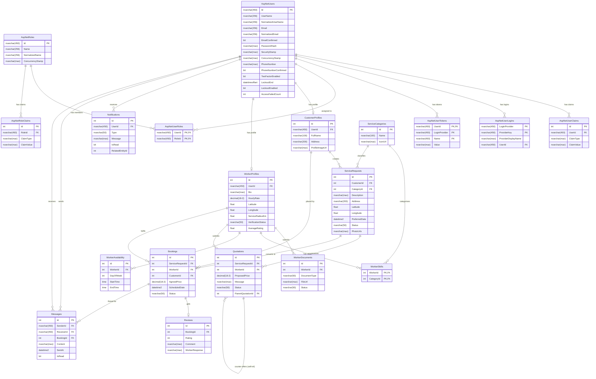

# Karigor — Entity Relationship Diagram

## Mermaid Diagram

---

## Relationship Descriptions

### Identity Layer (ASP.NET Core Identity — 7 tables)

These tables are owned by ASP.NET Core Identity and managed via `IdentityDbContext<ApplicationUser>`.
They are scripted manually in `001_initial_schema.sql` rather than generated by EF migrations.

| Table | Role |
|-------|------|
| `AspNetUsers` | Central user store — every app user (customer, worker, admin) has one row |
| `AspNetRoles` | Role definitions: `Customer`, `Worker`, `Admin` |
| `AspNetUserRoles` | Many-to-many join between users and roles |
| `AspNetUserClaims` | Per-user custom claims (e.g., profile completion flags) |
| `AspNetRoleClaims` | Per-role claims attached to all members of that role |
| `AspNetUserLogins` | External login providers (OAuth) — one login per user per provider |
| `AspNetUserTokens` | Stored tokens (e.g., password reset, 2FA codes) |

### Profile Layer

Each `AspNetUsers` row has **at most one** `CustomerProfiles` row and **at most one** `WorkerProfiles` row.
A user registered as a customer will have a `CustomerProfiles` row; as a worker, a `WorkerProfiles` row.
(An admin will have neither profile row by default.)

### Worker Sub-entities

- `WorkerDocuments`: verification documents uploaded by a worker (e.g., NID, trade certificate).
- `WorkerSkills`: junction table connecting `WorkerProfiles` to `ServiceCategories` — a worker may offer multiple service types.
- `WorkerAvailability`: weekly schedule entries (by `DayOfWeek` 0–6) indicating when a worker is available.

### Service Request & Transaction Flow

1. A **customer** creates a `ServiceRequests` row, selecting a `ServiceCategories` entry and providing location/description.
2. **Workers** respond with `Quotations`. A `Quotation` can counter-offer another via the self-referencing `ParentQuotationId` FK.
3. When a quotation is accepted, a `Bookings` row is created linking the service request, the worker, and the customer.
4. After service completion, a `Reviews` row (one per booking, `||--o|` cardinality) captures rating and comments.
5. `Messages` threads may be attached to a booking or be standalone direct messages between users.
6. `Notifications` are user-scoped and reference an optional related entity by ID.

### Required Indexes

| Index | Rationale |
|-------|-----------|
| `IX_WorkerProfiles_VerificationStatus` | Admin panel filtering of pending/verified/rejected workers |
| `IX_ServiceRequests_Status` | Customer/worker dashboards filtering open/assigned/completed requests |
| `IX_ServiceRequests_CategoryId` | Worker discovery filtered by service category |
