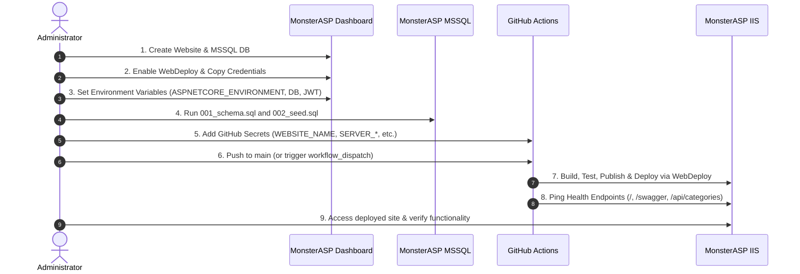

# KARIGOR — Production Deployment Guide on MonsterASP.NET

This operational guide provides complete, step-by-step instructions for deploying and running **KARIGOR** on [MonsterASP.NET](https://admin.monsterasp.net/app/dashboard).

---

## 1. Target Architecture

The production architecture hosts both the React client-side application (SPA) and ASP.NET Core Web API under a **single HTTPS origin** on IIS:

```
                            GitHub (push / workflow_dispatch)
                                         │
                                         ▼
                            GitHub Actions CD Pipeline
                                         │
                 ┌───────────────────────┴───────────────────────┐
                 │ 1. Build Backend (.NET 10 Release)            │
                 │ 2. Build Frontend (Vite Production -> dist)   │
                 │ 3. Copy dist/ into Karigor.Api/wwwroot/       │
                 │ 4. Publish unified artifact + web.config      │
                 └───────────────────────┬───────────────────────┘
                                         │
                                         ▼
                                WebDeploy (MSDeploy)
                                         │
                                         ▼
                            MonsterASP.NET (IIS 10.x)
                 ┌───────────────────────────────────────────────┐
                 │               https://yourdomain              │
                 │                                               │
                 │   /                 React SPA (index.html)    │
                 │   /login, /customer React Router (via IIS)    │
                 │   /api/*            ASP.NET Core Web API      │
                 │   /hubs/*           SignalR Realtime Hub      │
                 │   /swagger          OpenAPI Documentation     │
                 │   /uploads/*        Static Uploaded Docs      │
                 └───────────────────────┬───────────────────────┘
                                         │
                                         ▼
                              MonsterASP Hosted MSSQL
```

### Key Architectural Benefits
- **Zero Cross-Origin Issues:** No CORS preflight latency, no cross-site cookie blocking, and no mixed-content issues.
- **Unified HTTPS:** SSL/TLS terminated via Let's Encrypt at the MonsterASP edge.
- **Survives Redeployment:** User uploads stored under `wwwroot/uploads` are protected from deletion across WebDeploy runs via MSDeploy skip rules.

---

## 2. Prerequisites

Before deploying, ensure you have:
1. An active account on [MonsterASP.NET](https://admin.monsterasp.net/app/dashboard).
2. Administrative access to the GitHub repository: [ShadmanMuhtasim/Karigor](https://github.com/ShadmanMuhtasim/Karigor).
3. SQL Server Management Studio (SSMS), Azure Data Studio, or the MonsterASP web database client for initial database provisioning.
4. A secure, random 32+ character string for production JWT signing.

---

## 3. MonsterASP Website Setup

1. Log in to the [MonsterASP.NET Control Panel](https://admin.monsterasp.net/app/dashboard).
2. Navigate to **Websites** (or check current MonsterASP dashboard wording).
3. Click **Create New Website** (or **Add Website**).
4. Enter your desired website name (e.g., `karigor`).
5. MonsterASP assigns a default subdomain (e.g., `karigor.monsterasp.net`).
6. Enable **Free SSL (Let's Encrypt)** under the website's SSL/Security settings.

---

## 4. .NET Runtime Configuration

1. In your website's settings in the MonsterASP dashboard, navigate to **ASP.NET / .NET Version** (check dashboard wording).
2. Select **.NET 10.0** (or modern .NET Core / in-process).
3. Ensure the Application Pool is set to **Integrated** / **No Managed Code** (standard for ASP.NET Core in-process hosting).
4. Save the configuration.

---

## 5. WebDeploy Activation & Credentials

1. In the website dashboard, find the **WebDeploy** or **Publishing** section.
2. Click **Enable WebDeploy** (if not already enabled).
3. Note the following four WebDeploy parameters displayed on screen:
   - **Website Name** (e.g., `karigor` or `site12345`)
   - **Server / Computer Name** (e.g., `https://wdeploy.monsterasp.net:8172/msdeploy.axd` or `wdeploy.monsterasp.net`)
   - **Username** (e.g., `karigor` or `site12345`)
   - **Password** (your WebDeploy publishing password)

> [!IMPORTANT]
> Keep these credentials secure. You will add them as GitHub Repository Secrets in Step 10. Do not commit them into Git.

---

## 6. MSSQL Database Creation

1. In the MonsterASP dashboard, navigate to **Databases** -> **MS SQL**.
2. Click **Create Database**.
3. Set your Database Name (MonsterASP may prepend a prefix, e.g., `db_karigor`).
4. Create a Database User and strong Password.
5. Once created, note the database connection details:
   - **Server / Host** (e.g., `mssql.monsterasp.net` or `sql123.monsterasp.net`)
   - **Database Name** (e.g., `db_karigor`)
   - **Username**
   - **Password**
6. If connecting from your local PC via SSMS, ensure **Remote Access** (or **External Connections**) is enabled for this database in the dashboard.

---

## 7. Database Schema & Seed Deployment

Before launching the web application, provision the database schema and seed data using the production-safe scripts in [database/production/](file:///j:/SD_3200_1/database/production/).

### Execution Order

1. Open **SSMS** or the **MonsterASP Web Query Tool**.
2. Connect using the MSSQL server, database name, user, and password obtained in Step 6.
3. Open and execute:
   ```sql
   database/production/001_schema.sql
   ```
   *Creates all 21 tables (Identity, ServiceCategories, Customer/Worker profiles, ServiceRequests, Bookings with verification fields, Reviews, Messages, Notifications, and SosAlerts), constraints, and performance indexes.*
4. Open and execute:
   ```sql
   database/production/002_seed.sql
   ```
   *Idempotently seeds core Identity Roles (`Customer`, `Worker`, `Admin`) and the 10 starter trade categories with CDN icons.*

### Schema Verification Query
```sql
SELECT TABLE_NAME, TABLE_TYPE 
FROM INFORMATION_SCHEMA.TABLES 
WHERE TABLE_TYPE = 'BASE TABLE'
ORDER BY TABLE_NAME;
```
*Expected: 21 tables.*

---

## 8. Automatic Admin User Provisioning

On first startup in production, the ASP.NET Core runtime automatically seeds the initial administrator account:
- **Email / Username:** `admin@karigor.com`
- **Password:** `Admin123!`
- **Role:** `Admin`

The user is generated through ASP.NET Core Identity's `UserManager.CreateAsync` with PBKDF2 cryptographic hashing. Immediately log in and change this password after initial verification.

---

## 9. Production Environment Variables in MonsterASP

In the MonsterASP Control Panel, go to your website's **Application Settings** / **Environment Variables** (or check current dashboard wording). Configure the following variables:

| Variable Name | Value | Purpose |
|---|---|---|
| `ASPNETCORE_ENVIRONMENT` | `Production` | Switches to production exception handlers, secure cookies, and logging |
| `ConnectionStrings__DefaultConnection` | `Server=<Host>;Database=<DBName>;User Id=<User>;Password=<Pass>;TrustServerCertificate=True;MultipleActiveResultSets=true;Connection Timeout=30;` | Connects API to MonsterASP MSSQL |
| `Jwt__Key` | `<random-32+-character-string>` | Secret key for signing JWT tokens |
| `Jwt__Issuer` | `karigor-api` | JWT issuer |
| `Jwt__Audience` | `karigor-client` | JWT audience |

> [!NOTE]
> In ASP.NET Core, nested configuration keys use double underscores (`__`) when set via environment variables. For example, `ConnectionStrings:DefaultConnection` becomes `ConnectionStrings__DefaultConnection`.

---

## 10. GitHub Secrets Configuration

In your GitHub repository ([ShadmanMuhtasim/Karigor](https://github.com/ShadmanMuhtasim/Karigor)):
1. Navigate to **Settings** -> **Secrets and variables** -> **Actions**.
2. Under **Repository secrets**, click **New repository secret** and add:

| Secret Name | Value Description | Example |
|---|---|---|
| `WEBSITE_NAME` | Website name from MonsterASP WebDeploy panel | `karigor` |
| `SERVER_COMPUTER_NAME` | Server URL from WebDeploy panel | `https://wdeploy.monsterasp.net:8172/msdeploy.axd` |
| `SERVER_USERNAME` | WebDeploy username | `karigor` |
| `SERVER_PASSWORD` | WebDeploy password | `P@ssw0rd123!` |
| `PRODUCTION_URL` | *(Optional)* Full HTTPS URL of deployed site for health-check pings | `https://karigor.monsterasp.net` |

---

## 11. CD Workflow Operation

The GitHub Actions workflow [.github/workflows/deploy-monsterasp.yml](file:///j:/SD_3200_1/.github/workflows/deploy-monsterasp.yml) automatically runs on:
- **Every push to `main`**: Deploys committed code.
- **Manual Trigger (`workflow_dispatch`)**: Can be triggered manually from the GitHub **Actions** tab by selecting **Deploy to MonsterASP.NET** -> **Run workflow**.

### Workflow Pipeline Stages
1. **Setup:** Installs .NET SDK 10.0.x and Node.js 20.x on a `windows-latest` runner.
2. **Backend Validation:** Restores dependencies, builds Release configuration, and runs unit tests.
3. **Frontend Validation:** Runs `npm ci`, verifies types with `npx tsc --noEmit`, and compiles production bundles with `npm run build`.
4. **Assembly:** Copies `karigor-client/dist/*` directly into `backend/Karigor.Api/wwwroot/`.
5. **Publish:** Publishes the unified backend and embedded frontend using `dotnet publish`.
6. **Artifact Inspection:** Verifies that `Karigor.Api.dll`, `web.config`, and `wwwroot/index.html` are present.
7. **Deploy:** Executes Microsoft WebDeploy via `rasmusbuchholdt/simply-web-deploy@2.1.0`.
8. **Health Check:** Retries HTTP requests to `/`, `/swagger/v1/swagger.json`, and `/api/categories` to confirm application warmup.

---

## 12. Deployment Step-by-Step Procedure



---

## 13. Post-Deployment Verification Checklist

After the GitHub Actions workflow finishes:

| Step | Test Action | Expected Result |
|---|---|---|
| 1 | Visit `https://<your-site>.monsterasp.net/` | React landing page loads with styles, images, and language selector |
| 2 | Visit `https://<your-site>.monsterasp.net/swagger` | Swagger UI loads with API documentation |
| 3 | Navigate directly in browser to `/login` | Login page loads directly without IIS 404 error |
| 4 | Log in with `admin@karigor.com` / `Admin123!` | Successfully authenticates; redirects to Admin Dashboard |
| 5 | Inspect cookie in browser DevTools | Cookie `karigor_rt` exists with flags: `HttpOnly = true`, `Secure = true`, `SameSite = Lax` |
| 6 | Open DevTools Network tab | All API calls target `/api/...` on same HTTPS origin; 0 calls to localhost |
| 7 | Check SignalR Chat | Status shows connected over same origin (`/hubs/chat`) |

---

## 14. SignalR & WebSockets on MonsterASP

- **WebSockets Toggle:** Check whether your MonsterASP dashboard website settings contain a **WebSockets** toggle. If present, turn it **ON**.
- **Fallback Support:** If WebSockets are restricted or unavailable on the shared pool, KARIGOR's client [signalrService.ts](file:///j:/SD_3200_1/karigor-client/src/services/signalrService.ts) automatically falls back to **Long Polling** without user intervention.

---

## 15. Upload Persistence Across Deployments

Worker identity verification documents uploaded through the application are stored under:
```
wwwroot/uploads/worker-documents/<workerId>/<guid>.<ext>
```

To guarantee that continuous deployment runs do not delete uploaded user files:
1. **MSDeploy Skip Rules:** Configured in [Karigor.Api.csproj](file:///j:/SD_3200_1/backend/Karigor.Api/Karigor.Api.csproj) to prevent WebDeploy from synchronizing or wiping the `uploads` directory.
2. **Custom Storage Path (Optional):** If preferred, you can set `Storage__UploadPath` in the MonsterASP environment variables to point to a persistent site directory outside `wwwroot`.

---

## 16. Viewing Application Logs & Diagnosing Errors

1. **MonsterASP Error Logs:** In the dashboard under **Logs** / **Error Log**, inspect IIS-level errors.
2. **ASP.NET Core Stdout Logs:**
   - In `web.config`, `stdoutLogEnabled` can be set to `true` to write startup crash logs into `.\logs\stdout`.
   - View logs via FTP/SFTP or MonsterASP File Manager in the site root.
3. **Application Logs:** Serilog logs structured messages to the console/stdout on every request and exception.

---

## 17. Common Troubleshooting (HTTP 500 / 502 / 503)

### HTTP 500.30 — In-Process Startup Failure
- **Cause:** Application threw an unhandled exception during startup in `Program.cs`.
- **Solution:** 
  - Verify `ConnectionStrings__DefaultConnection` has valid server and credentials.
  - Verify `Jwt__Key` is at least 32 characters long.
  - Temporarily set `stdoutLogEnabled="true"` in `web.config` to see the stack trace in `logs/stdout_*.log`.

### HTTP 500.19 — Internal Server Error (Configuration Error)
- **Cause:** Invalid XML or unrecognized section in `web.config`.
- **Solution:** Verify `web.config` syntax. Note: Do not add IIS `<rewrite>` rules for React SPA routing—SPA fallback is handled natively in-process by ASP.NET Core's `app.MapFallbackToFile("index.html")`. Adding IIS rewrite rules can cause static assets (`.js`, `.css`) to be incorrectly rewritten to `index.html` (causing module script MIME errors).

### HTTP 502 / 504 on Local Dev
- **Cause:** Backend API is not running on `localhost:5253`.
- **Solution:** Run `dotnet run --project backend/Karigor.Api`.

---

## 18. Rollback & Redeployment

- **Redeploying:** Re-running the GitHub Actions workflow deploys the latest build cleanly. Idempotent database scripts ensure no schema conflicts occur.
- **Rollback:** In GitHub Actions, navigate to the last successful workflow run or revert the commit on `main`. Pushing the revert commit triggers an automatic redeployment of the prior stable state.

---

## 19. Local Development vs. Production Configuration Matrix

| Configuration Item | Local Development | MonsterASP Production |
|---|---|---|
| **Frontend Host** | `localhost:5173` (Vite dev server) | Same-origin IIS (`wwwroot`) |
| **Backend Host** | `localhost:5253` (Kestrel) | In-Process IIS (`w3wp.exe`) |
| **Database** | `.\\SQLEXPRESS;Database=KarigorDev` | MonsterASP MSSQL Server |
| **Database Credentials** | Windows Authentication / Trusted | SQL Server Authentication (`User Id=...;Password=...`) |
| **JWT Key Location** | .NET User Secrets | `Jwt__Key` Environment Variable |
| **Refresh Cookie Secure** | `Secure = false` (HTTP) | `Secure = true` (HTTPS) |
| **File Storage** | `backend/Karigor.Api/wwwroot/uploads` | `wwwroot/uploads` (protected by MSDeploy skip rules) |
| **CORS** | `http://localhost:5173` | Same-origin (CORS not required for SPA) |

---

## 20. Security Notes

- **Never Commit Secrets:** Real database passwords, JWT signing keys, and WebDeploy credentials must **never** be placed in git, `appsettings.json`, or documentation.
- **Secure Password Hashing:** The application uses ASP.NET Core Identity's PBKDF2 password hasher with SHA-256 for all stored user passwords.
- **Token Security:** JWT access tokens are stored strictly in frontend memory (module scope) and never in `localStorage` or `sessionStorage`. Refresh tokens are stored in `HttpOnly`, `SameSite=Lax`, `Secure` cookies.
