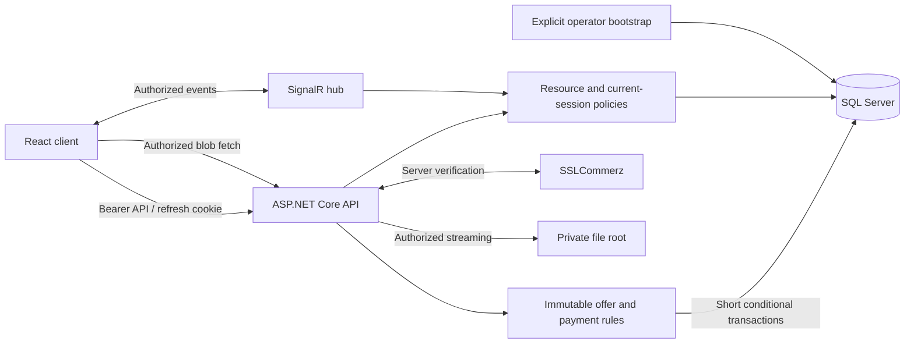
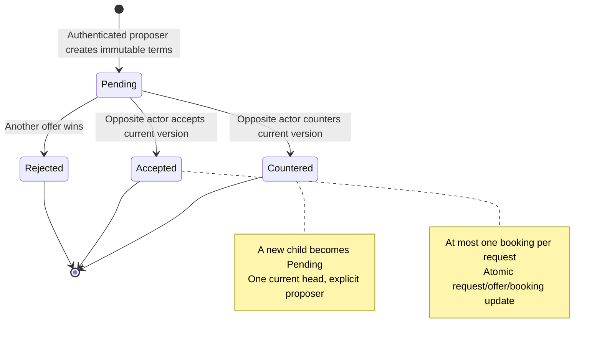

# Phase 1 security remediation plan

**Status:** Proposed; re-audit and documentation only. No remediation has been implemented.
**Audit date:** 2026-10-07 (Asia/Dhaka).
**Repository:** https://github.com/ShadmanMuhtasim/Karigor
**Audited main:** 9e907132a2c20cb06c79fa663aea3b36dc71f2c1.
**Architecture record:** [ADR 0001](../adr/0001-phase1-security-boundaries-and-consistency.md).

## 1. Scope, evidence, and verification boundaries

Re-audit the seven previously identified findings and plan their smallest coherent fixes. This document authorizes no deployment, credential rotation, data migration, production attack, or application behavior change. The only changes in this task are this plan and its proposed ADR.

GitHub main and the local main checkout matched the audited SHA. The working tree was clean before documentation creation. A repository search found no AGENTS.md. Source inspection included the affected API controllers/hub/startup, application services, EF models/mappings/migration snapshot, SQL scripts, frontend map/auth/payment/document consumers, and related deployment/test configuration.

All seven findings remain supported by source. Attack scenarios below are reasoned from the code, not successful attacks against production. Production passwords, merchant settings, database contents, old public files, and hosting behavior have not been inspected. No application build or automated regression suite was executed for this documentation-only task. The solution contains no test projects; frontend package scripts contain no test command.

Existing controls must be retained: Identity password hashing; JWT issuer/audience/lifetime validation; random hashed refresh tokens; HttpOnly cookies; REST ownership checks; document owner/admin checks, GUID filenames, canonical path checks and security headers; payment initiation ownership; and transactional quotation acceptance. Their existence does not establish the missing invariants.

Severity is a qualitative assessment, not a calculated CVSS score. Difficulty and learning value are subjective estimates for this codebase.

| ID | Finding | Severity | Difficulty /10 | CV learning value /10 |
|---|---|---|---:|---:|
| F1 | Payment trust and transaction binding | Critical for payment integrity | 7 | 10 |
| F2 | Implicit administrator provisioning | Critical if the provisioned credentials remain usable; unsafe promotion confirmed | 4 | 8 |
| F3 | SignalR resource access and event disclosure | High | 6 | 9 |
| F4 | Stored data interpreted as map HTML | High | 3 | 8 |
| F5 | Customer offer mutation and acceptance | High for business integrity | 7 | 10 |
| F6 | Refresh replay, rotation, and revocation races | High for session security; exploitation requires possession of a token | 8 | 10 |
| F7 | Private document validation and delivery | Medium for confirmed correctness defects; High confidentiality risk if legacy public documents remain | 5 | 9 |

## 2. Findings and remediation specifications

### F1. Payment trust and transaction binding

#### Exact affected files/functions and source evidence

- [PaymentService.cs, ProcessSuccessCallbackAsync, line 121](https://github.com/ShadmanMuhtasim/Karigor/blob/9e907132a2c20cb06c79fa663aea3b36dc71f2c1/backend/Karigor.Application/Payments/PaymentService.cs#L121): booking-ID fallback at line 133; optional amount checking at line 164; sub-one-unit tolerance at line 167; missing/malformed amount acceptance at line 179; caller-supplied VALID fallback at line 190; callback-derived receipt fields at line 205.
- Same file: InitiatePaymentAsync, line 39; ProcessFailCallbackAsync, line 267; ProcessCancelCallbackAsync, line 291; ProcessIpnAsync, line 315; GetBookingPaymentAsync, line 320.
- [PaymentsController.cs, SslCommerzSuccess, line 65](https://github.com/ShadmanMuhtasim/Karigor/blob/9e907132a2c20cb06c79fa663aea3b36dc71f2c1/backend/Karigor.Api/Controllers/PaymentsController.cs#L65): anonymous callback routes; SslCommerzFail, SslCommerzCancel, SslCommerzIpn and PopulateFromRequest.
- [SslCommerzClient.cs, ValidateTransactionAsync, line 129](https://github.com/ShadmanMuhtasim/Karigor/blob/9e907132a2c20cb06c79fa663aea3b36dc71f2c1/backend/Karigor.Application/Payments/SslCommerz/SslCommerzClient.cs#L129): provider HTTP call and sandbox credential fallback. That client's sandbox check does not gate PaymentService's acceptance of caller VALID.
- [PaymentDtos.cs, SslCommerzValidationResponse, line 56](https://github.com/ShadmanMuhtasim/Karigor/blob/9e907132a2c20cb06c79fa663aea3b36dc71f2c1/backend/Karigor.Application/Payments/DTOs/PaymentDtos.cs#L56): TranId, Amount and Currency are already available.
- [Payment.cs](https://github.com/ShadmanMuhtasim/Karigor/blob/9e907132a2c20cb06c79fa663aea3b36dc71f2c1/backend/Karigor.Infrastructure/Models/Payment.cs): TransactionId uniqueness already exists; no business concurrency token.
- [PaymentCallbackPage.tsx, PaymentCallbackPage, line 6](https://github.com/ShadmanMuhtasim/Karigor/blob/9e907132a2c20cb06c79fa663aea3b36dc71f2c1/karigor-client/src/pages/PaymentCallbackPage.tsx#L6): success presentation derives from URL status rather than an authenticated status fetch.

#### Problem and original failure scenario

An initiated payment exists. An unauthenticated caller supplies a nonempty transaction identifier and VALID status. If server validation is absent, throws, or does not establish a valid result, the service still sets isValid=true. If the identifier is unknown, a supplied ValueA booking ID can select that booking's latest payment.

A separate attack uses a genuinely validated payment belonging to another transaction: the service does not compare the validation response's TranId or Currency against the selected payment. Missing/malformed amount is accepted, and a small mismatch is tolerated.

Result: Payments.Status can become Completed and Bookings.PaymentStatus Paid without proof of the required payment. This is a payment-record integrity failure; there is no proof of an actual bank transfer or payout. The notification's claim that a payout was credited is unsupported by payout execution code.

Fail/cancel routes have the same fallback selection and trust an external caller's outcome. Concurrent callbacks can pass the pre-save Completed check; late stale writes can contradict payment truth.

#### Requirements / invariants

1. Only authoritative provider verification for the exact merchant/environment, stored transaction, expected BDT currency, and exact decimal amount can establish successful payment.
2. Missing, malformed, mismatched, or unavailable verification never grants payment success.
3. Callback parameters and browser query strings are hints, not authoritative financial facts.
4. The same provider transaction cannot pay another booking. One booking has at most one allocated settlement.
5. Payment success and the booking's Paid summary commit together; confirmed success cannot be downgraded by an untrusted fail/cancel callback.
6. Duplicate delivery does not duplicate the business transition or its durable notification.
7. A provider timeout means an unknown outcome, not proof of failed payment.
8. Financial facts about an additional real settlement must be retained for investigation rather than discarded by a constraint.

#### Previous architecture

Customer -> owned completed booking -> save Initiated payment -> gateway initiation -> anonymous callback -> optional validation -> callback fallback -> save payment/booking -> separate notification and global push -> browser shows URL-derived success.

#### Recommended remediation and proposed new architecture

**Immediate containment, no schema prerequisite:**
- Remove all caller-status success fallbacks in sandbox and live paths.
- Resolve the exact stored TransactionId only. Reject unknown IDs; never select by ValueA.
- Require a successful provider HTTP/parse result and recognized verified status. Compare validated TranId, Currency and Amount to the stored immutable attempt. Parse with a defined invariant decimal format, no rounding-down or tolerance that hides mismatches.
- Copy receipt fields from validated provider data, not arbitrary callback values.
- Route all callback/IPN outcomes through the same verification boundary. A browser fail/cancel redirect must not directly finalize payment records.
- Preserve unresolved status on transport/validation uncertainty. Return an appropriate retryable outcome for server notification, and a truthful pending/error presentation for browser return. Verify actual provider retry semantics before finalizing HTTP status policy.
- Make the return page fetch the authorized booking/payment summary. Do not trust status=success or claim a payout.
- Keep existing ownership checks and fee rules; this work does not introduce a wallet.

**Consistency follow-up in the same remediation track:**
- Persist provider session metadata and environment/merchant identity required to query unresolved attempts.
- Use a stable payment attempt and scoped initiation idempotency key. A retry must not blindly create another payable session when the earlier provider request may have succeeded.
- Validate outside the SQL transaction. Inside a short transaction, reload current payment/booking state and conditionally allocate the verified settlement using versions.
- Keep payment observations separate from the booking's selected settlement. A second genuinely settled attempt is retained as requiring review; it must not produce a second booking allocation.
- Write recipient notification records in the same transaction where feasible; push after commit. If asynchronous delivery is required later, use a separately reviewed SQL outbox. Do not delay the fail-closed fix until an outbox exists.
- Return the selected successful settlement and unresolved attempts accurately; the latest failed attempt must not conceal a prior settlement.

#### Alternative remediation approaches

| Approach | Reason to choose/reject |
|---|---|
| Only delete the VALID fallback | Useful immediate containment, but insufficient: mismatched validation identity and fail/cancel trust remain. |
| Require a JWT on provider callback | Reject: the provider has no customer session. Authentication of the caller is not a substitute for provider transaction verification. |
| IP allowlist or callback signature | Additional protection only when documented/supported by the provider; does not replace binding transaction/amount/currency. |
| Put provider HTTP inside a serializable DB transaction | Reject: network latency holds locks and still cannot atomically commit across the provider and SQL. |
| Filtered unique Completed payment per booking | Simple but can prevent recording a second real settlement. Prefer one allocated settlement pointer/record while preserving observations. |
| Full wallet/ledger/broker | Outside this fix. Add only for a separate financial product requirement. |

#### Database changes required

No DB change is necessary for immediate trust-boundary containment. Before the consistency follow-up:
- Add rowversion to Payment and Booking; map it as concurrency metadata.
- Add a nullable selected settlement reference on Booking, or a small settlement-allocation table unique by BookingId. Prefer the pointer for current scope; configure its FK deletion policy explicitly to avoid cascade cycles.
- Add scoped initiation key/request fingerprint and provider session metadata. Protect provider session secrets and omit them from logs/UI.
- Retain existing unique TransactionId. Add a unique non-null provider validation identity scoped to merchant/environment, after checking actual provider semantics and existing duplicates.
- Define recipient notification deduplication when durable effects are introduced.

Schema authority is a prerequisite: the EF snapshot does not include Payment/PaymentStatus, production SQL is incomplete, and startup DDL currently fills gaps. Follow the repository's documented SQL-first approach with reviewed versioned changes and matching EF mappings, or deliberately adopt a single alternative through an ADR. Do not apply constraints blindly to live data.

#### Regression tests required

| Test ID | Test and what it proves |
|---|---|
| F1-T1 | VALID with no ValId, provider timeout/error, invalid status or invalid JSON cannot set Completed/Paid. |
| F1-T2 | Wrong/missing TranId, wrong currency, missing/malformed amount, and any fractional mismatch cannot settle the selected attempt. |
| F1-T3 | A real valid receipt for another attempt cannot settle this booking; unknown TranId plus known ValueA cannot select a payment. |
| F1-T4 | Correct provider-bound success commits one payment and its booking summary; provider receipt fields win over contradictory callback fields. |
| F1-T5 | Sequential and barrier-coordinated concurrent callbacks produce one allocated settlement and one durable notification identity. |
| F1-T6 | Late fail/cancel, stale success/fail races, and forged cancellation cannot downgrade verified success. |
| F1-T7 | DB failure rolls back allocation and summary; provider timeout remains unresolved; a retry/reconciliation recovers without another blind charge session. |
| F1-T8 | Return page cannot show verified success solely from URL parameters; owning customer/worker can read the true summary, unrelated users cannot. |
| F1-T9 | A second real provider settlement is preserved and flagged for review without becoming a second booking allocation. |

Use a fake provider HttpMessageHandler plus real SQL for transaction/constraint tests. Add a deliberate sandbox smoke test only after containment; do not call production during CI.

#### Compatibility risk, difficulty, and learning value

Risk: High for payment behavior. Existing sandbox fallback demonstrations will stop appearing successful. In-flight attempts must remain queryable; no blanket rewrite of old Paid rows. Older receipts may lack merchant/environment metadata; reconcile or explicitly quarantine them. Coordinate return UI, callback HTTP semantics, and merchant configuration. Difficulty 7/10; CV learning value 10/10: fail-closed verification, external-system uncertainty, idempotency, and financial truth.

### F2. Implicit administrator provisioning

#### Exact affected files/functions and source evidence

- [Program.cs, startup seed block, line 363](https://github.com/ShadmanMuhtasim/Karigor/blob/9e907132a2c20cb06c79fa663aea3b36dc71f2c1/backend/Karigor.Api/Program.cs#L363): fixed administrator email at line 376, literal password in CreateAsync at line 386, and email-based promotion at line 397. There is no production exclusion.
- [MONSTERASP_DEPLOYMENT.md, Automatic Admin User Provisioning](https://github.com/ShadmanMuhtasim/Karigor/blob/9e907132a2c20cb06c79fa663aea3b36dc71f2c1/docs/MONSTERASP_DEPLOYMENT.md#L141).
- [database/production/README.md](https://github.com/ShadmanMuhtasim/Karigor/blob/9e907132a2c20cb06c79fa663aea3b36dc71f2c1/database/production/README.md): documents the default account.

#### Problem and original failure scenario

A fresh environment starts and creates the privileged account with publicly known credentials. If those credentials remain unchanged, someone who knows them can authenticate as Admin. Independently, startup finds any existing account with the fixed email and promotes it.

An existing account match is not proof of an operator-approved administrative identity. The source confirms provisioning/promotion; current production credential usability is unknown.

#### Requirements / invariants

Administrator privilege requires explicit operator intent. Ordinary application startup must not create a known-password administrator or promote by email. No secret appears in source, command history, documentation, logs or process arguments. Repeated bootstrap must be safe and must check every Identity result.

#### Previous architecture

Every startup -> seed roles -> lookup fixed email -> create fixed-password account or add Admin role -> application starts.

#### Recommended remediation and proposed new architecture

Keep idempotent role seeding. Move initial privileged-account creation into an explicit one-time bootstrap mode/command, disabled in ordinary startup. Supply credentials through a protected prompt or approved secret provider; use an existing environment secret only if its operational exposure is understood.

Validate operator input, reject existing-account promotion through this creation command, check creation/role results, and create the account/assignment atomically where supported. The command must exit without serving HTTP. Preserve existing legitimate admins.

For an existing production default, verify exposure through an authorized operator process, rotate credentials, revoke sessions, and review account actions. Removing the seed does not remediate an already-compromised account. This is a future operator task; no credentials are changed here.

#### Alternative remediation approaches

- Development-only seeding: acceptable for isolated development with explicit opt-in and non-shared credentials; less safe as the production bootstrap mechanism.
- A one-time startup configuration flag: simpler, but repeated deployment flags can accidentally reopen provisioning. Prefer an explicit command with a defined lifecycle.
- Direct SQL inserts into Identity: reject; risk invalid hashing and inconsistent Identity records.
- Promote an existing account: support only through a separate explicitly authenticated/operator-reviewed command targeting a verified immutable user ID. Do not hide this action in email lookup.

#### Database changes required

No new table is required. Use existing Identity storage and transaction support. An audit record for privileged provisioning is desirable; it must contain no password. Do not delete accounts or revoke roles automatically as part of a migration.

#### Regression tests required

| Test ID | Test and what it proves |
|---|---|
| F2-T1 | Ordinary Production startup creates no administrator/default credential and does not promote an existing fixed-email customer. |
| F2-T2 | Missing/invalid explicit bootstrap inputs fail before serving HTTP or creating a partial privileged identity. |
| F2-T3 | Explicit bootstrap creates exactly the requested user and Admin role, checks failed Identity operations, and emits no secrets. |
| F2-T4 | Repeated/concurrent bootstrap cannot grant roles to an unrelated preexisting account; partial DB failure leaves no silently usable privileged account. |
| F2-T5 | Existing legitimate administrators remain able to sign in after removal of startup provisioning. |

#### Compatibility risk, difficulty, and learning value

Risk: Medium. Fresh deployments need a documented administrator creation step; demonstrations relying on the old credentials break. Existing admin accounts remain. Difficulty 4/10; CV learning value 8/10: secure defaults, privilege provisioning, and secret lifecycle.

### F3. SignalR resource access and event disclosure

#### Exact affected files/functions and source evidence

- [KarigorHub.cs, JoinBooking, line 52; SendTyping, line 62](https://github.com/ShadmanMuhtasim/Karigor/blob/9e907132a2c20cb06c79fa663aea3b36dc71f2c1/backend/Karigor.Api/Hubs/KarigorHub.cs#L52): no booking membership check. OnConnectedAsync correctly assigns caller-derived user groups and role-derived Admins membership.
- [SignalRRealtimeNotifier.cs, BroadcastAsync, line 32](https://github.com/ShadmanMuhtasim/Karigor/blob/9e907132a2c20cb06c79fa663aea3b36dc71f2c1/backend/Karigor.Api/Realtime/SignalRRealtimeNotifier.cs#L32): Clients.All.
- [MessagingService.cs, SendMessageAsync, line 30](https://github.com/ShadmanMuhtasim/Karigor/blob/9e907132a2c20cb06c79fa663aea3b36dc71f2c1/backend/Karigor.Application/Messaging/MessagingService.cs#L30): REST checks participation; full messages then go to booking groups at line 122.
- [PaymentService.cs, ProcessSuccessCallbackAsync, line 247](https://github.com/ShadmanMuhtasim/Karigor/blob/9e907132a2c20cb06c79fa663aea3b36dc71f2c1/backend/Karigor.Application/Payments/PaymentService.cs#L247): global payment identifiers/amounts.
- [AdminService.cs, VerifyWorkerAsync, line 134](https://github.com/ShadmanMuhtasim/Karigor/blob/9e907132a2c20cb06c79fa663aea3b36dc71f2c1/backend/Karigor.Application/Admin/AdminService.cs#L134): global WorkerVerificationUpdated at line 191, including PendingWorkerDto document/user information.
- [MarketplaceService.cs, CreateQuotationAsync / AcceptQuotationAsync / CounterQuotationAsync](https://github.com/ShadmanMuhtasim/Karigor/blob/9e907132a2c20cb06c79fa663aea3b36dc71f2c1/backend/Karigor.Application/Marketplace/MarketplaceService.cs#L202): global negotiation events at lines 202, 467 and 563.
- [CustomerService.cs, CreateServiceRequestAsync, line 78](https://github.com/ShadmanMuhtasim/Karigor/blob/9e907132a2c20cb06c79fa663aea3b36dc71f2c1/backend/Karigor.Application/Customer/CustomerService.cs#L78): global ServiceRequestCreated at line 108 includes coordinates.
- [ReviewService.cs, CreateReviewAsync / RespondToReviewAsync](https://github.com/ShadmanMuhtasim/Karigor/blob/9e907132a2c20cb06c79fa663aea3b36dc71f2c1/backend/Karigor.Application/Reviews/ReviewService.cs#L116): global DTO broadcasts at lines 116 and 278 need explicit public-field review.
- [IRealtimeNotifier.cs](https://github.com/ShadmanMuhtasim/Karigor/blob/9e907132a2c20cb06c79fa663aea3b36dc71f2c1/backend/Karigor.Application/Realtime/IRealtimeNotifier.cs), [signalrService.ts, startConnection / joinBooking / sendTyping](https://github.com/ShadmanMuhtasim/Karigor/blob/9e907132a2c20cb06c79fa663aea3b36dc71f2c1/karigor-client/src/services/signalrService.ts), and Program.cs MapHub at line 515.

#### Problem and original failure scenario

An unrelated authenticated customer/worker invokes JoinBooking with another booking ID and receives future chat messages. SendTyping can inject typing events without membership. A connection need not join any booking to receive private Clients.All payment/verification events. Missing frontend listeners do not prevent a custom client from listening.

#### Requirements / invariants

Only booking participants receive booking-private content; Admin is not automatically a chat participant. Only authorized administrators and the affected worker receive appropriate verification data. Each private event's recipients are determined from server state, never client-supplied user IDs. Public discovery updates contain no exact private address/document/payment/negotiation data. Reconnects and account/session changes reapply authorization.

#### Previous architecture

JWT establishes hub identity -> arbitrary booking ID becomes group membership -> REST-created messages fan out to group. Separate services broadcast private business DTOs to all authenticated connections.

#### Recommended remediation and proposed new architecture

Create a focused booking-access policy/query shared by REST/hub use cases. Check participation before JoinBooking and SendTyping. A database error fails closed. LeaveBooking removes only the current connection from the requested group and must never become a generic join/group-management API.

Prefer existing NotifyUserAsync for private state events, deriving recipient IDs from booking/request/worker records. Restrict verification admin details to NotifyAdminsAsync and send the worker a minimized result. Retain booking groups for chat only after authorization. Close connections at token expiration and enforce current suspension/session state on sensitive hub methods; integrate session revocation later with F6.

Review every BroadcastAsync call. Either eliminate global private delivery or expose an explicitly public, minimal event operation. For open-request discovery, initially send a worker-role refresh hint without exact data; actual retrieval must enforce listing eligibility. If request detail privacy remains broader than the event policy, track its REST eligibility hardening as an explicit linked issue.

| Event | Intended recipients / minimum payload |
|---|---|
| ReceiveMessage / UserTyping | Booking participants; approved chat DTO |
| PaymentReceived | Booking customer/worker; necessary status/amount, no unnecessary provider receipt |
| WorkerVerificationUpdated | Admin operational view; affected worker gets own status/reason only |
| QuotationUpdated | Request owner and affected worker's thread; no competitor prices |
| ServiceRequestCreated | Eligible worker audience or role-scoped refresh hint; no exact coordinates/address |
| ReviewCreated / ReviewUpdated | Public refresh hint or approved public review DTO; remove internal booking/customer identifiers |
| SosAlertTriggered | Existing Admins path retained; never global |

Update client handlers together. The current client re-joins bookings on reconnect; preserve that behavior and surface denied joins instead of retaining unauthorized local group IDs. Live delivery remains best effort in this fix; REST persistence/re-fetch remains necessary.

#### Alternative remediation approaches

- Remove booking groups and use user groups for everything: simplest strong privacy boundary, but more per-user fan-out; valid alternative.
- Signed booking-room token: adds expiry/revocation complexity and cannot replace current membership checks without careful semantics.
- Role-only Worker/Customer authorization: reject; two users of the same role still own different resources.
- Rely on unguessable booking IDs: reject; obscurity is not authorization.
- Broker/backplane: unnecessary for this boundary fix.

#### Database changes required

None for participation checks/scoped delivery; existing Booking foreign keys identify participants. F6 adds session state for revocation-aware connections. Add no standalone group-membership table solely to mirror SignalR's transient groups.

#### Regression tests required

| Test ID | Test and what it proves |
|---|---|
| F3-T1 | Anonymous connection fails; unrelated customer/worker cannot join a booking; both real participants can. |
| F3-T2 | Nonparticipant SendTyping fails even without a prior JoinBooking; approved typing goes only to the other participant. |
| F3-T3 | Three simultaneous connections prove unrelated users receive no chat/payment/negotiation/verification private fields. |
| F3-T4 | Admin group receives admin verification details, affected worker receives minimized own result, ordinary users receive neither. |
| F3-T5 | Reconnect reauthorizes membership; expired/suspended/revoked-session calls cannot retain usable private access under the chosen session policy. |
| F3-T6 | A DB membership lookup failure adds no group membership; public refresh hints contain no private coordinates/IDs and authorized screens still refresh. |

Use a real hosted hub/SignalR client for delivery isolation. Mock notifier tests alone cannot establish network recipients.

#### Compatibility risk, difficulty, and learning value

Risk: Medium. Screens relying on global invalidation may stop refreshing unless subscriptions are adjusted. Existing connections can retain old membership until disconnected, so deploy a coordinated restart/reconnect. No REST route change is required. Difficulty 6/10; CV learning value 9/10: resource authorization, data minimization, and connection-lifetime identity.

### F4. Stored data interpreted as map HTML

#### Exact affected files/functions and source evidence

- [KarigorMap.tsx, KarigorMap marker-rendering effect, line 449](https://github.com/ShadmanMuhtasim/Karigor/blob/9e907132a2c20cb06c79fa663aea3b36dc71f2c1/karigor-client/src/components/map/KarigorMap.tsx#L449): req.description at line 454 and req.address at line 457 enter innerHTML.
- Same component: worker popup at line 391 includes email/category-derived text; request divIcon HTML at line 431 contains categoryName. Audit all dynamic HTML in this component, not only two fields.
- [CustomerService.cs, CreateServiceRequestAsync, line 78](https://github.com/ShadmanMuhtasim/Karigor/blob/9e907132a2c20cb06c79fa663aea3b36dc71f2c1/backend/Karigor.Application/Customer/CustomerService.cs#L78): stores description/address.
- [CreateRequestPage.tsx, handleSubmit](https://github.com/ShadmanMuhtasim/Karigor/blob/9e907132a2c20cb06c79fa663aea3b36dc71f2c1/karigor-client/src/pages/CreateRequestPage.tsx): sends user input; frontend maxlength does not make HTML safe.

#### Problem and original failure scenario

A customer stores markup in request text. A worker opens the corresponding Leaflet popup. The browser parses that data as HTML; event-handler markup can execute in the application's origin. This path is source-confirmed, not a performed production exploit.

HttpOnly hides the refresh cookie from direct script reads, but malicious same-origin script can still make authenticated requests and interact with the running application.

#### Requirements / invariants

User/database text is rendered as text. Data never becomes executable HTML or script. Static repository-owned icons may remain static markup; dynamic category, name, email, address, translation text, and prices must use safe DOM/text APIs or React escaping.

#### Previous architecture

Customer input -> SQL -> request DTO -> string interpolation -> innerHTML/divIcon HTML -> browser interpretation.

#### Recommended remediation and proposed new architecture

Build popup/marker nodes with createElement/textContent and attach listeners directly, or mount a small React view through a well-managed root. Prefer DOM text APIs for the current direct Leaflet integration because they avoid a new rendering lifecycle. Keep existing interactions, icons and layout.

Do not strip characters from stored descriptions as the primary defense. Existing stored values also become safe when rendered through text APIs. Consider CSP later as defense in depth, after inventorying map, Google login, inline styles/scripts, and deployment compatibility.

#### Alternative remediation approaches

- Escape every interpolation correctly: smaller diff, but fragile when one new field/context is missed.
- HTML sanitizer: useful only if formatted user HTML is an actual product requirement. None is established here.
- Reject angle brackets in API validation: insufficient and unnecessarily changes legitimate text input.
- CSP alone: does not repair the unsafe sink and has compatibility requirements.

#### Database changes required

None. Do not mass-rewrite stored text. A content review can be an authorized operator follow-up if prior malicious requests are suspected.

#### Regression tests required

| Test ID | Test and what it proves |
|---|---|
| F4-T1 | Stored hostile description/address appear literally and cannot execute when a popup opens. |
| F4-T2 | Worker email/skill/category and request icon text use the same safe behavior; no dynamic HTML sink is missed. |
| F4-T3 | Bengali text, quotes, ampersands and angle brackets round-trip unchanged. |
| F4-T4 | Profile/quote buttons and marker selection still work after repeated render/update/unmount without accumulating listeners. |

Use a browser test with deterministic fixtures and controlled map assets; asserting only a string helper's output does not prove the actual Leaflet sink is safe.

#### Compatibility risk, difficulty, and learning value

Risk: Low. Text formerly interpreted as markup becomes literal, which is intended. Keep CSS classes and SVG icons stable. Difficulty 3/10; CV learning value 8/10: stored XSS, output context, and defense in depth.

### F5. Customer offer mutation and acceptance

#### Exact affected files/functions and source evidence

- [MarketplaceService.cs, CreateQuotationAsync, line 85](https://github.com/ShadmanMuhtasim/Karigor/blob/9e907132a2c20cb06c79fa663aea3b36dc71f2c1/backend/Karigor.Application/Marketplace/MarketplaceService.cs#L85): existingPending lookup at line 162 and price/message overwrite at lines 168-169.
- Same file: GetNegotiationDepth, line 26; GetWorkerQuotationsAsync, line 272; GetRequestQuotationsAsync, line 320; AcceptQuotationAsync, line 367; CounterQuotationAsync, line 481; CreateBookingAsync, line 578.
- [Quotation.cs](https://github.com/ShadmanMuhtasim/Karigor/blob/9e907132a2c20cb06c79fa663aea3b36dc71f2c1/backend/Karigor.Infrastructure/Models/Quotation.cs): no stored proposer or concurrency token.
- [QuotationsController.cs, Create / Accept / Counter](https://github.com/ShadmanMuhtasim/Karigor/blob/9e907132a2c20cb06c79fa663aea3b36dc71f2c1/backend/Karigor.Api/Controllers/QuotationsController.cs): worker role on initial creation; participant-dependent service rules on negotiation.
- [marketplaceApi.ts, createQuotation / acceptQuotation / counterQuotation](https://github.com/ShadmanMuhtasim/Karigor/blob/9e907132a2c20cb06c79fa663aea3b36dc71f2c1/karigor-client/src/api/marketplaceApi.ts).
- [RequestDetailPage.tsx](https://github.com/ShadmanMuhtasim/Karigor/blob/9e907132a2c20cb06c79fa663aea3b36dc71f2c1/karigor-client/src/pages/RequestDetailPage.tsx) and [WorkerBookingsTab.tsx](https://github.com/ShadmanMuhtasim/Karigor/blob/9e907132a2c20cb06c79fa663aea3b36dc71f2c1/karigor-client/src/pages/worker/WorkerBookingsTab.tsx): negotiation consumers must understand explicit authorship and stale-version errors.

#### Problem and original failure scenario

Worker proposes 1,000. Customer counters 800, producing an odd-depth Pending row with the original worker ID. Worker POSTs an initial quote of 5,000 for the same request. CreateQuotationAsync updates that customer counter row because it selects any Pending row for the pair. AcceptQuotationAsync still infers Customer authorship from depth and lets the worker accept. A Scheduled booking at 5,000 can result without customer agreement.

Existing role/ownership checks do not prevent this business-authorization bypass. Concurrent counter/accept operations can also use stale current-offer state.

#### Requirements / invariants

Offer proposer and terms are immutable after submission. Only the opposite authorized participant may accept/counter the current offer. Client-supplied proposer identity is ignored. One negotiation has at most one current Pending offer; a linear offer has at most one child. Acceptance captures the displayed current agreed price and creates at most one booking per request.

#### Previous architecture

Mutable Pending row -> parent-depth parity implies author -> participant checks -> pre-transaction status checks -> transaction creates booking and rejects competitors.

#### Recommended remediation and proposed new architecture

**Immediate containment:** never let initial POST update a customer-proposed row. Reject conflicting initial submissions, and require an expected version for any retained author-edit behavior. This containment does not justify retaining parity indefinitely.

**Target:** add explicit ProposedByUserId (plus role-at-submission if useful), CreatedAt and rowversion. Derive author from authenticated server identity when creating/countering. Initial POST creates an initial immutable offer; repeating identical intent can return the existing initial result, while changing terms requires an explicit new negotiation action.

Retain the current parent chain; no new negotiation framework is needed. Protect one pending head per request/worker with a constraint and conditional parent transition. Change Pending -> Countered before inserting its child inside the same SQL transaction; account for EF insert/update ordering under the filtered index.

Acceptance re-reads request and offer inside the retried transaction, checks version/current head/opposite actor, updates request/offer, rejects other pending offers and inserts booking atomically. Add one-booking-per-request uniqueness. Translate stale versions/uniqueness conflicts to a stable 409 response and refresh the comparison UI.

Do not claim this also fixes worker scheduling across different requests: that requires a separate scheduling invariant/serialization rule. CreateBookingAsync currently retrieves the booking already created by acceptance; preserve this behavior.

#### Alternative remediation approaches

- Add ParentQuotationId == null to the current overwrite query: blocks this specific counter overwrite but leaves mutable prices and stale acceptance; emergency-only.
- Keep depth as a read/display calculation: acceptable after authoritative proposer storage; never use it for new authorization.
- Versioned NegotiationThread with CurrentQuotationId: clean if thread rules grow; one additional table and migration are unnecessary for the initial linear-chain solution.
- Serializable transactions alone: do not repair authorship or immutable agreement.
- Client disables the button: reject as enforcement; direct API calls remain possible.

#### Database changes required

Add explicit proposer FK, creation timestamp, and quotation/request rowversion; add unique Bookings.ServiceRequestId for the current one-booking model. Add filtered one-Pending-per-(ServiceRequestId, WorkerId) and unique non-null ParentQuotationId if linear threads are adopted.

Before constraints/backfill, report duplicate heads/bookings, cycles, cross-request/cross-worker parents, missing parents, and invalid statuses. Historical parity can infer likely authors only for valid unambiguous chains; it cannot prove who wrote an already-overwritten offer. Quarantine ambiguous active negotiations for confirmation instead of inventing provenance. Do not fabricate historical CreatedAt values; distinguish unknown legacy time.

#### Regression tests required

| Test ID | Test and what it proves |
|---|---|
| F5-T1 | The original 1,000 -> customer 800 -> worker POST 5,000 -> accept sequence cannot produce an unauthorized agreement. |
| F5-T2 | Initial offer, customer counter, worker counter and opposite-party acceptance store correct server-derived authors; self/other-worker/other-customer actions fail. |
| F5-T3 | Old offer IDs/versions cannot be accepted or countered after a newer offer; displayed and accepted terms match. |
| F5-T4 | Concurrent counters and counter-versus-accept leave one coherent head/result; no fork. |
| F5-T5 | Concurrent acceptances of the same/different workers' offers create one booking, one winning agreement, and consistent request status. |
| F5-T6 | DB failure rolls back all acceptance changes; execution-strategy retry re-reads state; 409 is visible and recoverable in both UIs. |
| F5-T7 | Migration validates clean chains, refuses ambiguous active data, and preserves existing valid bookings without manufacturing historical authorship. |

#### Compatibility risk, difficulty, and learning value

Risk: High. Repeat-POST editing behavior changes, DTOs need version/authorship fields, and dirty historical data may require intervention. Deploy schema additions before the coordinated backend/frontend cutover; do not run old mutable writers beside new invariants. Difficulty 7/10; CV learning value 10/10: immutable intent, business authorization, optimistic concurrency and SQL invariants.

### F6. Refresh replay, rotation, and revocation races

#### Exact affected files/functions and source evidence

- [AuthService.cs, RefreshAsync, line 292](https://github.com/ShadmanMuhtasim/Karigor/blob/9e907132a2c20cb06c79fa663aea3b36dc71f2c1/backend/Karigor.Application/Auth/AuthService.cs#L292): revoked-token grace at line 311, successor lookup at line 314, old raw-token return at line 328, unconditional consume/insert at lines 339-355; LogoutAsync, line 375; BuildAuthResultAsync, line 392.
- [AuthController.cs, Refresh / Logout / SetRefreshCookie](https://github.com/ShadmanMuhtasim/Karigor/blob/9e907132a2c20cb06c79fa663aea3b36dc71f2c1/backend/Karigor.Api/Controllers/AuthController.cs#L143): grace return resets the cookie; logout currently needs an access JWT; cookie lifetime is a fixed seven days.
- [RefreshToken.cs](https://github.com/ShadmanMuhtasim/Karigor/blob/9e907132a2c20cb06c79fa663aea3b36dc71f2c1/backend/Karigor.Infrastructure/Models/RefreshToken.cs): no family/session identity, rowversion or unique bounded hash.
- [TokenService.cs, GenerateAccessToken / GenerateRefreshToken / HashToken](https://github.com/ShadmanMuhtasim/Karigor/blob/9e907132a2c20cb06c79fa663aea3b36dc71f2c1/backend/Karigor.Application/Auth/TokenService.cs): secure generation/hashing already exists; access JWT has no session binding.
- [AdminService.cs, ToggleUserSuspensionAsync, line 252](https://github.com/ShadmanMuhtasim/Karigor/blob/9e907132a2c20cb06c79fa663aea3b36dc71f2c1/backend/Karigor.Application/Admin/AdminService.cs#L252): revokes active token rows.
- [client.ts, refreshAuthToken](https://github.com/ShadmanMuhtasim/Karigor/blob/9e907132a2c20cb06c79fa663aea3b36dc71f2c1/karigor-client/src/api/client.ts): single-flight exists within one JS instance, not across tabs.
- [AuthContext.tsx](https://github.com/ShadmanMuhtasim/Karigor/blob/9e907132a2c20cb06c79fa663aea3b36dc71f2c1/karigor-client/src/context/AuthContext.tsx), [signalrService.ts](https://github.com/ShadmanMuhtasim/Karigor/blob/9e907132a2c20cb06c79fa663aea3b36dc71f2c1/karigor-client/src/services/signalrService.ts), Program.cs JWT events and hub mapping.

#### Problem and original failure scenarios

1. A rotated predecessor is presented during its 60-second grace period. It can still mint an access token while its successor is active.
2. A delayed grace response sets the old revoked token as the browser cookie, overwriting a valid successor. Later refresh fails.
3. Two requests read one active token before either saves. Both create successors; the last replacement link does not revoke the other branch.
4. Logout only targets the presented token. A replay/fork descendant can survive without a family-level policy.
5. Suspension checks stop login/refresh, but existing bearer credentials/connections are not automatically revoked.

A stolen refresh token is required for adversarial replay. Ordinary multiple-tab/network races also trigger reliability failures.

#### Requirements / invariants

Exactly one active successor is created when one token is consumed. Expiry is checked before any replay handling. Revoked/expired/suspended sessions never mint usable credentials. Logout/reuse/suspension act on the session family, not just one token. Error/losing responses never replace a newer cookie. SQL stores hashes, not plaintext refresh tokens. Access-token revocation latency is an explicit policy.

#### Previous architecture

Per-tab single-flight -> hash lookup -> revoked predecessor grace or active rotation -> separate successor rows without concurrency guard -> Set-Cookie -> only supplied token revoked on logout.

#### Recommended remediation and proposed new architecture

Introduce a small RefreshSession family record and bind each RefreshToken to it. One login creates one session. Rotate in a short transaction using conditional token consumption and a session version check; logout/reuse revokes the family; suspension revokes all families and prevents an overlapping refresh from escaping.

Use strict one-use rotation initially:
- A request that observed an active token but loses an atomic concurrency race returns a documented conflict without new credentials or cookie mutation.
- A later presentation of an already-consumed token follows strict replay policy and revokes that session family. Genuine delayed duplicates may force reauthentication; document this tradeoff.
- Do not return the revoked predecessor or silently mint access during a blanket grace window.
- Coordinate browser refresh across tabs where supported; retain per-tab single-flight and a safe reauthentication fallback for unsupported clients. Do not store bearer/refresh secrets in localStorage.
- A lost successful rotation response may require login again under strict policy. Do not hide this with insecure token replay.

Add sid to JWTs and check current session/suspension state for authenticated requests requiring immediate revocation and for sensitive hub methods. Initially use a direct indexed SQL lookup if measured cost is acceptable. Set CloseOnAuthenticationExpiration and reconnect with current credentials; expiry closure alone is not immediate logout enforcement. For server-pushed private events, ensure revoked connections are disconnected or recipients are filtered by live session state; method checks alone do not stop passive receipt.

Define authorization at the server's current-state check: revocation prevents subsequent authorized operations. It cannot recall bytes already delivered or automatically roll back an operation already authorized before revocation. Document the in-flight request/push policy and verify its disconnect/filter behavior instead of promising instantaneous cancellation of every queued frame.

Allow session-cookie logout safely even when access JWT has expired, with explicit Origin/CSRF policy, generic success, correct cookie deletion and no session enumeration. Cookie expiry must derive from the same configured token/session lifetime.

#### Alternative remediation approaches

- Only remove grace: immediate improvement but does not solve rotation branching or family revocation.
- Rowversion on token only: prevents two consumes; without shared session state, logout/suspension races and descendant policy remain incomplete.
- Revoke every session on any reuse: stronger blast radius but unnecessarily logs out unrelated devices; prefer affected-family revocation.
- Bounded idempotent response replay: improves retry usability but requires securely storing an encrypted recoverable response/successor, a request identity, expiry and explicit replay policy. Reconsider only if strict rotation causes unacceptable measured failures.
- Keep short-lived stateless JWTs: valid alternative if up-to-15-minute HTTP revocation delay is explicitly accepted; still requires a separate hub policy. Do not promise immediate suspension in this mode.
- Redis/distributed locks: not required to atomically consume SQL-owned tokens.

#### Database changes required

RefreshSessions: Id, UserId, CreatedAt, ExpiresAt, RevokedAt, RevocationReason, rowversion. RefreshTokens: SessionId FK, bounded unique SHA-256 hash, rowversion, parent/replacement linkage with at most one child if parent IDs are stored. Index family/user lookup and hash lookup; verify actual SQL datatype/collation and existing hash validity before conversion.

Refresh must contend on the same session row as logout. Suspension must serialize account/session checks with issuance, for example by locking the user row and session rows in a consistent order during the short transaction; a pre-transaction LockoutEnd check alone is insufficient.

Safest legacy cutover is a planned forced reauthentication: old JWTs lack sid and old token lineage may be ambiguous. Preserve hashes only for retention/audit under policy, revoke legacy tokens, and do not infer a trusted active family from corrupt links. This is a future migration, not executed here.

#### Regression tests required

| Test ID | Test and what it proves |
|---|---|
| F6-T1 | Revoked predecessor cannot mint credentials at 0, 30, 60 or 61 seconds; expired token fails before replay logic. |
| F6-T2 | Two coordinated refreshes create at most one successor; loser does not change cookie or revoke winner merely because of a detected in-flight conflict. |
| F6-T3 | Later reuse revokes the affected family; unrelated device family remains valid; hashes alone are stored. |
| F6-T4 | Logout-versus-refresh and suspension-versus-refresh cannot leave a usable family; old JWT sid fails the chosen revocation check. |
| F6-T5 | Out-of-order responses/multiple tabs do not restore an old cookie; lost successful response follows documented reauthentication behavior. |
| F6-T6 | DB failure returns no new cookie/access result and rolls back predecessor/successor/session changes. |
| F6-T7 | Expired-access-token logout works under correct origin policy; disallowed origin fails; issuance/deletion cookie attributes and configured expiry agree. |
| F6-T8 | Expired/revoked connections cannot invoke or continue receiving private hub events under the implemented disconnect/filter policy. |

Use controlled time through TimeProvider or an equivalent narrow clock abstraction, real SQL contention, and browser tests for cookie ordering.

#### Compatibility risk, difficulty, and learning value

Risk: High. Family migration and sid enforcement require a planned sign-in reset and coordinated API/client deployment. Direct session checks add database work; strict replay may log out users after benign retries. Difficulty 8/10; CV learning value 10/10: atomic consumption, replay detection, session families, revocation versus expiry, and consistency across HTTP/WebSockets.

### F7. Private document validation and delivery

#### Exact affected files/functions and source evidence

- [FileValidationService.cs, ValidateStream, line 22](https://github.com/ShadmanMuhtasim/Karigor/blob/9e907132a2c20cb06c79fa663aea3b36dc71f2c1/backend/Karigor.Application/Worker/FileValidationService.cs#L22): PDF bytes at lines 51-52 spell %FDP, not %PDF.
- [WorkerService.cs, UploadDocumentAsync, line 283](https://github.com/ShadmanMuhtasim/Karigor/blob/9e907132a2c20cb06c79fa663aea3b36dc71f2c1/backend/Karigor.Application/Worker/WorkerService.cs#L283): 5 MiB cap, allowlisted extensions, file write before DB insert.
- [WorkerDocumentFileController.cs, GetDocumentFile, line 64](https://github.com/ShadmanMuhtasim/Karigor/blob/9e907132a2c20cb06c79fa663aea3b36dc71f2c1/backend/Karigor.Api/Controllers/WorkerDocumentFileController.cs#L64): correct owner/admin/DB/path checks; await using stream at line 117 is disposed before FileStreamResult executes.
- [PrivateUploadPathProvider.cs, constructor / GetUploadRoot](https://github.com/ShadmanMuhtasim/Karigor/blob/9e907132a2c20cb06c79fa663aea3b36dc71f2c1/backend/Karigor.Infrastructure/Upload/PrivateUploadPathProvider.cs): always uses content-root App_Data path.
- [Program.cs, upload DI, line 264](https://github.com/ShadmanMuhtasim/Karigor/blob/9e907132a2c20cb06c79fa663aea3b36dc71f2c1/backend/Karigor.Api/Program.cs#L264): configured root is created but provider receives contentRoot instead; static files at line 504.
- [WorkerDocumentsTab.tsx, handleUpload / document link](https://github.com/ShadmanMuhtasim/Karigor/blob/9e907132a2c20cb06c79fa663aea3b36dc71f2c1/karigor-client/src/pages/worker/WorkerDocumentsTab.tsx): 10 MiB client threshold at line 51; plain link at line 137.
- [AdminVerificationsTab.tsx, AdminVerificationsTab preview](https://github.com/ShadmanMuhtasim/Karigor/blob/9e907132a2c20cb06c79fa663aea3b36dc71f2c1/karigor-client/src/pages/admin/AdminVerificationsTab.tsx#L290): iframe/img/plain links use bare URL.
- [client.ts, getFileUrl / apiClient interceptors](https://github.com/ShadmanMuhtasim/Karigor/blob/9e907132a2c20cb06c79fa663aea3b36dc71f2c1/karigor-client/src/api/client.ts): URL construction does not attach Authorization to browser resource elements.
- [web.config](https://github.com/ShadmanMuhtasim/Karigor/blob/9e907132a2c20cb06c79fa663aea3b36dc71f2c1/backend/Karigor.Api/web.config), [Karigor.Api.csproj](https://github.com/ShadmanMuhtasim/Karigor/blob/9e907132a2c20cb06c79fa663aea3b36dc71f2c1/backend/Karigor.Api/Karigor.Api.csproj), and deployment docs: hosting size/persistence assumptions need alignment.

#### Problem and original failure scenarios

A normal PDF beginning %PDF- is rejected; a non-PDF prefix %FDP passes that specific signature check. Correctly authorized download opens a stream and returns it from an await-using scope; MVC attempts delivery after disposal. Admin/worker browser previews send no bearer header and therefore cannot use the private endpoint merely because the refresh cookie exists.

Changing Storage:UploadPath does not change the actual provider root. A deployment may therefore write to a different location than operators expect. If old wwwroot/uploads files exist, UseStaticFiles can serve them before controller authorization. Their actual production presence is unknown.

#### Requirements / invariants

Only owner/admin can retrieve a matched private document. Path boundaries, generated names, no-store and nosniff remain. Valid supported files work; mismatched/oversized files fail. The stream stays alive through result execution and is disposed by its owner afterward. Private bytes never enter public static storage or tokenized query URLs. File/DB failures do not leave publicly reachable or misrepresented documents.

#### Previous architecture

Multipart -> signature check -> write private file -> insert row -> bare browser URL -> JWT-required controller -> return already-disposed stream. Startup's configured root differs from provider's actual root.

#### Recommended remediation and proposed new architecture

Correct PDF signature to %PDF- and keep JPEG/PNG support. Treat magic bytes as a cheap format check, not malware/content safety proof. Prefer the existing allowed set; do not enable WebP merely because a helper branch exists.

Return a stream whose lifetime belongs to MVC after return, or authorize first and use PhysicalFile. Ensure exception paths dispose any untransferred handle. Retain restrictive response headers/type allowlist and file-ID/path checks.

Fetch documents through the authenticated Axios client with responseType=blob and an explicitly rooted /uploads path; account for its /api baseURL. Reuse existing refresh/error handling without leaking tokens into URLs. Show loading/errors; create object URLs only for authorized bytes, revoke on close/unmount/account change, and cancel late requests. Use authorized download as a PDF fallback if an isolated preview cannot be verified across supported browsers.

Use one validated configuration value for the effective private root shared by upload/download; reject a root inside wwwroot and do not log sensitive paths unnecessarily. Align the client limit at 5 MiB and set multipart/request limits allowing bounded multipart overhead. Do not set whole-request cap equal to file cap and accidentally reject valid boundary files.

On failed file write, create no row. On failed DB insert, remove the new private file; because filesystem and SQL have no shared transaction, use a staging/finalization strategy and orphan reconciliation for crash gaps rather than claiming atomicity.

Inventory legacy URLs/files before moving them. Copy into private storage, verify size/hash and row mapping, cut over, then remove/block legacy public copies under an explicit operator procedure. Preserve valid existing links through the authorized route when possible. Prove redeploy persistence rather than relying on project-file comments.

#### Alternative remediation approaches

- PhysicalFile after authorization: simplifies handle lifetime; valid alternative to streaming.
- Same-origin cookie-authenticated document endpoint: possible, but broadens authentication/CSRF architecture; unnecessary with an existing bearer client.
- Short-lived signed URLs: useful with remote object storage; not required for local private files and creates leak/expiry considerations.
- Download-only PDF: safest simple fallback where isolated embedded rendering is unreliable.
- Re-publicize uploads to restore previews: reject.
- Antivirus/object storage service: a separately justified operational enhancement; not a required new infrastructure component for this fix.

#### Database changes required

No new table/column is required for signature, streaming, blob preview, or configuration repair. Legacy FileUrl mappings may need a reviewed data migration. Optional StorageKey/Size/ContentHash metadata aids migration/orphan checks, but is not required for the immediate repair. No SQL transaction can make arbitrary filesystem writes atomic.

#### Regression tests required

| Test ID | Test and what it proves |
|---|---|
| F7-T1 | Valid %PDF-, JPEG and PNG pass; %FDP, truncated/mismatched signatures and disallowed extensions fail. |
| F7-T2 | Owner/admin receive exact bytes through full MVC result execution; unrelated worker/customer/anonymous fail. |
| F7-T3 | Encoded traversal, invalid IDs, wrong worker/file pair and missing file fail without path disclosure. |
| F7-T4 | 5 MiB boundary file works with multipart overhead; larger file fails consistently; frontend shows the same limit. |
| F7-T5 | Authenticated admin/worker previews/downloads work without tokens in URL/storage; expired access refreshes safely; denied fetch renders an error. |
| F7-T6 | Closing/switching accounts cancels requests and revokes object URLs; no old document becomes visible after a late response. |
| F7-T7 | Custom private root is used by both upload/download; root under wwwroot is rejected; retained headers are correct. |
| F7-T8 | Injected disk/DB failures leave no successful row or untracked permanent file; staged crash recovery is documented/tested. |
| F7-T9 | A controlled legacy migration/redeploy preserves bytes and authorized retrieval; old public URLs return no document bytes. |

#### Compatibility risk, difficulty, and learning value

Risk: Medium, High if legacy file migration is needed. Existing valid routes should be preserved; storage relocation requires inventory, backup and explicit mapping. PDF viewing depends on browser behavior and must have a tested fallback. Difficulty 5/10; CV learning value 9/10: resource ownership, stream lifetime, browser authentication and cross-resource consistency.

## 3. Safest implementation order and dependencies

Use small reviewable changes. Tests accompany each fix; the absence of a test suite is a prerequisite problem, not a reason to postpone critical containment.

| Order | Work package | Dependencies / release gate |
|---:|---|---|
| 0 | Add minimal backend/browser security test harness; capture F1/F2/F3/F4/F5/F7 reproductions in an isolated fixture | Canonical disposable SQL setup; no live attacks. Add tests to the solution and make their failure block CI. |
| 1 | F1 fail-closed payment binding and callback outcome containment | No new schema needed. Test sandbox and live configuration branches; return UI must stop asserting URL-derived success. |
| 2 | F2 remove implicit admin bootstrap; document explicit operator bootstrap | Verify an operator can preserve/access an existing legitimate admin before release. Credential/session response is an operator task. |
| 3 | F3 block unauthorized joins/typing and scope existing private events | No schema prerequisite. Coordinate notifier call sites/client handlers and disconnect existing connections. Do this before adding new payment/offer notifications. |
| 4 | F4 replace dynamic map HTML | Independent small frontend change; can proceed alongside orders 1-3. Browser regression proof required. |
| 5 | F7 repair signatures/stream ownership/blob previews and root consistency | Preview transport uses existing auth first; legacy migration/persistence validation may be a separate controlled release. |
| 6 | Reconcile schema authority, then F5 explicit authorship/immutability and acceptance constraints | Preflight active chains/duplicates; reviewed SQL/EF alignment; backend/frontend version contract cutover. |
| 7 | F1 concurrency, initiation idempotency and settlement allocation | Canonical schema and F3 recipient policy. No provider network calls inside long SQL transactions. |
| 8 | F6 session-family/atomic rotation/client coordination and live-session hub enforcement | Canonical schema, F3, and browser test harness; planned forced sign-in reset and coordinated deployment. |
| 9 | Re-run all security journeys; finish verified implementation guides/ADRs and rollback instructions | Record actual results, no claims based only on green compilation. |

The sequence favors direct financial/admin/privacy exposure first, then migration-heavy correctness work. The listed independent work can overlap without changing priorities.

Hard dependencies:
- F3 is required before calling any new private business event delivery safe.
- F5 agreement integrity and F1 payment binding form separate boundaries: gateway validation cannot prove customer consent to an already-corrupted booking price.
- F6 changes how F3 checks live sessions; preserve the initial participation fix while adding revocation enforcement.
- F7 browser fetching depends on auth behavior; rerun it after F6 and account-switch handling.
- Schema preflight precedes new uniqueness/version/session constraints.
- No outbox, Redis, broker, microservice, or framework is required before these fixes.

## 4. System-design concepts learned

| Concept | Beginner-friendly meaning | Karigor example |
|---|---|---|
| Trust boundary | A place where input from a less-trusted actor needs independent proof | Callback VALID is not the same as provider-validated payment |
| Fail closed | Missing proof denies a privilege rather than granting it | Provider outage leaves payment unresolved |
| Resource authorization | Role says what kind of user; ownership says which specific record they may access | Two Workers cannot join each other's customer chats |
| Immutable intent | Preserve the terms someone actually proposed | Customer's 800 offer cannot be overwritten into 5,000 |
| Optimistic concurrency | Update only if the record still has the version you read | Counter/accept races return conflict instead of silently overwriting |
| Unique invariant | SQL rejects an impossible committed relationship even if app checks race | One booking per request |
| Idempotency | Retrying one intent yields the same business effect | Same callback cannot allocate payment twice |
| Session family | Link a login's successive refresh tokens under one revocable authority | Logout invalidates descendants |
| Atomicity versus external uncertainty | SQL can commit related rows together, but cannot undo a gateway operation that timed out | Reconcile a possibly-created payment session |
| Output context | Safe plain text is different from parsed HTML | textContent for Leaflet request description |
| Resource lifetime | The component consuming a resource must own its disposal | MVC must read the returned stream before disposal |
| Compensation | Undo/reconcile part of a cross-resource workflow when there is no common transaction | Remove an upload after its DB insert fails |
| Expiry versus revocation | Expiry is a pre-set deadline; revocation is a later decision | JWT expiry alone cannot promise immediate suspension |

## 5. Cross-cutting failure handling

| Failure | Required future behavior |
|---|---|
| SQL write/commit fails | Return no success; rollback linked rows. Do not emit a successful business event or set a new refresh cookie before commit. |
| SQL commit succeeds but HTTP response is lost | Retry against stable command identity/current state. Strict refresh may require reauthentication; document this exception. |
| Two commands arrive simultaneously | SQL constraints/conditional versions select one coherent outcome; loser gets stable conflict or idempotent result. |
| Provider timeout/invalid response | No payment privilege; retain unresolved attempt and reconcile; avoid blind session recreation. |
| SignalR unavailable | Keep committed business truth; authorized REST re-fetch works; document best-effort delivery until durable retry exists. |
| Membership/session lookup unavailable | Deny private access; do not cache an allow result as a fallback. |
| Disk full/write interruption | No successful document row; staged partial file cleanup. |
| SQL insert fails after file write | Compensating deletion and bounded orphan recovery; filesystem is not rolled back by SQL. |
| Browser preview/refresh fails | Clear error/loading state, safe retry or reauthentication; no cached previous-user document. |

## 6. Security and database implications

Retain the modular monolith and existing stack. The new rules reduce authority delegated to callback fields, mutable offer rows, transient hub group names and stale session credentials. No client-only restriction is treated as enforcement.

Keep passwords, raw refresh tokens, full document bodies, gateway session secrets and authorization headers out of logs. Audit security decisions with actor/entity/correlation/reason fields where introduced; the general audit/outbox projects remain distinct follow-ups unless a specific fix needs their minimal durable record.

Before migration, use an authorized read-only preflight against a backed-up environment. Report problems; do not auto-delete duplicate bookings, payments or malformed negotiation history. Test both a fresh database and an upgrade from the audited schema. Additive columns must remain nullable/legacy-aware until backfill is verified. After cutover, prevent old code from writing under the old semantics.

| Area | Transaction | Constraint/index | Consistency boundary |
|---|---|---|---|
| Payment | Verified fact + allocated settlement + Paid summary together | Existing TransactionId; scoped provider identity; attempt key; rowversions | Provider is external; reconcile unknown outcome |
| Administrator | User + role assignment together where supported | Identity's existing keys | Operator action, no implicit startup escalation |
| Hub | Read current participant/session policy | Existing relationship/session lookups | Groups are delivery routing, not durable authorization |
| Map | None | None | Data remains text at DOM boundary |
| Offer | Head transition + immutable child; acceptance + booking together | Unique pending head/child/booking; rowversions | Versioned agreement captured once |
| Refresh | Token consume + successor + family state together | Unique hash/child; family index/version | Logout/suspension contend with issuance |
| Document | Metadata row; filesystem compensation/staging | Existing worker/document matching; optional storage metadata | No distributed filesystem/SQL transaction |

## 7. Testing strategy and what each test proves

All F1-T1 through F7-T9 entries above are required proposed scenarios; none have been added or executed yet. Grouped cases should become parameterized tests with identifiable names/results.

- xUnit + WebApplicationFactory for authenticated API contracts and startup behavior.
- Real disposable SQL Server for uniqueness, transactions, EF rowversion, upgrade scripts and coordinated races. EF InMemory cannot establish these SQL guarantees.
- A fake provider HTTP handler for deterministic valid/invalid/unavailable outcomes, avoiding production calls.
- A hosted hub and multiple real clients for private event recipients.
- Frontend component tests for pending/error/conflict state and object-URL cleanup; Playwright for actual cookies, cross-tab behavior, Leaflet HTML interpretation and full document previews.
- Controlled time and barriers, not sleeps as the sole evidence of overlap.
- Assert database invariants after races, not only HTTP status.
- Compile/typecheck/lint are necessary checks but are not security regression proof.

Suggested future paths are tests/Karigor.Security.UnitTests, tests/Karigor.Security.IntegrationTests and karigor-client/e2e/security. They do not exist as new artifacts from this task. Test dependencies are justified by behavioral verification; they do not change production architecture.

## 8. Tradeoffs and limitations

- Fail-closed payment verification may delay confirmation during provider outages; honest pending state is preferable to false Paid.
- Immutable offers remove convenient in-place editing and require clearer negotiation UI.
- SQL versions/constraints add conflict handling and migration effort; they avoid inventing distributed locks.
- Strict refresh replay increases reauthentication after lost responses/benign duplication; bounded secure response replay remains an optional alternative.
- Current-session checks add SQL load. Measure before adding caches; stale revocation caches weaken the guarantee.
- Scoped events may fan out to more individual recipients; a global DTO broadcast was simpler but violates privacy.
- Blob previews use browser memory and require object-URL cleanup; PDFs need browser-tested isolation/fallback.
- Format signatures do not prove uploaded files are harmless.
- Legacy provenance cannot be reconstructed reliably after mutation.
- Best-effort SignalR does not become exactly-once or durable just because access is fixed.
- The plan does not prove production credential state, payout execution, file persistence, or provider retry behavior.

## 9. Educational scaling discussion

User count alone does not determine capacity. Concurrent requests, chat activity, search workload, file sizes and payment volume matter. The following is educational; it authorizes no redesign.

| Scale | What to measure/change if evidence requires it | Invariants that stay the same |
|---|---|---|
| 100 users | One API/SQL instance and private disk may suffice; run the security tests, take backups, verify restore and provider recovery | Ownership, immutable offers, verified payments and atomic refresh consumption |
| 10,000 users | Inspect query plans, session lookup rate, connection count and disk/memory; page data, tune proven indexes, bound preview size, assess multiple instances and durable storage | SQL constraints still protect writes; shared instances cannot rely on in-memory authorization/locks |
| 1,000,000 users | Educational concerns: capacity partitions, event delivery, shared private object storage, SignalR distribution, revocation consistency, reconciliation throughput and operational staffing. Choose changes from measured workload and business boundaries | Do not relax verification/ownership; no assumption that a cache/broker gives exactly-once financial processing |

A future backplane/shared cache has a purpose only when multiple instances or measured load require it. Horizontal scaling alone does not fix today's trust-boundary defects.

## 10. Interview explanations (proposed; revise after implementation)

### 30-second explanation

Karigor already has authentication, payments, negotiation and realtime updates. The security plan makes their authority explicit: a payment needs a matching provider receipt, a chat subscriber needs booking ownership, and an accepted price must be an immutable offer from the other party. SQL constraints and conditional versions handle races. Session families make refresh rotation and logout coherent. Regression tests demonstrate each boundary before claims of readiness.

### 2-minute explanation

The main lesson is that having a security feature does not prove its invariant. The payment service called the provider but could still accept a browser-supplied success flag after an error. The hub authenticated connections but accepted arbitrary booking IDs. Negotiation checked roles but inferred the author of a mutable price from chain depth.

The proposed changes retain the existing monolith. Payment callbacks become untrusted inputs until the server binds provider identity, transaction, amount and currency to a stored attempt. Network calls stay outside short SQL transactions; an uncertain external outcome is reconciled rather than called a success or blindly retried as a new charge.

Offers store an explicit author and preserve submitted terms. A conditional current-offer transition and unique booking constraint prevent concurrent acceptance from creating contradictory results. Refresh tokens stay hashed, but successive tokens belong to one session that can be atomically revoked. Browsers coordinate refresh, and the server never returns a revoked predecessor to repair a race.

For documents, access checks already exist; the plan repairs lifetime and browser transport while preserving private storage. Map data uses text APIs. The tests focus on malicious cross-user access, actual delivery recipients, coordinated SQL races, failure injection and browser cookie/rendering behavior. The cost is additional conflict handling, migration care and occasional reauthentication. That is a deliberate tradeoff for explainable correctness.

### Five likely questions and answers

1. **Why is a gateway callback not proof of payment?** Its fields can be submitted by an arbitrary caller. The server must verify the provider result and bind its transaction, merchant/environment, amount and currency to the exact stored attempt.
2. **Why use both a transaction and a unique constraint?** A transaction commits related rows together. Two transactions can still make the same stale decision; the unique constraint prevents an impossible final relationship, while versions detect stale intent.
3. **Why does author storage matter if chain depth already says Customer/Worker?** Depth describes structure, not who actually supplied today's mutable terms. Explicit authenticated authorship plus immutable terms preserves consent.
4. **Why can logout fail despite token rotation?** Revoking one row does not necessarily revoke descendants or concurrent branches. A shared session family provides one revocation authority; already-issued access JWTs need an explicit revocation policy too.
5. **Why does a protected image URL fail when the user is signed in?** An img/iframe request does not attach the Axios Bearer header. The refresh cookie is not the document endpoint's authentication scheme. Fetch authorized bytes, then display a controlled blob URL.

## 11. Files changed and prospective implementation scope

### Actual changes in this documentation task

| File | Change | Reason |
|---|---|---|
| docs/security/PHASE1_SECURITY_REMEDIATION_PLAN.md | New re-audit, remediation/dependency/testing/learning plan | Requested complete plan |
| docs/adr/0001-phase1-security-boundaries-and-consistency.md | New Proposed ADR | Record meaningful security/consistency design choices without claiming implementation |

### Likely future files (not modified now)

| File/group | Planned change | Reason |
|---|---|---|
| backend/Karigor.Application/Payments/PaymentService.cs; Payments/SslCommerz/SslCommerzClient.cs; Payments/DTOs/PaymentDtos.cs | Validated binding, unresolved outcomes, conditional settlement and initiation contracts | F1 |
| backend/Karigor.Api/Controllers/PaymentsController.cs; karigor-client/src/pages/PaymentCallbackPage.tsx | Unified verified outcome handling and backend-derived UI status | F1 |
| backend/Karigor.Api/Program.cs; docs/MONSTERASP_DEPLOYMENT.md; database/production/README.md; proposed bootstrap command | Remove implicit provisioning; describe explicit bootstrap | F2 |
| backend/Karigor.Api/Hubs/KarigorHub.cs; Realtime/SignalRRealtimeNotifier.cs; Application/Realtime/IRealtimeNotifier.cs | Shared access checks and scoped event operations | F3/F6 |
| Application Admin/Customer/Marketplace/Reviews/Messaging services; karigor-client/src/services/signalrService.ts | Safe recipient payloads and compatible client refresh behavior | F3 |
| karigor-client/src/components/map/KarigorMap.tsx | Safe DOM text rendering | F4 |
| backend/Karigor.Application/Marketplace/MarketplaceService.cs; Marketplace/DTOs; QuotationsController.cs | Immutable author-aware versioned commands | F5 |
| karigor-client/src/api/marketplaceApi.ts; RequestDetailPage.tsx; pages/worker/WorkerBookingsTab.tsx | Explicit author/version and conflict UI | F5 |
| backend/Karigor.Application/Auth/AuthService.cs; Auth/TokenService.cs; Api/Controllers/AuthController.cs; Admin/AdminService.cs | Atomic session family/revocation policy | F6 |
| karigor-client/src/api/client.ts; context/AuthContext.tsx; services/signalrService.ts | Refresh coordination, sign-in reset and account-switch cleanup | F6/F7 |
| backend/Karigor.Application/Worker/FileValidationService.cs; WorkerService.cs; Api/Controllers/WorkerDocumentFileController.cs; Infrastructure/Upload/PrivateUploadPathProvider.cs | Signature, file lifetime/storage and failure repair | F7 |
| karigor-client/src/pages/worker/WorkerDocumentsTab.tsx; pages/admin/AdminVerificationsTab.tsx; shared private-file helper | Authorized blob delivery and cleanup | F7 |
| backend/Karigor.Infrastructure/Models; reviewed versioned database changes | Required constraints/versions/session/settlement metadata | F1/F5/F6; F7 only if migration metadata is chosen |
| Karigor.slnx; future tests; karigor-client/package.json; CI workflows | Executable regression gates | Verification foundation |

Final implementation guides must replace this prospective table with exact paths and actual changes. Do not include unchanged files merely because they were inspected.

## 12. Mermaid diagrams (proposed architecture, not deployed)

### Architecture



### Verified payment sequence

```mermaid
sequenceDiagram
    participant Caller as Untrusted callback
    participant API
    participant Provider as SSLCommerz
    participant DB as SQL Server
    participant UI as Authorized client
    Caller->>API: Transaction / validation hints
    API->>DB: Find exact stored attempt
    API->>Provider: Verify transaction
    alt Missing, mismatch or unavailable proof
        API-->>Caller: Reject or retryable unresolved outcome
        Note over API,DB: No Paid privilege; timeout is not final failure
    else Matching authoritative proof
        API->>DB: Begin short transaction; reload versions
        API->>DB: Save fact + allocate settlement + Paid summary
        API->>DB: Commit
        API-->>UI: Scoped status hint
        UI->>API: Fetch authorized authoritative status
    end
```

### Immutable offer state



## 13. Mandatory implementation learning/documentation contract

Implementation is not authorized by this plan. When implementation is requested, each meaningful change must finish with a repository guide under docs/security/implementation/ and an Accepted/amended ADR only after its decision is actually implemented and verified.

Each guide must include all sixteen items:
1. Problem and original reproducible failure scenario.
2. Requirements/invariants and how enforcement is split across API/domain/SQL/browser.
3. Previous request/data flow.
4. New actual request/data flow, clearly distinguishing remaining proposed work.
5. Chosen design, alternatives and reasons for rejection.
6. Beginner-friendly, technically accurate system-design concepts.
7. DB failure, simultaneous requests and external dependency failure behavior.
8. Security implications and remaining exposure.
9. Transactions, constraints, indexes, consistency and migration results.
10. Every added test's name and the guarantee it proves.
11. Disadvantages, usability costs and limitations.
12. Educational discussion at 100/10,000/1,000,000 users; no scale-driven redesign without evidence.
13. Updated 30-second/2-minute explanation and five likely interview Q&As.
14. File | Change | Reason table containing actual changes.
15. Useful Mermaid architecture/sequence/state diagrams that match implemented behavior.
16. Exact verification commands, executed tests/counts/results, environment, and limitations.

Do not convert proposed text to past tense or say a vulnerability is fixed merely because code compiles. Record failed/skipped tests and reasons. Keep implementation PRs limited to the selected finding and its real dependencies.

## 14. Verification ledger

### Executed during this audit/documentation task

- GitHub GET /repos/ShadmanMuhtasim/Karigor/branches/main: audited SHA confirmed.
- git -C J:\SD_3200_1 remote -v: origin matched the requested repository.
- git -C J:\SD_3200_1 branch --show-current and rev-parse HEAD: main at the audited SHA.
- git status --porcelain=v1 and git diff --name-only before writing: clean.
- rg --files --hidden -g AGENTS.md with repository/generated-directory exclusions: no repository instructions found.
- Targeted rg -n and UTF-8 Get-Content reads of the affected functions, models, frontend contracts, SQL and deployment files: all seven findings remain source-supported.
- python --version: Python 3.14.6 available for documentation verification.

A sandbox process-launch error prevented the initial normal shell read; narrowly scoped elevated workspace reads succeeded. One wildcard rg invocation was unsupported on Windows; the required contracts were inspected through explicit paths/source reads. Neither issue establishes an application failure.

### Documentation checks

- Python stdin validation (python -): both documents decoded as UTF-8; no replacement characters, trailing whitespace or unbalanced code fences; all relative document links resolved.
- The validator checked 46 pinned repository source links against local file existence and source line bounds. It did not execute application behavior or validate every external URL over HTTP.
- All seven finding sections contained the requested evidence, scenario, invariant, architecture, alternative, database, regression and compatibility/rating fields. The plan defines 48 unique proposed regression scenarios; none were executed.
- git diff --check completed successfully. Because the two new documents are untracked, the Python whitespace check covered their contents explicitly.
- git status --short --untracked-files=all showed only this plan and ADR 0001; git diff --name-only showed no tracked production modifications. No commit or push was performed.
- Final GitHub main recheck and local HEAD remained 9e907132a2c20cb06c79fa663aea3b36dc71f2c1.
- Mermaid blocks were inspected as text with balanced fences; no Mermaid renderer/browser run was performed. Runtime diagram rendering remains unverified.

### Not executed / remaining limits

No dotnet build/test, npm build/lint/test, browser security test, SQL migration, provider transaction, credential rotation, file relocation, deployment, or production exploit was executed. No existing/new remediation is claimed verified. Source evidence alone cannot establish that the deployed default password is unchanged or that legacy public uploads exist.

### Future verification commands (not run; test paths/scripts must first exist)

```powershell
dotnet build Karigor.slnx --configuration Release
dotnet test tests/Karigor.Security.UnitTests --configuration Release
dotnet test tests/Karigor.Security.IntegrationTests --configuration Release
npm --prefix karigor-client run lint
npm --prefix karigor-client run build
npm --prefix karigor-client run test:security
npm --prefix karigor-client run e2e:security
git diff --check
```

Provision only an isolated SQL fixture for these tests. Record SDK/runtime, database version, provider fake/sandbox mode, browser versions, test results and approved migration evidence. These commands are a future contract, not proof that today's repository defines these test projects/scripts.

## 15. Primary technical references

- [SSLCommerz integration documentation](https://sandbox-gw.sslcommerz.com/docs): server verification of notifications and matching transaction/amount; review exact provider contract before implementation.
- [EF Core optimistic concurrency](https://learn.microsoft.com/en-us/ef/core/saving/concurrency): conditional version checks and conflict handling.
- [ASP.NET Core SignalR authentication/authorization](https://learn.microsoft.com/en-us/aspnet/core/signalr/authn-and-authz?view=aspnetcore-10.0): connection identity lifetime and expiration policy.
- [ASP.NET Core integration testing](https://learn.microsoft.com/en-us/aspnet/core/test/integration-tests?view=aspnetcore-10.0): hosted API testing foundation.

The detailed design is a recommendation inferred from Karigor's source and invariants; these references do not prove its implementation or production behavior.
