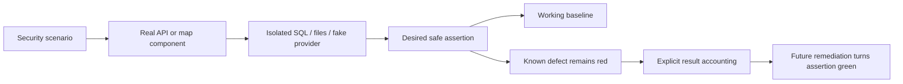
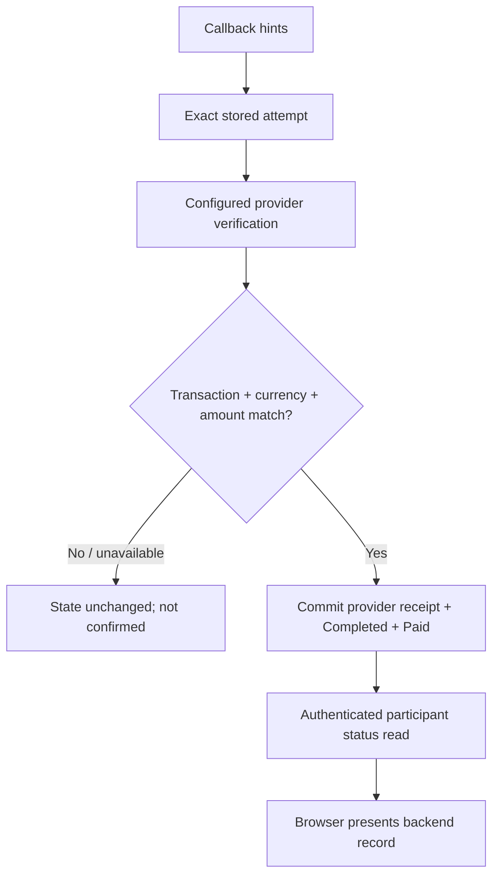
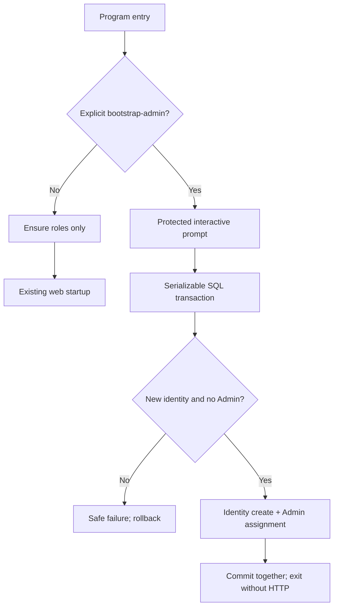
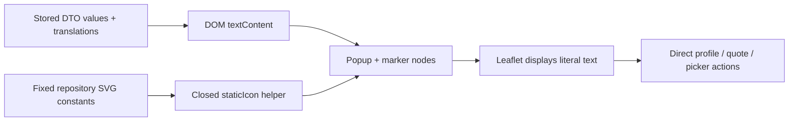
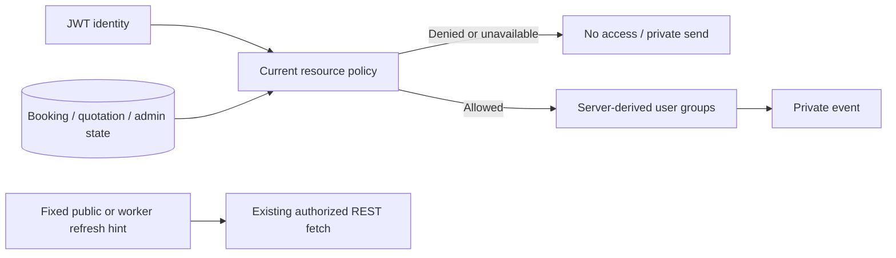

# 2026-10-07 — Order 0: executable security test foundation

This entry is about building tests before fixing the security bugs. Production behavior has not changed. The detailed run/setup reference is [PHASE1_SECURITY_TEST_HARNESS.md](../testing/PHASE1_SECURITY_TEST_HARNESS.md).

This file did not exist when this task started, so there were no older entries to replace. Future tasks should append their own dated entries.

## 1. What problem did we have?

We had source-code evidence, but no reliable way to repeat the important failures automatically.

A regression test is a small program that repeats a scenario and checks the rule we want to preserve. Without it, changing the code can make a demonstration look better without proving the underlying rule.

For example, the payment code could receive VALID from the caller and mark the booking Paid even when no provider verification happened. A callback is an HTTP message sent back to our API, the server's request interface. Someone submitting a callback is not automatically a trusted payment provider.

The same gap appeared elsewhere:
- Startup created a default administrator.
- SignalR, the realtime messaging library, let unrelated authenticated users join another booking's group.
- The map interpreted stored customer text as HTML. XSS means cross-site scripting: attacker-controlled text becomes script in someone else's browser.
- A worker could change the customer's 800 counter-offer to 5,000 and accept it.
- A valid PDF signature was rejected, an invalid one accepted, and private download streaming failed.

Customers' agreements, private conversations, payment status and verification documents could be affected. This task gives us repeatable evidence of those problems. It does not repair them.

## 2. Why was this fix necessary?

The fix here is to our testing foundation.

A trust boundary is where data moves from a less-trusted source into a decision that grants authority. The payment provider result belongs on one side; a caller's success flag belongs on the other. A test should prove that crossing this boundary requires independent evidence.

Authorization means deciding what an identified user may do. Being logged in does not make someone a participant in every booking. The hub test gives an unrelated user a real valid JWT, a signed short-lived identity token, and checks that the server should still deny the booking.

We want a red test first: the desired safe rule fails on the current code. After the actual fix, that exact rule should become green. Otherwise, we might be testing the wrong path or accepting the bug as normal behavior.

## 3. What did we change?

A fixture is controlled setup used by a test. Ours creates only artificial identities, requests, bookings, payments and files.

The backend flow is:

Create uniquely named local SQL database
-> apply existing schema
-> boot real API in Production mode inside a test server
-> inject test-only provider transport and private file location
-> seed synthetic users and issue real JWTs
-> send HTTP/hub requests
-> inspect responses and committed database facts
-> record green/red outcomes
-> stop host and remove only generated resources.

WebApplicationFactory is the ASP.NET testing tool that boots this server. It keeps real middleware, Identity, controllers, EF queries and MVC result execution. MVC is the framework component that executes the returned HTTP result, including reading a file stream.

EF Core, Entity Framework Core, maps C# entities to database tables. We kept the SQL Server provider, which executes real SQL. We did not substitute EF InMemory, an object-based test store.

The provider fake replaces HttpMessageHandler, the transport used by HttpClient. It has no real network transport behind it. It returns configured receipt JSON or throws a deliberate availability error. Unexpected requests fail the fixture instead of contacting a gateway.

For the map, a small test page mounts the actual KarigorMap component with a DTO-shaped request. A DTO is the data object passed between application layers. The malicious fixture only flips a local boolean when HTML executes; it does not steal data or send it elsewhere.

We also added an explicit known-defect classifier. TRX is the XML test report produced by dotnet test. The classifier reads it and distinguishes the documented security assertions from unrelated errors.

## 4. Before vs After

| Before | After |
|---|---|
| Audit descriptions without repeatable runtime evidence | Executed HTTP, SQL, hub, unit and browser scenarios |
| dotnet test could fail without blocking backend CI | Unlisted/setup/skipped failures block the new gate |
| No safe payment-provider test transport | Deterministic receipts/outages; no gateway network call |
| No isolated SQL target rule | Loopback/master-only input and generated database names |
| A green build could be mistaken for security proof | Raw known failures remain visible and counted |
| Map vulnerability known only from source | Actual Chrome execution observed through a harmless probe |
| Production vulnerabilities existed | They still exist; tests now identify them |

## 5. Security invariant

For the harness itself:

**Tests must never use a production payment transport or target an application/remote database, and a known-failure exception must never hide a setup error or a new failure.**

For the application, the tests express rules that are currently broken, such as:

**A caller's VALID flag must not make a payment Completed or a booking Paid without matching provider verification.**

This matters because a test suite can otherwise give a false sense of safety. Passing the harness's result-accounting gate is not the same as passing all application security rules.

## 6. System-design concepts I learned

### Regression testing
- **Simple explanation:** Repeat a scenario automatically so a later change cannot silently break its rule.
- **Karigor example:** Keep the worker 1000 -> customer 800 -> worker 5000 sequence.
- **Why engineers use it:** Manual demonstrations are difficult to reproduce reliably.
- **Common mistake:** Assert that the worker successfully overwrites 800, turning the vulnerability into desired behavior.

### Unit versus integration testing
- **Simple explanation:** Unit tests check a small function; integration tests check components together.
- **Karigor example:** PDF bytes need a unit test; a callback changing SQL payment/booking rows needs integration.
- **Why engineers use it:** Cheap tests cover simple logic; heavier tests cover real boundaries.
- **Common mistake:** Mock the database and then claim SQL transactions or constraints were proved.

### Disposable SQL fixture
- **Simple explanation:** Create a temporary database for synthetic data, then remove it.
- **Karigor example:** Karigor_SecurityTests_<random-guid> on local SQL Express.
- **Why engineers use it:** We can safely execute real startup, writes and uniqueness checks.
- **Common mistake:** Reuse KarigorDev or run a script containing USE KarigorDev. Our fixture refuses that catalog and does not execute that script.

### Deterministic fake
- **Simple explanation:** An external service replacement that gives a result we choose every time.
- **Karigor example:** A valid BDT receipt, a USD receipt, another transaction's receipt, or a provider outage.
- **Why engineers use it:** No charges, internet timing or third-party availability during tests.
- **Common mistake:** Use sandbox payment calls as every automated test's dependency. Sandbox still has external failure modes.

### Resource authorization
- **Simple explanation:** Logging in identifies the person; ownership determines which specific records they may access.
- **Karigor example:** A customer JWT is valid but must not join somebody else's booking.
- **Why engineers use it:** Role checks alone cannot protect individual resources.
- **Common mistake:** Assume an unguessable group name is permission.

### Red -> Green workflow
- **Simple explanation:** First demonstrate the safe rule failing, then change production code until it passes.
- **Karigor example:** The PDF tests stay red now. A later signature correction must turn both green.
- **Why engineers use it:** The first red result proves the test reaches the defect.
- **Common mistake:** Skip the test or weaken its assertion to get a green build.

### Explicit failure accounting
- **Simple explanation:** Accept only an exact known assertion while treating everything else as a new problem.
- **Karigor example:** A failure beginning F1_CALLER_STATUS in its named method is documented; SQL unavailable is not.
- **Why engineers use it:** A temporary exception list can support remediation without disabling CI.
- **Common mistake:** continue-on-error on the entire test command. That also hides broken setup and new regressions.

### Synchronization and barriers
- **Simple explanation:** Coordinate operations at a known phase rather than guessing with delays.
- **Karigor example:** Future two-acceptance tests need both operations to reach the relevant read window before proceeding.
- **Why engineers use it:** Race conditions depend on overlap, not elapsed seconds.
- **Common mistake:** Thread.Sleep and two started tasks are not proof that both read the old state. No business concurrency test was added in this task.

### Resource lifetime
- **Simple explanation:** Keep a resource alive until its consumer finishes.
- **Karigor example:** The private file test goes through MVC so it catches a stream disposed before delivery.
- **Why engineers use it:** Returning a result is not always the same moment as executing it.
- **Common mistake:** Unit-test only the controller's returned type and never read the response bytes.

## 7. Failure scenarios

**Database unavailable:** fixture setup fails and the gate blocks. It cannot be called an expected payment or authorization failure.

**Two harness runs overlap:** random database/file names separate their resources. Within one SQL collection, tests run serially because they share a fake/host. This does not prove concurrent business operations are safe.

**Malicious input:** the map test observes a harmless browser flag. We never execute an attack against the deployed application.

**Provider unavailable:** the fake throws without network access. The unchanged payment code currently falls back to caller VALID. Its safe assertion fails as expected.

**Client retries:** duplicate callback processing and initiation idempotency are not covered yet. A future remediation must add those cases without contacting the real provider.

**Authentication/session state changes:** these tests use real valid JWTs, but do not redesign refresh sessions or prove immediate revocation. F6 remains deferred.

**Test process crashes:** normal cleanup is verified, but a crash may leave a generated database or directory. An operator should inspect that exact prefix instead of deleting arbitrary databases/uploads.

## 8. Why this design was chosen

**Alternative: EF InMemory.**
It was considered because it is quick to set up. It was rejected for relational claims: it does not behave like SQL Server for uniqueness, rollback, foreign keys, locking or rowversion.

**Alternative: Docker/Testcontainers everywhere.**
A container library can automate database lifecycle. It was deferred because this machine already has SQL Express. CI gets a SQL service container only because its Ubuntu runner needs a real engine. One small lifecycle fixture can use either connection.

**Alternative: multiple backend test projects immediately.**
Separate unit/integration projects can become useful later. One project plus explicit Layer traits is smaller now and still supports a SQL-free unit subset.

**Alternative: copy the vulnerable map HTML into a unit test.**
That would test the copy rather than the application. We mount the real component in a browser instead.

**Alternative: skip known security failures.**
It keeps CI green but stops proving the reproduction. We execute them and publish the raw failure.

**Alternative: assert vulnerable behavior as a green characterization test.**
That can document old behavior, but the same test would not become a passing security rule after the fix. Our assertions describe the safe rule.

**Alternative: tolerate every dotnet test exit 1.**
Rejected. Only named failures with exact assertion markers are accepted; setup errors and unexpected passes block. We added six tests for that classifier itself.

The tradeoff is a small custom result classifier and an exception manifest that need maintenance. Each completed remediation must remove its exception. The actual GitHub-hosted execution remains unverified until the workflow runs.

## 9. Tests added

The expected results below describe the safe requirement, not today's vulnerable behavior. Setup and layer details for every case are in the harness guide.

| Test name | What it does | Bug / invariant protected | Why it matters |
|---|---|---|---|
| CallerValidStatusAloneCannotSettlePayment | Anonymous VALID callback without ValId | F1: Only independent verification grants payment privilege | Payment not Completed and booking not Paid |
| UnavailableProviderCannotFallBackToCallerValid | VALID callback with ValId | F1: Dependency failure fails closed | No Completed/Paid despite provider exception |
| ReceiptForAnotherTransactionCannotSettlePayment | Callback naming this attempt | F1: Receipt must bind exact attempt | No Completed/Paid |
| ReceiptWithWrongCurrencyCannotSettlePayment | Callback with correct transaction | F1: Amount alone does not bind currency | No Completed/Paid |
| MatchingProviderReceiptUpdatesPaymentAndBooking | Valid callback | F1: Retain valid provider path during fixes | Completed and Paid; exactly one fake call |
| SqlServerRejectsDuplicatePaymentTransaction | Insert valid duplicate transaction | F1/foundation: Transaction ID remains unique | SQL 2601/2627 uniqueness error |
| OrdinaryProductionStartupDoesNotProvisionDefaultAdministrator | Start unchanged API | F2: Admin requires explicit operator intent | No implicit default account |
| UnrelatedAuthenticatedUserCannotJoinBooking | Invoke JoinBooking over Long Polling | F3: Authentication does not imply ownership | Hub denies invocation |
| BookingParticipantCanJoinAndReceiveGroupEvent | Join and emit test-only group probe | F3: Keep legitimate realtime access | Participant receives probe |
| WorkerCannotOverwriteAndAcceptCustomerCounterOffer | Worker 1000 -> customer 800 -> worker initial 5000 -> accept | F5: Preserve customer intent | Customer price remains 800; no altered agreement |
| DocumentOwnerReceivesCompleteFileThroughMvc | GET through full MVC pipeline | F7: Authorization must lead to usable complete delivery | 200 and identical bytes |
| NonOwnerCannotDownloadPrivateDocument | GET private URL | F7: Only owner/admin may retrieve private document | 404, no document |
| ValidPdfSignatureIsAccepted | Call actual validator | F7: Valid supported input works | True |
| InvalidFdpSignatureIsRejected | Call actual validator | F7: Incorrect signature is rejected | False |
| ValidPngSignatureIsAcceptedAndStreamPositionIsPreserved | Call actual validator | F7: Keep working format and caller resource state | True; offset still 3 |
| SqlFixtureRejectsRemoteServersAndApplicationDatabases | Validate fixture target | Harness safety: Never target app/remote DB | Both rejected before SQL |
| plain request popup and quote callback work | Open popup; press quote | F4 baseline: Safe ordinary interactions survive rendering changes | Text shown; callback outputs request 123 |
| stored map text cannot execute HTML | Open popup; await image completion | F4: Stored text cannot become executable HTML | Execution probe stays false |

The six gate tests protect how we interpret the application tests:

| Test name | What it does | Rule protected | Why it matters |
|---|---|---|---|
| test_exact_known_assertion_is_reported_as_expected | Synthetic failed TRX with exact name/marker | One accounted-for expected failure | Known failure is explicit rather than silently skipped |
| test_fixture_error_is_not_accepted_as_known_failure | Known test name but SQL-unavailable message | Blocking error | Infrastructure failure cannot masquerade as security reproduction |
| test_unregistered_failure_blocks | Failure absent from manifest | Blocking error | New defects cannot enter the allowlist silently |
| test_unexpected_pass_requires_promotion | Known regression now passes | Blocking promotion message | A fix must remove its exception and become blocking |
| test_skipped_test_blocks | TRX outcome NotExecuted | Blocking error | No silent test skips |
| test_strict_mode_keeps_known_regression_red | Exact known failure with strict=true | Blocking error | Strict mode exposes real red security assertions |

Actual results:
- Backend: 16 cases, 6 green baseline passes and 10 expected safe-assertion failures.
- Browser: one ordinary popup/callback baseline pass; one actual XSS safe-assertion failure.
- Classifier: six passes.
- Skipped: zero.

Playwright prints “2 passed” because its expected-failure annotation matched. Its JSON records the XSS case as expected failed/actually failed. That is not a claim that XSS was fixed.

The strict F1 command returns 1: two baselines pass and four security assertions fail. After F1 remediation, those four must pass and their manifest entries must be removed.

## 10. Files changed

| File | Change | Reason |
|---|---|---|
| .github/workflows/backend-ci.yml | Local SQL service in Ubuntu CI; run classifier tests/full suite; upload raw artifacts | Make regressions executable without blanket continue-on-error |
| .github/workflows/frontend-ci.yml | Install Chromium; typecheck/run browser fixture; upload results | Run actual map rendering in CI |
| .github/workflows/deploy-monsterasp.yml | Run explicit Layer=Unit subset through classifier | Avoid raw known failures/SQL dependency breaking the existing Windows deploy job; full SQL suite runs in backend CI |
| .gitignore | Ignore generated browser results and Python bytecode | Keep test artifacts out of source |
| Karigor.slnx | Add the security test project | Include test code in normal builds |
| karigor-client/package.json | Playwright dev dependency and three security scripts | Test-only browser tooling |
| karigor-client/package-lock.json | Lock the three added Playwright packages | Reproducible dependency resolution |
| karigor-client/e2e/vite.config.ts | Separate loopback test entry/server | No production route or API dependency |
| karigor-client/e2e/playwright.config.ts | One browser/worker; explicit results and expected-failure handling | Small deterministic browser runner |
| karigor-client/e2e/tsconfig.json | Typecheck test fixtures/config/spec | Catch TS errors that Playwright transpilation alone would miss |
| karigor-client/e2e/fixtures/map.html | Test-only HTML entry | Mount actual component outside application flows |
| karigor-client/e2e/fixtures/map.tsx | Theme/i18n/map fixture; harmless XSS probe; quote output | Real component rendering without copying production HTML |
| karigor-client/e2e/map.security.spec.ts | Baseline and executed XSS regression | Protect F4 |
| scripts/run-security-tests.py | Run dotnet; validate exact TRX outcomes/manifest; emit summary; strict/subset modes | Account for known red assertions without accepting unrelated failures |
| scripts/tests/test_security_runner.py | Six classifier self-tests | Prove the gate's rejection rules |
| tests/known-security-defects.json | Ten named assertions explicitly accepted as current defects | Auditable promotion list |
| tests/Karigor.Security.Tests/Karigor.Security.Tests.csproj | Single net10.0 xUnit/WAF/SignalR project | Minimum backend dependency set |
| tests/Karigor.Security.Tests/Infrastructure/DisposableSqlDatabase.cs | Loopback/master guard; unique database; current SQL script; guarded cleanup | Real SQL behavior without touching application databases |
| tests/Karigor.Security.Tests/Infrastructure/FakePaymentHandler.cs | Deterministic valid/mismatched/unavailable receipt modes; deny unexpected calls | No production payment transport |
| tests/Karigor.Security.Tests/Infrastructure/SecurityApplicationFixture.cs | Production TestServer host; isolated SQL/files; real JWTs and graph fixtures | Test unchanged pipeline and Identity/ownership behavior |
| tests/Karigor.Security.Tests/UnitSecurityTests.cs | Four signature/fixture-safety tests | Cheap deterministic boundaries |
| tests/Karigor.Security.Tests/PaymentSecurityTests.cs | Six callback/binding/provider/constraint tests | F1 starting evidence |
| tests/Karigor.Security.Tests/ApiSecurityTests.cs | Six startup/hub/negotiation/document tests | F2/F3/F5/F7 evidence |
| docs/testing/PHASE1_SECURITY_TEST_HARNESS.md | How to run, interpret and extend this small harness | Implementation and learning reference |
| docs/security/SECURITY_WORKDONE.md | Dated study entry (new file; no prior entries existed) | Human-readable security learning history |
| docs/adr/0002-phase1-security-test-harness.md | Implemented harness architecture decision | Record SQL and expected-failure tradeoffs |

No backend production source, frontend src or database SQL file changed. Approved plan/ADR 0001 were left intact. The old ADR is empty in this checkout; the new testing decision is recorded separately.

## 11. Commands and verification

Important commands actually run:

```text
dotnet sln Karigor.slnx add tests/Karigor.Security.Tests/Karigor.Security.Tests.csproj
dotnet build tests/Karigor.Security.Tests/Karigor.Security.Tests.csproj --configuration Release
dotnet build Karigor.slnx --configuration Release --no-restore
python scripts/run-security-tests.py
python scripts/run-security-tests.py --no-build --filter "Layer=Unit"
python scripts/run-security-tests.py --no-build --strict --filter "Finding=F1"
python -m unittest discover -s scripts/tests -v
npm --prefix karigor-client install --save-dev --save-exact @playwright/test
npm --prefix karigor-client run typecheck:security
npm --prefix karigor-client run test:security
npm --prefix karigor-client run build
npm --prefix karigor-client run lint
```

For browser execution we selected installed Chrome with KARIGOR_TEST_BROWSER_CHANNEL=chrome. On this machine Node/npm needed the real Program Files installation prepended to process PATH; no system files were changed.

Builds passed. The whole backend build reported zero warnings/errors. Browser fixture typechecking passed. Lint exited zero but reported warnings in existing production files. The Vite build retained its existing bundle/config warnings.

The backend accounting gate returned zero only after confirming the ten known failures and six passes. Its strict F1 run returned 1 as intended. The deployment-style unit subset returned zero after two passes and two known PDF failures.

A read-only SQL query found zero databases remaining under the generated fixture prefix after the runs. Generated reports/traces are ignored locally and configured for CI upload.

Final checks also passed: git diff --check, parsing all three changed workflow YAML files, and checking documentation links, code fences and required study sections. A scoped git diff confirmed no backend production source, frontend src or database SQL changes. Parsing a workflow checks its syntax; it does not prove the hosted job will execute successfully.

Environment actually used: .NET SDK 10.0.301, SQL Express 2022 16.0.1000.6, Node 22.17.0, Playwright 1.63.0 and Chrome 154.0.8037.98. We did not run hosted GitHub Actions, a Linux SQL service container, live payments or a production deployment.

## 12. Remaining risks / limitations

This harness does not fix any production vulnerability.

The suite is deliberately small. It does not yet prove global event confidentiality, anonymous hub denial, default-email promotion handling, amount edge cases, callback booking fallback, payment retries, concurrent acceptance, refresh-session revocation, upload traversal/limits, or authenticated browser document previews.

Current SQL setup still mirrors production schema plus startup DDL. Schema ownership drift remains. No rowversion/migration was added and no concurrency guarantee is claimed.

Only Chrome was executed locally. SignalR was tested through Long Polling and TestServer, not live WebSockets/IIS. The map fixture uses stored-shaped data, not a full persisted request-to-worker journey.

Dependency installation reported nine advisories. We did not apply unrelated audit fixes. The existing lint/bundle warnings remain.

CI jobs now have the necessary commands, but their first actual GitHub run is still required. The deployment workflow runs an explicit unit subset; full SQL tests run in Backend CI. This task did not create branch protection or link the independent deployment workflow to CI completion.

A red regression can be transformed into a normal blocking test after its actual fix. Updating the exception manifest is not permission to weaken the rule or hide a different failure.

## 13. How I would explain this in an interview

### 30-second explanation

I built a small security harness before changing Karigor's vulnerable behavior. It runs the real API against disposable SQL, replaces payment transport with a deterministic fake, and mounts the real map in Chrome. Safe assertions reproduce the current defects. CI accounts for only those exact failures and blocks setup errors or new failures. Each remediation must turn its test green and remove its exception.

### 2-minute explanation

Our audit found security rules that existed in documentation but were not proved by tests. A payment could settle from a caller's flag, hub authentication did not ensure booking ownership, and mutable counter-offers did not preserve customer consent.

I added one backend project with unit and integration traits. WebApplicationFactory runs the unchanged Production pipeline, including the problematic startup, but points it at a generated local SQL database and test files. SQL Server is important because I want actual constraint and transaction behavior, not an in-memory substitute. A provider handler supplies receipts or outages without contacting a gateway.

The browser fixture mounts the real Leaflet component and checks a harmless script-execution flag. A normal popup/quote baseline protects legitimate behavior.

The challenge is keeping CI useful while known defects intentionally remain. I preserve the safe assertions, run them red, and use exact names/markers to account for them. New errors, skips and unexpected passes block. Once a fix works, its exception must be removed. This has a maintenance cost, but it gives an honest red-to-green process instead of a misleading green build.

## 14. Interview questions

1. **What did the tests fix?** The lack of repeatable evidence and useful test gating. They did not fix production vulnerabilities.
2. **Why real SQL for these integrations?** EF InMemory cannot prove SQL constraints or rollback/locking behavior. Our duplicate transaction baseline checks an actual SQL uniqueness error.
3. **How did you test payment failure safely?** A handler with no network transport throws a configured exception. We check the stored payment and booking remain unprivileged; that requirement currently fails.
4. **Why not silently skip the red tests?** A skipped scenario cannot prove reproduction or detect that a remediation made it pass. Exact result accounting keeps it executed and visible.
5. **What does an unexpected pass mean?** The behavior may have been fixed or the fixture may have stopped reaching it. Review it, preserve the assertion, and remove the exception only when the fix is verified.

## 15. What should I study next?

1. How an HTTP provider response becomes an authoritative payment decision: exact transaction, currency and amount binding.
2. SQL transactions versus unique constraints: why atomic commit and prevention of duplicate relationships solve different problems.
3. TaskCompletionSource and barriers: how to control a race test's read/commit window.
4. ASP.NET result execution and stream ownership: why returning a FileStreamResult does not immediately consume its stream.
5. CI result semantics: how failed assertions, setup errors and expected-failure promotion should affect a quality gate.

**Ready to begin F1 remediation locally:** yes. Its real callback/SQL path, provider fake, four red assertions and two baselines are verified. Before F1 is called complete, add the remaining selected payment cases and run the actual CI job.



# F1 Payment Trust and Provider Verification

Date: 2026-10-07 (Asia/Dhaka).
Implemented: immediate F1 containment only.
Detailed reference: [F1 implementation guide](implementation/F1_PAYMENT_TRUST_AND_VERIFICATION.md).

## 1. What problem did we have?

Our API could hear “VALID” from an HTTP caller and treat it as proof of payment. A callback is a message sent back to our server; anyone reaching the anonymous route can try to submit one.

Imagine a customer has an Initiated payment for BDT 1,000. Someone submits its transaction ID and status=VALID, but no provider validation ID. The old code could mark the payment Completed and the booking Paid without asking SSLCommerz anything.

The problem was not limited to a missing validation call. When the provider call failed, the same caller-status fallback still worked. A real receipt for another transaction or another currency could also pass. Missing/malformed amounts were accepted, and an amount difference below one taka was tolerated.

ValueA is a callback's extra field. If the supplied transaction did not exist, a booking ID in ValueA could select that booking's newest payment. This confused “a record the caller named” with “the exact attempt the provider verified.”

Customers, artisans and anyone relying on booking/payment status could be affected. Our local pre-fix strict run reproduced the four Phase 0 payment defects: two baseline passes and four security failures.

The return page had another trust mistake: changing its URL to status=success made it claim verified payment and display caller amount/transaction. It also claimed an artisan payout, even though this code did not execute a payout.

## 2. Why was this fix necessary?

A **trust boundary** is the point where data from someone we do not trust can affect a decision with authority. Here, untrusted callback fields were crossing into financial state.

**Server-side verification** means our server asks the configured payment provider through its own connection. The caller can give us a lookup hint, but cannot supply the answer.

**Fail closed** means missing proof does not grant a privilege. For Karigor, that means no new Completed payment or Paid booking without matching proof. It does not mean we should invent a failed charge when the provider times out.

A **timeout** tells us that we did not receive a reliable answer. The provider might still have processed the payment. Saying “No charges were made” would be another unsupported claim.

## 3. What did we change?

The previous flow was:

Callback says success
-> optional provider check
-> trust caller VALID if checking did not establish success
-> possibly find a different attempt using ValueA
-> save caller receipt fields
-> mark payment/booking paid
-> browser displays URL-derived success.

The implemented flow is:

Receive success, fail, cancel or IPN
-> use the same verifier
-> find the exact stored transaction
-> ask the configured provider
-> require matching transaction, BDT currency and exact amount
-> save provider receipt and Completed/Paid together
-> return a recorded completion only after the save.

If proof is absent or unreliable, the flow stops before financial writes. The new attempt stays Initiated. “Unresolved” is the decision we return; we did not add a new stored status or schema.

We also compare the returned transaction using **ordinal equality**, which compares the actual characters. SQL Server's collation, its string-comparison rules, can ignore case or trailing spaces. A database match alone was not enough for an exact identifier.

The amount parser now accepts ordinary invariant decimal text with up to two fractional digits and compares decimal values exactly. “Invariant” means a fixed format independent of the machine's language settings. There is no tolerance, exponent/group syntax or rounding of excessive precision.

ValId, bank transaction and card type come from the verified provider response. Contradictory callback values do not overwrite them. The stored serialized receipt is the validation DTO, the provider fields represented by our response class.

All route names are hints. A fail URL with a genuinely matching success receipt can record success. A success URL without proof cannot.

The provider client now rejects HTTP errors before parsing and never silently changes to the shared sandbox merchant. Initiation and verification use the configured store.

The browser then does a separate read:

Return page opens
-> authentication restores or asks for sign-in
-> page requests the booking's payment summary with its Bearer token
-> backend checks booking participation
-> page confirms only a Completed record with PaidAt
-> page displays backend details.

A **Bearer token** is the signed access token sent with an API request. The existing customer/worker ownership checks are still used. Nonparticipants get 403; guests get 401. A cache-control header asks HTTP caches not to store this financial summary.

The page's retry button reads status again; it does not initiate another charge. We removed automatic success-driven redirection and unsupported no-charge/payout statements so users can inspect uncertainty.

An existing exact Completed record is returned unchanged on a later callback. This protects sequential late messages. It does not prove that two simultaneous callbacks have one effect.

## 4. Before vs After

| Before | After |
|---|---|
| Caller VALID could mark a booking Paid | Only a matching provider receipt creates payment completion |
| ValueA could choose a booking's latest attempt | Exact stored transaction selects the attempt |
| Missing or slightly wrong amount could pass | Amount is required and must match exactly |
| Caller bank/card values became receipt facts | Verified provider values become receipt facts |
| Provider failure could be treated as success or Failed | No financial write; unresolved outcome |
| Fail/cancel directly changed financial state | Same verifier; route/status hints alone do not finalize |
| URL status=success meant “verified” | Authenticated backend record controls the page |
| Payment receipt was described as payout | Confirmation explicitly does not prove artisan payout |

## 5. Security invariant

**A payment may newly become Completed and its booking Paid only after independent provider verification binds to that exact stored transaction, currency and amount.**

The word “exact” matters. It prevents a valid payment somewhere else from paying this booking.

This task does not revalidate or repair old Completed/Paid rows. Our new UI reports the backend record; it cannot reconstruct historical proof that was never recorded correctly.

## 6. System-design concepts I learned

### Trust boundaries
- **Simple explanation:** A message from outside is a claim, not permission to change important state.
- **Karigor example:** status=VALID is a hint until independent provider proof matches the attempt.
- **Why engineers use it:** It keeps caller-controlled input from becoming authority.
- **Common mistake:** Assume a route named success can only be called after a successful payment.

### Server-side verification
- **Simple explanation:** Ask the source of truth directly.
- **Karigor example:** Our configured provider client retrieves the receipt; the callback does not supply the authoritative bank/card facts.
- **Why engineers use it:** It prevents browser/request tampering from forging outcomes.
- **Common mistake:** Call the provider, then ignore the result and fall back to the caller.

### Authoritative state
- **Simple explanation:** Choose which verified record controls our decisions.
- **Karigor example:** The return page reads the authorized backend summary instead of URL amount/status.
- **Why engineers use it:** Different clients should not invent different payment outcomes.
- **Common mistake:** Think a database row is automatically historically trustworthy. Old rows still need review.

### External-system uncertainty
- **Simple explanation:** A missing response does not tell us what happened remotely.
- **Karigor example:** Timeout leaves an attempt unresolved; it does not prove the customer was not charged.
- **Why engineers use it:** Remote calls cannot be rolled back by our SQL transaction.
- **Common mistake:** Retry a new charge session blindly after a timeout.

### Fail-closed behavior
- **Simple explanation:** Do not grant the benefit when evidence is insufficient.
- **Karigor example:** Reject missing transaction/currency/amount proof before setting Paid.
- **Why engineers use it:** Availability problems should not turn into authorization bypasses.
- **Common mistake:** Confuse denying success with proving failure.

### Atomicity versus idempotency
- **Simple explanation:** Atomicity means related writes happen together; idempotency means retrying one intent has one business effect.
- **Karigor example:** One EF save commits payment and booking together. It does not prevent two independent callbacks from both notifying.
- **Why engineers use it:** These solve different failure modes.
- **Common mistake:** Call an early Completed check “concurrency-safe idempotency.”

### Regression promotion
- **Simple explanation:** Keep the original safe assertion and remove its exception when the fix actually makes it pass.
- **Karigor example:** Four F1 markers left the known-defect manifest only after successful execution.
- **Why engineers use it:** The fixed rule becomes a normal blocking check.
- **Common mistake:** Weaken the assertion or remove the test to get a green build.

## 7. Failure scenarios

**Database rejects the save:** a fixture-only CHECK deliberately rejected the booking's Paid update. The API returned 503, and a new SQL read found the payment Initiated, booking Unpaid and receipt fields unset. The temporary constraint was removed afterward. This proves actual SQL rollback for this failure.

**Two callbacks arrive together:** both can still read the old state, verify and produce notifications. We added no rowversion, settlement allocation or coordinated race guarantee. That is later work.

**Malicious callback input:** status/ValueA/amount/bank/card hints cannot establish completion. Exact identity and provider binding are checked before writes.

**Provider fails or times out:** no Completed or Failed write occurs. IPN returns an unresolved 503 for transport/parse uncertainty. Retry-After: 30 is advisory; we did not test the provider's actual retry policy.

**Client retries:** the page retries only its read. Payment-initiation retries can still create another attempt. They need the later idempotency/reconciliation design.

**Authentication changes:** a signed-out page asks for sign-in; a denied summary stays unconfirmed. The query includes user ID. Refresh-session rotation/revocation was not redesigned or proved.

**Late fail/cancel:** the existing completed record, PaidAt and receipt remain unchanged. This was tested sequentially, not under competing stale writes.

**Notification delivery fails:** the existing best-effort code does not undo a committed payment. No durable delivery or notification race test was added.

## 8. Why this design was chosen

We fixed the missing proof boundary without requiring a database migration. Waiting for the complete payment architecture would have left the direct trust bypass open.

**Alternative: remove only the VALID fallback.**
It was small, but left transaction/currency binding, ValueA lookup and direct fail/cancel trust unresolved. We rejected it as incomplete containment.

**Alternative: require a customer login on the provider callback.**
It uses familiar authentication, but the provider has no customer session. Logging in is not evidence that money moved.

**Alternative: treat timeout as failed payment.**
It gives a simple final state, but lies about an unknown external outcome. We preserved the current attempt instead.

**Alternative: add a new Unresolved table/status.**
That could improve recovery modeling. We deferred it because existing Initiated plus an unresolved response supports immediate containment, and this task forbids the larger schema architecture.

**Alternative: build rowversion/allocation/idempotency/outbox now.**
Those are useful consistency tools, but were explicitly deferred. An **outbox** is a durable database record of an event waiting to be delivered. We did not add one.

**Alternative: keep shared sandbox credentials as fallback.**
It helps demonstrations appear to work, but silently switches which merchant is being trusted. Configuration failure now stays failure.

The cost of this design is honest uncertainty: some returns will remain unconfirmed, and unverified abandoned attempts can remain Initiated. That is preferable to falsely marking money received.

The implemented boundary matches the approved immediate F1 design. ADR 0001 is empty in this checkout and was not rewritten; no unrelated Proposed decision changed status.

## 9. Tests added or promoted

These are the relevant tests. Each expected result describes the safe rule. The implementation guide lists full setup/layer details and every parameterized input.

| Test name / cases | What it does | Rule or bug protected | Why it matters |
|---|---|---|---|
| CallerValidStatusAloneCannotSettlePayment (1 (promoted)) | POST success with caller VALID and no ValId | A caller flag cannot grant payment authority | Neither Completed nor Paid; zero provider calls |
| UnavailableProviderCannotFallBackToCallerValid (1 (promoted)) | POST success with VALID and ValId | An outage is not success | Neither Completed nor Paid; one fake call |
| ReceiptForAnotherTransactionCannotSettlePayment (1 (promoted)) | POST success naming this attempt | Receipt identity binds the exact attempt | Neither Completed nor Paid |
| ReceiptWithWrongCurrencyCannotSettlePayment (1 (promoted)) | POST success | Currency is part of payment identity | Neither Completed nor Paid |
| MatchingProviderReceiptUpdatesPaymentAndBooking (1 existing baseline) | POST success | Valid payment still works | Completed and Paid; one fake call |
| SqlServerRejectsDuplicatePaymentTransaction (1 existing baseline) | Insert duplicate TransactionId | Transaction identifier remains unique | SQL 2601/2627 |
| UntrustedCallbackRoutesLeavePaymentUnresolved (3: fail, cancel, ipn) | Send VALID without ValId to each route | Route names/caller status cannot finalize money | State and receipt fields unchanged; IPN 422; browser not confirmed |
| BrowserGetCallbackRequiresTheSameProviderVerification (3: success, fail, cancel) | GET VALID without ValId, then GET FAILED with a matching receipt | Query hints obey the same verification boundary | First unresolved; second Completed/Paid and confirmed |
| UnknownOrNonExactTransactionCannotUseBookingFallback (6: unknown on all four routes; case/space on success) | Send unknown/non-exact transaction plus real ValueA | ValueA and SQL collation cannot select another attempt | No provider call or mutation; unknown IPN 404 |
| MalformedOrUnboundProviderReceiptLeavesPaymentUnresolved (14 cases (listed below)) | POST IPN | Incomplete or mismatched proof grants no authority | 422; Initiated/Unpaid; no authoritative receipt fields |
| ProviderTransportOrParseFailureLeavesPaymentUnresolved (4: timeout, non-2xx HTTP, invalid JSON, JSON null) | POST IPN | Unknown external outcome is not Paid or Failed | 503 with Retry-After; unchanged financial state |
| VerifiedProviderFieldsOverrideCallbackHints (1) | POST IPN | Only verified provider facts become authoritative | Provider receipt fields stored; Completed/Paid; no forged values |
| EveryRouteCanRecordOnlyProviderBoundSuccess (3: fail, cancel, ipn) | POST each route | Success is a provider fact, independent of route | Completed/Paid from provider; one call |
| LateCallbacksCannotDowngradeVerifiedSuccess (3: fail, cancel, ipn) | Send late FAILED without a receipt | A later hint cannot erase confirmed success | Completion, PaidAt and stored receipt preserved; no provider call |
| ParticipantsCanReadAuthoritativeSummaryButStrangersCannot (1) | GET summary as both participants, stranger and guest | UI reads are authenticated and resource-authorized | 200/no-store for participants; stranger 403; guest 401 |
| DatabaseWriteFailureCannotPartiallyCompletePaymentAndBooking (1) | Verify receipt and POST IPN | Payment and booking commit together | 503; payment Initiated and booking Unpaid; receipt not committed |
| SandboxCredentialErrorNeverSwitchesMerchant (2: initiation, validation) | Call provider client | Merchant identity must not silently change | Exactly one request to configured merchant; no testbox retry |
| F1: forged success URL cannot confirm an unresolved payment (1) | Open status=success plus forged amount/transaction | URL hints cannot grant UI confirmation | Not confirmed; backend details only; Bearer header sent |
| F1: backend completion wins over failure URL and forged receipt details (1) | Open status=failed with forged receipt fields | Backend record controls presentation | Confirmed; backend transaction and BDT 1,000; no payout claim |
| F1: backend outage remains unconfirmed and an explicit status retry can recover (1) | Open forged success, then click status retry | An outage is unresolved, not no-charge proof | Initially not confirmed; then confirmed; two reads |
| F1: denied summary cannot be replaced by URL success (1) | Open status=success | Authorization failure has no client fallback | Not confirmed; no receipt details |
| F1: signed-out return asks for sign-in and does not fetch payment details (1) | Open status=success | No anonymous claim of authenticated payment truth | Sign-in prompt; zero payment reads |

The fourteen bad-receipt variations cover missing/empty/malformed amounts, both one-paisa mismatches, grouping/exponent/excess-precision text, missing transaction/currency/validation ID, a different validation ID, FAILED and INVALID_TRANSACTION.

The original four safe assertions were preserved. Their Classification changed to GreenBaseline after the underlying fix, and their four manifest entries were removed after observed passes. The two existing F1 baselines were retained.

Actual results:
- Before remediation: six F1 cases, two passes and four expected security failures.
- Final strict F1: 47 passes, zero failures/skips; gate exit 0.
- Full backend: 57 cases, 51 passes and six exact known failures from F2/F3/F5/F7; gate exit 0, raw dotnet exit 1.
- Browser: five payment cases and the ordinary map case passed. The unchanged F4 XSS assertion failed as expected.
- Classifier self-tests: six passed.
- Unit subset: four passes and two known F7 failures.
- Skipped: zero.

Playwright reports “7 passed” because the expected F4 failure matches its annotation. That does not mean XSS was fixed.

## 10. Files changed

| File | Change | Reason |
|---|---|---|
| backend/Karigor.Application/Payments/PaymentService.cs | One verifier for success/fail/cancel/IPN; exact lookup/binding; provider-only receipts; leave uncertainty unchanged; correct payout wording | Remove payment trust bypass without redesigning initiation or settlement allocation |
| backend/Karigor.Application/Payments/PaymentVerificationException.cs | Small unresolved-verification exception carrying stored booking ID and retryability | Keep browser/IPN outcomes honest without a schema or new stored state |
| backend/Karigor.Application/Payments/SslCommerz/SslCommerzClient.cs | Require successful HTTP; dispose responses; remove merchant fallbacks; avoid raw malformed validation logging | A failed call or another sandbox merchant is not authoritative proof |
| backend/Karigor.Api/Controllers/PaymentsController.cs | Consistent browser handling; IPN 400/404/422/503; safe redirect encoding; no-store summary and explicit 403/404 | Expose unresolved outcomes and support authorized status reads |
| karigor-client/src/pages/PaymentCallbackPage.tsx | Fetch authenticated summary; ignore URL status/receipt; conservative errors/sign-in; explicit status retry; remove payout/charge claims | Present backend truth rather than caller hints |
| tests/Karigor.Security.Tests/PaymentSecurityTests.cs | Preserve/promote four regressions; add receipt/route/GET/provenance/ownership/SQL rollback cases | Verify immediate F1 containment |
| tests/Karigor.Security.Tests/SslCommerzClientSecurityTests.cs | Two sandbox merchant-boundary cases | Prove credential errors never switch stores |
| tests/Karigor.Security.Tests/Infrastructure/FakePaymentHandler.cs | Add timeout/HTTP/body/initiation modes and captured request metadata | Deterministic evidence with no socket-backed transport |
| tests/known-security-defects.json | Remove exactly four verified F1 exceptions; retain six unrelated defects | Make F1 a normal blocking gate |
| karigor-client/e2e/fixtures/payment.html | Test-only browser entry | Mount the real return page outside production routing |
| karigor-client/e2e/fixtures/payment.tsx | Actual router/query/auth/theme/page fixture | Reuse existing stack without copying decision logic |
| karigor-client/e2e/payment.security.spec.ts | Five browser regressions with local mocked HTTP and external requests blocked | Prove URL/error/auth presentation boundaries |
| docs/testing/PHASE1_SECURITY_TEST_HARNESS.md | Add current F1 status note; preserve Order 0 evidence | Avoid confusing historical red results with current F1 state |
| docs/security/SECURITY_WORKDONE.md | Append dated F1 study entry; preserve previous history | Explain what changed and what was actually proved |
| docs/security/implementation/F1_PAYMENT_TRUST_AND_VERIFICATION.md | Create final implementation/verification guide | Record architecture, tradeoffs and deferred work |

This is the F1 task's table. Earlier uncommitted Order 0 files remain in the working tree and were preserved. We made no new dependency/CI/schema changes for F1.

## 11. Commands and verification

Important commands actually run:

```text
dotnet build Karigor.slnx --configuration Release --no-restore
dotnet test tests/Karigor.Security.Tests/Karigor.Security.Tests.csproj --configuration Release --filter "Finding=F1" --logger "trx;LogFileName=f1-after.trx" --results-directory TestResults/f1
dotnet test tests/Karigor.Security.Tests/Karigor.Security.Tests.csproj --configuration Release --filter "FullyQualifiedName~BrowserGetCallbackRequiresTheSameProviderVerification" --logger "trx;LogFileName=f1-get.trx" --results-directory TestResults/f1
python scripts/run-security-tests.py --no-build --strict --filter "Finding=F1"
python scripts/run-security-tests.py --no-build
python scripts/run-security-tests.py --no-build --filter "Layer=Unit"
python -m unittest discover -s scripts/tests -v
npm --prefix karigor-client run typecheck:security
npm --prefix karigor-client run test:security
npm --prefix karigor-client run build
npm --prefix karigor-client run lint
```

The first solution build passed with an EF fixture-DDL interpolation warning. We replaced that expression with formatting of only a generated typed integer. The final solution build passed with zero warnings/errors.

Browser fixture typechecking and frontend build passed. Lint exited zero with 21 warnings already present in other production files. Existing Vite config/bundle warnings remain.

The strict F1 command was executed before and after the fix. The full runner correctly accepted only the six remaining known assertions. No classifier rule was weakened.

We used installed Chrome with KARIGOR_TEST_BROWSER_CHANNEL=chrome and prepended the real Node/npm installation to PATH. Payment calls used the fake handler, including fake sandbox requests. Browser HTTP was controlled locally and third-party origins blocked.

The detailed guide identifies raw report paths. Final checks passed: git diff --check, UTF-8 documentation/code-fence/relative-link checks, all 15 required study sections, report-counter checks and exact production file-scope checks. The previous Order 0 study content was verified as an unchanged prefix of this appended file.

The production delta is exactly five F1 files: the payment controller/service/provider client, the new verification exception and the return page. SignalR authorization, negotiation, refresh sessions, worker documents and database scripts have no changes. The approved plan and empty ADR 0001 remain unchanged. A read-only sqlcmd query found zero generated fixture databases after the final runs.

Not verified: GitHub-hosted Actions, live gateway behavior, production database history, merchant cutover, Linux service-container execution or deployment. No commit/push/merge/deployment/credential rotation was performed.

## 12. Remaining risks / limitations

**Implemented:** immediate provider trust/binding containment, consistent callback handling, provider receipt provenance and backend-derived return presentation.

**Still proposed for later:** payment initiation idempotency, per-attempt merchant/environment metadata, rowversions, settlement allocation, reconciliation and durable notification guarantees. None was added here.

Important limits:
- Concurrent callbacks can still duplicate side effects; sequential tests are not race proof.
- The latest-attempt summary can conceal an earlier settlement if another attempt exists.
- Old Completed/Paid rows were not revalidated. Their provenance may be incomplete or incorrect.
- Unknown remote outcomes do not recover automatically; a 503 header is not a recovery worker.
- Actual risk flags, FX, refunds/chargebacks and gateway retry semantics were not tested.
- Some unverified failure/cancel events leave attempts Initiated. Strict binding also stops formerly tolerated demonstrations.
- PaymentReceived still broadcasts globally. F3 confidentiality is unresolved.
- F5 can still corrupt negotiated consent; provider verification cannot repair that agreement.
- F6 session architecture and worker-document handling were untouched.
- Browser tests use mocked local HTTP and one browser; they are not a real checkout against SSLCommerz.

## 13. How I would explain this in an interview

### 30-second explanation

Karigor could mark a payment successful from a caller's VALID flag after missing or failed provider verification. I made all callback routes independently verify an exact stored transaction, BDT currency and decimal amount. Receipt facts now come from the provider, and uncertainty changes no financial state. The page reads authenticated backend status. The four original red regressions are now green; concurrency and idempotency remain a separate phase.

### 2-minute explanation

The issue was that we treated an incoming message as financial authority. A provider call existed, but the code could fall back to caller VALID after an exception. Missing amounts, small mismatches, another transaction and another currency were not rejected consistently. An extra booking field could select a different attempt.

I kept the current stack and schema. All callback routes use exact stored transaction lookup and the configured provider client. Before writing, we require successful HTTP, a valid parsed result and matching transaction/currency/amount. We store receipt facts from that response. A timeout stays unresolved because the remote provider may have processed the payment.

One EF save commits the payment and booking summary together. An actual SQL constraint-failure test proves rollback. The return page separately reads the authenticated participant-only API and ignores URL status/receipt hints.

The tests use a deterministic provider fake and disposable SQL, so no real charge is needed. Forty-seven F1 backend cases and five browser cases pass. The original four assertions were not weakened; their exceptions were removed. The tradeoff is delayed confirmation and unresolved attempts. This does not claim safe simultaneous settlement, notification deduplication or old-data repair; those require the later consistency design.

## 14. Interview questions

1. **Why isn't VALID in a callback enough?** An arbitrary caller can send it. Independent provider proof must match our stored attempt.
2. **Why check currency if the amount matches?** The same number in different currencies represents different money. Currency belongs to the binding.
3. **Why not mark Failed on timeout?** Missing communication does not prove the remote operation failed. Preserve uncertainty.
4. **What does the rollback test prove?** Payment and booking updates do not partially commit when SQL rejects this save. It does not prove concurrent idempotency.
5. **Why does the page fetch status again?** Its URL is caller-controlled. The authenticated backend summary supplies the record and enforces ownership.

## 15. What should I study next?

1. Decimal parsing and SQL collation: why representation rules matter for exact financial identity.
2. SQL atomicity versus optimistic concurrency: why a successful transaction is not enough for two simultaneous callbacks.
3. Initiation idempotency and reconciliation: how to recover an unknown gateway outcome without starting another charge.
4. Receipt provenance and merchant/environment identity: how to retain evidence that a future audit can actually verify.
5. API uncertainty in UI design: how to communicate “not confirmed” without claiming success or no charge.



# F2 Secure Administrator Bootstrap

Date: 2026-10-07 (Asia/Dhaka).

Implemented and verified locally on base c43176d in J:/Karigor-F2-F4, branch fix/admin-bootstrap-and-xss-on-f1. This is a separate worktree: another checkout of the repository on its own branch. The original checkout and branch were left unchanged.

## 1. What problem did we have?

Starting the API also created a privileged user with a fixed email and known password. If someone already owned that email, startup gave the existing account the Admin role instead.

A concrete failure was: a customer registers the fixed email, the application restarts, and that customer becomes an administrator without an operator approving the promotion. On a fresh database, someone who knew the published demo credentials could try the automatically created administrator instead. Customers, workers and their private data could be affected by misuse of that account.

The login page also offered an Admin Demo button. Removing that button alone would not repair the startup behavior.

We reproduced the original problem in an isolated SQL database before changing it. We did not inspect whether a real deployment already contained that account.

## 2. Why was this fix necessary?

A **trust boundary** is the point where information needs stronger authority before it can control an operation. Here, an ordinary application restart crossed the boundary into creating administrator privilege.

**Authorization** means deciding who may perform an action. Possessing an email matching a constant is not authorization to become an administrator. The operator should explicitly choose a new initial account.

**Bootstrap** means the first setup needed before a system can operate. Initial administrator setup belongs in an operator task, with a clear end, rather than in every web-server restart.

## 3. What did we change?

Normal startup now follows this sequence:

Start API
→ ensure the Customer, Worker and Admin role definitions exist
→ check role-creation results
→ leave user accounts and assignments alone
→ continue existing initialization and start HTTP.

A role definition is a label the application understands; creating the label Admin does not give it to anyone.

Initial administrator setup now has a separate sequence:

Run `dotnet Karigor.Api.dll bootstrap-admin`
→ reject extra arguments or redirected input
→ ask for email and two hidden password entries
→ reject empty or mismatched input
→ build services without starting the web server
→ open a SQL transaction
→ refuse existing email/username matches
→ ensure the Admin role exists
→ refuse setup if an administrator already exists
→ create a new user and assign Admin using ASP.NET Core Identity
→ commit both writes
→ report a safe outcome and exit.

**ASP.NET Core Identity** is the account library already used by Karigor. It validates users, hashes passwords and manages role assignments. We reused it; we did not create our own password hashing.

A **transaction** groups database changes so they commit together or roll back together. User creation and role assignment share one scoped database context and one transaction. Every IdentityResult, the library's success/failure result, is checked.

The transaction uses **serializable isolation**, which makes competing database operations behave as though they ran in a serial order. This protects the decision that no administrator exists. SQL's configured retry strategy retries certain temporary failures; each retry clears entities tracked by the failed attempt.

The command runs before web startup, JWT configuration and startup schema work. It builds a non-web host but never starts it. Password characters are read without echo. No password is accepted in process arguments, printed in outcomes or recorded in these instructions.

The UI's Admin Demo action was removed. Deployment/database instructions now describe the explicit command. The seed SQL change is a comment only.

The detailed [F2 implementation guide](implementation/F2_SECURE_ADMIN_BOOTSTRAP.md) explains configuration, exit codes and each service.

## 4. Before vs After

| Before | After |
|---|---|
| Every startup could create a known-password administrator | Startup only ensures role definitions |
| Matching the fixed email could promote a customer | Bootstrap refuses existing email or username matches |
| Creation and role assignment could be treated separately | Both commit in one SQL transaction |
| Failed Identity results could be ignored | Results are checked and failure stops setup |
| Login UI advertised administrator demo credentials | That action is absent |
| Restart and initial privileged setup were coupled | An explicit command performs initial setup and exits |

## 5. Security invariant

“Ordinary web startup must never create an administrator or promote a user by matching an email.”

For the operator command: “A new initial account and its Admin assignment commit together; existing accounts are never promoted, and bootstrap closes once an administrator exists.”

These rules matter because routine restarts should not change who controls the application. Preserving legitimate existing administrators is also part of the rule. This change does not revoke an old exposed account automatically.

## 6. System-design concepts I learned

**Concept: separate operator work from request serving.**

Simple explanation: starting a website and granting its first privilege are different jobs.

Karigor example: Program branches into bootstrap-admin before building the web server.

Why engineers use it: routine availability work cannot accidentally grant privilege.

Common mistake: leaving a one-time setup flag enabled in every deployment.

**Concept: atomicity.**

Simple explanation: either all related changes happen or none do.

Karigor example: if SQL rejects the Admin assignment, the newly created user is rolled back too.

Why engineers use it: partially completed setup is hard to reason about and recover safely.

Common mistake: assuming two successful library calls automatically share a transaction.

**Concept: concurrency and serialization.**

Simple explanation: two operations may both read “none exists” before either writes.

Karigor example: two initial administrator commands can compete. Serializable SQL plus retry makes one succeed and the other observe that setup is closed.

Why engineers use it: a check performed before a write needs protection against another writer.

Common mistake: using a process-only lock, which cannot coordinate two separately launched commands.

**Concept: a test barrier.**

Simple explanation: a barrier holds cooperating test operations at a chosen point until both arrive.

Karigor example: the test releases both commands after they have checked the no-admin condition.

Why engineers use it: it exercises the dangerous overlap deliberately.

Common mistake: relying on Thread.Sleep, which changes timing without proving that overlap occurred.

**Concept: safe diagnostics.**

Simple explanation: explain failure without repeating confidential input.

Karigor example: a rejecting Identity validator supplies a sensitive description; the command exposes only a generic outcome.

Why engineers use it: error messages and logs are additional places credentials can escape.

Common mistake: logging an entire exception or failed result without reviewing its contents.

## 7. Failure scenarios

If SQL rejects role assignment, the transaction rolls back the new account. The fixture-only CHECK constraint test proves this with real SQL, not an in-memory substitute.

If two commands arrive together, the coordinated test produces one administrator. The other operation retries after the conflict and refuses setup. This is not a concurrency guarantee for unrelated registration, payment or session code.

If input is malformed, weak or mismatched, setup fails. A customer matching the requested address is preserved rather than promoted. Extra arguments and redirected input stop before database/web startup.

If the database connection or a commit response is lost, the command must not announce success. A lost response can be ambiguous: the complete transaction may already have committed. Exit 1 means success was not confirmed, not universal proof that no account exists. Inspect the intended database before retrying.

If the operator retries after confirmed success, setup refuses another account and preserves the original. We tested both repeating the same identity and requesting another identity.

If existing account/session state changes, this command does not repair it. Normal startup preserves legitimate administrators and the integration test verifies actual login. Session revocation and legacy credential rotation remain separate work.

The password is hidden during entry but briefly exists in managed process memory. A compromised operator machine is outside what a hidden prompt can protect.

## 8. Why this design was chosen

| Alternative | Why considered | Why rejected or deferred |
|---|---|---|
| Development-only default administrator | Convenient demos | Keeps a shared privileged credential pattern without a requirement |
| Startup environment flag | Easy to toggle | Still couples privilege to web startup; flag may remain enabled |
| Password in arguments or piped input | Easy automation | Can expose secrets through histories, process inspection or scripts |
| Direct SQL account insertion | Fewer application services | Bypasses Identity validation, normalization and password hashing |
| Promote an existing email match | Convenient setup | An email match is not permission to elevate that account |
| New console framework or identity service | More separation | Existing assembly and early command dispatch are enough here |
| No transaction | Less code | Can leave a partial account or two initial winners |

The cost is more setup code and deliberately limited failure messages. Serializable transactions can block or deadlock; the command is rare, short and uses the existing SQL retry strategy.

No schema, migration, index or new infrastructure was introduced. The existing Identity tables and indexes remain. Test constraints exist only in generated databases.

This follows the approved F2 design. ADR 0001 is empty in this base and was not rewritten; this task did not introduce a different architecture decision.

## 9. Tests added

The first row is the existing Phase 0 regression, promoted without changing its assertion. Other rows describe the new checks; theory rows include more than one executed case.

| Test | Cases / what it does | Bug or invariant protected / why it matters |
|---|---|---|
| OrdinaryProductionStartupDoesNotProvisionDefaultAdministrator | 1; original promoted; Fresh Production-style WAF host → Start actual API → No fixed-email account created | No implicit privileged identity; startup + SQL |
| RealCommandRejectsRedirectedInputOrExtraArgumentsWithoutStartingWebServer | 2: redirected input, extra argument; Actual API child process, redirected streams → Invoke bootstrap-admin → Exit 2; no web-start/listening output | Operator mode is explicit and non-web; process test |
| MissingOrMismatchedPromptInputStopsBeforeDatabaseConfiguration | 3: email, password, confirmation; Synthetic prompt; no database supplied → Invoke command → Exit 2; no secret output | Invalid prompt cannot reach provisioning; unit |
| ExplicitBootstrapCreatesExactlyOneRequestedAdministrator | 1; Fresh generated SQL Identity schema → Run actual command with test input/config → Exit 0; one hashed account/Admin assignment | Requested identity and privilege created together; SQL integration |
| RepeatedBootstrapAndAdditionalAdministratorAreRejected | 1; One successfully bootstrapped account → Repeat same email, then try another email → Exit 1; one account/assignment, original password unchanged | Initial bootstrap closes and never overwrites; SQL integration |
| BootstrapNeverPromotesAnExistingCustomer | 2: email match, username-only match; Existing customer and password → Request its address/name as bootstrap → Exit 1; customer preserved, no Admin | Matching an account is not promotion authority; SQL integration |
| InvalidIdentityInputLeavesNoAccountOrRole | 2: bad email, weak password; Fresh generated database → Attempt bootstrap → Exit 1; zero users/assignments/roles | Input/Identity failure rolls back creation; SQL integration |
| RoleAssignmentSqlFailureRollsBackAccountCreation | 1; Fixture-only CHECK rejects Admin assignment → Run bootstrap → Exit 1; no account or assignment | User creation cannot partially commit; real SQL fault |
| RejectedRoleIdentityResultIsCheckedWithoutLeakingInput | 1; Real RoleManager with rejecting validator; sensitive description → Call bootstrap service → Throw safe error; no user/role; description absent | Failed Identity results are not ignored; SQL + Identity |
| CoordinatedConcurrentBootstrapCreatesOnlyOneAdministrator | 1; Two scopes, distinct emails, validator barrier after no-admin reads → Run both bootstrap operations → One success; one closed-bootstrap rejection; one user/assignment | Serializable initial bootstrap prevents two winners; real SQL/barrier |
| NormalStartupDoesNotPromoteDefaultEmailCustomer | 1; Create fixed-email customer, restart actual API on same fixture → Read roles/password after restart → Still Customer, not Admin; password works; three roles remain | Startup does not elevate by email; WAF/SQL |
| ExistingAdministratorSurvivesStartupAndCanSignIn | 1; Existing hashed Admin; restart actual API → POST actual login → 200 with Admin role | Legitimate privileged identities survive; WAF/SQL/auth |
| F2: login page offers no default administrator demo credentials | 1; Real LoginPage fixture with local mocked HTTP → Open login → Customer/Worker demos present; Admin Demo absent | Product UI no longer advertises default privilege; browser |

The backend total is 17 passing cases. The login browser case also passes.

Before the fix, the original Production-startup assertion failed. After the fix, the same assertion passed, its classification became GREEN BASELINE and only F2_DEFAULT_ADMIN was removed from the known-defect manifest. We did not weaken the assertion or change the classifier.

**WebApplicationFactory** is the ASP.NET Core test host that runs the actual API entry point with test services and configuration. The startup/login tests combine that host with disposable SQL Server. The command tests use either an actual child process or a controlled prompt. Database correctness tests use real SQL because transactions and locks are the behavior being examined.

A real interactive-terminal smoke test also created one synthetic administrator in a generated local database. Both password entries were hidden, the command exited 0, SQL showed one account and assignment, and the database was removed afterward. No production password was used.

There were no skipped F2 cases. In the combined backend run, five expected failures remain for F3/F5/F7; those are not F2 successes.

## 10. Files changed

| File | What changed | Why |
|---|---|---|
| backend/Karigor.Api/Program.cs | Early explicit command dispatch; roles-only ordinary startup | Remove default creation/promotion |
| backend/Karigor.Api/Administration/AdminBootstrapCommand.cs | Hidden prompt; no args/piping; non-web service host; safe exit messages | Separate operator provisioning from HTTP startup |
| backend/Karigor.Api/Administration/AdminBootstrapper.cs | Initial-only Identity creation in retried serializable SQL transaction | Reject promotion/partial privilege/concurrent winners |
| backend/Karigor.Api/Administration/IdentityRoleSeeder.cs | Idempotent role definitions and checked Identity results | Preserve roles without implicit users |
| karigor-client/src/pages/auth/LoginPage.tsx | Remove Admin Demo handler/button | Retire unsafe credential shortcut |
| tests/Karigor.Security.Tests/AdminBootstrapCommandTests.cs | Five command/input tests | Prove process exit and prompt rejection |
| tests/Karigor.Security.Tests/AdminBootstrapSecurityTests.cs | Eleven actual SQL/startup/login/bootstrap cases | Verify authority, rollback and coordination |
| tests/Karigor.Security.Tests/ApiSecurityTests.cs | Promote original F2 classification; assertion unchanged | Make verified startup rule blocking |
| tests/known-security-defects.json | Remove only F2_DEFAULT_ADMIN entry | Keep unrelated failures explicit |
| karigor-client/e2e/fixtures/payment.tsx | Test-only option mounts actual LoginPage | Reuse existing auth/query/router fixture; payment code unchanged |
| karigor-client/e2e/admin-bootstrap.security.spec.ts | Actual login UI regression | Verify Admin Demo removal |
| docs/MONSTERASP_DEPLOYMENT.md | Replace automatic/default admin setup with explicit prompt command | Correct operator instructions |
| database/production/README.md | Replace automatic admin setup instructions | Correct provisioning sequence |
| database/production/002_seed.sql | Admin-setup comment only; executable SQL identical | Remove misleading automatic-provisioning note |
| docs/security/implementation/F2_SECURE_ADMIN_BOOTSTRAP.md | Final F2 architecture, commands/tests/limits | Technical implementation reference |
| docs/security/SECURITY_WORKDONE.md | Append two dated study entries; preserve Order 0/F1 history | Explain why each task matters |
| docs/testing/PHASE1_SECURITY_TEST_HARNESS.md | Update current F2/F4 status; preserve prior evidence | Keep current gates distinguishable from historical red tests |

The shared study log and harness guide also record F4. Payment production code, authorization endpoints, session code and executable SQL were not changed for F2.

## 11. Commands and verification

Important commands actually executed from the separate worktree:

```text
python scripts/run-security-tests.py --strict --filter "Finding=F2"
dotnet build Karigor.slnx --configuration Release --no-restore
dotnet test tests/Karigor.Security.Tests/Karigor.Security.Tests.csproj --configuration Release --filter "Finding=F2" --logger "trx;LogFileName=f2-after.trx" --results-directory TestResults/f2
python scripts/run-security-tests.py --no-build --strict --filter "Finding=F2"
npm --prefix karigor-client run test:security -- --grep "^F2:"
dotnet backend/Karigor.Api/bin/Release/net10.0/Karigor.Api.dll bootstrap-admin
python scripts/run-security-tests.py --no-build
python -m unittest discover -s scripts/tests -v
npm --prefix karigor-client run typecheck:security
npm --prefix karigor-client run test:security
npm --prefix karigor-client run build
npm --prefix karigor-client run lint
```

The first strict command was pre-fix: one known assertion failed, exit 1. Post-fix raw and strict F2 runs each passed 17 cases. The targeted login browser run passed one.

The real command invocation above used a guarded generated SQL fixture, not production configuration. sqlcmd applied the existing schema, read the resulting counts and dropped the generated database.

The final solution build passed with zero warnings/errors. Two early test-code build warnings were corrected before that build.

Combined backend: 73 executed, 68 passed, five exact known F3/F5/F7 failures, zero skips. Raw dotnet exited 1; the existing accounting gate exited 0. All 47 F1 backend cases remain green. Classifier self-tests: six passes.

Combined browser: 19 passed, zero expected failures/skips. Browser fixture typechecking and frontend build passed. Existing Vite configuration/bundle warnings remain. Lint exited 0 with 20 existing warnings.

The browser used installed Chrome and blocked external origins. The test command required the actual Node/npm directory in PATH; locked packages were installed without changing the package or lock files. Nine existing npm advisories were reported and not repaired in this task.

Detailed raw report paths are in the F2 guide. GitHub-hosted CI, the actual hosting console and production were not run. No commit, push, merge, deployment or production credential change was performed.

Final inspection passed: git diff --check with the repository's Windows line-ending settings, exact 21-file scope, UTF-8/fence/link checks, both 15-section study entries, preserved previous history, report counters and unchanged executable seed SQL. The original F2 assertion/body is unchanged; its classification is the only edit in ApiSecurityTests. The original F4 safe assertion was also confirmed unchanged. A read-only sqlcmd query found zero generated fixture databases, and no test process referenced this worktree.

Two inspection attempts needed correction: overriding Git's line-ending mode produced CRLF whitespace reports, and an ad hoc assertion check initially assumed the wrong browser probe name. Rechecking with the repository settings and the actual assertion passed. Neither required a production-code change or a weakened security test.

## 12. Remaining risks / limitations

**Actually implemented:** roles-only startup, explicit initial bootstrap, hidden input, checked Identity results, atomic account/role creation, local concurrency protection, and removal of the administrator demo shortcut.

**Still requires operator work:** determine whether an old default account is exposed, rotate/revoke it if authorized, and review sessions. Existing production identities were preserved and not inspected.

The command does not confirm ownership of the entered email or set EmailConfirmed. It is authorized through trusted executable/database access, not an HTTP permission check. Hidden entry does not protect against a compromised terminal, and diagnostic detail is intentionally limited.

The current Identity policy is registered in both normal application setup and command setup; future policy changes must keep them aligned. Startup seeding can still have availability failures if the database cannot create a role. This task does not redesign concurrent normal web startup.

F3 private realtime authorization, F5 quotation consent, F7 document handling and F6 session redesign remain unresolved. F1's later consistency/idempotency work remains separate.

Educational scaling, without implementing a redesign:

| Scale | What changes conceptually |
|---|---|
| 100 users | One trusted operator and the existing SQL setup are adequate to evaluate |
| 10,000 users | Administrator lifecycle, reviews and safe recovery matter more than bootstrap throughput |
| 1,000,000 users | Privilege approvals, audit evidence and separation of operator duties need stronger process; do not run bootstrap per user |

Bootstrap frequency is not proportional to customer count. No IAM service, audit infrastructure or distributed lock was added for these examples.

## 13. How I would explain this in an interview

### 30-second explanation

Karigor granted administrator privilege during ordinary startup using a fixed identity. I removed account creation and email-based promotion from startup and added an explicit initial setup command with hidden password entry. Identity creation and role assignment share a serializable SQL transaction. Tests prove no startup promotion, rollback on assignment failure and one winner under coordinated concurrency. Existing production accounts still need a separate review.

### 2-minute explanation

The original flaw mixed application availability with privileged setup. Starting the server could create a known-password administrator or elevate a customer who matched the configured email. Removing the UI demo was necessary but would not repair that trust boundary.

I kept the current Identity and SQL stack. Normal startup now seeds role definitions only. A command mode branches before HTTP and JWT setup, requires an interactive protected prompt, rejects existing accounts and closes once an administrator exists.

UserManager and RoleManager use the same scoped database context. Every result is checked, and account creation plus Admin assignment run in one serializable transaction. The existing SQL retry strategy handles temporary conflicts; a retry clears state from the rolled-back attempt.

I tested real API startup, actual login, a real command subprocess, malformed prompts, a failed role validator and a SQL constraint fault. A barrier forces two initial commands into the dangerous overlap rather than relying on timing delays. Seventeen backend cases and the login browser case pass, including the original unchanged regression.

The tradeoff is limited diagnostics and serializable locking for a rare operator operation. This is not automated recovery or credential revocation. An uncertain commit must be inspected, and old exposed production accounts were deliberately preserved until separately reviewed.

## 14. Interview questions

1. **Why seed Admin as a role but not a user?** The role defines a permission category; assignment grants that permission to a specific identity. Startup needs definitions, not new privileged people.
2. **Why reject existing accounts?** A matching email or username is not operator approval to elevate its current owner.
3. **What does the SQL fault test prove?** If role assignment fails, the newly created account does not remain. It tests an actual database transaction.
4. **Why is a barrier better than a sleep?** It proves both operations reached the relevant decision before allowing the writes to compete.
5. **Does removing default seeding revoke an old administrator?** No. Old accounts and sessions need separate authorized review; changing future startup cannot undo past exposure.

## 15. What should I study next?

1. ASP.NET Core Identity stores and IdentityResult: how validation, hashing and role assignments reach SQL.
2. SQL serializable locks and deadlocks: why competing absence checks need coordination.
3. Transaction retry and uncertain commit recovery: why an error can mean “unknown.”
4. Operator credential handling and account lifecycle: how to separate initial setup from recovery and revocation.



# F4 Stored XSS Prevention

Date: 2026-10-07 (Asia/Dhaka).

Implemented and verified locally in the same J:/Karigor-F2-F4 worktree. This entry describes map rendering; it does not claim that unrelated authorization or upload problems were repaired.

## 1. What problem did we have?

Request descriptions and addresses entered Leaflet popup HTML strings. Other dynamic values, including categories, worker email/skills and translated labels, used similar HTML paths.

**Stored cross-site scripting (stored XSS)** means an attacker saves text that later becomes executable content in another person's browser. For example, a customer could save an image tag with an error handler in a request description. A worker opening that request's map popup could execute the handler under Karigor's page origin.

The browser test's harmless handler only flips a local boolean. Before the fix, the original test observed execution and failed its safe assertion. A real attacker could attempt actions available to that browser session. We did not perform a production attack or inspect stored production content.

React did not automatically escape these strings because the map handed them directly to Leaflet's HTML APIs, outside React's normal text rendering.

## 2. Why was this fix necessary?

A **rendering sink** is the API that receives data for display. A dangerous sink interprets the data as markup or code; a safe text sink displays it literally.

**Output context** means where and how the browser interprets a value. Text, HTML, URLs and JavaScript are different contexts. This task uses the plain-text context because map descriptions and labels do not require user-authored HTML.

The trust boundary is between stored or translated data and the browser's parser. A database value is still untrusted when displayed. Storing the value successfully never made it safe HTML.

## 3. What did we change?

The rendering sequence is now:

Receive nearby data or map translations
→ create DOM elements
→ assign dynamic values through textContent
→ construct fixed visual icons separately
→ give Leaflet completed nodes
→ display literal text
→ use direct listeners for profile/quote actions.

**DOM** means the browser's document object model: the actual nodes that form the page. **textContent** assigns text to a node without asking the HTML parser to interpret it.

The component's textElement helper creates elements, sets their fixed classes and assigns textContent. Request category, description, address, distance and button text all follow this path. Worker email, skill names, rate, rating/distance and translated labels do too.

Picker badge/popup, user-location popup and worker-base coverage popup were included. We checked marker labels as well as the larger popups, because a small label can also be an HTML sink.

Repository-owned SVG icons use a private helper with a closed set of fixed keys. Its remaining HTML parser input is only source-controlled SVG constants. Static attribution and two fixed marker shells remain static markup. Dynamic data does not enter them.

Buttons are constructed directly, keep type=button and receive listeners on the actual node. Quote/profile/selection callbacks are preserved, including quote's request-selection fallback. Marker effects now include the relevant callbacks/translations so a redraw uses current values.

No stored data was rewritten, no angle brackets were stripped and no sanitizer, framework or content-security-policy deployment was added. Bengali, quotes, ampersands and bracket characters remain visible as entered.

The [F4 implementation guide](implementation/F4_STORED_XSS_PREVENTION.md) contains the complete sink inventory.

## 4. Before vs After

| Before | After |
|---|---|
| User description/address parsed as popup HTML | Literal DOM text |
| Category could become markup in both badge and popup | Text in both locations |
| Worker email/skills entered popup HTML | Text nodes |
| Some translations entered HTML strings | Text in markers/location/picker popups |
| Interpolated button markup needed later lookup | Direct button nodes and listeners |
| Existing malicious rows could execute at these sinks | The same strings display literally |
| Input stripping might damage legitimate text | Original Bengali and punctuation are preserved |

## 5. Security invariant

“Every dynamic value displayed by KarigorMap must remain text rather than executable markup.”

Fixed repository icons are a separate boundary: they must stay fixed and never interpolate request, worker or translation values.

The rule protects the browser viewing another person's stored content. It also makes future maintenance clearer: adding a new map field means passing text to a text API, not assembling another HTML template.

## 6. System-design concepts I learned

**Concept: stored XSS.**

Simple explanation: someone else's saved text turns into code when you view it.

Karigor example: a request description becomes an image handler in a worker's popup.

Why engineers use the concept: it connects storage, later display and the victim's session.

Common mistake: assuming that “came from our database” means “trusted.”

**Concept: context-specific rendering.**

Simple explanation: use the API that matches the intended meaning of the data.

Karigor example: descriptions and category names go to textContent because they are text.

Why engineers use it: escaping for one context does not automatically protect another.

Common mistake: treating all output safety as one generic string replacement.

**Concept: separating code from data.**

Simple explanation: our fixed icons are markup; a customer's description is data.

Karigor example: staticIcon accepts only keys into fixed source SVGs, while textElement accepts the labels.

Why engineers use it: the parser boundary becomes easy to inspect.

Common mistake: later adding user data to a supposedly static template.

**Concept: resource lifetime.**

Simple explanation: a marker's nodes and listeners should exist only as long as that marker.

Karigor example: clearing layers on redraw and removing the map on unmount avoids retaining old quote listeners.

Why engineers use it: callbacks should fire once and use current data.

Common mistake: repeatedly attaching listeners to surviving elements without removing old ones.

**Concept: browser component testing.**

Simple explanation: exercise one real UI component in an actual browser with controlled inputs.

Karigor example: the fixture mounts the real KarigorMap, opens Leaflet popups and observes DOM/events.

Why engineers use it: HTML parsing and image/SVG events cannot be proved by a string-only assertion.

Common mistake: checking that a payload string was escaped somewhere without proving how the final browser renders it.

## 7. Failure scenarios

If someone supplies hostile HTML-looking text, it is displayed literally. Tests verify the text, absence of injected handler elements and absence of execution. They cover image and SVG variants.

If a database/API request fails, data loading behavior is unchanged. This component renders supplied props; it does not add recovery or database writes. Safe rendering works whenever data reaches it.

If map data updates quickly or the component redraws, nodes are rebuilt through the same text path. Repeated redraw/remount tests verify one quote action per click and one map after remount. They are not a general backend concurrency proof.

If external tiles or mocked services fail, tests still exercise local markers and popups. External browser origins are blocked. Google/SignalR console messages from controlled fixtures do not establish live integration behavior.

If the client retries or remounts, rendering remains text. The test checks callback counts through several redraws and a remount.

If authentication changes, this rendering rule still applies, but access control remains the responsibility of the existing API/session layers. XSS prevention does not prove that a user is authorized to read a booking.

If the quote callback is absent, the original selection fallback remains available. Profile, picker and location behavior also have browser checks.

## 8. Why this design was chosen

| Alternative | Why considered | Why rejected or deferred |
|---|---|---|
| Escape every template interpolation | Small local changes | Easy to miss one field or use the wrong context |
| Strip angle brackets on input | Simple validation rule | Damages legitimate text and does not protect old rows |
| Clean all stored rows | Remove known examples | Changes data while leaving the unsafe rendering sink |
| Add an HTML sanitizer | Useful for formatted user content | Map text has no requirement for user-authored HTML |
| Create React roots inside every popup | Reuse JSX escaping | Adds root lifecycle/unmount work without needing it |
| Rely only on CSP | Can reduce exploitability | Does not repair these sinks and needs separate compatibility review |

**Content Security Policy (CSP)** is a browser policy restricting allowed sources and kinds of content. It can be defense in depth, meaning another protective layer, but it was not introduced here.

DOM construction is more verbose than a string template. The benefit is a visible rule for every dynamic value while keeping Leaflet's existing lifecycle. No SQL constraints, indexes, migrations or transactions changed because this is a display-boundary fix.

The approach follows the approved F4 design. ADR 0001 remains untouched; no different architecture decision was introduced.

## 9. Tests added

Every map case uses actual Chrome, Leaflet and the production component. The payloads only flip a local test boolean. The baseline and original regression are preserved; the fixture now covers additional fields and interactions.

| Test | What it does / expected result | Bug or invariant protected / why it matters |
|---|---|---|
| GREEN BASELINE: plain request popup and quote callback work | Ordinary request DTO → Open popup and press quote → Description shown; callback request 123 | Preserve normal request interaction |
| GREEN REGRESSION F4: stored map text cannot execute HTML | Original image-handler description → Open actual popup → Original execution assertion false; literal payload; no image | Promoted original XSS rule |
| F4: request address image markup remains literal | Image-handler address → Open popup and quote → Literal text, no image/handler or execution; quote works | Address is text |
| F4: request category image markup remains literal | Image-handler category → Inspect marker badge and popup → Literal category; no image/handler or execution | Marker HTML is also a trust boundary |
| F4: request category svg markup remains literal | SVG-load category → Inspect marker badge and popup → Literal SVG text; no onload/execution | Different payload type stays inert |
| F4: worker email markup remains literal and profile actions work | Image-handler email → Click marker then profile button → Literal email; no execution; callback counts 1 then 2 | Name/email label does not become code |
| F4: worker skill markup remains literal and profile actions work | SVG-load skill/category → Click marker then profile button → Literal skill; no execution; callbacks once per action | Skill names are text |
| F4: Bengali quotes ampersands and angle brackets are preserved | Bengali/special-character description and address → Open popup → Exact original strings retained | Safety must not destroy legitimate text |
| F4: translated worker marker label remains literal | Hostile translated New label → Inspect worker icon and popup → Literal label; no image/execution | Translations do not enter HTML |
| F4: user and worker-base location popup translations remain literal | Hostile location titles/coverage translation → Open both location popups, closing each between actions → Literal labels; no image/execution | All location popup text uses safe DOM |
| F4: picker text remains literal and map selection works | Hostile drag/title/hint translations → Open picker popup and select map position → Literal text; no image/execution; coordinates emitted | Picker badge/popup and interactions survive |
| F4: redraw and remount do not accumulate quotation handlers | Normal request with counters and controlled redraw/mount → Three redraw/quote cycles; unmount/remount; quote again → Counts 1,2,3,4; one map after remount | Listeners belong to the current marker |
| F4: quotation button preserves request-selection fallback | No onRequestQuote callback → Select marker then press quote → Selection counts 1 then 2; zero quote callbacks | Existing fallback behavior remains |

All 13 map cases passed, with zero skipped or expected-failure cases after promotion.

The original safe execution assertion was not changed. Before remediation it failed and was accounted as an expected failure. After remediation it passed while the annotation still expected failure, so Playwright reported “Expected to fail, but passed” and exited 1. Only then did we remove test.fail and promote the case to GREEN REGRESSION. This is the **Red → Green workflow**: observe a real failing invariant, fix its cause, then make that same invariant a blocking check.

One initial expanded run had 12 passes and one timeout: the first location popup covered the second marker. The test now closes the first popup using its real close button before opening the other. We did not use a forced click, arbitrary sleep or weaker assertion. The corrected map run passed 13, and the combined browser run passed 19.

The fixture feeds DTO-shaped props directly into the real component. It is not an end-to-end proof of database persistence or a live customer-to-worker journey.

## 10. Files changed

| File | What changed | Why |
|---|---|---|
| karigor-client/src/components/map/KarigorMap.tsx | Safe DOM/text for all dynamic icons/popups; direct listeners; current callbacks/translations in effect dependencies | Render stored text inertly and preserve interactions |
| karigor-client/e2e/fixtures/map.tsx | Worker/location/picker/text/redraw/remount scenarios and harmless probes | Exercise actual component boundaries |
| karigor-client/e2e/map.security.spec.ts | Promote original safe assertion; twelve additional/baseline cases | Verify rendering and interactions in Chrome |
| docs/security/implementation/F4_STORED_XSS_PREVENTION.md | Final sink inventory, flows, tests and limitations | Technical implementation reference |
| docs/security/SECURITY_WORKDONE.md | Append two dated study entries; preserve Order 0/F1 history | Explain why each task matters |
| docs/testing/PHASE1_SECURITY_TEST_HARNESS.md | Update current F2/F4 status; preserve prior evidence | Keep current gates distinguishable from historical red tests |

Only KarigorMap changes production behavior for F4. The separate F2 entry describes the login fixture and administrator changes. Payment architecture, SignalR membership, negotiation, refresh and document code were preserved.

## 11. Commands and verification

Commands actually executed:

```text
npm --prefix karigor-client run test:security -- --grep "EXPECTED-FAIL REGRESSION F4"
npm --prefix karigor-client run test:security -- --grep "stored map text cannot execute HTML"
npm --prefix karigor-client run typecheck:security
npm --prefix karigor-client run test:security -- map.security.spec.ts
dotnet build Karigor.slnx --configuration Release --no-restore
python scripts/run-security-tests.py --no-build
python -m unittest discover -s scripts/tests -v
npm --prefix karigor-client run test:security
npm --prefix karigor-client run build
npm --prefix karigor-client run lint
```

Pre-fix original F4: the safe assertion failed as expected; native expected-failure accounting returned process 0. Post-fix with that annotation still present: the safe assertion passed, and process 1 signaled the unexpected pass. Final promoted map suite: 13 passes.

Combined browser suite: 19 actual passes, zero failures, expected failures or skips. This includes five existing F1 payment cases and the F2 login case. No external payment provider was contacted.

Combined backend: 68 passes and five exact known F3/F5/F7 failures from 73 cases. The raw runner exited 1 and the unchanged accounting gate exited 0. Nothing is silently skipped. Classifier self-tests: six passes.

Backend build passed with zero warnings/errors. Browser fixture typechecking and frontend build passed. Existing Vite configuration/bundle warnings remain. Lint exited 0 with 20 existing warnings; the map's relevant callback/translation dependency warning was removed.

Final browser results are at karigor-client/test-results/security-browser/results.json. Detailed backend report paths and the sink inventory are in the implementation guides.

Chrome was the only tested browser. Hosted CI, production stored rows and deployment were not exercised. No commit, push, merge or deployment was performed.

Final git diff --check passed with the repository's Windows line-ending settings. File-scope, documentation and recorded-result checks passed; earlier study history is preserved. The original no-execution assertion is byte-for-byte the same text. A final read-only check found zero generated SQL fixture databases and no test processes referencing this worktree. The exact production scope is Program, the three new Administration classes, LoginPage and KarigorMap; all payment/SignalR/negotiation/session/document production surfaces remain unchanged from the selected base.

## 12. Remaining risks / limitations

**Actually implemented:** safe text rendering for all dynamic KarigorMap popups and marker labels, preserved actions, and browser regressions promoted to blocking checks.

**Not established:** application-wide freedom from XSS, correct resource authorization, safe worker-document previews, or session revocation. Other rendering components were not comprehensively tested by this task.

A future map change must preserve the fixed-icon boundary and use textContent for dynamic values. HTML-looking text is intentionally visible; there is no supported rich-HTML formatting feature.

Tests use Chrome and controlled props/HTTP. They do not prove Firefox/Safari compatibility or production persistence. Existing map initialization/ref lint warnings and marker recreation costs remain. No performance redesign or CSP rollout was made.

F3/F5/F7 known defects and F6/later payment consistency work remain. Both F2 and F4 can be locally correct while those separate risks still exist.

Educational scaling:

| Scale | What to examine if load requires it |
|---|---|
| 100 users | Correct literal rendering and normal interactions |
| 10,000 users | Visible marker count, update frequency and client memory; measure before choosing clustering |
| 1,000,000 users | Viewport-limited data and rendering budgets may matter; the text/code rule still applies |

User count alone does not determine how many markers one browser renders. No million-user redesign or new infrastructure was implemented.

## 13. How I would explain this in an interview

### 30-second explanation

Karigor passed stored request text into Leaflet HTML strings, so a malicious description could execute when someone opened a popup. I replaced every dynamic map label and popup with DOM nodes using textContent and kept fixed SVG icons separate. The original browser assertion is now green, with tests for image/SVG payloads, Bengali text and unchanged quote/profile/picker actions. Stored data needs no rewrite.

### 2-minute explanation

The vulnerability was at the output boundary. The backend could store a description normally, but the map later asked the browser to interpret that description as HTML. React's automatic escaping did not help because the values went directly to Leaflet divIcon and bindPopup APIs.

I audited both marker labels and popups. The fix uses createElement and textContent for request fields, worker labels and translated location/picker text. Leaflet receives completed nodes. Only a closed set of fixed repository SVGs still crosses an HTML parser. Buttons use direct listeners, and redraw effects include current callbacks and translations.

The original actual-browser test failed before the change. When it passed afterward, the expected-failure annotation deliberately caused an unexpected-pass signal; then I promoted the unchanged assertion. Thirteen map cases prove literal hostile text, no injected handler elements, special-character preservation, profile/quote/fallback actions, picker selection and redraw/remount behavior.

The cost is more verbose DOM code. We avoided a sanitizer because user HTML formatting is not required, and avoided input stripping because it would damage legitimate text and leave old rows vulnerable. This is locally verified component safety, not an application-wide XSS or live production claim.

## 14. Interview questions

1. **Why did stored text remain untrusted?** The database stores values; it does not decide whether they are safe for the browser's HTML context.
2. **Why didn't React escaping help?** These values bypassed JSX and entered Leaflet HTML APIs directly.
3. **Why use textContent?** It displays characters literally without creating executable markup.
4. **Why is a real browser test useful?** HTML parsing and image/SVG events determine execution; an isolated string assertion misses that behavior.
5. **Why not sanitize or delete old payloads?** Text rendering meets the requirement without changing user data. Cleaning rows would leave the unsafe sink and future payloads.

## 15. What should I study next?

1. Browser output contexts and safe sinks: text, attributes, URLs and script contexts have different rules.
2. Leaflet node/listener lifecycle: why redraw and unmount tests belong beside rendering security tests.
3. Stored versus DOM XSS: how saved data and client-side transformations reach execution.
4. CSP as defense in depth: how a separate policy can supplement correct rendering without replacing it.
5. Browser component versus full E2E tests: what controlled props prove and what persistence/authorization journeys still require.




# F3 SignalR Resource Authorization and Private Event Delivery

Date: 2026-10-07 (Asia/Dhaka). Implemented and verified locally.
Technical reference: [F3 implementation guide](implementation/F3_SIGNALR_AUTHORIZATION.md).

## 1. Original problem

Karigor authenticated the SignalR connection but did not authorize its booking ID. `JoinBooking` added any authenticated caller to any room, and `SendTyping` independently lacked a participant check. Payment, worker-verification, quotation, discovery and review events also used broad delivery with private fields.

Authentication answers who the caller is. Authorization answers what that caller may access. A valid Worker or Customer JWT does not make its owner a participant in every booking.

## 2. Concrete exploit and why this mattered

An unrelated customer connects with a legitimate JWT and guesses booking 73. The old hub lets them join `booking_73`, then receive private chat when the actual customer sends a message. They can also inject typing into another booking without joining first. Global payment or verification listeners reveal amounts or document metadata without any room join.

This is BOLA/IDOR: broken object-level authorization, also called insecure direct object reference. The problem is a missing access decision for the selected record, not the predictability of the numeric ID. Workers/customers and their private conversations/verification information are affected. The original hosted regression reproduced the unauthorized join inside an isolated fixture; no production attack occurred.

## 3. Security invariant

Only currently authorized resource participants receive its private realtime information. Admin role alone does not grant chat membership. Recipients come from authoritative SQL relationships; caller-supplied recipient IDs and old SignalR groups are not authorization.

The checks establish current access at their read point. They do not make permission changes and network delivery one atomic transaction or introduce F6 session-family revocation.

## 4. Previous flow

JWT → arbitrary booking ID → add connection to room → REST-created message fans out to that room and receiver group.

Separately: a service saves a private business result → broadcasts the DTO to every authenticated connection. Frontend subscriptions hiding an event do not stop a custom client listening to it.

## 5. New flow

JWT → current identity/suspension check → current booking customer/worker lookup → authorize each join and each typing call. Reconnect repeats the same query.

Private business event → derive participants/admin/quotation thread from SQL → filter active recipients → deliver through their caller-derived user groups. Broad discovery/review updates carry only a fixed refresh hint; screens re-fetch through their existing APIs.



## 6. Exact implementation

`BookingAccess` provides no-tracking current participant queries, caller activity checks through Identity LockoutEnd, and current admin-recipient queries. Hub and REST messaging use its participant rule. Every `JoinBooking` and `SendTyping` checks it; lookup exceptions fail the invocation before adding a room or sending typing. Leave only removes the caller's connection.

`NotifyBookingGroupAsync` retains its interface name but delivers to current participant user groups. Old room membership cannot receive chat/payment DTOs, and booking messages no longer arrive twice through two routes. The REST booking message ignores a supplied ReceiverId and derives the other party from the booking.

All private global broadcasts were reviewed: payment goes to booking participants without provider transaction ID; verification operational detail goes to current active admins while the worker gets only status/note; create/counter/accept quotation events go to the request owner and that worker. Competing workers get only a Closed hint for their known request, never winning terms. Discovery goes to a Worker refresh group without coordinates/address/ID. Review events are fixed public refresh hints. SOS retains its admin-only policy, using current SQL admin recipients.

The notifier's broad API no longer accepts an arbitrary object. It constructs `{ refresh: true }` internally. Missing/suspended users are excluded from private user delivery. `CloseOnAuthenticationExpiration` is enabled for the hub.

The client retries authorized joins on reconnect and removes denied rooms from its set. Initial denied join is surfaced by ChatBox. `setAccount` stops/resets realtime state when user identity changes; generation checks ignore callbacks from an old or pending connection. AuthContext binds this to user ID, without changing refresh-token architecture. Review consumers now invalidate on the minimized hint rather than requiring a leaked booking ID.

## 7. Before vs After

| Before | After |
|---|---|
| JWT alone admitted arbitrary booking joins | Current booking participation required |
| Typing assumed no separate resource check | Typing independently checks current participation |
| Old room could remain a private delivery route | Current SQL recipients control private delivery |
| Private payment/verification/quote DTOs went to all | Explicit booking/admin/thread recipients |
| Discovery broadcast exact coordinates | Worker refresh hint only |
| Review DTO disclosed internal IDs globally | Public refresh hint only |
| Account switch could retain old connection | Identity change resets state and ignores stale callbacks |
| Red F3 assertion accounted as a known failure | Same body passes and is a blocking baseline |

## 8. Important concepts

| Concept | Plain explanation and Karigor example | Common mistake |
|---|---|---|
| Authentication vs authorization | JWT identifies the caller; SQL booking relationships authorize this booking. | Treat a valid login as access to every record. |
| RBAC vs resource authorization | Role-based access control says Worker/Customer; resource policy says this customer/worker owns this booking. | Add a role attribute and assume ownership follows. |
| BOLA/IDOR | Selecting a record ID bypasses its missing ownership check. | Replace numeric IDs with GUIDs instead of checking access. |
| SignalR groups | Transient delivery routing for connected clients; no durable permission authority. | Treat a group name or prior join as proof. |
| Server-derived recipients | SQL foreign keys choose the actual customer/worker/admin/thread. | Trust a payload's user ID for private event delivery. |
| Data minimization | Send only what the audience needs: refresh hint, own verification result, own thread terms. | Broadcast a complete service DTO because it is already available. |
| Reconnect authorization | A new connection/rejoin repeats the current permission query; identity change resets local room intent. | Restore yesterday's room list without checking today's state. |

These concepts keep identity, authority and transport separate. [Microsoft documents that groups themselves are not a security feature](https://learn.microsoft.com/en-us/aspnet/core/signalr/groups?view=aspnetcore-10.0).

## 9. Failure scenarios

If SQL cannot read participation, join/typing fail; no fallback room or cached allow is used. A hosted interceptor test exercises that path and recovery. If a worker is reassigned or suspended, old membership no longer receives private booking events; current queries deny later typing/rejoin.

If the client reconnects, it repeats authorized joins. If a join is denied, it stops retaining that room intent. If the user switches accounts while a connection is starting, its generation becomes stale and its callbacks are ignored; it stops after the start completes.

If SignalR fails after SQL commits, live delivery can be lost while persisted business truth remains. REST re-fetch is still needed; there is no durable outbox or exactly-once claim. A simultaneous permission change between a read and send is not an atomic cutoff guarantee.

JWT expiry closes connections under the configured option. Immediate logout/refresh-family revocation is F6, not a guarantee added here. We did not claim an expired/suspended session-family test that does not exist.

## 10. Alternatives and tradeoffs

Role-only authorization and opaque room IDs do not repair object authorization. Signed room tokens would add expiry/revocation work while still needing a current access policy. Checking only JoinBooking would leave SendTyping and stale membership as separate problems.

Current user delivery is the approved alternative to room-based private fan-out. It costs extra participant lookups and per-user sends, and sends authorized events to all of a participant's connections. The existing client filters messages by booking. This is a modest modular-monolith change: no schema, group-membership table, Redis, broker, microservice or outbox was added. F5 offer mutation and payment concurrency were intentionally preserved.

## 11. Tests and results

Before F3: original hosted suite had one pass and one actual membership assertion failure. After remediation: **13 hosted F3 cases passed**, with **zero failures/skips**, including the strict security gate. The original join and participant baseline bodies are unchanged.

Cases cover anonymous/unrelated customer/unrelated worker/admin denial; both participants and spoofed message recipient; independently denied typing; no unrelated message/payment/quotation/verification event; worker/admin verification split; competing-worker closure without price; actual discovery/review create/respond refresh payloads; admin-only SOS; changed participation across reconnect and stale room; suspension; and failed SQL lookup.

Multiple real .NET SignalR clients run against the actual API and disposable SQL through Long Polling. An awaited per-connection fence observes absence after sent events instead of sleeping. This is stronger evidence than a mock notifier inventory alone.

Combined results after F7: **117 backend cases, 116 passes, one exact unchanged F5 failure**; gate exit 0, raw dotnet exit 1. **30 browser passes**, zero failures/expected failures/skips. Solution build has zero warnings/errors; frontend typechecking/build/lint pass, retaining 20 existing lint warnings and existing Vite warnings. Six classifier tests pass; final diff check passes.

Executed commands and exact reports are in the [implementation guide](implementation/F3_SIGNALR_AUTHORIZATION.md). No existing Phase 0 assertion was corrected or weakened. The F3 manifest exception was removed only after its body passed. One new admin fixture initially reused a synthetic email; giving each test a unique email fixed setup rather than suppressing the failure.

## 12. Files changed

- Backend policy/routing: `Realtime/BookingAccess.cs`, `IRealtimeNotifier.cs`, `KarigorHub.cs`, `SignalRRealtimeNotifier.cs`, and shared `Program.cs`.
- Backend event sites: MessagingService, PaymentService, AdminService, CustomerService, MarketplaceService and ReviewService. Changes in payment/marketplace concern delivery, not settlement or negotiation rules. SOS's notifier intent remains admin-only.
- Frontend: `signalrService.ts`, `AuthContext.tsx`, `ChatBox.tsx` and `BookingDetailPage.tsx` for identity/rejoin/refresh compatibility.
- Tests: new `SignalRSecurityTests.cs`, original `ApiSecurityTests.cs` classification, and the F3 entry in `known-security-defects.json`.
- Documentation: this appended section, the F3 implementation guide and current harness status. The guide contains every full file path and its specific change.

## 13. Remaining risks

F6 session families and stronger immediate logout revocation remain. Current recipient reads and delivery are not serialized against reassignment. REST discovery/detail eligibility and public review DTO privacy need separate review; a minimized event does not secure an overly broad subsequent REST read.

Delivery remains best effort. Tests establish Long Polling/TestServer behavior, not WebSockets/IIS, multiple nodes, live browser-to-hub traffic or hosted CI. Expiry closure is configured but was not timed over a live WebSocket. Production credentials, roles, documents and sessions were not inspected. Deployment needs coordinated restart/reconnect to discard old code's rooms.

F3 is locally verified within those boundaries. The repository is ready to start local schema-authority reconciliation and F5 consent/domain work, while retaining its real red regression. This is not approval to deploy or apply constraints blindly to production.

## 14. Interview explanations and five Q&As

**30-second explanation:** Karigor checked SignalR login but trusted arbitrary booking IDs and broadcast private business DTOs globally. I made joins and typing query current participants, and routed private events to server-derived current users. Broad updates are fixed refresh hints. Thirteen hosted multi-client tests pass, including the original unchanged unauthorized-join regression; session-family revocation remains a separate task.

**Longer explanation:** Authentication, resource permission and event routing are different boundaries. I reused existing SQL relationships and added a small shared booking policy. Every sensitive hub invocation reads current participation and suspension; errors fail closed. I also removed room membership as private delivery authority, so reassignment cannot leave an old room receiving messages. Services derive booking/thread/admin recipients from SQL and minimize each audience's payload. The client preserves reconnects by repeating authorization, resets on identity change and consumes refresh hints through existing API reads. Hosted clients prove actual delivery and absence, while the original red assertion becomes a normal blocking gate. The cost is extra reads and best-effort invalidation; this does not claim a distributed atomic revocation or durable delivery system.

1. **Why is a valid Worker JWT insufficient?** It identifies a worker and role, not participation in the selected booking.
2. **Why authorize typing separately?** A caller can invoke it without joining, and participation may have changed since a join.
3. **Why stop using rooms as delivery authority?** They are transient cached routing state; SQL relationships can change while membership survives.
4. **Why send refresh hints?** The broad audience needs to know to re-fetch, not learn private coordinates, prices or internal identifiers.
5. **Does this implement logout revocation?** No. JWT expiry/current resource and suspension checks are implemented; F6 supplies stronger session-family authority later.

## 15. Study-next topics

1. ASP.NET resource policies and BOLA/IDOR: how ownership differs from role membership.
2. SignalR connection identity, expiry and reconnect lifecycle; when user groups are useful routing.
3. Permission changes during in-flight operations and the limits of point-in-time checks.
4. Minimal event contracts and REST listing/detail eligibility.
5. Best-effort invalidation versus durable outbox delivery, and why the latter is separate work.

# F7 Secure Private Document Handling

Date: 2026-10-07 (Asia/Dhaka). Implemented and verified locally.
Technical reference: [F7 implementation guide](implementation/F7_PRIVATE_DOCUMENT_SECURITY.md).

## 1. Original problem

The validator spelled the PDF signature `%FDP` instead of `%PDF-`. The file controller opened its stream in an await-using scope, returned a FileStreamResult and disposed the stream before MVC read it. Frontend img/iframe/links used bare protected URLs, so they did not carry Axios's Bearer header.

The actual storage provider also ignored configured UploadPath, the client advertised 10 MB against a 5 MiB server limit, and SQL insertion failure could leave an untracked file. Unknown legacy public copies could potentially bypass the protected route through static serving; their production existence was not assumed.

## 2. Concrete exploit/failure scenario

A worker uploads an ordinary PDF and is rejected, while incorrect `%FDP` passes the old prefix check. Even an owner with a valid JWT cannot receive complete bytes through MVC because the stream is already closed. An admin's preview lacks Authorization despite being signed in.

If a previous public document copy exists, a bare URL could reach static serving before authorization. If SQL rejects a newly created document row, the old flow leaves its file behind. These are separate format, lifetime, browser authentication, storage and consistency failures affecting worker identity documents and the admins who verify them.

The baseline run reproduced three original assertion failures in isolated storage/SQL. No production file or user was examined or migrated.

## 3. Security invariant

Only the authorized owner/admin receives validated private document bytes. Supported bytes remain private in storage and browser delivery. Validation is a format rule, not proof of harmless content. Names/rows/canonical paths, response headers, authentication and resource lifetime each protect a different part of that rule.

## 4. Previous flow

Multipart → incorrect signature check → write file → insert SQL row → bare browser URL → JWT-required controller → return disposed stream.

Configured storage was created at startup but ignored by the provider used for actual uploads/downloads. SQL could not undo a filesystem write, and the frontend limit did not match the real file limit.

## 5. New flow

Owner multipart → bounded private staging copy → actual length/format check → same-directory finalization → insert metadata → return authorized route. Confirmed failed insertion removes the new file; an unknown SQL outcome keeps it private for reconciliation without returning success.

Admin/owner UI → Axios Bearer blob retrieval at the rooted document route → server owner/admin, row, name, path, stored-size/signature checks → MVC consumes/disposes live stream → authorized Blob URL → image preview or PDF download fallback → abort/revoke on cleanup.

```mermaid
sequenceDiagram
    participant UI as Account-bound document viewer
    participant API as Authorized MVC endpoint
    participant Store as Validated private storage
    UI->>API: Axios Bearer GET, responseType blob
    API->>API: Owner/admin, exact metadata, name/path checks
    API->>Store: Open and validate stored bytes
    Store-->>API: Live validated stream
    API-->>UI: Byte-exact response; MVC disposes afterward
    UI->>UI: Create object URL for this account/path
    UI->>UI: Image preview / PDF download
    UI->>UI: Close/unmount/account change: abort, ignore late bytes, revoke URL
```

## 6. Exact implementation

PDF validation requires all five `%PDF-` bytes. Existing JPEG/PNG signature support and seekable stream-position restoration remain. WebP was not enabled for uploads; delivery matches the supported PDF/JPEG/PNG set.

`WorkerDocumentLimits` fixes the file limit at 5,242,880 bytes and request limit at 5,308,416 bytes, allowing 64 KiB bounded multipart overhead. Controller form limits bound file section, headers, values and count; IIS uses the request cap. Client constant and English/Bengali messages use 5 MiB.

`PrivateUploadPathProvider` resolves the configured absolute root or relative root against ContentRoot, with the original private App_Data default when unset. Program and both consumers share this one validated provider. Canonical roots inside/default/effective wwwroot and linked ancestors are rejected. Worker directories and delivered files are checked for links; trusted operator ownership of the filesystem remains necessary.

Upload writes a generated `.uploading` file with CreateNew, counts actual bytes, rejects size/declared-length mismatch, validates the staged signature and moves within the same private directory. This supports non-seekable input without consuming its signature before copying. Cleanup only targets paths this attempt created.

On SQL failure, the exact worker/FileUrl outcome is queried. Confirmed absence deletes the final file; a found row retains its bytes; unavailable outcome checking retains a private file and logs safe reconciliation identifiers. No success is reported. Ordinary partial-write failures delete staging. Process crashes/deletion failures still require an operator process; there is no filesystem/SQL distributed transaction.

The controller retains owner/admin and exact metadata checks, GUID/extension validation, canonical path guard, no-store/nosniff and allowlisted MIME. It checks the open file's actual size/signature and transfers that stream to MVC. Invalid/error paths dispose it locally; success is disposed by MVC after delivery. The private document namespace is excluded from static middleware, including old copies.

`fetchPrivateDocument` permits only rooted GUID document paths, overrides Axios's `/api` base with `/`, requests blobs with a cancellation signal, reuses existing refresh and checks supported MIME/size before URL creation. Tokens never enter document URLs.

`PrivateDocumentViewer` matches state to account and path, aborts/ignores late responses and revokes object URLs on close/unmount/account change. Panels and metadata query keys are account-bound. JPEG/PNG preview from authorized blobs; PDFs have an authenticated download-only fallback because embedded cross-browser isolation was not verified. Blob bytes are never persisted in localStorage or a query cache.

## 7. Before vs After

| Before | After |
|---|---|
| Valid `%PDF-` rejected; incorrect `%FDP` accepted | Exact five-byte PDF prefix |
| Stream disposed before MVC delivery | MVC owns/disposes after sending |
| Browser elements requested protected URL without Bearer | Authenticated Axios bytes, then Blob URL |
| Old preview could outlive account/request | Account/path render guard and abort/revoke lifecycle |
| Client 10 MB vs backend 5 MiB | Same 5 MiB rule and bounded request overhead |
| Configured root ignored | One validated effective private root |
| Static pipeline could serve a legacy public copy | Protected namespace bypasses static middleware |
| Failed SQL insert left its file unconditionally | Compensate confirmed absence; retain unknown outcome privately for reconciliation |

## 8. Important concepts

| Concept | Plain explanation and Karigor example | Common mistake |
|---|---|---|
| File signature validation | Leading bytes match an expected format: `%PDF-`, JPEG or PNG. | Call a prefix match malware-proofing or a complete parser. |
| Authorization | Match JWT owner/admin and the exact worker/document row before bytes. | Assume an image extension or hard-to-guess name grants privacy. |
| Stream/resource lifetime | The consumer owns the resource until it finishes. MVC reads after the action returns. | Use await using around a returned FileStreamResult stream. |
| Browser Bearer authentication | Axios adds Authorization to its requests; raw img/iframe/a requests do not inherit that interceptor. | Assume the refresh cookie authenticates a Bearer document endpoint. |
| Blob/Object URLs | Authorized bytes become an opaque browser resource reference. Revoke it when the viewer stops owning it. | Treat a Blob URL as a lasting authenticated server URL. |
| Private storage | Files live outside serving roots; only the checked controller supplies them. | Restore previews by making uploads public. |
| Filesystem vs SQL consistency | SQL commits metadata, while disk writes are separate effects. | Say SQL rollback deletes a file. |
| Compensation | Explicitly undo a confirmed failed operation's new file; preserve uncertain outcomes for reconciliation. | Delete bytes after any exception without checking whether the row committed. |

[ASP.NET upload guidance distinguishes signature checks from content scanning](https://learn.microsoft.com/en-us/aspnet/core/mvc/models/file-uploads?view=aspnetcore-10.0). [MDN describes object URL lifetime management](https://developer.mozilla.org/en-US/docs/Web/URI/Reference/Schemes/blob).

## 9. Failure scenarios

Invalid/truncated/mismatched signatures or unsupported extensions produce no successful row/file. The copy also rejects actual oversize and forged declared length. Interrupted writes remove staging. A real SQL CHECK rejection removes the finalized new file after confirming no row exists.

If SQL insertion/outcome checking is unavailable, the operation reports failure and retains the private bytes for reconciliation. No matching row means the controller cannot serve them. A process crash can also leave staging/orphans or a row/file ambiguity. Operators must compare exact rows, names and hashes in a quiescent window, never indiscriminately delete all uploads.

If retrieval is denied or refresh fails, no successful document URL is created and an error is shown. If a request finishes after close/account change, cancellation and the active/render guards prevent old bytes appearing. URLs are revoked on close, unmount, switch and sign-out. Downloaded files remain under the user's control; logging out cannot delete their disk copy.

If root configuration is public or linked, startup refuses it rather than silently choosing another location. Existing production files are not relocated. Legacy migration needs inventory/backup/copy/hash/row mapping/cutover/denial checks and explicit removal of public copies, as the separate controlled procedure in the guide describes.

## 10. Alternatives and tradeoffs

PhysicalFile after authorization is valid but reopens a path after validation; transferring the validated stream keeps the byte check and response on one handle. Cookie authentication and signed URLs would change another boundary; the existing Bearer client is sufficient. Re-publicizing files is rejected.

PDF download fallback avoids an unverified embedded rendering boundary but changes the previous inline experience. Blobs use bounded browser memory and require lifecycle management. Antivirus/remote object storage can be separately justified enhancements, not invented infrastructure in this scope.

Staging plus compensation handles ordinary failures and recognizes uncertain commits. It does not promise crash-atomic filesystem/SQL effects or automatic orphan cleanup. Retrying a lost successful upload response can create another document; idempotency is separate work.

## 11. Tests and results

Before F7: **five original cases, two passes and three exact PDF/FDP/MVC failures**. After: **38 backend F7 passes, zero failures/skips**, including the strict gate. Thirteen new unit cases cover signatures/root rejection/request-cap metadata; 20 new hosted cases cover HTTP authorization/bytes/paths/limits/storage/faults. Five original cases remain, with three classifications promoted.

Evidence includes owner/admin exact bytes and released MVC handle; anonymous/unrelated user denial; invalid GUIDs/encoded traversal/trailing newline; wrong worker/file pair/missing/invalid stored file; 5 MiB exact boundary plus overhead; real configured/default/relative roots; interrupted/non-seekable input; actual SQL rejection cleanup; unavailable SQL retained private orphan; and synthetic legacy static-copy blocking across a host restart.

**Eleven Chrome document cases pass:** real worker/admin image bytes and downloads, PDF fallback, denied response, 401 refresh/retry, pending close, ready/pending account switch, unmount/sign-out, arbitrary-origin rejection and matching client size boundary. Their HTTP is controlled; backend JWT/MVC/SQL is proven separately, not as a full live E2E journey.

The initial new browser fixtures used the wrong admin mock route and an unrealistic token expiry, causing four failures. Those setup assumptions were corrected without changing safe assertions. A new fault test was corrected to assert EF's DbUpdateException plus its inner failure. No original Phase 0 test was invalidated, weakened or removed.

Combined: **116 backend passes and one unchanged F5 failure from 117**, gate exit 0/raw exit 1; **30 actual browser passes**, no failures/expected failures/skips. Final build/typecheck/lint/classifier/diff checks pass; .NET has zero warnings/errors, frontend keeps 20 existing lint warnings and Vite warnings. Commands/raw reports are in the [guide](implementation/F7_PRIVATE_DOCUMENT_SECURITY.md).

## 12. Files changed

- Backend upload/validation/storage: `WorkerService.cs`, `FileValidationService.cs`, new `WorkerDocumentLimits.cs`, `PrivateUploadPathProvider.cs`, shared Program, WorkerController, WorkerDocumentFileController and web.config.
- Frontend: new `privateDocumentApi.ts` and `PrivateDocumentViewer.tsx`, AdminVerificationsTab, WorkerDocumentsTab, and English/Bengali locale messages.
- Tests: new `PrivateDocumentSecurityTests.cs`, original UnitSecurityTests/ApiSecurityTests classifications, removal of three verified manifest entries, and removal of the fake root provider from SecurityApplicationFixture so the real configured provider is exercised.
- Browser: `documents.security.spec.ts`, `fixtures/documents.html` and `fixtures/documents.tsx`.
- Documentation: this appended section, the F7 guide and current harness note. The guide lists every full path and the separately controlled future migration/recovery procedure.

## 13. Remaining risks

Signatures do not prove harmless content. No malware scanner, embedded PDF isolation, upload idempotency, distributed transaction or automated orphan reconciler was introduced. Crash/uncertain commit/deletion failures need the documented operator process. Filesystem ACLs and backup/redeploy persistence are deployment responsibilities; a privileged actor swapping a directory between checks is outside this trust model.

Production legacy files and alternate static mappings are unknown. Configuration now matters and may reveal a previously ignored incompatible root; no production relocation was performed. The generated-host legacy test is not an actual deployment migration. IIS/Kestrel transport enforcement, real redeploy persistence, hosted CI and Firefox/Safari were not run.

F6 stronger session revocation, F5 domain/schema work and payment concurrency remain separate. F7 is locally verified for the implemented boundary. The repository can proceed to schema-authority reconciliation and F5 work while keeping the consent regression red. Nothing was committed, pushed, merged, deployed, or changed in production data/files.

## 14. Interview explanations and five Q&As

**30-second explanation:** Karigor's PDF prefix was wrong, MVC returned a disposed stream and private previews skipped Bearer authentication. I repaired format/lifetime rules, shared one validated private root, staged bounded uploads with explicit compensation, and fetched authorized blobs with account-bound cleanup. Thirty-eight backend and eleven browser cases pass; original assertions remain intact. Crash recovery and unknown legacy migration stay controlled operator procedures.

**Longer explanation:** Document security spans several owners. The server first validates actual supported bytes and keeps them outside public storage. Metadata authorization binds the requesting owner/admin to the exact GUID file; MVC must retain the stream until result execution finishes. The browser's ordinary elements do not inherit Axios headers, so the UI retrieves authenticated blobs, creates object URLs only after success, and cancels/revokes them when their account/view lifetime ends. Upload staging and same-directory finalization avoid presenting partial files. SQL and disk do not share a transaction: confirmed absent metadata permits deletion, while an uncertain outcome preserves private bytes for reconciliation. Actual SQL/MVC tests and real browser panels verify the boundaries without making production or malware-proof claims.

1. **Why check `%PDF-` rather than the extension?** The name can be forged; the five-byte prefix identifies the expected format, though not safe content.
2. **Why did await using break FileStreamResult?** The action disposed the stream on return before MVC executed the result and read it.
3. **Why fetch a blob before displaying an image?** Axios attaches the Bearer token; the image element cannot inherit that interceptor.
4. **Why revoke object URLs and cancel requests?** They retain private browser bytes and late responses can otherwise restore data after close or an account switch.
5. **Why retain a file after an unknown SQL outcome?** The row may have committed. Deleting blindly could break a real document; keep it private and reconcile exact state first.

## 15. Study-next topics

1. File format detection versus complete parsing, malware scanning and content-disposition policy.
2. ASP.NET MVC result execution, FileStreamResult disposal and response cancellation.
3. Browser Bearer transport, Blob URL memory/lifetime and identity-scoped UI state.
4. Filesystem/SQL compensation, uncertain commits, crash-gap recovery and upload idempotency.
5. Controlled legacy migration, ACLs, alternate static mappings and actual redeploy persistence tests.

# F5 Immutable Negotiation and Agreement Integrity

Date: 2026-10-07 (Asia/Dhaka). Implemented and verified locally; no commit, push, merge, deployment or production data changes. [Implementation guide](implementation/F5_NEGOTIATION_INTEGRITY.md), [database note](../database/F5_SCHEMA_AUTHORITY_AND_MIGRATION.md), [ADR 0003](../adr/0003-f5-sql-authority-and-immutable-negotiation.md).

## 1. Original exploit and why role checks were insufficient

A worker submitted 1000; the customer countered 800. Another worker initial POST with 5000 selected the existing Pending row and overwrote the customer's price/message. Acceptance inferred the proposer from odd chain depth, so the same worker could accept the overwritten 5000 offer as though the customer had proposed it.

The worker really was a participant with the correct role. That did not authorize changing someone else's submitted terms. The missing boundary was consent to a specific immutable offer, its actual author and its current position in the negotiation.

## 2. Before and after

Before: one mutable Pending row, parity-implied author, checks before the acceptance transaction, no SQL booking-per-request uniqueness. Stale and concurrent actions could disagree about the current offer.

After: initial POST creates one immutable root and returns 409 for an existing thread. The 800 counter retains its customer author, price and message. The worker must respond to that current offer using its displayed version; accepting it books exactly 800. A changed price requires an explicit new counter child, and only the opposite participant can respond. Self/other-customer/other-worker/stale actions fail.

## 3. Immutable intent and explicit authorship

New roots/counters store authenticated `ProposedByUserId` and server UTC `CreatedAt`. Client author fields are ignored. Submitted price/message, author/time, request/worker and parent link are immutable in the service flow and protected against SQL updates by a trigger. Price validation rejects fractional cents before SQL can round the submitted intent. Case-only/trailing-space message changes are also denied.

Depth remains a cycle-bounded display/history calculation. Authorization and proposer labels use the stored identity; historical unknown authors remain Unknown. We did not reconstruct legacy authorship from parity or manufacture historical timestamps.

## 4. Stale intent, optimistic concurrency and database uniqueness

Quotation and ServiceRequest have real SQL rowversion. The response exposes a base64 offer version; accepting/countering must echo it as expectedVersion. Rowversion means the row changed since observation, not when the offer was created. An old offer cannot be accepted after it has a child, even if a caller retained its old price/version.

Each F5 mutation makes a version-checked request write before offer writes. That orders operations for the same request, including offers from different workers. Two readers may both be authorized against the old state; only one can commit its request CAS. EF concurrency and SQL uniqueness conflicts become stable 409 responses.

SQL unique indexes enforce one Pending head per request/worker, one child per linear parent and one booking per request. These are final guards when concurrent callers pass application checks. Role checks, optimistic concurrency, uniqueness and transactions address different parts of the invariant; none alone proves agreement integrity.

## 5. Transaction boundaries and retries

The execution strategy starts a fresh transaction and reloads participants/request/offer on every attempt after clearing tracked state. Countering verifies opposite author/current head/version, saves Pending → Countered, then inserts its immutable child before commit. Separate saves avoid inserting the child while its parent still owns the filtered Pending key; rollback restores both.

Acceptance re-reads and verifies intent inside the transaction, closes the request, accepts exact current terms, rejects competing Pending offers and inserts one Scheduled booking. A real SQL failure at the booking insert rolls back request, accepted offer and competitor rejection. A retry test changes authoritative state after rollback and proves the next attempt refuses stale intent instead of reusing the tracked agreement.

Notifications/realtime delivery still happen after commit. Delivery failure does not undo the agreement. An uncertain commit acknowledgement can yield conflict on retry; refreshing authoritative booking/negotiation state recovers that result. This is not an exactly-once notification or response guarantee.

## 6. Schema authority and legacy safety

Stage 0 inspected the production/development SQL, Quotation/ServiceRequest/Booking mappings/FKs/indexes, EF migration/snapshot and startup DDL. The repository uses controlled SQL provisioning plus additive startup payment/verification DDL; there is no automatic EF migration path. ADR 0001 is empty in this checkout. The approved plan's SQL-first preference is implemented in ADR 0003.

F5's sole definition is `database/production/005_f5_negotiation_integrity.sql`. Its default mode reports legacy issues without persistent writes. Explicit apply mode repeats preflight with table locks and installs all additions in one transaction: proposer/time/quotation version, request version, proposer FK/index, three unique indexes, status check, immutable submission trigger and version stamp. Runtime EF mappings match; historical migrations/snapshot remain frozen. Startup verifies F5 and never creates its structures. Existing unrelated payment DDL remains documented outside this narrow scope.

Preflight reports duplicate bookings/heads/roots, forks, cycles, missing/cross-request/cross-worker parents, invalid offer statuses, incoherent heads and active unknown provenance. It refuses dirty/ambiguous active data instead of inventing an author. Even a structurally clean chain cannot establish historical consent under the old mutable implementation. Inactive historical authors/time remain NULL and valid bookings are preserved.

Read-only local `.\SQLEXPRESS/KarigorDev` inspection found no EF migration-history table and **two unresolved active offers, IDs 2 and 4**. Preflight reported no other structural issue. The application database was not changed. Its new startup will deliberately fail until an operator reviews the active offers and applies the compatible schema during a coordinated outage. Production data was not inspected; no claim is made about its historical correctness.

## 7. Exact frontend and application changes

- MarketplaceService, its interface, DTOs and QuotationsController implement server authors, immutable writes, current-version checks, transactions and HTTP 409. Existing create-booking retrieval behavior remains.
- Quotation/ServiceRequest models, DbContext and F5SchemaGate map/verify the SQL additions, including EF trigger-compatible OUTPUT handling.
- marketplaceApi sends versions. RequestDetailPage captures the version when a counter form opens and accepts the clicked offer's version. It shows conflict, discards stale drafts and refreshes current offers/request/bookings. Unknown authors have no response action and are visibly labelled unknown.
- WorkerBookingsTab handles initial-submission conflicts visibly and refreshes summaries/jobs/bookings; its negotiation links continue to the same request detail actions.
- DisposableSqlDatabase applies F5 only in its generated loopback database. New NegotiationIntegrityTests/F5SchemaTests and six browser cases cover the boundary. Existing Phase 0/F3 assertions remain unchanged; only required protocol fields/classification were updated.

## 8. Executed tests and results

| Check | Actual result |
|---|---|
| Release solution build | Passed, zero warnings/errors |
| Full backend strict gate | **151 passed**, zero failed/expected-failed/skipped; raw dotnet and gate exit 0 |
| F5 coverage within that suite | **35 passing cases**, including the original exploit |
| Coordinated real-SQL races | Counters, counter/accept, same-offer accept and competing-worker accept: one coherent winner |
| Actual SQL rollback | Error 547 at booking insert restores request/offer/competitor state; no booking |
| Retry/state refresh | Synthetic transient plus real authoritative SQL change: retry re-reads and conflicts |
| Legacy schema checks | Nine dirty fixtures detected/refused; clean inactive migration/reapply preserves unknown facts/booking; absent/disabled/mismatched guards denied |
| Full browser security suite, installed Chrome | **36 passed**, including six F5 cases; zero failures/expected failures/skips |
| Classifier self-tests | Six passed |
| Frontend build / browser TypeScript / lint | Passed; existing lint and Vite warnings remain |
| Local existing application preflight | Read-only: two active unknown-provenance offers; no migration |

The first strict exploit run passed its real assertion and was correctly flagged as an unexpected pass until its known-defect exception was removed. The manifest is now empty. Initial browser dashboard selectors were corrected to match the actual button/input; two existing F3 HTTP tests were updated to send expected versions after their old protocol returned 409. No safe assertion was weakened or new failure allowlisted.

Final full backend TRX: ignored `TestResults/security/75dd959798f1450e9c32af649b6f44c7/security.trx`. Browser report: ignored `karigor-client/test-results/security-browser/results.json`. Other logs are `TestResults/f5-*.log`. Commands are in the implementation guide. Generated SQL databases are cleaned up; no production connection/provider transaction was used. Hosted CI, live IIS and other browsers were not executed.

## 9. Remaining limitations and payment readiness

Schema deployment remains future operator work. Stop old mutable writers before installation and coordinate backend/frontend compatibility; old callers without versions get 409. Legacy active confirmation/closure is not automated. Unknown historical facts are preserved, not reconstructed. Notifications can fail after commit; broad request/booking workflows, scheduling across separate requests, refresh sessions and payment races remain separate.

F5 schema authority is now specified/tested for the affected invariants. **Overall payment schema is not sufficiently canonical for payment concurrency implementation yet:** production baseline/EF snapshot/startup still disagree about payments and PaymentStatus. First establish the payment-specific SQL authority/additions and settlement/booking concurrency guarantees. F5 added no payment/booking rowversion, settlement pointer, outbox or distributed lock.

## 10. Interview explanations and Q&A

**30-second explanation:** A worker could overwrite a customer counter and then accept it because the server inferred its author from chain depth. I made offers immutable, stored authenticated authors, required displayed versions and opposite-party responses, and committed one exact-price agreement transactionally. SQL unique indexes protect heads, child links and booking identity. Real SQL races/rollback and browser conflict-recovery tests pass; ambiguous legacy offers are reported instead of reconstructed.

**Longer explanation:** Role checks establish who a user is allowed to participate as; they do not establish who submitted a particular price or whether it is still current. I retained the existing chain and added explicit provenance and rowversion rather than introducing a workflow framework. Request CAS orders same-request writers, a parent transition releases the filtered Pending key before its child insert, and acceptance commits exact terms, request closure, competing-offer rejection and one booking together. One SQL script owns the schema and checks old data before adding guards. The UI refreshes after 409 so the user's next decision uses current intent.

1. **Why not infer author from depth?** The old writer could overwrite another author's row without changing depth. Structure cannot prove provenance.
2. **Why immutable offers instead of just checking roles?** An authorized participant may still alter someone else's intent; immutability binds acceptance to the submitted terms.
3. **Why both rowversion and unique indexes?** Versions reject stale observations; uniqueness forbids duplicate heads/children/bookings even when callers compete.
4. **Why save the parent before its child?** The filtered Pending key belongs to the parent until its status changes; both saves remain atomic in the outer transaction.
5. **Why touch the request when countering?** Every F5 action then coordinates through the same versioned row, including competing workers and acceptance.
6. **Why reload on retry?** A rollback does not make tracked entities authoritative; another action may have changed state before the retry.
7. **Why not backfill clean legacy authors?** Parity suggests likely turns but cannot prove who submitted a value under the vulnerable writer. Unknown must remain unknown.
8. **Does this fix payment or scheduling concurrency?** No. Those have different invariants, schema drift and serialization boundaries, and require separate work.

## 11. Study-next concepts

1. Immutable business intent, provenance, consent and resource authorization.
2. SQL rowversion, EF original values, compare-and-swap and stable 409 contracts.
3. Filtered unique indexes, linear graph invariants, SQL triggers and update/insert ordering.
4. Multi-save transactions, rollback, execution strategies and uncertain commits.
5. Barrier-coordinated race tests with separate DbContexts and authoritative UI refresh.
6. SQL-first schema authority, preflight, legacy ambiguity and coordinated compatibility cutovers.
7. Next scoped work: canonical payment schema, settlement allocation uniqueness and payment/booking concurrency.

# Payment Schema Authority and Database Evolution

Date: 2026-10-07 (Asia/Dhaka). **IMPLEMENTED:** Payment schema ownership, explicit EF mappings, preflight, deterministic upgrade and read-only startup gate. **PROPOSED:** the later F1 concurrency/idempotency metadata and business logic. **NOT VERIFIED IN PRODUCTION:** data, schema application, deployment and provider operations. No commit, push, merge, deployment or production inspection/modification was performed.

References: [audit/authority/upgrade guide](../database/PAYMENT_SCHEMA_AUTHORITY.md), [ADR 0004](../adr/0004-payment-schema-authority.md), [F1 verifier](implementation/F1_PAYMENT_TRUST_AND_VERIFICATION.md).

## 1. What schema drift means

Schema drift means the application's expected table structure, the scripts used to create it and the actual database are different. A model can contain a property that never appeared in an applied migration, or startup can create a table missing from production provisioning. The application might work only after one particular restart has filled a gap.

Different owners can also agree today but diverge on the next change. Updating one SQL copy while leaving another unchanged makes the result depend on installation order and environment. Restarting the app is then an accidental migration mechanism with runtime DDL privileges and poorly visible failure/data assumptions.

## 2. What Karigor did before and why three owners were dangerous

Development 004 and Program.cs both defined Payments and Booking.PaymentStatus. Production baseline 001 omitted them. Startup also added missing ServiceCharge with zero as the default. Runtime EF knew Payment columns, but its SQL defaults and delete behavior were implicit, and TransactionId was represented as an index while SQL created a unique constraint. The historical migration/snapshot did not contain Payment or PaymentStatus at all.

The two SQL definitions mostly agreed about types, including decimal(18,2). The problem was ownership/completeness and mapping accuracy, not proof of a conflicting amount precision in valid current storage. The detailed comparison table in the database guide records every object and its actual before/after definition.

Allowing SQL scripts, EF migrations and startup DDL to independently evolve the same financial tables would create three possible histories. Missing/defaulted fields can silently invent financial facts; incompatible keys/FKs can change behavior or fail only on one installation. Role checks and provider validation cannot repair that database evolution problem.

## 3. Source of truth now used and why

`database/production/006_payment_schema_authority.sql` is the sole current Payment definition/upgrade. This follows F5's versioned-SQL decision and avoids a broad EF migration adoption from a stale snapshot. Old development 004 now fails with a clear pointer to 006 and changes no database context/schema. Program's Payment DDL was removed; PaymentSchemaGate verifies metadata before ordinary seeding.

Current EF mappings explicitly match SQL defaults, decimal precision, named TransactionId unique constraint and the existing booking cascade FK. Historical EF migrations/snapshot remain frozen and documented; no fictitious migration entry was manufactured. No Payment/Booking rowversion, initiation key, provider session identity, settlement allocation, outbox or concurrency behavior was added.

## 4. Fresh database flow

An operator selects/provisions the database, runs production baseline 001 and ordinary seed 002 as needed, then preflights and explicitly applies F5 005 and Payment 006. The API starts only after both schema gates pass. Missing PaymentStatus/ServiceCharge can be added on empty affected tables because there are no historical values to infer.

The real-SQL test fixture now performs that same explicit sequence before hosting. It no longer depends on application startup to create payment structures. The API still retains unrelated legacy booking-verification compatibility DDL; this task did not modernize that workflow.

## 5. Existing database upgrade flow

Run 006 normally for persistent-data read-only preflight. Review its report and stop every writer through an authorized operator outage. Opt into application through the documented same-connection session-context flag. The script locks existing Bookings/Payments, repeats checks and commits all DDL/defaults/FK/index/stamp changes atomically using XACT_ABORT.

Valid audited current schemas preserve every stored Payment/Booking field. Matching legacy EF uniqueness can be adopted as the SQL unique constraint; missing valid supporting indexes/FK and wrong/missing defaults can be reconciled. Unsupported types, key/FK definitions or unknown version stamps are refused instead of silently coerced.

The script contains no persistent UPDATE/DELETE, USE or database create/drop. It does not fill historical timestamps, receipts or provider identity. It refuses adding missing ServiceCharge to populated Payments or PaymentStatus to populated Bookings rather than assigning invented zero/Unpaid values.

## 6. Preflight checks and why history must not be auto-corrected

Preflight reports duplicate/malformed/missing TransactionId, apparent duplicate ValId/BankTranId, multiple Completed attempts for one booking, Paid without completion, completion without Paid, invalid/missing amounts, unsupported/missing currency, orphan payments, suspicious statuses, incomplete completion evidence and fee/booking-price inconsistencies. It also checks readable schema shape and missing historical financial fields.

An extra Completed payment might be a real second settlement, not an expendable duplicate. Paid/Completed without complete evidence might be an old defect, missing records or another historical workflow. Replacing values until constraints pass would hide the uncertainty. The script reports IDs, preserves records and refuses application when review is needed; it does not choose a settlement winner or reconstruct merchant provenance.

Provider identifiers are only *apparently* duplicated because merchant/environment scope is not stored yet. This task does not add provider uniqueness or a single-Completed-per-booking constraint. The later consistency design must preserve real additional settlements rather than preventing their observation.

## 7. EF model versus database schema

The EF model describes how runtime properties map to storage; it does not prove how that storage was provisioned. C# defaults such as Currency="BDT" or CreatedAt=UtcNow are not themselves SQL defaults. An index and a SQL unique constraint can both enforce uniqueness while representing different metadata.

EF now maps BDT/Initiated/Unpaid/zero/server-UTC defaults, (18,2) precision, the alternate key and explicit cascade FK. Tests compare actual sys.columns to EF types/nullability, verify defaults/key/FK mapping and run the schema gate on the generated SQL result. The old snapshot remains an older model and is explicitly not an authoritative Payment upgrade path.

## 8. Migration versus runtime schema mutation

A controlled migration is a reviewed, explicit change with a known source version, preflight, atomic DDL and a deployment boundary. Runtime schema mutation changes storage merely because an application starts, potentially with unreviewed history/default assumptions. PaymentSchemaGate reads metadata/stamp and fails clearly; it cannot invent or repair Payments, PaymentStatus or ServiceCharge.

An actual Production-mode TestServer with F5 installed but Payment absent proves startup fails with 51061 while both payment objects remain absent. Ordinary startup does not run financial preflight or auto-correct history.

## 9. Forward migration and rollback limits

Later Payment concurrency/provider/initiation/settlement additions must use a new reviewed SQL version, matching runtime mappings and disposable upgrade tests. Version 1 refuses unknown future stamps rather than downgrading them. Failed DDL transactions roll back; successful changes are not reversed by dropping financial tables or reintroducing old startup-owned binaries. Use compatible binaries/schema or a reviewed forward correction. No destructive rollback script was created.

Existing ON DELETE CASCADE behavior is explicitly preserved. This task deletes no records; a future retention/delete-policy change needs a separate business decision. Operators must account for the current FK before deleting a booking.

## 10. Actual local-development findings

Read-only `.\SQLEXPRESS/KarigorDev` metadata/preflight found **no Payments table**, **no Booking.PaymentStatus** and **nine existing bookings, IDs 1–9, with unknown payment-status history**. The upgrade would refuse labeling those bookings Unpaid automatically. No payment attempt/receipt/amount rows exist in a Payments table there, so their duplicate/currency/provider consistency is not evaluable—not certified clean.

The local application database was not changed. Production was not inspected. Valid audited-current upgrades use generated fixtures copied from the old Program/004 schema; they are not inferred from the incomplete local development schema. Existing F5 legacy findings remain separate.

## 11. Tests and results

Schema tests use real disposable SQL Server. Fresh creation verifies all 15 Payment columns and exact EF/default/key/FK correspondence. Valid audited, matching-EF-index, missing-index/FK and wrong-default upgrades compare complete financial snapshots before/after and reapply successfully. Dirty fixtures exercise every selected history condition and confirm no financial change. Missing-column cases prove empty-table compatibility and populated-table refusal. Metadata drift and actual startup refusal are tested.

The first startup check was corrected for SQL Server's normalization of a function's casing. Legacy fixture DDL/data were split into separate batches so the newly added PaymentStatus was visible at compilation. An empty-table JSON snapshot helper was corrected to handle SQL NULL as an empty result. These were setup/verification corrections; no F1 safe assertion or financial preservation assertion was weakened.

Executed commands and final counts are also recorded in the authority guide/harness note. Release build has zero warnings/errors. Full backend and existing real-browser security suites are run; F1 verifier and frontend code are unchanged. Raw logs/reports live in ignored TestResults/payment-schema-* and TestResults/security; browser results are under karigor-client/test-results/security-browser. Final counts are appended below after the final run. Generated databases are dropped through the guarded fixture lifecycle.

## 12. Files changed

| File | Change and purpose |
|---|---|
| database/production/006_payment_schema_authority.sql | Sole schema owner, read-only financial/shape preflight, explicit atomic upgrade/stamp |
| database/004_add_payments.sql | Retire duplicate development owner; clear error, no context/DDL |
| backend/Karigor.Infrastructure/Models/PaymentSchemaGate.cs | Read-only exact metadata prerequisite verification |
| backend/Karigor.Infrastructure/Models/KarigorDbContext.cs / Payment.cs | Explicit defaults/precision/alternate key/FK; remove conflicting index metadata |
| backend/Karigor.Api/Program.cs | Remove Payment DDL and call gate before seeding |
| tests/Karigor.Security.Tests/Infrastructure/DisposableSqlDatabase.cs | Explicit canonical Payment SQL provisioning and upgrade-test opt-out |
| tests/Karigor.Security.Tests/PaymentSchemaTests.cs | Fresh/upgrade/history/mapping/metadata/actual-startup SQL evidence |
| docs/database/PAYMENT_SCHEMA_AUTHORITY.md / ADR 0004 | Comparison, authority, apply/refusal flow, limitations and decision |
| Migration README, root/production/deployment documentation | One setup path and frozen snapshot policy |
| F5 database note, F1 guide, harness, this study entry | Current cross-references and truthful historic-versus-current state |

No PaymentService, provider verifier, frontend, historical migration/snapshot, dependency, deployment workflow or production database was changed.

## 13. Remaining limitations and readiness

**YES: Payment schema is sufficiently canonical in this repository and tested disposable databases to begin the next F1 concurrency/idempotency implementation.** SQL 006 owns its definition, runtime EF matches, startup verifies and upgrade/history behavior is tested. Future features can extend that path without independent migration/startup owners.

This is not a concurrency guarantee or deployment approval. Payment versions, initiation idempotency, provider scope/session storage, allocation state, reconciliation worker and durable effect deduplication are still proposed. Ambiguous legacy data needs evidence/operator review. Current cascade delete semantics remain; broader historical snapshot drift and unrelated verification DDL are outside this task. Production, actual hosted upgrade and provider operations are unverified.

## 14. Interview explanations

**30 seconds:** Karigor's payment table was defined independently by a development script and application startup, while production baseline and EF snapshot omitted it. I established one versioned SQL owner, explicit runtime mappings and a read-only startup gate. The upgrade preserves valid financial rows and reports ambiguous history instead of inventing defaults. Real SQL fresh/upgrade/refusal tests and existing security regressions verify it; concurrency/idempotency is the next separate task.

**Two minutes:** A working EF property does not establish a reliable migration history. Karigor only obtained complete payment storage through a particular combination of scripts and restart-time DDL. I audited each definition and followed the SQL-first direction already chosen for negotiations. One host-neutral version owns Payments/PaymentStatus, canonical defaults, unique transaction identity and the existing FK/indexes. EF accurately describes that result, while the old snapshot stays documented as historical.

The upgrade defaults to a read-only report. Explicit application repeats checks with writers stopped and commits the DDL atomically. It never rewrites Paid/Completed or fills a missing historical fee/status just to make storage match. Duplicate-looking receipts and multiple completions remain financial evidence requiring review. Tests compare every valid financial field before/after upgrades, exercise invalid legacy cases on real SQL and prove actual startup refuses missing prerequisites without creating them. That gives the next consistency task a deterministic schema path; it does not itself establish exactly-once financial behavior or production correctness.

## 15. Five interview questions and answers

1. **What is schema drift?** A mismatch between expected models, provisioning definitions and actual installed tables/constraints; different environments may have different results.
2. **Why freeze the EF snapshot instead of adding a Payment migration?** It already omits newer structures and is not the chosen owner. Adding a migration from it would re-own broader schema and misrepresent deployment history.
3. **Why not fill a missing ServiceCharge with zero?** Zero is a financial fact, not proof of absence. Existing records need evidence; empty tables can safely acquire a default for future inserts.
4. **Why report multiple Completed attempts rather than add uniqueness now?** A second real settlement must remain observable. The later allocation model should select one booking settlement while preserving additional financial observations.
5. **What does the startup gate prove?** Required schema metadata/stamp matches the implemented contract. It does not prove provider truth, correct historical financial data or safe concurrent business transitions.

## 16. What to study next

1. SQL schema ownership, explicit forward versions, migration preflight and writer-outage boundaries.
2. EF model/default/value generation versus physical SQL metadata and migration history.
3. Financial uncertainty, immutable evidence and why deduplication differs from deleting duplicate-looking records.
4. Unique constraints, FK delete/retention semantics, decimal precision and transactional DDL.
5. Next scoped F1 design: payment/booking versions, initiation keys/fingerprints, provider merchant/environment/session identity, settlement allocation and real-SQL race tests.

## Final executed verification

| Check | Result |
|---|---|
| Release solution build | Passed; zero warnings/errors |
| Full strict backend security gate | **186 passed**, zero failed/expected-failed/skipped; raw/gate exit 0 |
| Payment schema/upgrade cases within that suite | **35 passed**; fresh schema, four valid upgrade variants, dirty-history refusal, missing-field compatibility and metadata/actual startup checks |
| Existing F1 verifier cases within that suite | **47 passed**, assertions unchanged |
| Other established backend security cases | All passing; existing F2/F3/F5/F7 included |
| Full existing browser security suite, installed Chrome | **36 passed**, including F4 and F1/F5/F7; zero skipped/unexpected/flaky |
| Diff / documentation links/fences | Passed |
| Existing local financial preflight | Read-only: nine unknown booking payment statuses; no Payments/PaymentStatus objects added |

Executed: `dotnet build Karigor.slnx --configuration Release --no-restore`; `python scripts/run-security-tests.py --no-build --strict --filter "Finding=PaymentSchema"`; final `python scripts/run-security-tests.py --no-build --strict`; `npm --prefix karigor-client run test:security` with `KARIGOR_TEST_BROWSER_CHANNEL=chrome`; `git diff --check` and document/scope checks.

Final backend report: ignored `TestResults/security/15083a5481824e4b8c3f613d9b5b13ae/security.trx`. The earlier focused schema run had 33 passes before adding actual startup and unsupported-booking-type cases; the final suite includes both. Browser report: ignored `karigor-client/test-results/security-browser/results.json`; logs: `TestResults/payment-schema-*.log`. No new known-defect exception was introduced. Production, hosted CI and an actual production upgrade remain unverified.

# F1 Payment Concurrency, Idempotency and Settlement Allocation

Date: 2026-10-07, Asia/Dhaka. **IMPLEMENTED:** payment rowversions, SQL invariants, one durable initiation intent, selected booking settlement, additional-settlement review and atomic recipient notification. **VERIFIED LOCALLY:** disposable real SQL tests and fake provider HTTP. **UNVERIFIED:** actual gateway operations, production data/schema and hosted deployment. All earlier study entries above are preserved as historical evidence. Read the [implemented flow and Mermaid diagrams](implementation/F1_PAYMENT_CONCURRENCY_AND_IDEMPOTENCY.md), [schema authority](../database/PAYMENT_SCHEMA_AUTHORITY.md) and [ADR 0005](../adr/0005-payment-intent-and-settlement-allocation.md).

## 1. The race that verification alone could not stop

Imagine two callback requests for the same payment. Both read Status=Initiated. Both independently obtain a valid provider receipt. Both see an unpaid booking, write Completed/Paid and send a notification. Their individual provider checks are correct, yet the business effect can happen twice. Another race occurs when two genuinely different attempts settle: the latest request could overwrite the booking summary and conceal the first receipt.

Initiation had a related problem. Every click generated a fresh transaction and gateway POST. If the provider created a session but its response was lost, the browser's retry could create another payable session. A failed HTTP request cannot prove that the remote operation did not happen.

## 2. Duplicate delivery is normal

A sender may retry because an acknowledgement was lost, the receiver restarted, or a connection timed out after the receiver committed. The sender usually cannot observe the receiver's database directly. Browser returns and IPNs can also report the same transaction through different routes. Therefore duplication is an expected condition that the application must handle; rejecting all repeats would make legitimate recovery harder.

Example: SQL commits payment at 10:00:00, but the callback's response is lost at 10:00:01. The provider retries at 10:00:10. The second request should confirm the same durable result without paying or notifying again.

## 3. Idempotency, first simply and then technically

Simple definition: repeating the same operation has the same final effect as doing it once.

Technical definition: for operation f over relevant business state s, `f(f(s)) = f(s)`. Here the relevant effect is a selected settlement and its durable notification. The response need not be byte-identical: an initiation retry might first return Dispatching and later Ready, while referring to the same intent. A different real settlement is a different fact, so preserving a second receipt for review does not violate idempotency.

## 4. Exactly-once network delivery versus business effect

We cannot guarantee that a callback arrives exactly once. Nor can one SQL transaction atomically commit both our database and a remote payment provider. We can ensure that repeated processing of the same verified fact produces one allocation in our database.

The guarantee is deliberately bounded: exactly one null-to-selected booking transition and one durable PaymentReceived record for that allocation. Realtime delivery remains best effort and can be omitted by a crash after commit. Unknown provider outcomes can delay progress. Those are different guarantees, and naming them precisely avoids claiming more than the code proves.

## 5. Optimistic concurrency

An optimistic writer reads a version, prepares its change, then asks the database to update only if that version is still current. It assumes conflicts are uncommon rather than taking a long lock while doing external work. If another writer changed the row, the first version is stale and the write must reload or return a conflict.

In settlement, both callbacks can verify outside SQL. They then reload current SQL rows and compete on Booking's version. A loser rolls back and rereads the winner's state. Same transaction: return its committed result. Different transaction: retain the new successful fact for review without replacing the allocation.

## 6. What SQL Server rowversion means

`rowversion` is an automatically generated eight-byte binary version token. It is not a timestamp, clock time or business sequence number. An update advances it even when an assigned business value stays the same. EF's `[Timestamp]` attribute maps it as a concurrency token and generated value.

EF updates effectively include `WHERE Id=@id AND RowVersion=@original`. Zero affected rows causes DbUpdateConcurrencyException. We expose Payment's token as base64 metadata; callbacks rely on versions loaded by the server rather than trusting a callback-supplied version.

## 7. Unique database invariants

The old global TransactionId unique constraint remains. SQL 007 adds a filtered unique BookingId index for non-null InitiationFingerprint: a booking has one initiation intent in this scope. A composite unique Payment(Id,BookingId) key supports a same-booking allocation FK. Verified merchant/environment/transaction identity is unique when present.

Booking.SelectedPaymentId is one scalar, with a composite NO ACTION FK ensuring it points to a Payment for that same booking. Checks and triggers require a verified Completed receipt for a Paid selection and reject replacement or downgrade. Completed payment facts cannot be rewritten or deleted. We do not make Completed unique per booking, because another real financial fact must be recordable.

## 8. Why checking in application code is insufficient

Consider `if (!exists) insert`. Two requests can both observe no row before either insert commits. Their separate checks are both true. Without uniqueness, both inserts succeed. Likewise `if Status != Completed` does not reserve the right to allocate.

The database is the shared authority across application processes. Its filtered uniqueness closes intent insert races; rowversion closes stale writes; the FK/guards enforce selection ownership and immutability. A process-local lock would protect only one process and would disappear on restart. No such lock, Redis or distributed-lock dependency was added.

## 9. Why provider HTTP stays outside SQL transactions

HTTP can take seconds, time out or finish remotely after we stop waiting. Holding database locks during that wait increases contention and still cannot make the two systems share one atomic commit.

Initiation commits the dispatcher claim, then calls HTTP, then persists the observed result. Callback processing obtains provider proof before beginning the short settlement transaction. Tests assert no active EF SQL transaction at every fake HTTP call. A controlled pending initialization also allows another SQL context to update the booking before the provider response is released.

## 10. Previous payment flow

After the earlier trust fix, initiation still saved a new Initiated row per command and called the gateway without a stable persisted session. Callback processing loaded a Payment, returned early if already Completed, otherwise verified it, then saved Payment and Booking and created the notification separately. The early check handled sequential repeats but did not coordinate simultaneous requests. The summary selected the newest attempt by creation time.

The trust fix was necessary and remains intact. This follow-up adds consistency around that existing proof boundary.

## 11. New payment flow

Initiation: authorize completed booking, fingerprint stored terms/scope, reserve or reuse one intent in SQL, claim Dispatching with Payment rowversion, call provider outside SQL, then save Ready metadata or Unknown. Retrying a dispatched intent never blindly POSTs again.

Settlement: exact stored attempt, independent bound verification, short SQL transaction, current terms/versions, Booking CAS, receipt fact, first selection plus Paid or extra fact plus review, recipient notification, commit, private realtime pushes. The CAS touches the unchanged PaymentStatus to acquire common coordination before any receipt write. Only the null-to-selected change is the allocation effect.

## 12. Provider fact and Karigor allocation are different

`Payment.Status=Completed` means an authenticated provider result matched that stored attempt. `Booking.SelectedPaymentId` means Karigor allocated that successful Payment to satisfy the booking. PaymentDetails.IsAllocated states this explicitly. They are related facts but not interchangeable.

For two verified payments P1 and P2 on booking B, both can be Completed. B selects exactly one. The other has RequiresReview=true. The booking-payment summary returns the selected Payment regardless of which attempt is newest; the extra settlement remains in Payments and a customer review notification identifies the booking. No refund or artisan payout is inferred.

## 13. Initiation idempotency identity

For the current product, one booking payment obligation is one intent. The server fingerprints booking/customer/worker IDs, price, platform fee, service charge, BDT, configured merchant and Live/Sandbox scope using SHA-256. SQL enforces one fingerprint-bearing Payment per booking. The random provider transaction is generated once, not regenerated by a retry.

The fingerprint prevents reusing the original session after relevant terms/configuration change: that returns a stable conflict. It is not an authorization token; ownership checks still run. No client nonce is required for this one-intent-per-booking policy. A future policy permitting a reviewed replacement/expired session would need its own explicit decision.

## 14. Lost response and unknown outcome

Reserved means no durable dispatch claim exists, so one request may still claim it. Dispatching means a claim committed and a POST may have occurred. Ready means session metadata was observed and saved. Unknown means the POST result could not be established safely. These are initiation states, separate from verified settlement status.

A lost API response after Ready is recoverable by returning the stored session URL. A lost provider response can leave Unknown with no session key, or Dispatching if SQL persistence failed. The transaction ID, initiation merchant/environment and dispatch time remain available. When received, the session key is also saved. SSLCommerz documents transaction/session query mechanisms in its [official documentation](https://developer.sslcommerz.com/doc/v4/); no reconciliation HTTP or background worker was implemented.

A crash between claiming Dispatching and making HTTP is indistinguishable locally from a crash after remote session creation. Re-dispatching merely because an intent is old could create another payable session. We retain uncertainty instead. This sacrifices automatic availability to prevent blind duplication.

## 15. Duplicate callback handling

Sequential duplicates read the immutable committed receipt without another provider call. Simultaneous requests can both obtain provider proof, but only one Booking version wins. The other rolls back, reloads and returns the same completed fact without another notification or private push. Provider proof is reused during local conflict retries; it is rebound to freshly loaded terms before writing.

Completed facts are read without EF tracking at the initial guard. This matters after rollback: EF may still contain attempted in-memory Completed values even though SQL is Initiated. The authoritative read must not return that phantom success. The fault/retry test exposed this problem and the final implementation corrects it.

## 16. Success versus fail/cancel

All route names are hints. A bound successful provider receipt arriving on fail/cancel is still processed as success. An INVALID, mismatched, missing or unavailable verification never writes a failure state. A stale fail/cancel arriving after success returns the existing completed record and cannot downgrade it.

SQL also rejects direct downgrade/replacement, and a stale EF version cannot overwrite a newer row. Tests coordinate both verified-route races and valid-versus-invalid HTTP responses; final booking selection, receipt and notification remain coherent.

## 17. A second real settlement

Do not discard a real receipt simply because the booking is paid. The short transaction preserves the second Payment's provider receipt, scope, paid time and Completed status, sets RequiresReview, and inserts one customer PaymentReview record. The original selected Payment remains unchanged; no second worker PaymentReceived notification or allocation push occurs.

Both sequential and simultaneous distinct-settlement cases are executed. The sequential case proves a later real payment is retained; the concurrent case proves both facts survive competition. A duplicate callback for the extra fact returns RequiresReview/IsAllocated=false without making another review notification.

## 18. Before versus after

| Situation | Before this follow-up | Implemented behavior |
|---|---|---|
| Same initiation repeated | New transaction/session per call | One SQL intent and dispatcher; Ready URL reused |
| Provider initialization timeout | No durable session outcome policy | Unknown/Dispatching, same transaction, no new POST |
| Simultaneous callbacks | Both could pass Completed check | SQL Booking CAS; loser reloads |
| Receipt and notification | Separate persistence | Same settlement transaction |
| Two genuine settlements | Summary could be replaced | Both facts retained, one selection, extra review |
| Newest unsuccessful attempt | Could hide selected success | Summary follows selected PaymentId |
| Stale writes | Last-write risk | Rowversions plus immutable SQL guards |
| Rollback then context reuse | Tracked attempted success could linger | Untracked authoritative reads |

## 19. Schema and deployment

SQL 007 advances Payment's extended-property marker from 1 to 2. Payment gains twelve fields: RowVersion, InitiationFingerprint, InitiationState, InitiationDispatchedAt, InitiationMerchantId, InitiationEnvironment, ProviderSessionKey, ProviderGatewayUrl, VerifiedMerchantId, VerifiedEnvironment, VerifiedTransactionId and RequiresReview. Booking gains RowVersion and SelectedPaymentId. New field types, indexes, FK, checks/defaults and triggers are listed in the [implementation guide](implementation/F1_PAYMENT_CONCURRENCY_AND_IDEMPOTENCY.md#exact-schema-extension).

006 remains the frozen base and 007 is the forward owner of the extension. Fresh fixture provisioning is 001 -> 005 -> 006 -> 007. No startup Payment DDL, EF migration, wallet table, allocation table or outbox was added. Existing cascade is retained as a base FK, but the new retention/allocation guards intentionally refuse deleting completed payment history or its selected booking.

Preflight is read-only by default and reports entity IDs without credentials or receipt payloads. Every existing version-1 attempt is unknown historical scope and blocks automatic adoption. Paid/unknown booking payment states also require review. Apply explicitly opts in, locks Bookings/Payments and rolls back all DDL if blocked. It never invents a selected settlement. The earlier local nine unknown bookings were not inspected again or changed, and no production database was accessed.

## 20. Failure scenarios

| Failure | Durable result and recovery |
|---|---|
| DB failure saving receipt/selection/notification | Entire SQL transaction rolls back; no partial Paid/selected state; verified callback may retry |
| Two simultaneous callbacks | One CAS commits; conflict reload finds duplicate or preserves extra real fact |
| Initialization network timeout | Unknown if saved; no proof of no charge/session, no repeated POST |
| Provider response received, SQL save fails | Dispatching remains; retry is unresolved |
| API response lost after Ready | Retry returns same saved transaction/session URL |
| Provider callback retry | Durable completed fact returned without duplicate effect |
| Application retry / reconnect | Same booking intent reused; changed terms conflict |
| Crash after settlement commit before push | Notification record exists; realtime hint may be absent |
| Verifier config differs from known initiation scope | No settlement under mismatched scope |

## 21. Alternatives and tradeoffs

A unique Completed-per-booking constraint is attractive but rejects another real settlement. A separate allocation table is valid but unnecessary for one pointer. A local lock protects only one process; distributed locks introduce infrastructure while SQL still needs invariants. Holding SQL over HTTP increases lock time without solving distributed atomicity. Automatically taking over old Dispatching intents risks creating another session. A wallet/ledger/outbox or background reconciliation service is beyond this task.

The chosen design favors financial safety during uncertainty. It blocks automatic new sessions and legacy adoption until reviewed, and it guarantees durable notification creation rather than guaranteed push delivery. Its scope and costs are explicit in ADR 0005.

## 22. Important tests and the invariant each proves

| Actual test/scenario | Invariant proved by final SQL assertions |
|---|---|
| SequentialDuplicatesAndLateFailCancelHaveOneDurableEffect | One selected Completed payment, one worker notification, one provider call; user/booking pushes once after commit |
| SimultaneousVerifiedRoutesConvergeAfterRealRowversionConflict: success/fail/cancel | Two SQL contexts deliberately read the same version; an actual optimistic conflict occurs; one selection/notification |
| UnverifiedFailCancelRacingSuccessCannotChangeFinancialTruth: fail/cancel | Simultaneous valid/invalid provider responses; invalid route cannot write financial truth |
| TwoRealSettlementsRaceOneAllocationAndPreserveOtherReceiptForReview: concurrent/sequential | Two immutable Completed facts, one selection, one RequiresReview, one worker and one review notification; selected summary unchanged |
| NotificationDatabaseFailureRollsBackReceiptAllocationAndSummaryThenRetrySucceeds | Actual SQL CHECK failure on notification insert rolls back receipt and booking; retry in same context succeeds |
| RepeatedInitiationAndLostApiResponseReusePersistedSession | Fresh request/context reuses one transaction/URL/session; provider POST count one |
| DoubleClickCreatesOneIntentAndOneProviderDispatch | Coordinated SQL reservation race; one intent, one provider dispatch, observed version conflict |
| LostProviderResponseRemainsUnknownAndRetryNeverPostsAgain: timeout/malformed | Unknown is durable; repeat returns same transaction and no URL/new POST |
| DatabaseFailureSavingProviderResponseLeavesDispatchingAndRetryCannotCreateSession | Actual SQL response-save failure; dispatched identity retained, retry does not POST |
| RetryDuringProviderDispatchReturnsPendingAndDoesNotHoldBookingLocks | HTTP held at barrier; another request returns Dispatching and SQL remains writable |
| ChangedTermsCannotReuseIntentOrOpenAnotherSession | Fingerprint conflict, one existing Payment and one provider call |
| StalePaymentAndBookingVersionsCannotOverwriteCommittedSettlement | Both stale EF writes fail; direct SQL downgrade/removal is rejected; final Paid/selected receipt intact |
| VersionTwoExactlyMatchesEfAndRepeatApplyChangesNoFinancialRows | 27 Payment columns, precise EF types/default/identity/version/index/FK; repeated 007 preserves snapshot |
| LegacyFinancialAmbiguityReportsIdentitiesAndRefusesWithoutInventingHistory: attempt/Paid/Unknown | Review codes and full snapshots; refusal adds no versions/pointer |
| StartupRejectsConcurrencyMetadataDriftAndDoesNotRepair: index/trigger/check/FK/column | Gate rejects each actual SQL drift twice without repair |
| VersionOneBinariesContractIsFrozenAndCurrentStartupRequiresExplicit007 | 006 contract remains valid; new startup refuses v1 until explicit forward upgrade |
| Existing 47 F1 and 35 version-006 PaymentSchema cases | Provider trust unchanged; old base/default/financial-preflight assertions retained |
| New initiation browser cases | Real booking page displays 202 uncertainty and 409/503 guidance; repeat sends same booking intent and does not redirect on an Unknown URL |

Barriers coordinate writes or provider responses; they are not sleeps. SQL is real, generated and guarded to loopback. The fake HTTP handler has no network fallback and asserts transactions are absent. Fault tests add a CHECK scoped to that test's generated booking, then remove it; they do not bypass application invariants.

## 23. Commands and actual results

Final commands/counts are recorded in the validation addendum below. Release build and the complete strict backend run executed successfully: **213 passed, zero failed/expected-failed/skipped**, raw/gate exit 0. This includes 17 payment-concurrency cases, 45 PaymentSchema cases (35 retained 006 + 10 new 007), and all 47 retained F1 provider cases. The full TRX is ignored `TestResults/security/04a8c38d854a4735872355bab67a87c6/security.trx`.

The first backend checkpoint failed because new-column index/check DDL was compiled in the same batch as its ALTER, and EF disabled identity generation on Booking.Id after it became part of the composite FK. These implementation defects were corrected. A later new-test run found two fixture CHECKs accidentally included earlier test rows, conflict observation used the wrong EF interceptor event, and retry after rollback could read EF's attempted Completed state. The final code/test synchronization and scoped fault fixtures correct these; no known-defect exception was introduced.

The first browser run had 35 passes/four failures: three new fixtures lacked Vite's React refresh preamble, and unchanged F4 remount testing encountered two transient popup nodes in a strict locator. After fixture correction, the focused run had 14 passes/two new failures: warning-icon text prevented an exact locator match. All 13 unchanged F4 cases passed that focused run. New locators now match the complete message within its warning element. These are recorded actual failed runs, not expected failures or skipped assertions; final browser evidence appears below.

Frontend build/typecheck completed; lint exited successfully with repository warnings. The classifier's six self-tests passed. Its console example named EXPECTED-FAIL is a synthetic self-test fixture, not a reclassified application defect.

## 24. Files changed and why

| Files | Reason |
|---|---|
| database/production/007_payment_concurrency.sql | Canonical version-2 preflight/atomic DDL/guards |
| Payment.cs, Booking.cs, KarigorDbContext.cs, PaymentSchemaGate.cs | Exact runtime fields, identity/rowversions, same-booking FK, indexes and fail-closed metadata gate |
| PaymentService.cs, PaymentConflictException.cs | Durable initiation/dispatch and optimistic settlement transaction; safe conflict outcomes |
| PaymentDtos.cs, PaymentsController.cs | Explicit initiation/allocation/version outcomes; 202/409/503 and private no-store responses |
| SslCommerzClient.cs | Expose configured merchant/environment; avoid raw initialization response/secret logging |
| paymentApi.ts, BookingDetailPage.tsx, CustomerBookingsTab.tsx | Show unresolved state and response guidance; only redirect for Ready |
| PaymentConcurrencyTests.cs, PaymentConcurrencySchemaTests.cs | Actual SQL races, uncertainty, fault rollback, version-2/preflight checks |
| DisposableSqlDatabase.cs, PaymentSchemaTests.cs | Explicit 007 provisioning; freeze 006 historical assertions separately |
| payment-initiation.security.spec.ts, e2e/fixtures/payment.tsx | Real booking-page initiation browser assertions |
| ADR 0005, implementation guide, schema authority, this notebook | Final implemented decisions, study material and evidence |
| README/deployment/production/migration/harness guidance, ADR 0004 note, original F1 guide note | Compatible provisioning path and historical-versus-current status |

The original 006 tests described 15 fields with no rowversions. Before changing those fixtures I explained that their contract is now explicitly versioned: they still provision/test 006 only and assert those original physical columns/defaults/keys/preflight semantics. The new tests compare all current EF fields to 007. No provider-trust test body, defect manifest or classifier rule was weakened/deleted/reclassified.

## 25. Remaining risks and deferred work

There is no automatic reconciliation/query worker, new-intent/expiry policy, legacy adoption, refund/payout decision or reliable asynchronous push delivery. A dispatch crash can leave an intent blocked even when HTTP never happened. Real provider behavior, production DB/schema and deployed/hosted CI remain unverified. Data retention now blocks deleting completed payments/selected bookings; business deletion policy should be reviewed before deployment.

The first browser run exposed timing sensitivity in an unchanged F4 remount locator. Its focused rerun passed without source/assertion changes; this observation remains in the record. It is not an expected-failure annotation or permission to ignore an unsuccessful final suite.

F6 refresh/session architecture, SignalR authorization, F5 negotiation semantics, unrelated document security, outbox, Redis and broker infrastructure were not modified. Narrow payment-recipient pushes preserve the existing authorized delivery interfaces. No commit, push, merge, deployment, production payment call or production financial read/write was performed.

## 26. Thirty-second interview explanation

I separated a verified provider payment from its allocation to a booking. SQL rowversions and a same-booking settlement pointer let duplicate callbacks converge to one allocation and durable notification. A second real payment stays recorded for review. Initiation now reserves one durable intent and commits a dispatcher claim before calling the gateway. Retries reuse a saved session or report uncertainty, so a lost response never blindly starts another payable session. Real SQL barrier tests prove the races and rollback behavior.

## 27. Two-minute interview explanation

The existing verifier already checked the authenticated provider receipt, transaction ID, BDT currency and exact amount. That protected the trust boundary, but two callbacks could both read Initiated, both pass verification, and both produce booking/payment notifications. Initiation retries also generated a new gateway session whenever the first response was lost.

I kept provider verification outside SQL, then added a short transaction that reloads Payment and Booking, rechecks current terms and uses Booking rowversion as compare-and-swap. It records immutable provider facts, selects the first successful Payment and updates Paid with its durable notification in the same commit. A conflict reloads the winner's result. When a different real settlement arrives, the service records it as Completed and requiring review while preserving the original selection. That distinguishes financial observation from business allocation.

For initiation, a server fingerprint and filtered unique index enforce one intent per booking. Payment rowversion elects one dispatcher before HTTP. Ready persists the session URL; Dispatching and Unknown prevent blind re-dispatch. The key tradeoff is availability: a crash can block an uncertain intent until later reconciliation, but it cannot silently create another payable session.

Versioned SQL 007 owns the extension, EF matches it, and startup only verifies. Preflight refuses historical financial ambiguity. Independent SQL contexts meet at barriers; tests prove actual optimistic conflicts, two preserved settlements, notification rollback, stale writes and one provider dispatch. Exactly-once refers to local business effects, not network delivery or guaranteed realtime push.

## 28. Interview questions and answers

1. **Why can a valid provider receipt still cause a bug?** Authenticity does not serialize business writes. Two authentic callbacks can both act on the same stale Initiated state.
2. **What is rowversion and why isn't it a timestamp?** It is SQL's generated binary change token. EF compares the original token in an UPDATE predicate; it does not represent wall-clock time.
3. **Why not make Completed unique per booking?** That prevents recording another real settlement. Allocation is unique; provider facts can be multiple and need review.
4. **How does a lost initialization response affect retry?** The provider may have created a session. Retain Dispatching/Unknown and the same transaction; do not assume failure means nothing happened.
5. **Why is the durable dispatcher claim committed before HTTP?** It lets competing requests observe who may have dispatched without keeping a SQL transaction open during network latency.
6. **Can exactly-once network delivery be guaranteed here?** No. The application accepts duplicates and uses database invariants to ensure one allocation effect.
7. **What happens if the notification insert fails?** Receipt, allocation and Paid summary roll back with it. A retry must read SQL, not EF's attempted in-memory values.
8. **Why is the allocation FK composite?** A scalar PaymentId FK proves existence; the composite additionally proves that Payment belongs to this Booking.
9. **What can still be lost after commit?** A realtime push can fail or be omitted by a crash. The notification row and financial state remain durable.
10. **Which guarantees did you actually test?** Deterministic local SQL races/rollback/uniqueness/version mappings and real-page browser guidance; production/provider operations were not tested.

## 29. Study next

1. Transaction isolation, SQL lock lifetimes and deadlock ordering.
2. Compare-and-swap and optimistic concurrency in EF/SQL.
3. Idempotent commands, acknowledgement loss and distributed failure models.
4. Reconciliation/state recovery across external services without distributed transactions.
5. Relational composite keys, referential integrity and financial fact retention.


## Final validation addendum for this F1 follow-up

All commands below were actually executed; counts include every selected test. Earlier failed checkpoints in section 23 were corrected, not hidden as expected failures. Following the final schema-gate/dependency cleanup, the complete backend run was repeated successfully.

| Check | Final result |
|---|---|
| Release solution build | Passed, 0 warnings / 0 errors |
| Complete strict backend security suite | **213 passed**, 0 failed / 0 expected failures / 0 skips; raw and classifier exit 0 |
| Dedicated real-SQL F1 concurrency gate | **17 passed**, 0 failed / expected failures / skips |
| Payment schema/preflight gate | **45 passed**, 0 failed / expected failures / skips; 35 frozen 006 + 10 forward 007 |
| Retained provider trust cases in full backend | **47 passed**; test bodies unchanged |
| Full Chrome browser security suite | **39 passed**, 0 unexpected / flaky / skipped; existing 36 retained plus 3 initiation cases |
| Frontend build (tsc -b and Vite) | Passed; Vite emitted its existing config-loader notice |
| Browser fixture typecheck | Passed |
| Frontend lint | Exit 0; 20 warning lines, 0 error lines; no unrelated warning cleanup |
| Classifier self-tests | **6 passed**, no skipped cases |
| git diff --check | Passed |
| Documentation links/fences | Passed |
| Prior study preservation and scope | Entire prior notebook preserved; retained trust assertions, manifest and classifier unchanged |

Executed from the repository root unless otherwise noted:

```powershell
dotnet build Karigor.slnx --configuration Release --no-restore
python scripts/run-security-tests.py --no-build --strict --filter 'FullyQualifiedName~PaymentConcurrencyTests'
python scripts/run-security-tests.py --no-build --strict --filter 'Finding=PaymentSchema'
python scripts/run-security-tests.py --no-build --strict
python -m unittest discover -s scripts/tests
git diff --check
# From karigor-client, with C:\Program Files\nodejs on PATH:
npm run build
npm run lint
npm run typecheck:security
$env:KARIGOR_TEST_BROWSER_CHANNEL='chrome'
npm run test:security
```

Final full backend TRX: ignored `TestResults/security/0f28077f70944ed0a8a1ba3cbc99b6b5/security.trx`. Dedicated concurrency TRX: `TestResults/security/9ade71c2d59047bb82fc01d7f6c4cdef/security.trx`. Final schema TRX: `TestResults/security/562a1e3ca51e4a8fa017664cb0e9bb66/security.trx`. Browser JSON: `karigor-client/test-results/security-browser/results.json`, with expected=39, unexpected=0, flaky=0, skipped=0. Logs: `TestResults/payment-concurrency-full-final.log`, `payment-concurrency-release-build.log`, `payment-targeted-final.log`, `payment-schema-final.log`, `payment-browser-final.log`, `payment-frontend-build.log`, `payment-frontend-lint.log`, `payment-browser-typecheck.log`, `payment-classifier.log`. Earlier failures remain documented/logged in `payment-initial.log`, `payment-trust.log`, `payment-concurrency.log`, `payment-concurrency-v2.log`, `payment-concurrency-browser.log` and `payment-browser-focused.log`.

Browser fixtures deliberately reject unconfigured external HTTP and fake the local SignalR API; their denied Google-script/SignalR console warnings are not successful production requests. The final browser result gate counts all test outcomes. The earlier unchanged F4 transient-popup failure remains a timing observation; its source/assertions were not changed and the final entire suite passed with no retries/flaky classifications.

**Is F1 COMPLETE for the approved Phase 1 repository scope? YES.** The retained immediate provider trust boundary and this scoped concurrency/idempotency/allocation follow-up are implemented and locally verified. This answer does not mark production deployability, legacy-history adoption, actual gateway behavior, automatic reconciliation, reliable push, refunds or payouts as verified. Unknown provider outcomes remain intentionally unresolved rather than blindly retried. F6 and all prohibited unrelated architecture remain untouched. No commit, push, merge, deployment, production payment request or production financial database access occurred.

Exact changed-file inventory at handoff:

- `README.md`
- `backend/Karigor.Api/Controllers/PaymentsController.cs`
- `backend/Karigor.Application/Payments/DTOs/PaymentDtos.cs`
- `backend/Karigor.Application/Payments/PaymentConflictException.cs`
- `backend/Karigor.Application/Payments/PaymentService.cs`
- `backend/Karigor.Application/Payments/SslCommerz/SslCommerzClient.cs`
- `backend/Karigor.Infrastructure/Migrations/README.md`
- `backend/Karigor.Infrastructure/Models/Booking.cs`
- `backend/Karigor.Infrastructure/Models/KarigorDbContext.cs`
- `backend/Karigor.Infrastructure/Models/Payment.cs`
- `backend/Karigor.Infrastructure/Models/PaymentSchemaGate.cs`
- `database/production/007_payment_concurrency.sql`
- `database/production/README.md`
- `docs/MONSTERASP_DEPLOYMENT.md`
- `docs/adr/0004-payment-schema-authority.md`
- `docs/adr/0005-payment-intent-and-settlement-allocation.md`
- `docs/database/PAYMENT_SCHEMA_AUTHORITY.md`
- `docs/security/SECURITY_WORKDONE.md`
- `docs/security/implementation/F1_PAYMENT_CONCURRENCY_AND_IDEMPOTENCY.md`
- `docs/security/implementation/F1_PAYMENT_TRUST_AND_VERIFICATION.md`
- `docs/testing/PHASE1_SECURITY_TEST_HARNESS.md`
- `karigor-client/e2e/fixtures/payment.tsx`
- `karigor-client/e2e/payment-initiation.security.spec.ts`
- `karigor-client/src/api/paymentApi.ts`
- `karigor-client/src/pages/BookingDetailPage.tsx`
- `karigor-client/src/pages/customer/CustomerBookingsTab.tsx`
- `tests/Karigor.Security.Tests/Infrastructure/DisposableSqlDatabase.cs`
- `tests/Karigor.Security.Tests/PaymentConcurrencySchemaTests.cs`
- `tests/Karigor.Security.Tests/PaymentConcurrencyTests.cs`
- `tests/Karigor.Security.Tests/PaymentSchemaTests.cs`
