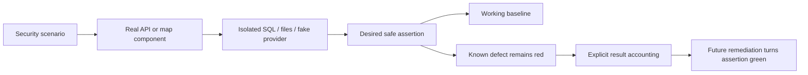
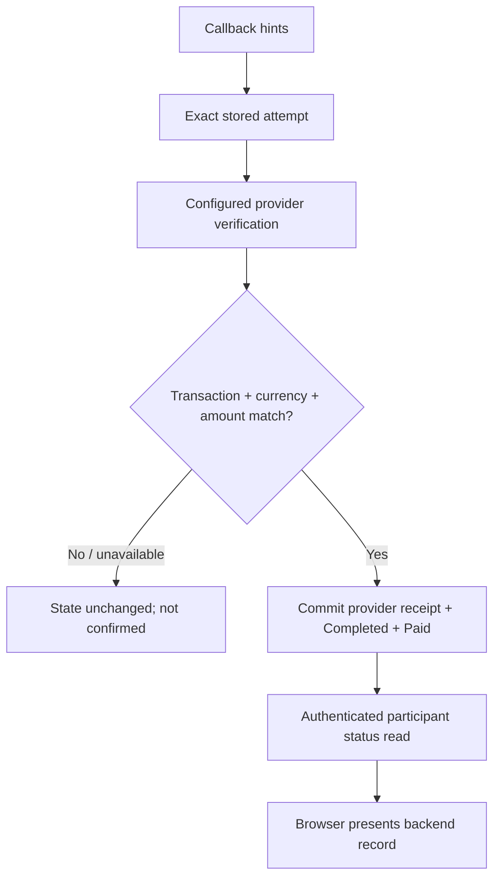

# 2026-10-07 — Order 0: executable security test foundation

This entry is about building tests before fixing the security bugs. Production behavior has not changed. The detailed run/setup reference is [PHASE1_SECURITY_TEST_HARNESS.md](../testing/PHASE1_SECURITY_TEST_HARNESS.md).

This file did not exist when this task started, so there were no older entries to replace. Future tasks should append their own dated entries.

## 1. What problem did we have?

We had source-code evidence, but no reliable way to repeat the important failures automatically.

A regression test is a small program that repeats a scenario and checks the rule we want to preserve. Without it, changing the code can make a demonstration look better without proving the underlying rule.

For example, the payment code could receive VALID from the caller and mark the booking Paid even when no provider verification happened. A callback is an HTTP message sent back to our API, the server's request interface. Someone submitting a callback is not automatically a trusted payment provider.

The same gap appeared elsewhere:
- Startup created a default administrator.
- SignalR, the realtime messaging library, let unrelated authenticated users join another booking's group.
- The map interpreted stored customer text as HTML. XSS means cross-site scripting: attacker-controlled text becomes script in someone else's browser.
- A worker could change the customer's 800 counter-offer to 5,000 and accept it.
- A valid PDF signature was rejected, an invalid one accepted, and private download streaming failed.

Customers' agreements, private conversations, payment status and verification documents could be affected. This task gives us repeatable evidence of those problems. It does not repair them.

## 2. Why was this fix necessary?

The fix here is to our testing foundation.

A trust boundary is where data moves from a less-trusted source into a decision that grants authority. The payment provider result belongs on one side; a caller's success flag belongs on the other. A test should prove that crossing this boundary requires independent evidence.

Authorization means deciding what an identified user may do. Being logged in does not make someone a participant in every booking. The hub test gives an unrelated user a real valid JWT, a signed short-lived identity token, and checks that the server should still deny the booking.

We want a red test first: the desired safe rule fails on the current code. After the actual fix, that exact rule should become green. Otherwise, we might be testing the wrong path or accepting the bug as normal behavior.

## 3. What did we change?

A fixture is controlled setup used by a test. Ours creates only artificial identities, requests, bookings, payments and files.

The backend flow is:

Create uniquely named local SQL database
-> apply existing schema
-> boot real API in Production mode inside a test server
-> inject test-only provider transport and private file location
-> seed synthetic users and issue real JWTs
-> send HTTP/hub requests
-> inspect responses and committed database facts
-> record green/red outcomes
-> stop host and remove only generated resources.

WebApplicationFactory is the ASP.NET testing tool that boots this server. It keeps real middleware, Identity, controllers, EF queries and MVC result execution. MVC is the framework component that executes the returned HTTP result, including reading a file stream.

EF Core, Entity Framework Core, maps C# entities to database tables. We kept the SQL Server provider, which executes real SQL. We did not substitute EF InMemory, an object-based test store.

The provider fake replaces HttpMessageHandler, the transport used by HttpClient. It has no real network transport behind it. It returns configured receipt JSON or throws a deliberate availability error. Unexpected requests fail the fixture instead of contacting a gateway.

For the map, a small test page mounts the actual KarigorMap component with a DTO-shaped request. A DTO is the data object passed between application layers. The malicious fixture only flips a local boolean when HTML executes; it does not steal data or send it elsewhere.

We also added an explicit known-defect classifier. TRX is the XML test report produced by dotnet test. The classifier reads it and distinguishes the documented security assertions from unrelated errors.

## 4. Before vs After

| Before | After |
|---|---|
| Audit descriptions without repeatable runtime evidence | Executed HTTP, SQL, hub, unit and browser scenarios |
| dotnet test could fail without blocking backend CI | Unlisted/setup/skipped failures block the new gate |
| No safe payment-provider test transport | Deterministic receipts/outages; no gateway network call |
| No isolated SQL target rule | Loopback/master-only input and generated database names |
| A green build could be mistaken for security proof | Raw known failures remain visible and counted |
| Map vulnerability known only from source | Actual Chrome execution observed through a harmless probe |
| Production vulnerabilities existed | They still exist; tests now identify them |

## 5. Security invariant

For the harness itself:

**Tests must never use a production payment transport or target an application/remote database, and a known-failure exception must never hide a setup error or a new failure.**

For the application, the tests express rules that are currently broken, such as:

**A caller's VALID flag must not make a payment Completed or a booking Paid without matching provider verification.**

This matters because a test suite can otherwise give a false sense of safety. Passing the harness's result-accounting gate is not the same as passing all application security rules.

## 6. System-design concepts I learned

### Regression testing
- **Simple explanation:** Repeat a scenario automatically so a later change cannot silently break its rule.
- **Karigor example:** Keep the worker 1000 -> customer 800 -> worker 5000 sequence.
- **Why engineers use it:** Manual demonstrations are difficult to reproduce reliably.
- **Common mistake:** Assert that the worker successfully overwrites 800, turning the vulnerability into desired behavior.

### Unit versus integration testing
- **Simple explanation:** Unit tests check a small function; integration tests check components together.
- **Karigor example:** PDF bytes need a unit test; a callback changing SQL payment/booking rows needs integration.
- **Why engineers use it:** Cheap tests cover simple logic; heavier tests cover real boundaries.
- **Common mistake:** Mock the database and then claim SQL transactions or constraints were proved.

### Disposable SQL fixture
- **Simple explanation:** Create a temporary database for synthetic data, then remove it.
- **Karigor example:** Karigor_SecurityTests_<random-guid> on local SQL Express.
- **Why engineers use it:** We can safely execute real startup, writes and uniqueness checks.
- **Common mistake:** Reuse KarigorDev or run a script containing USE KarigorDev. Our fixture refuses that catalog and does not execute that script.

### Deterministic fake
- **Simple explanation:** An external service replacement that gives a result we choose every time.
- **Karigor example:** A valid BDT receipt, a USD receipt, another transaction's receipt, or a provider outage.
- **Why engineers use it:** No charges, internet timing or third-party availability during tests.
- **Common mistake:** Use sandbox payment calls as every automated test's dependency. Sandbox still has external failure modes.

### Resource authorization
- **Simple explanation:** Logging in identifies the person; ownership determines which specific records they may access.
- **Karigor example:** A customer JWT is valid but must not join somebody else's booking.
- **Why engineers use it:** Role checks alone cannot protect individual resources.
- **Common mistake:** Assume an unguessable group name is permission.

### Red -> Green workflow
- **Simple explanation:** First demonstrate the safe rule failing, then change production code until it passes.
- **Karigor example:** The PDF tests stay red now. A later signature correction must turn both green.
- **Why engineers use it:** The first red result proves the test reaches the defect.
- **Common mistake:** Skip the test or weaken its assertion to get a green build.

### Explicit failure accounting
- **Simple explanation:** Accept only an exact known assertion while treating everything else as a new problem.
- **Karigor example:** A failure beginning F1_CALLER_STATUS in its named method is documented; SQL unavailable is not.
- **Why engineers use it:** A temporary exception list can support remediation without disabling CI.
- **Common mistake:** continue-on-error on the entire test command. That also hides broken setup and new regressions.

### Synchronization and barriers
- **Simple explanation:** Coordinate operations at a known phase rather than guessing with delays.
- **Karigor example:** Future two-acceptance tests need both operations to reach the relevant read window before proceeding.
- **Why engineers use it:** Race conditions depend on overlap, not elapsed seconds.
- **Common mistake:** Thread.Sleep and two started tasks are not proof that both read the old state. No business concurrency test was added in this task.

### Resource lifetime
- **Simple explanation:** Keep a resource alive until its consumer finishes.
- **Karigor example:** The private file test goes through MVC so it catches a stream disposed before delivery.
- **Why engineers use it:** Returning a result is not always the same moment as executing it.
- **Common mistake:** Unit-test only the controller's returned type and never read the response bytes.

## 7. Failure scenarios

**Database unavailable:** fixture setup fails and the gate blocks. It cannot be called an expected payment or authorization failure.

**Two harness runs overlap:** random database/file names separate their resources. Within one SQL collection, tests run serially because they share a fake/host. This does not prove concurrent business operations are safe.

**Malicious input:** the map test observes a harmless browser flag. We never execute an attack against the deployed application.

**Provider unavailable:** the fake throws without network access. The unchanged payment code currently falls back to caller VALID. Its safe assertion fails as expected.

**Client retries:** duplicate callback processing and initiation idempotency are not covered yet. A future remediation must add those cases without contacting the real provider.

**Authentication/session state changes:** these tests use real valid JWTs, but do not redesign refresh sessions or prove immediate revocation. F6 remains deferred.

**Test process crashes:** normal cleanup is verified, but a crash may leave a generated database or directory. An operator should inspect that exact prefix instead of deleting arbitrary databases/uploads.

## 8. Why this design was chosen

**Alternative: EF InMemory.**
It was considered because it is quick to set up. It was rejected for relational claims: it does not behave like SQL Server for uniqueness, rollback, foreign keys, locking or rowversion.

**Alternative: Docker/Testcontainers everywhere.**
A container library can automate database lifecycle. It was deferred because this machine already has SQL Express. CI gets a SQL service container only because its Ubuntu runner needs a real engine. One small lifecycle fixture can use either connection.

**Alternative: multiple backend test projects immediately.**
Separate unit/integration projects can become useful later. One project plus explicit Layer traits is smaller now and still supports a SQL-free unit subset.

**Alternative: copy the vulnerable map HTML into a unit test.**
That would test the copy rather than the application. We mount the real component in a browser instead.

**Alternative: skip known security failures.**
It keeps CI green but stops proving the reproduction. We execute them and publish the raw failure.

**Alternative: assert vulnerable behavior as a green characterization test.**
That can document old behavior, but the same test would not become a passing security rule after the fix. Our assertions describe the safe rule.

**Alternative: tolerate every dotnet test exit 1.**
Rejected. Only named failures with exact assertion markers are accepted; setup errors and unexpected passes block. We added six tests for that classifier itself.

The tradeoff is a small custom result classifier and an exception manifest that need maintenance. Each completed remediation must remove its exception. The actual GitHub-hosted execution remains unverified until the workflow runs.

## 9. Tests added

The expected results below describe the safe requirement, not today's vulnerable behavior. Setup and layer details for every case are in the harness guide.

| Test name | What it does | Bug / invariant protected | Why it matters |
|---|---|---|---|
| CallerValidStatusAloneCannotSettlePayment | Anonymous VALID callback without ValId | F1: Only independent verification grants payment privilege | Payment not Completed and booking not Paid |
| UnavailableProviderCannotFallBackToCallerValid | VALID callback with ValId | F1: Dependency failure fails closed | No Completed/Paid despite provider exception |
| ReceiptForAnotherTransactionCannotSettlePayment | Callback naming this attempt | F1: Receipt must bind exact attempt | No Completed/Paid |
| ReceiptWithWrongCurrencyCannotSettlePayment | Callback with correct transaction | F1: Amount alone does not bind currency | No Completed/Paid |
| MatchingProviderReceiptUpdatesPaymentAndBooking | Valid callback | F1: Retain valid provider path during fixes | Completed and Paid; exactly one fake call |
| SqlServerRejectsDuplicatePaymentTransaction | Insert valid duplicate transaction | F1/foundation: Transaction ID remains unique | SQL 2601/2627 uniqueness error |
| OrdinaryProductionStartupDoesNotProvisionDefaultAdministrator | Start unchanged API | F2: Admin requires explicit operator intent | No implicit default account |
| UnrelatedAuthenticatedUserCannotJoinBooking | Invoke JoinBooking over Long Polling | F3: Authentication does not imply ownership | Hub denies invocation |
| BookingParticipantCanJoinAndReceiveGroupEvent | Join and emit test-only group probe | F3: Keep legitimate realtime access | Participant receives probe |
| WorkerCannotOverwriteAndAcceptCustomerCounterOffer | Worker 1000 -> customer 800 -> worker initial 5000 -> accept | F5: Preserve customer intent | Customer price remains 800; no altered agreement |
| DocumentOwnerReceivesCompleteFileThroughMvc | GET through full MVC pipeline | F7: Authorization must lead to usable complete delivery | 200 and identical bytes |
| NonOwnerCannotDownloadPrivateDocument | GET private URL | F7: Only owner/admin may retrieve private document | 404, no document |
| ValidPdfSignatureIsAccepted | Call actual validator | F7: Valid supported input works | True |
| InvalidFdpSignatureIsRejected | Call actual validator | F7: Incorrect signature is rejected | False |
| ValidPngSignatureIsAcceptedAndStreamPositionIsPreserved | Call actual validator | F7: Keep working format and caller resource state | True; offset still 3 |
| SqlFixtureRejectsRemoteServersAndApplicationDatabases | Validate fixture target | Harness safety: Never target app/remote DB | Both rejected before SQL |
| plain request popup and quote callback work | Open popup; press quote | F4 baseline: Safe ordinary interactions survive rendering changes | Text shown; callback outputs request 123 |
| stored map text cannot execute HTML | Open popup; await image completion | F4: Stored text cannot become executable HTML | Execution probe stays false |

The six gate tests protect how we interpret the application tests:

| Test name | What it does | Rule protected | Why it matters |
|---|---|---|---|
| test_exact_known_assertion_is_reported_as_expected | Synthetic failed TRX with exact name/marker | One accounted-for expected failure | Known failure is explicit rather than silently skipped |
| test_fixture_error_is_not_accepted_as_known_failure | Known test name but SQL-unavailable message | Blocking error | Infrastructure failure cannot masquerade as security reproduction |
| test_unregistered_failure_blocks | Failure absent from manifest | Blocking error | New defects cannot enter the allowlist silently |
| test_unexpected_pass_requires_promotion | Known regression now passes | Blocking promotion message | A fix must remove its exception and become blocking |
| test_skipped_test_blocks | TRX outcome NotExecuted | Blocking error | No silent test skips |
| test_strict_mode_keeps_known_regression_red | Exact known failure with strict=true | Blocking error | Strict mode exposes real red security assertions |

Actual results:
- Backend: 16 cases, 6 green baseline passes and 10 expected safe-assertion failures.
- Browser: one ordinary popup/callback baseline pass; one actual XSS safe-assertion failure.
- Classifier: six passes.
- Skipped: zero.

Playwright prints “2 passed” because its expected-failure annotation matched. Its JSON records the XSS case as expected failed/actually failed. That is not a claim that XSS was fixed.

The strict F1 command returns 1: two baselines pass and four security assertions fail. After F1 remediation, those four must pass and their manifest entries must be removed.

## 10. Files changed

| File | Change | Reason |
|---|---|---|
| .github/workflows/backend-ci.yml | Local SQL service in Ubuntu CI; run classifier tests/full suite; upload raw artifacts | Make regressions executable without blanket continue-on-error |
| .github/workflows/frontend-ci.yml | Install Chromium; typecheck/run browser fixture; upload results | Run actual map rendering in CI |
| .github/workflows/deploy-monsterasp.yml | Run explicit Layer=Unit subset through classifier | Avoid raw known failures/SQL dependency breaking the existing Windows deploy job; full SQL suite runs in backend CI |
| .gitignore | Ignore generated browser results and Python bytecode | Keep test artifacts out of source |
| Karigor.slnx | Add the security test project | Include test code in normal builds |
| karigor-client/package.json | Playwright dev dependency and three security scripts | Test-only browser tooling |
| karigor-client/package-lock.json | Lock the three added Playwright packages | Reproducible dependency resolution |
| karigor-client/e2e/vite.config.ts | Separate loopback test entry/server | No production route or API dependency |
| karigor-client/e2e/playwright.config.ts | One browser/worker; explicit results and expected-failure handling | Small deterministic browser runner |
| karigor-client/e2e/tsconfig.json | Typecheck test fixtures/config/spec | Catch TS errors that Playwright transpilation alone would miss |
| karigor-client/e2e/fixtures/map.html | Test-only HTML entry | Mount actual component outside application flows |
| karigor-client/e2e/fixtures/map.tsx | Theme/i18n/map fixture; harmless XSS probe; quote output | Real component rendering without copying production HTML |
| karigor-client/e2e/map.security.spec.ts | Baseline and executed XSS regression | Protect F4 |
| scripts/run-security-tests.py | Run dotnet; validate exact TRX outcomes/manifest; emit summary; strict/subset modes | Account for known red assertions without accepting unrelated failures |
| scripts/tests/test_security_runner.py | Six classifier self-tests | Prove the gate's rejection rules |
| tests/known-security-defects.json | Ten named assertions explicitly accepted as current defects | Auditable promotion list |
| tests/Karigor.Security.Tests/Karigor.Security.Tests.csproj | Single net10.0 xUnit/WAF/SignalR project | Minimum backend dependency set |
| tests/Karigor.Security.Tests/Infrastructure/DisposableSqlDatabase.cs | Loopback/master guard; unique database; current SQL script; guarded cleanup | Real SQL behavior without touching application databases |
| tests/Karigor.Security.Tests/Infrastructure/FakePaymentHandler.cs | Deterministic valid/mismatched/unavailable receipt modes; deny unexpected calls | No production payment transport |
| tests/Karigor.Security.Tests/Infrastructure/SecurityApplicationFixture.cs | Production TestServer host; isolated SQL/files; real JWTs and graph fixtures | Test unchanged pipeline and Identity/ownership behavior |
| tests/Karigor.Security.Tests/UnitSecurityTests.cs | Four signature/fixture-safety tests | Cheap deterministic boundaries |
| tests/Karigor.Security.Tests/PaymentSecurityTests.cs | Six callback/binding/provider/constraint tests | F1 starting evidence |
| tests/Karigor.Security.Tests/ApiSecurityTests.cs | Six startup/hub/negotiation/document tests | F2/F3/F5/F7 evidence |
| docs/testing/PHASE1_SECURITY_TEST_HARNESS.md | How to run, interpret and extend this small harness | Implementation and learning reference |
| docs/security/SECURITY_WORKDONE.md | Dated study entry (new file; no prior entries existed) | Human-readable security learning history |
| docs/adr/0002-phase1-security-test-harness.md | Implemented harness architecture decision | Record SQL and expected-failure tradeoffs |

No backend production source, frontend src or database SQL file changed. Approved plan/ADR 0001 were left intact. The old ADR is empty in this checkout; the new testing decision is recorded separately.

## 11. Commands and verification

Important commands actually run:

```text
dotnet sln Karigor.slnx add tests/Karigor.Security.Tests/Karigor.Security.Tests.csproj
dotnet build tests/Karigor.Security.Tests/Karigor.Security.Tests.csproj --configuration Release
dotnet build Karigor.slnx --configuration Release --no-restore
python scripts/run-security-tests.py
python scripts/run-security-tests.py --no-build --filter "Layer=Unit"
python scripts/run-security-tests.py --no-build --strict --filter "Finding=F1"
python -m unittest discover -s scripts/tests -v
npm --prefix karigor-client install --save-dev --save-exact @playwright/test
npm --prefix karigor-client run typecheck:security
npm --prefix karigor-client run test:security
npm --prefix karigor-client run build
npm --prefix karigor-client run lint
```

For browser execution we selected installed Chrome with KARIGOR_TEST_BROWSER_CHANNEL=chrome. On this machine Node/npm needed the real Program Files installation prepended to process PATH; no system files were changed.

Builds passed. The whole backend build reported zero warnings/errors. Browser fixture typechecking passed. Lint exited zero but reported warnings in existing production files. The Vite build retained its existing bundle/config warnings.

The backend accounting gate returned zero only after confirming the ten known failures and six passes. Its strict F1 run returned 1 as intended. The deployment-style unit subset returned zero after two passes and two known PDF failures.

A read-only SQL query found zero databases remaining under the generated fixture prefix after the runs. Generated reports/traces are ignored locally and configured for CI upload.

Final checks also passed: git diff --check, parsing all three changed workflow YAML files, and checking documentation links, code fences and required study sections. A scoped git diff confirmed no backend production source, frontend src or database SQL changes. Parsing a workflow checks its syntax; it does not prove the hosted job will execute successfully.

Environment actually used: .NET SDK 10.0.301, SQL Express 2022 16.0.1000.6, Node 22.17.0, Playwright 1.63.0 and Chrome 154.0.8037.98. We did not run hosted GitHub Actions, a Linux SQL service container, live payments or a production deployment.

## 12. Remaining risks / limitations

This harness does not fix any production vulnerability.

The suite is deliberately small. It does not yet prove global event confidentiality, anonymous hub denial, default-email promotion handling, amount edge cases, callback booking fallback, payment retries, concurrent acceptance, refresh-session revocation, upload traversal/limits, or authenticated browser document previews.

Current SQL setup still mirrors production schema plus startup DDL. Schema ownership drift remains. No rowversion/migration was added and no concurrency guarantee is claimed.

Only Chrome was executed locally. SignalR was tested through Long Polling and TestServer, not live WebSockets/IIS. The map fixture uses stored-shaped data, not a full persisted request-to-worker journey.

Dependency installation reported nine advisories. We did not apply unrelated audit fixes. The existing lint/bundle warnings remain.

CI jobs now have the necessary commands, but their first actual GitHub run is still required. The deployment workflow runs an explicit unit subset; full SQL tests run in Backend CI. This task did not create branch protection or link the independent deployment workflow to CI completion.

A red regression can be transformed into a normal blocking test after its actual fix. Updating the exception manifest is not permission to weaken the rule or hide a different failure.

## 13. How I would explain this in an interview

### 30-second explanation

I built a small security harness before changing Karigor's vulnerable behavior. It runs the real API against disposable SQL, replaces payment transport with a deterministic fake, and mounts the real map in Chrome. Safe assertions reproduce the current defects. CI accounts for only those exact failures and blocks setup errors or new failures. Each remediation must turn its test green and remove its exception.

### 2-minute explanation

Our audit found security rules that existed in documentation but were not proved by tests. A payment could settle from a caller's flag, hub authentication did not ensure booking ownership, and mutable counter-offers did not preserve customer consent.

I added one backend project with unit and integration traits. WebApplicationFactory runs the unchanged Production pipeline, including the problematic startup, but points it at a generated local SQL database and test files. SQL Server is important because I want actual constraint and transaction behavior, not an in-memory substitute. A provider handler supplies receipts or outages without contacting a gateway.

The browser fixture mounts the real Leaflet component and checks a harmless script-execution flag. A normal popup/quote baseline protects legitimate behavior.

The challenge is keeping CI useful while known defects intentionally remain. I preserve the safe assertions, run them red, and use exact names/markers to account for them. New errors, skips and unexpected passes block. Once a fix works, its exception must be removed. This has a maintenance cost, but it gives an honest red-to-green process instead of a misleading green build.

## 14. Interview questions

1. **What did the tests fix?** The lack of repeatable evidence and useful test gating. They did not fix production vulnerabilities.
2. **Why real SQL for these integrations?** EF InMemory cannot prove SQL constraints or rollback/locking behavior. Our duplicate transaction baseline checks an actual SQL uniqueness error.
3. **How did you test payment failure safely?** A handler with no network transport throws a configured exception. We check the stored payment and booking remain unprivileged; that requirement currently fails.
4. **Why not silently skip the red tests?** A skipped scenario cannot prove reproduction or detect that a remediation made it pass. Exact result accounting keeps it executed and visible.
5. **What does an unexpected pass mean?** The behavior may have been fixed or the fixture may have stopped reaching it. Review it, preserve the assertion, and remove the exception only when the fix is verified.

## 15. What should I study next?

1. How an HTTP provider response becomes an authoritative payment decision: exact transaction, currency and amount binding.
2. SQL transactions versus unique constraints: why atomic commit and prevention of duplicate relationships solve different problems.
3. TaskCompletionSource and barriers: how to control a race test's read/commit window.
4. ASP.NET result execution and stream ownership: why returning a FileStreamResult does not immediately consume its stream.
5. CI result semantics: how failed assertions, setup errors and expected-failure promotion should affect a quality gate.

**Ready to begin F1 remediation locally:** yes. Its real callback/SQL path, provider fake, four red assertions and two baselines are verified. Before F1 is called complete, add the remaining selected payment cases and run the actual CI job.



# F1 Payment Trust and Provider Verification

Date: 2026-10-07 (Asia/Dhaka).
Implemented: immediate F1 containment only.
Detailed reference: [F1 implementation guide](implementation/F1_PAYMENT_TRUST_AND_VERIFICATION.md).

## 1. What problem did we have?

Our API could hear “VALID” from an HTTP caller and treat it as proof of payment. A callback is a message sent back to our server; anyone reaching the anonymous route can try to submit one.

Imagine a customer has an Initiated payment for BDT 1,000. Someone submits its transaction ID and status=VALID, but no provider validation ID. The old code could mark the payment Completed and the booking Paid without asking SSLCommerz anything.

The problem was not limited to a missing validation call. When the provider call failed, the same caller-status fallback still worked. A real receipt for another transaction or another currency could also pass. Missing/malformed amounts were accepted, and an amount difference below one taka was tolerated.

ValueA is a callback's extra field. If the supplied transaction did not exist, a booking ID in ValueA could select that booking's newest payment. This confused “a record the caller named” with “the exact attempt the provider verified.”

Customers, artisans and anyone relying on booking/payment status could be affected. Our local pre-fix strict run reproduced the four Phase 0 payment defects: two baseline passes and four security failures.

The return page had another trust mistake: changing its URL to status=success made it claim verified payment and display caller amount/transaction. It also claimed an artisan payout, even though this code did not execute a payout.

## 2. Why was this fix necessary?

A **trust boundary** is the point where data from someone we do not trust can affect a decision with authority. Here, untrusted callback fields were crossing into financial state.

**Server-side verification** means our server asks the configured payment provider through its own connection. The caller can give us a lookup hint, but cannot supply the answer.

**Fail closed** means missing proof does not grant a privilege. For Karigor, that means no new Completed payment or Paid booking without matching proof. It does not mean we should invent a failed charge when the provider times out.

A **timeout** tells us that we did not receive a reliable answer. The provider might still have processed the payment. Saying “No charges were made” would be another unsupported claim.

## 3. What did we change?

The previous flow was:

Callback says success
-> optional provider check
-> trust caller VALID if checking did not establish success
-> possibly find a different attempt using ValueA
-> save caller receipt fields
-> mark payment/booking paid
-> browser displays URL-derived success.

The implemented flow is:

Receive success, fail, cancel or IPN
-> use the same verifier
-> find the exact stored transaction
-> ask the configured provider
-> require matching transaction, BDT currency and exact amount
-> save provider receipt and Completed/Paid together
-> return a recorded completion only after the save.

If proof is absent or unreliable, the flow stops before financial writes. The new attempt stays Initiated. “Unresolved” is the decision we return; we did not add a new stored status or schema.

We also compare the returned transaction using **ordinal equality**, which compares the actual characters. SQL Server's collation, its string-comparison rules, can ignore case or trailing spaces. A database match alone was not enough for an exact identifier.

The amount parser now accepts ordinary invariant decimal text with up to two fractional digits and compares decimal values exactly. “Invariant” means a fixed format independent of the machine's language settings. There is no tolerance, exponent/group syntax or rounding of excessive precision.

ValId, bank transaction and card type come from the verified provider response. Contradictory callback values do not overwrite them. The stored serialized receipt is the validation DTO, the provider fields represented by our response class.

All route names are hints. A fail URL with a genuinely matching success receipt can record success. A success URL without proof cannot.

The provider client now rejects HTTP errors before parsing and never silently changes to the shared sandbox merchant. Initiation and verification use the configured store.

The browser then does a separate read:

Return page opens
-> authentication restores or asks for sign-in
-> page requests the booking's payment summary with its Bearer token
-> backend checks booking participation
-> page confirms only a Completed record with PaidAt
-> page displays backend details.

A **Bearer token** is the signed access token sent with an API request. The existing customer/worker ownership checks are still used. Nonparticipants get 403; guests get 401. A cache-control header asks HTTP caches not to store this financial summary.

The page's retry button reads status again; it does not initiate another charge. We removed automatic success-driven redirection and unsupported no-charge/payout statements so users can inspect uncertainty.

An existing exact Completed record is returned unchanged on a later callback. This protects sequential late messages. It does not prove that two simultaneous callbacks have one effect.

## 4. Before vs After

| Before | After |
|---|---|
| Caller VALID could mark a booking Paid | Only a matching provider receipt creates payment completion |
| ValueA could choose a booking's latest attempt | Exact stored transaction selects the attempt |
| Missing or slightly wrong amount could pass | Amount is required and must match exactly |
| Caller bank/card values became receipt facts | Verified provider values become receipt facts |
| Provider failure could be treated as success or Failed | No financial write; unresolved outcome |
| Fail/cancel directly changed financial state | Same verifier; route/status hints alone do not finalize |
| URL status=success meant “verified” | Authenticated backend record controls the page |
| Payment receipt was described as payout | Confirmation explicitly does not prove artisan payout |

## 5. Security invariant

**A payment may newly become Completed and its booking Paid only after independent provider verification binds to that exact stored transaction, currency and amount.**

The word “exact” matters. It prevents a valid payment somewhere else from paying this booking.

This task does not revalidate or repair old Completed/Paid rows. Our new UI reports the backend record; it cannot reconstruct historical proof that was never recorded correctly.

## 6. System-design concepts I learned

### Trust boundaries
- **Simple explanation:** A message from outside is a claim, not permission to change important state.
- **Karigor example:** status=VALID is a hint until independent provider proof matches the attempt.
- **Why engineers use it:** It keeps caller-controlled input from becoming authority.
- **Common mistake:** Assume a route named success can only be called after a successful payment.

### Server-side verification
- **Simple explanation:** Ask the source of truth directly.
- **Karigor example:** Our configured provider client retrieves the receipt; the callback does not supply the authoritative bank/card facts.
- **Why engineers use it:** It prevents browser/request tampering from forging outcomes.
- **Common mistake:** Call the provider, then ignore the result and fall back to the caller.

### Authoritative state
- **Simple explanation:** Choose which verified record controls our decisions.
- **Karigor example:** The return page reads the authorized backend summary instead of URL amount/status.
- **Why engineers use it:** Different clients should not invent different payment outcomes.
- **Common mistake:** Think a database row is automatically historically trustworthy. Old rows still need review.

### External-system uncertainty
- **Simple explanation:** A missing response does not tell us what happened remotely.
- **Karigor example:** Timeout leaves an attempt unresolved; it does not prove the customer was not charged.
- **Why engineers use it:** Remote calls cannot be rolled back by our SQL transaction.
- **Common mistake:** Retry a new charge session blindly after a timeout.

### Fail-closed behavior
- **Simple explanation:** Do not grant the benefit when evidence is insufficient.
- **Karigor example:** Reject missing transaction/currency/amount proof before setting Paid.
- **Why engineers use it:** Availability problems should not turn into authorization bypasses.
- **Common mistake:** Confuse denying success with proving failure.

### Atomicity versus idempotency
- **Simple explanation:** Atomicity means related writes happen together; idempotency means retrying one intent has one business effect.
- **Karigor example:** One EF save commits payment and booking together. It does not prevent two independent callbacks from both notifying.
- **Why engineers use it:** These solve different failure modes.
- **Common mistake:** Call an early Completed check “concurrency-safe idempotency.”

### Regression promotion
- **Simple explanation:** Keep the original safe assertion and remove its exception when the fix actually makes it pass.
- **Karigor example:** Four F1 markers left the known-defect manifest only after successful execution.
- **Why engineers use it:** The fixed rule becomes a normal blocking check.
- **Common mistake:** Weaken the assertion or remove the test to get a green build.

## 7. Failure scenarios

**Database rejects the save:** a fixture-only CHECK deliberately rejected the booking's Paid update. The API returned 503, and a new SQL read found the payment Initiated, booking Unpaid and receipt fields unset. The temporary constraint was removed afterward. This proves actual SQL rollback for this failure.

**Two callbacks arrive together:** both can still read the old state, verify and produce notifications. We added no rowversion, settlement allocation or coordinated race guarantee. That is later work.

**Malicious callback input:** status/ValueA/amount/bank/card hints cannot establish completion. Exact identity and provider binding are checked before writes.

**Provider fails or times out:** no Completed or Failed write occurs. IPN returns an unresolved 503 for transport/parse uncertainty. Retry-After: 30 is advisory; we did not test the provider's actual retry policy.

**Client retries:** the page retries only its read. Payment-initiation retries can still create another attempt. They need the later idempotency/reconciliation design.

**Authentication changes:** a signed-out page asks for sign-in; a denied summary stays unconfirmed. The query includes user ID. Refresh-session rotation/revocation was not redesigned or proved.

**Late fail/cancel:** the existing completed record, PaidAt and receipt remain unchanged. This was tested sequentially, not under competing stale writes.

**Notification delivery fails:** the existing best-effort code does not undo a committed payment. No durable delivery or notification race test was added.

## 8. Why this design was chosen

We fixed the missing proof boundary without requiring a database migration. Waiting for the complete payment architecture would have left the direct trust bypass open.

**Alternative: remove only the VALID fallback.**
It was small, but left transaction/currency binding, ValueA lookup and direct fail/cancel trust unresolved. We rejected it as incomplete containment.

**Alternative: require a customer login on the provider callback.**
It uses familiar authentication, but the provider has no customer session. Logging in is not evidence that money moved.

**Alternative: treat timeout as failed payment.**
It gives a simple final state, but lies about an unknown external outcome. We preserved the current attempt instead.

**Alternative: add a new Unresolved table/status.**
That could improve recovery modeling. We deferred it because existing Initiated plus an unresolved response supports immediate containment, and this task forbids the larger schema architecture.

**Alternative: build rowversion/allocation/idempotency/outbox now.**
Those are useful consistency tools, but were explicitly deferred. An **outbox** is a durable database record of an event waiting to be delivered. We did not add one.

**Alternative: keep shared sandbox credentials as fallback.**
It helps demonstrations appear to work, but silently switches which merchant is being trusted. Configuration failure now stays failure.

The cost of this design is honest uncertainty: some returns will remain unconfirmed, and unverified abandoned attempts can remain Initiated. That is preferable to falsely marking money received.

The implemented boundary matches the approved immediate F1 design. ADR 0001 is empty in this checkout and was not rewritten; no unrelated Proposed decision changed status.

## 9. Tests added or promoted

These are the relevant tests. Each expected result describes the safe rule. The implementation guide lists full setup/layer details and every parameterized input.

| Test name / cases | What it does | Rule or bug protected | Why it matters |
|---|---|---|---|
| CallerValidStatusAloneCannotSettlePayment (1 (promoted)) | POST success with caller VALID and no ValId | A caller flag cannot grant payment authority | Neither Completed nor Paid; zero provider calls |
| UnavailableProviderCannotFallBackToCallerValid (1 (promoted)) | POST success with VALID and ValId | An outage is not success | Neither Completed nor Paid; one fake call |
| ReceiptForAnotherTransactionCannotSettlePayment (1 (promoted)) | POST success naming this attempt | Receipt identity binds the exact attempt | Neither Completed nor Paid |
| ReceiptWithWrongCurrencyCannotSettlePayment (1 (promoted)) | POST success | Currency is part of payment identity | Neither Completed nor Paid |
| MatchingProviderReceiptUpdatesPaymentAndBooking (1 existing baseline) | POST success | Valid payment still works | Completed and Paid; one fake call |
| SqlServerRejectsDuplicatePaymentTransaction (1 existing baseline) | Insert duplicate TransactionId | Transaction identifier remains unique | SQL 2601/2627 |
| UntrustedCallbackRoutesLeavePaymentUnresolved (3: fail, cancel, ipn) | Send VALID without ValId to each route | Route names/caller status cannot finalize money | State and receipt fields unchanged; IPN 422; browser not confirmed |
| BrowserGetCallbackRequiresTheSameProviderVerification (3: success, fail, cancel) | GET VALID without ValId, then GET FAILED with a matching receipt | Query hints obey the same verification boundary | First unresolved; second Completed/Paid and confirmed |
| UnknownOrNonExactTransactionCannotUseBookingFallback (6: unknown on all four routes; case/space on success) | Send unknown/non-exact transaction plus real ValueA | ValueA and SQL collation cannot select another attempt | No provider call or mutation; unknown IPN 404 |
| MalformedOrUnboundProviderReceiptLeavesPaymentUnresolved (14 cases (listed below)) | POST IPN | Incomplete or mismatched proof grants no authority | 422; Initiated/Unpaid; no authoritative receipt fields |
| ProviderTransportOrParseFailureLeavesPaymentUnresolved (4: timeout, non-2xx HTTP, invalid JSON, JSON null) | POST IPN | Unknown external outcome is not Paid or Failed | 503 with Retry-After; unchanged financial state |
| VerifiedProviderFieldsOverrideCallbackHints (1) | POST IPN | Only verified provider facts become authoritative | Provider receipt fields stored; Completed/Paid; no forged values |
| EveryRouteCanRecordOnlyProviderBoundSuccess (3: fail, cancel, ipn) | POST each route | Success is a provider fact, independent of route | Completed/Paid from provider; one call |
| LateCallbacksCannotDowngradeVerifiedSuccess (3: fail, cancel, ipn) | Send late FAILED without a receipt | A later hint cannot erase confirmed success | Completion, PaidAt and stored receipt preserved; no provider call |
| ParticipantsCanReadAuthoritativeSummaryButStrangersCannot (1) | GET summary as both participants, stranger and guest | UI reads are authenticated and resource-authorized | 200/no-store for participants; stranger 403; guest 401 |
| DatabaseWriteFailureCannotPartiallyCompletePaymentAndBooking (1) | Verify receipt and POST IPN | Payment and booking commit together | 503; payment Initiated and booking Unpaid; receipt not committed |
| SandboxCredentialErrorNeverSwitchesMerchant (2: initiation, validation) | Call provider client | Merchant identity must not silently change | Exactly one request to configured merchant; no testbox retry |
| F1: forged success URL cannot confirm an unresolved payment (1) | Open status=success plus forged amount/transaction | URL hints cannot grant UI confirmation | Not confirmed; backend details only; Bearer header sent |
| F1: backend completion wins over failure URL and forged receipt details (1) | Open status=failed with forged receipt fields | Backend record controls presentation | Confirmed; backend transaction and BDT 1,000; no payout claim |
| F1: backend outage remains unconfirmed and an explicit status retry can recover (1) | Open forged success, then click status retry | An outage is unresolved, not no-charge proof | Initially not confirmed; then confirmed; two reads |
| F1: denied summary cannot be replaced by URL success (1) | Open status=success | Authorization failure has no client fallback | Not confirmed; no receipt details |
| F1: signed-out return asks for sign-in and does not fetch payment details (1) | Open status=success | No anonymous claim of authenticated payment truth | Sign-in prompt; zero payment reads |

The fourteen bad-receipt variations cover missing/empty/malformed amounts, both one-paisa mismatches, grouping/exponent/excess-precision text, missing transaction/currency/validation ID, a different validation ID, FAILED and INVALID_TRANSACTION.

The original four safe assertions were preserved. Their Classification changed to GreenBaseline after the underlying fix, and their four manifest entries were removed after observed passes. The two existing F1 baselines were retained.

Actual results:
- Before remediation: six F1 cases, two passes and four expected security failures.
- Final strict F1: 47 passes, zero failures/skips; gate exit 0.
- Full backend: 57 cases, 51 passes and six exact known failures from F2/F3/F5/F7; gate exit 0, raw dotnet exit 1.
- Browser: five payment cases and the ordinary map case passed. The unchanged F4 XSS assertion failed as expected.
- Classifier self-tests: six passed.
- Unit subset: four passes and two known F7 failures.
- Skipped: zero.

Playwright reports “7 passed” because the expected F4 failure matches its annotation. That does not mean XSS was fixed.

## 10. Files changed

| File | Change | Reason |
|---|---|---|
| backend/Karigor.Application/Payments/PaymentService.cs | One verifier for success/fail/cancel/IPN; exact lookup/binding; provider-only receipts; leave uncertainty unchanged; correct payout wording | Remove payment trust bypass without redesigning initiation or settlement allocation |
| backend/Karigor.Application/Payments/PaymentVerificationException.cs | Small unresolved-verification exception carrying stored booking ID and retryability | Keep browser/IPN outcomes honest without a schema or new stored state |
| backend/Karigor.Application/Payments/SslCommerz/SslCommerzClient.cs | Require successful HTTP; dispose responses; remove merchant fallbacks; avoid raw malformed validation logging | A failed call or another sandbox merchant is not authoritative proof |
| backend/Karigor.Api/Controllers/PaymentsController.cs | Consistent browser handling; IPN 400/404/422/503; safe redirect encoding; no-store summary and explicit 403/404 | Expose unresolved outcomes and support authorized status reads |
| karigor-client/src/pages/PaymentCallbackPage.tsx | Fetch authenticated summary; ignore URL status/receipt; conservative errors/sign-in; explicit status retry; remove payout/charge claims | Present backend truth rather than caller hints |
| tests/Karigor.Security.Tests/PaymentSecurityTests.cs | Preserve/promote four regressions; add receipt/route/GET/provenance/ownership/SQL rollback cases | Verify immediate F1 containment |
| tests/Karigor.Security.Tests/SslCommerzClientSecurityTests.cs | Two sandbox merchant-boundary cases | Prove credential errors never switch stores |
| tests/Karigor.Security.Tests/Infrastructure/FakePaymentHandler.cs | Add timeout/HTTP/body/initiation modes and captured request metadata | Deterministic evidence with no socket-backed transport |
| tests/known-security-defects.json | Remove exactly four verified F1 exceptions; retain six unrelated defects | Make F1 a normal blocking gate |
| karigor-client/e2e/fixtures/payment.html | Test-only browser entry | Mount the real return page outside production routing |
| karigor-client/e2e/fixtures/payment.tsx | Actual router/query/auth/theme/page fixture | Reuse existing stack without copying decision logic |
| karigor-client/e2e/payment.security.spec.ts | Five browser regressions with local mocked HTTP and external requests blocked | Prove URL/error/auth presentation boundaries |
| docs/testing/PHASE1_SECURITY_TEST_HARNESS.md | Add current F1 status note; preserve Order 0 evidence | Avoid confusing historical red results with current F1 state |
| docs/security/SECURITY_WORKDONE.md | Append dated F1 study entry; preserve previous history | Explain what changed and what was actually proved |
| docs/security/implementation/F1_PAYMENT_TRUST_AND_VERIFICATION.md | Create final implementation/verification guide | Record architecture, tradeoffs and deferred work |

This is the F1 task's table. Earlier uncommitted Order 0 files remain in the working tree and were preserved. We made no new dependency/CI/schema changes for F1.

## 11. Commands and verification

Important commands actually run:

```text
dotnet build Karigor.slnx --configuration Release --no-restore
dotnet test tests/Karigor.Security.Tests/Karigor.Security.Tests.csproj --configuration Release --filter "Finding=F1" --logger "trx;LogFileName=f1-after.trx" --results-directory TestResults/f1
dotnet test tests/Karigor.Security.Tests/Karigor.Security.Tests.csproj --configuration Release --filter "FullyQualifiedName~BrowserGetCallbackRequiresTheSameProviderVerification" --logger "trx;LogFileName=f1-get.trx" --results-directory TestResults/f1
python scripts/run-security-tests.py --no-build --strict --filter "Finding=F1"
python scripts/run-security-tests.py --no-build
python scripts/run-security-tests.py --no-build --filter "Layer=Unit"
python -m unittest discover -s scripts/tests -v
npm --prefix karigor-client run typecheck:security
npm --prefix karigor-client run test:security
npm --prefix karigor-client run build
npm --prefix karigor-client run lint
```

The first solution build passed with an EF fixture-DDL interpolation warning. We replaced that expression with formatting of only a generated typed integer. The final solution build passed with zero warnings/errors.

Browser fixture typechecking and frontend build passed. Lint exited zero with 21 warnings already present in other production files. Existing Vite config/bundle warnings remain.

The strict F1 command was executed before and after the fix. The full runner correctly accepted only the six remaining known assertions. No classifier rule was weakened.

We used installed Chrome with KARIGOR_TEST_BROWSER_CHANNEL=chrome and prepended the real Node/npm installation to PATH. Payment calls used the fake handler, including fake sandbox requests. Browser HTTP was controlled locally and third-party origins blocked.

The detailed guide identifies raw report paths. Final checks passed: git diff --check, UTF-8 documentation/code-fence/relative-link checks, all 15 required study sections, report-counter checks and exact production file-scope checks. The previous Order 0 study content was verified as an unchanged prefix of this appended file.

The production delta is exactly five F1 files: the payment controller/service/provider client, the new verification exception and the return page. SignalR authorization, negotiation, refresh sessions, worker documents and database scripts have no changes. The approved plan and empty ADR 0001 remain unchanged. A read-only sqlcmd query found zero generated fixture databases after the final runs.

Not verified: GitHub-hosted Actions, live gateway behavior, production database history, merchant cutover, Linux service-container execution or deployment. No commit/push/merge/deployment/credential rotation was performed.

## 12. Remaining risks / limitations

**Implemented:** immediate provider trust/binding containment, consistent callback handling, provider receipt provenance and backend-derived return presentation.

**Still proposed for later:** payment initiation idempotency, per-attempt merchant/environment metadata, rowversions, settlement allocation, reconciliation and durable notification guarantees. None was added here.

Important limits:
- Concurrent callbacks can still duplicate side effects; sequential tests are not race proof.
- The latest-attempt summary can conceal an earlier settlement if another attempt exists.
- Old Completed/Paid rows were not revalidated. Their provenance may be incomplete or incorrect.
- Unknown remote outcomes do not recover automatically; a 503 header is not a recovery worker.
- Actual risk flags, FX, refunds/chargebacks and gateway retry semantics were not tested.
- Some unverified failure/cancel events leave attempts Initiated. Strict binding also stops formerly tolerated demonstrations.
- PaymentReceived still broadcasts globally. F3 confidentiality is unresolved.
- F5 can still corrupt negotiated consent; provider verification cannot repair that agreement.
- F6 session architecture and worker-document handling were untouched.
- Browser tests use mocked local HTTP and one browser; they are not a real checkout against SSLCommerz.

## 13. How I would explain this in an interview

### 30-second explanation

Karigor could mark a payment successful from a caller's VALID flag after missing or failed provider verification. I made all callback routes independently verify an exact stored transaction, BDT currency and decimal amount. Receipt facts now come from the provider, and uncertainty changes no financial state. The page reads authenticated backend status. The four original red regressions are now green; concurrency and idempotency remain a separate phase.

### 2-minute explanation

The issue was that we treated an incoming message as financial authority. A provider call existed, but the code could fall back to caller VALID after an exception. Missing amounts, small mismatches, another transaction and another currency were not rejected consistently. An extra booking field could select a different attempt.

I kept the current stack and schema. All callback routes use exact stored transaction lookup and the configured provider client. Before writing, we require successful HTTP, a valid parsed result and matching transaction/currency/amount. We store receipt facts from that response. A timeout stays unresolved because the remote provider may have processed the payment.

One EF save commits the payment and booking summary together. An actual SQL constraint-failure test proves rollback. The return page separately reads the authenticated participant-only API and ignores URL status/receipt hints.

The tests use a deterministic provider fake and disposable SQL, so no real charge is needed. Forty-seven F1 backend cases and five browser cases pass. The original four assertions were not weakened; their exceptions were removed. The tradeoff is delayed confirmation and unresolved attempts. This does not claim safe simultaneous settlement, notification deduplication or old-data repair; those require the later consistency design.

## 14. Interview questions

1. **Why isn't VALID in a callback enough?** An arbitrary caller can send it. Independent provider proof must match our stored attempt.
2. **Why check currency if the amount matches?** The same number in different currencies represents different money. Currency belongs to the binding.
3. **Why not mark Failed on timeout?** Missing communication does not prove the remote operation failed. Preserve uncertainty.
4. **What does the rollback test prove?** Payment and booking updates do not partially commit when SQL rejects this save. It does not prove concurrent idempotency.
5. **Why does the page fetch status again?** Its URL is caller-controlled. The authenticated backend summary supplies the record and enforces ownership.

## 15. What should I study next?

1. Decimal parsing and SQL collation: why representation rules matter for exact financial identity.
2. SQL atomicity versus optimistic concurrency: why a successful transaction is not enough for two simultaneous callbacks.
3. Initiation idempotency and reconciliation: how to recover an unknown gateway outcome without starting another charge.
4. Receipt provenance and merchant/environment identity: how to retain evidence that a future audit can actually verify.
5. API uncertainty in UI design: how to communicate “not confirmed” without claiming success or no charge.


