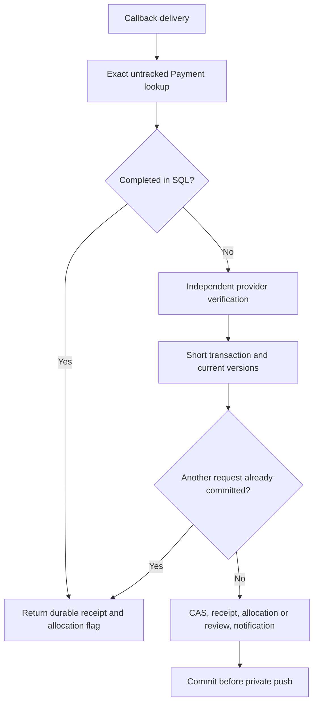
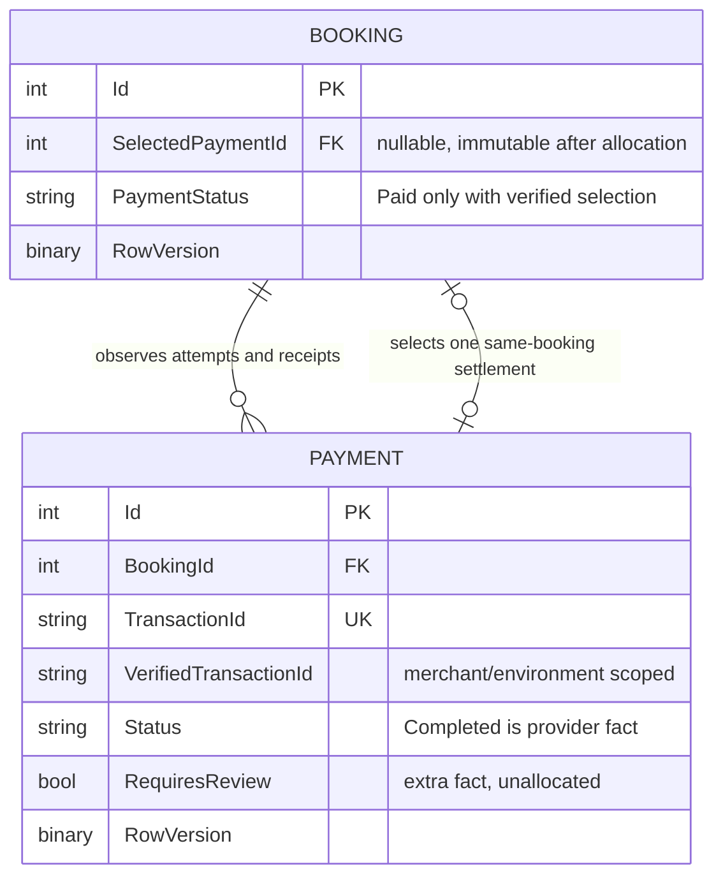

# F1 Payment Concurrency and Idempotency

Date: 2026-10-07 (Asia/Dhaka). **IMPLEMENTED** in this repository. Verification uses generated loopback SQL Server databases and deterministic provider fakes; production databases and payment services were not accessed. The [original provider-verification boundary](F1_PAYMENT_TRUST_AND_VERIFICATION.md) remains in force. [ADR 0005](../../adr/0005-payment-intent-and-settlement-allocation.md) records the decisions.

## Invariants and implemented ownership

One verified settlement produces at most one booking allocation and one durable PaymentReceived notification. Duplicate callbacks converge. Unverified fail/cancel hints never write financial state. A second genuinely verified settlement is retained for review. One initiation intent never automatically starts another payable session after dispatch uncertainty. Provider HTTP runs outside SQL transactions.

PaymentService owns application orchestration. SQL 006 owns the frozen version-1 base; SQL 007 extends it to version 2. Current models/DbContext match both layers. PaymentSchemaGate verifies metadata at startup; it neither creates objects nor reviews/repairs financial rows. Historical EF migrations remain frozen. [Schema/apply guidance](../../database/PAYMENT_SCHEMA_AUTHORITY.md) supplies the explicit operator path.

## Exact schema extension

| Object | Added definition | Purpose |
|---|---|---|
| Payment.RowVersion | rowversion NOT NULL | Conditional writes, generated by SQL; EF concurrency token |
| Payment.InitiationFingerprint | nullable nvarchar(64) | SHA-256 command fingerprint |
| Payment.InitiationState | nullable nvarchar(20) | Reserved / Dispatching / Ready / Unknown |
| Payment.InitiationDispatchedAt | nullable datetime2(7) | Durable dispatch-claim time |
| Payment.InitiationMerchantId / InitiationEnvironment | nullable nvarchar(100) / nvarchar(10) | Known initiation scope; no guessed legacy origin |
| Payment.ProviderSessionKey / ProviderGatewayUrl | nullable nvarchar(100) / nvarchar(2048) | Provider response metadata, only when observed |
| Payment.VerifiedMerchantId / VerifiedEnvironment / VerifiedTransactionId | nullable nvarchar(100) / nvarchar(10) / nvarchar(100) | Scope of authenticated verified provider fact |
| Payment.RequiresReview | bit NOT NULL, named default 0 | Another successful settlement exists but is unallocated |
| Booking.RowVersion | rowversion NOT NULL | CAS for initiation reservation and settlement selection |
| Booking.SelectedPaymentId | nullable int | One successful settlement allocated to this booking |

Payment has 27 columns, preserving all 15 version-1 columns. Preserve existing transaction uniqueness and supporting indexes. Add composite unique key UQ_Payments_Id_BookingId, filtered unique UX_Payment_InitiationIntent on BookingId for non-null fingerprints, and filtered unique UX_Payment_VerifiedIdentity on the verified scope/transaction. FK_PaymentAllocation_Booking uses both PaymentId and BookingId with NO ACTION. CK_Payment_Initiation / CK_Payment_Verified require coherent metadata. TR_Payment_Facts_Immutable preserves completed facts, initiation terms and one dispatch claim. TR_Booking_PaymentAllocation requires its own verified successful Payment, Paid summary and immutable selection. EF explicitly preserves identity generation despite Booking.Id participating in that composite FK; OUTPUT is disabled for trigger-bearing tables.

No unique Completed-per-booking constraint is introduced: it would reject a second real receipt. ValId and BankTranId are evidence, not newly assumed globally unique settlement keys. The authenticated provider's bound unique merchant transaction is the verified identity.

## Initiation: one intent, one dispatcher

The server checks the customer owns a completed, unpaid booking. It computes the fingerprint from booking/customer/worker, amount and fee components, BDT, configured merchant and Sandbox/Live environment. In a short SQL transaction it rechecks Booking and reserves one Payment. The filtered index closes concurrent insert races; the Booking rowversion coordinates reservation with settlement. A pre-existing attempt without an initiation intent is unresolved and prevents creation of another session.

Reservation commits before claiming Dispatching. A Payment rowversion write selects one dispatcher. Once that claim commits, every retry uses that Payment/TransactionId. Successful HTTP returns Ready after session metadata is saved. Timeout, rejected/malformed response or missing session/HTTPS URL produces Unknown; a database failure saving the response leaves Dispatching. Both outcomes are honest uncertainty. Retrying them returns 202 and does not POST to the gateway. A known Ready retry returns 200 and its original URL; changed terms/configuration return 409. New IDs use 112 random bits and 29 characters, within the documented 30-character limit.

```mermaid
sequenceDiagram
    participant C as Customer
    participant A as PaymentService
    participant D as SQL Server
    participant P as Provider
    C->>A: Initiate booking payment
    A->>D: Short transaction: recheck Booking, reserve/reuse intent
    D-->>A: Existing unique intent + rowversions
    alt Already Ready
        A-->>C: 200 same transaction + gateway URL
    else Dispatching or Unknown
        A-->>C: 202 same transaction, unresolved
    else Reserved
        A->>D: CAS Payment to Dispatching; commit
        alt CAS lost
            A->>D: Reload winner's state
            A-->>C: Same intent outcome
        else Dispatcher claimed
            A->>P: One initialization POST, no SQL transaction
            alt Session response received and saved
                A->>D: Save session key/URL, Ready
                A-->>C: 200 Ready
            else Response uncertain or persistence failed
                A->>D: Save Unknown if possible; otherwise Dispatching remains
                A-->>C: Unresolved or sanitized retry response
            end
        end
    end
```

There is no automatic new-session policy for an expired or failed intent. A crash between dispatch claim and HTTP may leave an intent that never reached the provider; a crash after provider creation can leave the same local state. The service cannot distinguish them safely from elapsed time. Session/transaction lookup is documented by [SSLCommerz](https://developer.sslcommerz.com/doc/v4/); saved metadata enables later review. No reconciliation worker or query call was added.

## Verified callback: proof outside SQL, effects inside SQL

Every success/fail/cancel/IPN route uses the retained verifier. Exact stored TransactionId lookup; no booking fallback from ValueA. Missing ValId, unavailable/malformed HTTP, unrecognized status, wrong exact amount/BDT/transaction/receipt identity cannot grant success. Known initiation merchant/environment must match the configured verifier. Already committed immutable receipts return their durable result without another provider call.

After provider proof, a short transaction reloads Payment and Booking. It rebinds verified transaction/amount/currency/scope against current terms. It touches Booking.PaymentStatus with the current rowversion as CAS before modifying any receipt, ensuring a common write order. It records provider-derived receipt facts and verified scope. If no selection exists, select this Payment, set Paid and insert the worker's PaymentReceived notification. Otherwise retain Completed, set RequiresReview and insert a customer PaymentReview notification. Save/commit together. Expected rowversion/unique/deadlock conflicts roll back and reload, up to four retries after the initial attempt. Exhaustion produces stable conflict/retry behavior, never raw SQL details. SQL transient execution strategies cover only the local transaction, never provider initialization HTTP.

```mermaid
sequenceDiagram
    participant H as Callback/IPN
    participant A as PaymentService
    participant P as Authenticated provider
    participant D as SQL Server
    participant R as Private realtime recipients
    H->>A: Transaction/receipt hints
    A->>D: Load exact stored attempt without tracking
    A->>P: Verify receipt outside SQL transaction
    P-->>A: Bound VALID/VALIDATED receipt
    A->>D: Begin short transaction; reload current versions
    A->>D: Booking rowversion CAS
    A->>D: Save immutable provider payment fact
    alt Booking has no selection
        A->>D: Select Payment + Paid + PaymentReceived notification
    else Booking already has selection
        A->>D: Retain extra fact + RequiresReview + PaymentReview notification
    end
    A->>D: Commit
    A->>R: ReceiveNotification; first allocation also PaymentReceived
    A-->>H: Durable result
```

The unchanged PaymentStatus touch is a coordination write, not a second Paid business transition. Versions may advance during successful local coordination, but only the first null-to-selected pointer change grants allocation. If any later statement fails, that touch, receipt, selection, summary and notification all roll back. Initial reads use AsNoTracking so a failed EF save cannot leave a phantom completed record visible to a retry in the same context.

## Simultaneous callbacks and duplicates

```mermaid
sequenceDiagram
    participant A as Request A
    participant D as SQL Server
    participant B as Request B
    A->>D: Read Payment + Booking version V
    B->>D: Read Payment + Booking version V
    A->>D: CAS Booking WHERE RowVersion = V
    D-->>A: Updated, holds write until commit
    B->>D: CAS Booking WHERE RowVersion = V
    A->>D: Receipt + selection + notification; COMMIT
    D-->>B: Zero matching rows: optimistic conflict
    B->>D: Roll back; reload current state
    alt Same provider transaction
        D-->>B: Already Completed: no new effects
    else Different verified transaction
        B->>D: Preserve extra receipt for review; selection unchanged
    end
```



Fail/cancel delivery is a hint, not a terminal failure write. A verified successful receipt received through either route follows the same success flow. An INVALID or unavailable verification leaves state unchanged. Therefore callback order cannot downgrade a committed success. SQL checks/triggers and rowversions also reject stale EF/direct SQL downgrade attempts.

## Payment fact versus booking allocation



The booking-payment summary API selects Booking.SelectedPaymentId when present. A newer failed, unresolved or extra completed attempt cannot hide the selected receipt. RequiresReview describes the extra Payment itself; the customer also has a durable review notification. No refund/payout decision is inferred. The authorized gateway URL is returned for redirection, but session keys, fingerprints, merchant credentials and raw initialization responses are not UI fields or log payloads.

## Legacy/deployment boundary

007 preflight requires the exact stamped 006 contract, refuses unexpected partial metadata, reports every existing version-1 Payment as legacy-payment-outcome and every non-Unpaid booking as legacy-booking-payment-provenance. Apply locks both tables, repeats financial checks and performs atomic DDL only if clear. It does not backfill provider identity, reconstruct a receipt, select a winner or modify financial values. Version-2 reruns perform no DDL or financial writes; startup gate checks metadata drift.

The prior local audit found nine bookings with no PaymentStatus provenance and no Payments table. Those records were not revisited, repaired or migrated in this task. Production was not inspected. Existing financial deployments need a separately reviewed historical adoption plan; this migration intentionally refuses to manufacture it. 006 itself refuses future version 2: on an upgraded database, do not rerun the older script as a downgrade.

## Executed evidence and limits

The dated [study notebook](../SECURITY_WORKDONE.md#f1-payment-concurrency-idempotency-and-settlement-allocation) records final commands, counts and intermediate failures. Tests use independent actual SQL contexts, write/HTTP barriers and fake provider handlers with no socket fallback. They assert final receipt/selection/summary/notification data, observed optimistic conflicts and HTTP/push transaction boundaries. No sleeps prove a race. Existing provider-trust assertions and all other security boundaries remain required.

Exactly-once local business effect is achieved for verified facts processed by this path; exactly-once network delivery, guaranteed push, automatic reconciliation, expiry/new-session policy, legacy adoption and production operations remain unverified/deferred. F6, F5 semantics, SignalR authorization, document security and broker/outbox infrastructure were not changed.
