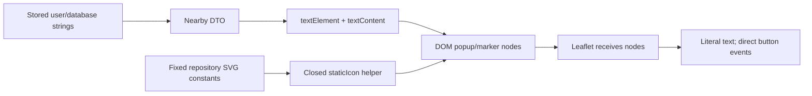

# F4 Stored XSS Prevention

Date: 2026-10-07 (Asia/Dhaka).
Status: locally implemented and verified.
Base/worktree: c43176d, J:/Karigor-F2-F4, fix/admin-bootstrap-and-xss-on-f1.
Design: [approved F4 plan](../PHASE1_SECURITY_REMEDIATION_PLAN.md).
Study: [SECURITY_WORKDONE.md](../SECURITY_WORKDONE.md).

## 1. Original problem and concrete failure

KarigorMap directly integrates Leaflet, a browser map library. Some popups used innerHTML, which asks the browser to parse a string as markup. Other labels used interpolated HTML in L.divIcon or bindPopup.

A stored request description could contain an image with an error handler. A worker opening its popup would execute that handler in Karigor's browser origin. The Phase 0 fixture used a harmless boolean flag instead of stealing data, and actually observed the flag changing in Chrome.

Description/address were not the only sinks. Category names entered request marker HTML and popup headings. Worker email and skill/category names entered popup HTML. Translations and numeric display strings entered marker/location popup templates.

React normally escapes JSX text. These Leaflet string templates bypassed that React boundary.

## 2. Invariant

**User-controlled or database-controlled text remains inert text when displayed in the map.**

Markup-like strings must not become elements, handlers or scripts. Existing hostile stored values become safe through rendering, without database rewriting or removing legitimate characters.

This task protects the map output boundary. It does not authorize new data access or alter backend storage, negotiation, location privacy, SignalR delivery or sessions.

## 3. Previous flow

Customer/database text -> DTO -> string interpolation -> innerHTML / divIcon HTML / bindPopup HTML -> browser parses attacker text.

The dangerous step was interpretation, not storage of the literal characters.

## 4. Implemented flow and exact changes

DTO text -> textElement -> textContent -> DOM node -> Leaflet popup/icon -> browser displays text.

textElement creates an HTMLElement, assigns repository-owned classes and places any supplied value through textContent. It never parses that value.

L.divIcon receives an HTMLElement for worker/request/picker content. Popup content is also an HTMLElement. Direct listeners attach to the created profile/quotation buttons instead of locating buttons inside interpolated HTML.

The location popup helper builds the user/base popup from DOM text. The picker popup is constructed separately to retain its original span/font classes. Existing icons, dimensions, classes, profile/quote selection behavior, dragging, circles and map controls remain.

The marker effect now includes its callback and translation dependencies so recreated nodes use current callbacks/labels. Existing map/marker cleanup remains in place. Tests cover redrawing/remounting and exactly one callback per action in those scenarios.

### Complete rendering inventory

| Surface | Dynamic values | Final treatment |
|---|---|---|
| Request marker badge | Category name | textContent in a DOM badge |
| Request popup | Category, distance/translation, description, address, quote translation | DOM elements/text; quote button listener attached directly |
| Worker marker badge | Rating or translated New label | DOM elements/text; fixed star icon |
| Worker popup | Email/name fallback, skills/category names, rating, rate, distance, profile translation | DOM elements/text; profile listener attached directly |
| Picker marker | Translated drag label | DOM elements/text plus fixed SVG |
| Picker popup | Title, coordinates, hint translation | DOM elements/text, original style classes |
| User location popup | Title and coordinates | locationPopup DOM/text |
| Worker-base popup | Title and coverage translation/radius | locationPopup DOM/text |
| React map controls/GPS error | Translated labels/errors | Existing JSX text escaping |
| User/worker-base icon shells | Fixed class/structure plus repository SVG constants | Static HTML only, no dynamic data |
| Tile attribution | Repository-owned copyright/link text | Existing static attribution |

Nearby DTO customerName, worker bio/userId and categoryIconUrl are not rendered into HTML by this component. No new rendering of those unused fields was introduced. Worker email is the existing visible name label.

### Remaining HTML parser boundary

A private staticIcon helper takes a key into a closed map of repository-owned SVG constants. It assigns only that constant to a template's innerHTML and returns the SVG node. Callers pass fixed keys, never user text.

Two existing static user/base divIcon shells and fixed attribution remain markup. Their inputs are repository constants only. There is no popup innerHTML, dynamic popup string or dynamic data in a marker HTML string.

This is deliberate separation of static markup from dynamic text, not a general-purpose sanitizer or safe-HTML API.

### Buttons and resource lifetime

- Profile marker click and profile button each retain the existing onSelectWorker action.
- Request marker click retains onSelectRequest.
- Quote button calls onRequestQuote when present, otherwise onSelectRequest.
- Buttons have type=button and direct IDs/listeners.
- Marker recreation clears the previous Leaflet layers.
- Map unmount removes the Leaflet map; fixture remount produces one map.
- Stored strings, API validation and database values are not changed.

## 5. Before vs after

| Before | After |
|---|---|
| Description/address parsed as HTML | Literal DOM text |
| Category parsed in marker and popup | Literal DOM badge/heading |
| Worker email/skills parsed in popup | Literal DOM text |
| Translation strings parsed in labels/location popups | Literal DOM text |
| Interpolated button markup plus selector lookup | Constructed button plus direct listener |
| Escaping could be missed at each interpolation | One text API consistently receives dynamic values |
| Hostile old rows stayed exploitable at these sinks | The same strings display harmlessly |

## 6. Why this design

| Alternative | Why considered | Why rejected/deferred |
|---|---|---|
| Escape every template insertion | Smaller string-template diff | Fragile across all fields/contexts; a missed interpolation reopens the issue |
| Strip angle brackets on input | Appears simple | Breaks legitimate text; does not protect existing stored values |
| Rewrite stored text | Could remove known payloads | Changes user data and still leaves the unsafe sink |
| Add HTML sanitizer | Useful for intentionally formatted user HTML | No such product requirement; unnecessary dependency/policy |
| Mount React roots in every Leaflet popup | JSX escapes text | Adds root lifecycle/unmount coordination to existing direct-DOM code |
| CSP alone | Useful defense in depth | Does not repair the output sink and requires separate compatibility review |

DOM construction is more verbose than a template. It makes the data/code boundary explicit and keeps current Leaflet lifecycle. No library/framework/CSP or backend filtering was added.

The decision follows the approved DOM/text approach. ADR 0001 remains unchanged and empty in the selected base; no unrelated Proposed decision changed status.

## 7. Concepts and failure scenarios

**Stored XSS** means a saved string becomes executable browser content when another user later views it. Saving the string in SQL does not make it trustworthy.

**Output context** means the browser treats a value differently depending on where it is placed. Plain text and parsed HTML are different contexts.

**textContent** assigns text to a node. It preserves literal brackets/quotes/ampersands rather than interpreting them as markup.

**Safe sink** means the operation receiving untrusted data does not interpret it as code. Here, the sink is textContent and Leaflet receives prebuilt nodes.

**Resource lifetime** means listeners/nodes belong to the marker/map that owns them. Redrawing should not keep old callbacks active.

| Scenario | Behavior and evidence |
|---|---|
| Hostile description/address/category | Literal payload, no handler/image creation, execution flag false |
| Hostile worker email/skill | Literal payload, no execution; profile actions still work |
| Hostile translation | Marker/location/picker labels remain text |
| Bengali/special characters | Original strings remain exactly present in DOM |
| Repeated redraw/remount | Callback counts advance once per quote; one map after remount |
| Quote callback missing | Existing request-selection fallback still works |
| Map data/backend request fails | This component renders supplied props; API-error handling unchanged |
| Concurrent data updates | Current props rebuild markers; no backend transaction/concurrency behavior changed |
| Tile/provider unavailable | Fixtures block external tiles; map markers/actions are independent test evidence |
| Session/authorization changes | Existing consumers/auth remain; rendering safety does not establish resource access |

The fixture is a browser component test, not a persisted customer-to-worker end-to-end journey. It feeds the same DTO shape into the actual component and browser.

## 8. Tests and what each proves

Every case below uses actual Leaflet/DOM behavior in installed Chrome. All external origins are blocked. Payloads only flip a local boolean if interpreted; they perform no exfiltration or production requests.

| Test | Setup | Action | Expected result | Rule protected |
|---|---|---|---|---|
| GREEN BASELINE: plain request popup and quote callback work | Ordinary request DTO | Open popup and press quote | Description shown; callback request 123 | Preserve normal request interaction |
| GREEN REGRESSION F4: stored map text cannot execute HTML | Original image-handler description | Open actual popup | Original execution assertion false; literal payload; no image | Promoted original XSS rule |
| F4: request address image markup remains literal | Image-handler address | Open popup and quote | Literal text, no image/handler or execution; quote works | Address is text |
| F4: request category image markup remains literal | Image-handler category | Inspect marker badge and popup | Literal category; no image/handler or execution | Marker HTML is also a trust boundary |
| F4: request category svg markup remains literal | SVG-load category | Inspect marker badge and popup | Literal SVG text; no onload/execution | Different payload type stays inert |
| F4: worker email markup remains literal and profile actions work | Image-handler email | Click marker then profile button | Literal email; no execution; callback counts 1 then 2 | Name/email label does not become code |
| F4: worker skill markup remains literal and profile actions work | SVG-load skill/category | Click marker then profile button | Literal skill; no execution; callbacks once per action | Skill names are text |
| F4: Bengali quotes ampersands and angle brackets are preserved | Bengali/special-character description and address | Open popup | Exact original strings retained | Safety must not destroy legitimate text |
| F4: translated worker marker label remains literal | Hostile translated New label | Inspect worker icon and popup | Literal label; no image/execution | Translations do not enter HTML |
| F4: user and worker-base location popup translations remain literal | Hostile location titles/coverage translation | Open both location popups, closing each between actions | Literal labels; no image/execution | All location popup text uses safe DOM |
| F4: picker text remains literal and map selection works | Hostile drag/title/hint translations | Open picker popup and select map position | Literal text; no image/execution; coordinates emitted | Picker badge/popup and interactions survive |
| F4: redraw and remount do not accumulate quotation handlers | Normal request with counters and controlled redraw/mount | Three redraw/quote cycles; unmount/remount; quote again | Counts 1,2,3,4; one map after remount | Listeners belong to the current marker |
| F4: quotation button preserves request-selection fallback | No onRequestQuote callback | Select marker then press quote | Selection counts 1 then 2; zero quote callbacks | Existing fallback behavior remains |

All 13 map cases passed. The original safe execution assertion was kept unchanged.

Promotion sequence:
1. Before the fix, the original test actually failed its safe assertion and matched its expected-failure annotation.
2. After the DOM fix, the same assertion passed; Playwright exited 1 with “Expected to fail, but passed.”
3. Only then was test.fail removed and the classification prefix changed to GREEN REGRESSION.
4. Literal-text/no-element checks and additional independent scenarios were added.
5. The promoted case and all other map cases passed.

One initial new location test timed out because the first real popup overlaid the other marker. We closed that popup through its existing close button before selecting the second marker. No assertion or click-safety check was weakened; no forced click or arbitrary delay was added.

## 9. Commands and actual results

```text
npm --prefix karigor-client run test:security -- --grep "EXPECTED-FAIL REGRESSION F4"
npm --prefix karigor-client run test:security -- --grep "stored map text cannot execute HTML"
npm --prefix karigor-client run typecheck:security
npm --prefix karigor-client run test:security -- map.security.spec.ts
dotnet build Karigor.slnx --configuration Release --no-restore
python scripts/run-security-tests.py --no-build
python -m unittest discover -s scripts/tests -v
npm --prefix karigor-client run test:security
npm --prefix karigor-client run build
npm --prefix karigor-client run lint
```

| Check | Actual result |
|---|---|
| Pre-fix original F4 | Safe assertion failed as expected; wrapper process 0 through native expected-failure accounting |
| Post-fix, annotation still present | Safe assertion passed; process 1 for unexpected pass |
| First expanded map run | 12 passes, one fixture interaction timeout |
| Corrected map run | 13 passes |
| Combined browser run | 19 passes, zero failures/skips/expected failures |
| Combined backend | 68 passes, five exact unrelated known failures; gate 0/raw dotnet 1; no skips |
| Backend build | Zero warnings/errors |
| Browser fixture TypeScript | Passed |
| Frontend production build | Passed; existing Vite config/bundle warnings |
| Frontend lint | Exit 0, 20 existing warnings; no new warning |
| Classifier self-tests | Six passes |

All browser runs selected Chrome with KARIGOR_TEST_BROWSER_CHANNEL=chrome and the actual Node/npm installation prepended to PATH. No new package/dependency/CI changes were needed. Fixture auth/provider console messages from blocked/mocked Google/SignalR requests are not failures of the map test.

The final browser JSON/traces are under karigor-client/test-results/security-browser. Combined backend report: TestResults/security/6c55c53bd0044fa78f025bb476242707/security.trx.

Final checks passed: git diff --check with repository line-ending settings, exact 21-file combined scope, unchanged original safe assertions, preserved earlier study history, documentation UTF-8/fences/relative links, required study sections and report counters. Executable seed SQL and unrelated production surfaces are unchanged. A read-only SQL query found zero generated fixture databases; no test process referenced this worktree.

## 10. Files changed

| File | Change | Reason |
|---|---|---|
| karigor-client/src/components/map/KarigorMap.tsx | Safe DOM/text for all dynamic icons/popups; direct listeners; current callbacks/translations in effect dependencies | Render stored text inertly and preserve interactions |
| karigor-client/e2e/fixtures/map.tsx | Worker/location/picker/text/redraw/remount scenarios and harmless probes | Exercise actual component boundaries |
| karigor-client/e2e/map.security.spec.ts | Promote original safe assertion; twelve additional/baseline cases | Verify rendering and interactions in Chrome |
| docs/security/implementation/F4_STORED_XSS_PREVENTION.md | Final sink inventory, flows, tests and limitations | Technical implementation reference |
| docs/security/SECURITY_WORKDONE.md | Append two dated study entries; preserve Order 0/F1 history | Explain why each task matters |
| docs/testing/PHASE1_SECURITY_TEST_HARNESS.md | Update current F2/F4 status; preserve prior evidence | Keep current gates distinguishable from historical red tests |

The shared log/harness entries also describe F2. F2's separate guide lists its command/login files. The payment-return fixture changed only to host the F2 login test; production payment code was preserved.

## 11. Database/security implications and limitations

No database text, schema, migration, transaction, index or storage rule changed for F4. SQL remains a storage system; the safety rule is applied when rendering.

- Local Chrome is verified; Firefox/Safari/hosted CI were not run.
- Browser fixtures do not reproduce SQL persistence or a live customer/worker journey.
- This does not prove every HTML sink elsewhere in the application is safe.
- Future map fields must continue using textElement/textContent; staticIcon must remain a closed repository-only boundary.
- Payload-like user text is intentionally visible, not sanitized into formatted HTML.
- Existing marker recreation costs remain; no clustering/performance redesign was made.
- No CSP, document-preview policy, session protection or SignalR privacy fix was added.
- Existing map initialization/ref lint warnings remain; only the relevant callback/translation dependency warning was removed.
- No production stored-content review or deployment was performed.

Recovery/rollback should preserve safe text rendering. Do not restore the unsafe string templates merely to recover a cosmetic layout issue.

## 12. Educational scaling

| Scale | What to measure if needed |
|---|---|
| 100 users | Normal DOM/Leaflet rendering and straightforward interaction tests |
| 10,000 users | Visible marker count, update frequency and browser memory; clustering only if justified |
| 1,000,000 users | Educational concern: viewport queries/limits and measured client rendering budgets |

User counts alone do not determine marker load. Dynamic values must remain text regardless of rendering strategy. No scaling component was introduced.

## 13. Data flow



## 14. Interview explanations

### 30 seconds

Karigor stored request text safely but later inserted it into Leaflet HTML strings. A worker opening a popup could execute a customer's payload. I replaced every dynamic map label/popup with DOM construction and textContent, keeping fixed SVGs separate. Existing data needs no rewrite. Actual browser tests now show literal hostile text and preserve normal/profile/quote/picker interactions.

### Two minutes

The bug was stored XSS at the output boundary. React escaping did not help because the map used Leaflet with manual innerHTML/divIcon/bindPopup strings. Description/address were obvious, but categories, worker emails/skills and translations also crossed into parsed HTML.

I audited the component's rendering paths and used createElement/textContent for all dynamic values. Leaflet receives completed DOM nodes. A closed helper parses only repository SVG constants, and buttons use direct listeners. I kept classes, marker dimensions, location controls and callback behavior.

The original actual-browser safe assertion failed before the change. Afterward it passed and triggered the expected-failure promotion signal; I then removed the annotation without changing the assertion. Thirteen map cases now cover literal image/SVG payloads, Bengali/special characters, translated labels, profile/quote/fallback/picker actions and redraw/remount counts.

The tradeoff is more verbose DOM construction. A sanitizer or new React-root lifecycle was unnecessary because user HTML formatting is not a requirement. No database cleanup, input stripping, new framework or CSP was added. The result is locally verified rendering safety, not a claim about unrelated application sinks or production deployment.

### Five questions

1. **Why didn't React protect this?** The vulnerable strings were sent directly to Leaflet/browser HTML APIs outside JSX escaping.
2. **Why textContent instead of innerHTML?** textContent displays data; innerHTML asks the browser to interpret it as markup.
3. **Why not remove angle brackets?** It damages valid text and does not fix existing rows or every interpretation path.
4. **Why a browser test?** Execution depends on real HTML parsing, image/SVG events and Leaflet behavior.
5. **Can static SVG still be HTML?** Yes, if it remains repository-owned constants and no user data is interpolated into that parser boundary.


## Final popup-regression reconciliation (2026-10-07)

The repeated-redraw locator occasionally matched two buttons during Leaflet's closing animation. Inspection of the installed Leaflet DivOverlay.onRemove and a real Chrome lifecycle probe showed one opacity-0 closing popup plus one opacity-1 current popup. Leaflet schedules DOM removal after 200 ms. Each old node detached, one marker/current popup remained after settlement, and callbacks advanced once. Unmount left no map/popup/button DOM. No persistent duplicate popup, duplicate callback or missing application cleanup was reproduced.

The regression now asserts exactly one marker/popup/button before quotation, waits for the removed popup/button count to become zero after each redraw, and verifies three unmount/remount cycles with exactly one callback per action. It uses state-based Playwright assertions, no arbitrary sleep, forced click or `.first()` selection. The diagnostic's immediate DOM dispatch was only used to observe the transition, never as a passing-test shortcut. All stored-XSS assertions and production DOM/text rendering remain unchanged. A real duplicate-DOM leak would still fail the zero/one counts or callback counters. See [final evidence](../SECURITY_WORKDONE.md#phase-1-final-regression-reconciliation).
