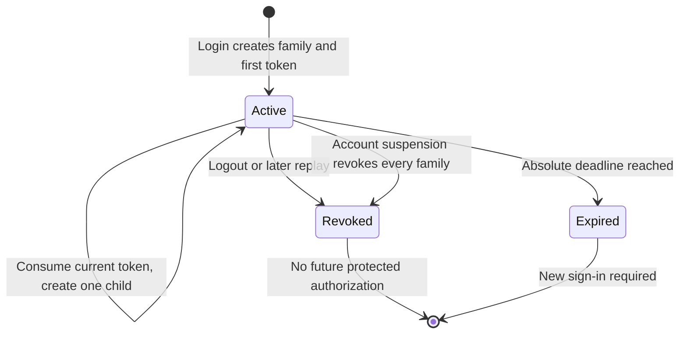
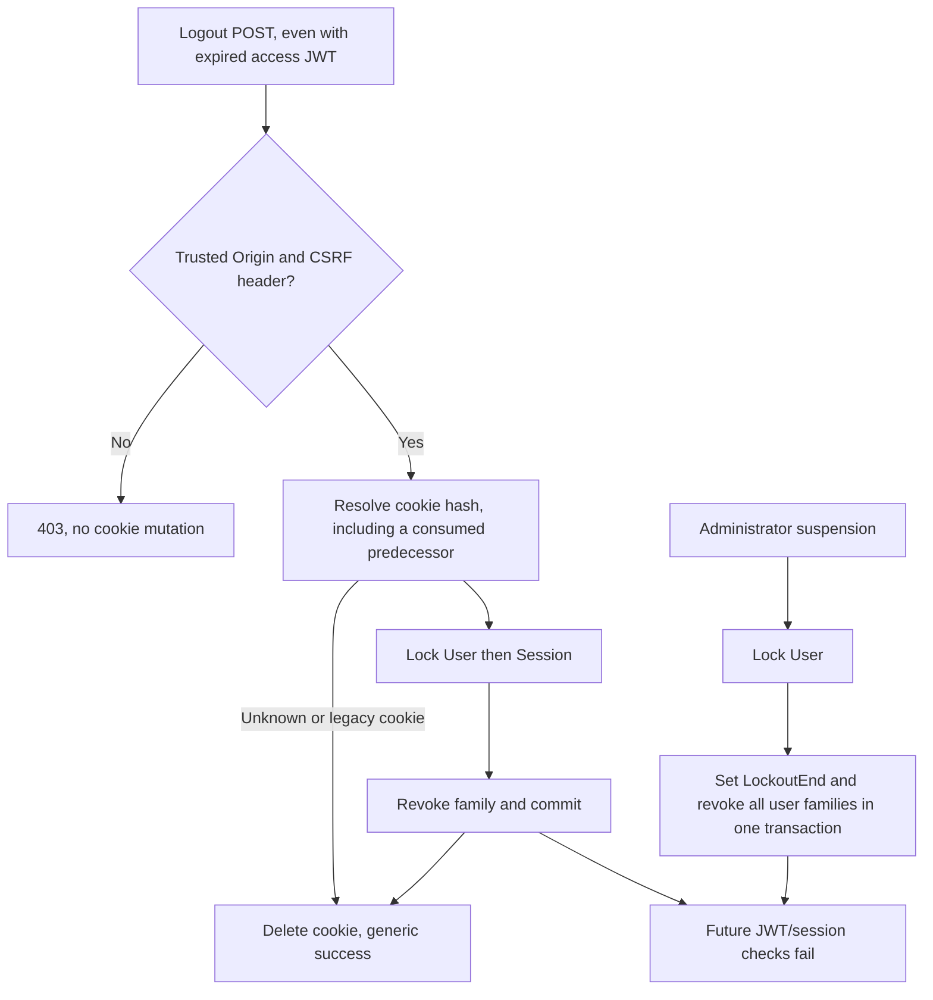
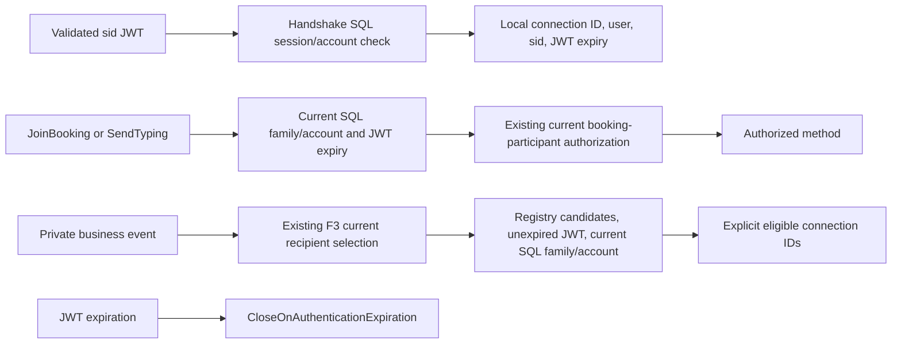

# F6 Refresh Token Rotation and Session Revocation Architecture

Date: 2026-10-07 (Asia/Dhaka). Scope: the F6 implementation and its necessary F3/session integration. No deployment, production database access, credential rotation, commit, push or merge was performed. The original Phase 1 plan is historical; ADR 0001 remains an empty historical file. [ADR 0006](../../adr/0006-refresh-session-authority.md) records the implemented decision.

## Authority and lifetime

A successful login creates one `RefreshSession`. Separate logins, including different devices, have independent GUID families. The session has a fixed expiry from `Jwt:RefreshTokenExpiryDays` (default seven days, accepted range 1?365). Refresh does **not** extend this deadline. Each access JWT contains `sid` and expires at the earlier of the configured access lifetime and the family's absolute deadline.

Raw refresh credentials contain 64 cryptographically random bytes encoded as Base64. SQL stores only their lowercase 64-character SHA-256 hashes. The cookie is `karigor_rt`, host-only, Path=/, HttpOnly, SameSite=Lax and Secure in production or HTTPS development. Issuance uses the exact session expiry; deletion repeats the same scope and security attributes. Access credentials remain in browser memory. Authentication responses use `Cache-Control: no-store`.

`RefreshToken.RevokedAt` means consumed/retired token state; `RefreshSession.RevokedAt` is the family revocation authority. An unconsumed row within a revoked/expired family is unusable. Never interpret a null token RevokedAt alone as active authorization.

## SQL-owned model

| Object | Meaning and enforcement |
|---|---|
| RefreshSessions | Id PK, UserId FK/index, CreatedAt, ExpiresAt, RevokedAt, bounded RevocationReason, SQL rowversion; valid lifetime/revocation checks |
| RefreshTokens | Existing hash/owner/timestamps plus nullable SessionId, ParentTokenId and rowversion; null family is only allowed for explicitly retired legacy history |
| UX_F6_TokenHash | Unique bounded hash; efficient exact credential lookup |
| UX_F6_Parent | At most one child of a consumed predecessor |
| UX_F6_ActiveToken | At most one unconsumed token per non-null family |
| Composite token/session FK | Token owner must be the family owner |
| Composite parent/family FK | Parent must belong to the same family; parent ID must precede child ID |
| ReplacedByToken | Retained, bounded successor hash for audit/compatibility; never raw token recovery |

Current EF mappings consume the SQL-owned schema. The historical EF snapshot is deliberately not rewritten. `008_refresh_session_authority.sql` is the only F6 migration owner; startup runs a read-only structural gate. No Redis, background authorization cache, distributed lock or OAuth server was introduced.

## Rotation and exact overlap policy

```mermaid
sequenceDiagram
    participant B as Browser
    participant A as Auth endpoint
    participant S as RefreshSessionService
    participant D as SQL
    B->>A: POST refresh with HttpOnly cookie, Origin, CSRF header
    A->>A: Check trusted origin and header
    A->>S: Raw token held only in request memory
    S->>D: Read hash row once without tracking
    S->>S: Reject missing, expired or legacy token
    S->>D: Begin transaction, lock User then Session
    S->>D: Read current token; check account and family
    S->>D: Conditional consume using token rowversion
    S->>D: Insert one successor hash with same family and absolute expiry
    S->>S: Build sid JWT while transaction can still roll back
    S->>D: Commit
    S-->>A: New raw successor and access result
    A-->>B: New cookie plus access JWT
```

There is no grace interval and no predecessor is returned as a successful cookie. Expiry is checked at initial observation and again inside the transaction **before replay handling**, including when a token expires while waiting for a lock.

```mermaid
sequenceDiagram
    participant A as Request A
    participant B as Request B
    participant D as SQL authority
    A->>D: Observe predecessor active, version V
    B->>D: Observe predecessor active, version V
    A->>D: Lock User, Session; consume V; insert child; commit
    D-->>A: Success with new cookie
    B->>D: Acquire same locks; predecessor now consumed
    D-->>B: 409 conflict, no cookie and no family revocation
    Note over A,B: Which caller wins is intentionally unspecified
    B->>D: A later request first observes consumed predecessor
    B->>D: Lock User, Session; revoke this family; commit
    D-->>B: 401 with no cookie
```

**Case A** is defined by both SQL observations being active, not by arrival time, elapsed seconds, browser timestamps or a client-supplied race identifier. The loser gets 409 without setting or deleting a cookie. **Case B** first observes a consumed, unexpired predecessor and revokes its family, then returns 401. This can happen immediately after the winner commits. A request that started earlier but first reads after commit still falls into Case B. Both cases issue no credentials to the loser. Unrelated families are unaffected.

The lock order is **User ? Session ? Token**. `UPDLOCK,HOLDLOCK` on the Identity row serializes account/session mutations across API instances sharing SQL; the session row is then locked. The token update also checks its observed rowversion, unconsumed state and expiry. Unique SQL indexes are independent backstops. Transactions use an execution strategy with zero automatic retries. Unknown commit acknowledgement is not converted into another issuance attempt. Registration's existing outer transaction encloses family creation and its response is returned only after that outer commit.



## Logout, suspension and protected HTTP requests



All auth POSTs require `X-Karigor-CSRF: 1` and an Origin exactly matching the request origin or an explicitly configured `Cors:AllowedOrigins` entry. Missing Origin, literal `null`, wildcard trust and hostile origins are rejected. This also prevents login CSRF and protects refresh from hostile same-site sibling origins. CORS must permit the trusted frontend/custom header. Non-browser callers must supply the explicit headers too. This is not a secret CSRF token: browser restrictions on Origin/custom headers plus the server's allowlist are the defense. SameSite is additional protection.

Logout does not depend on a valid access JWT. A recognized refresh cookie identifies its family even when consumed or expired. Unknown/missing cookies return the same success body. A database failure does not claim successful server revocation or clear the cookie. The browser clears local state immediately and displays a retryable sign-out warning if server confirmation fails.

Suspension and unsuspension use the same user lock as refresh and new-session creation. If refresh wins first, subsequent suspension revokes the successor's family. If suspension wins first, refresh sees the current LockoutEnd under lock and fails. Unsuspension permits a new sign-in but never resurrects old families. Other Identity updates must retain concurrency-stamp behavior; this operation changes the stamp.

After signature/issuer/audience/expiry validation, every bearer authentication runs an indexed current SQL family/account check. Missing `sid`, wrong user binding, revoked/expired family or suspended user fails authentication. Thus a JWT need not expire before logout takes effect. SQL errors fail closed; there is no cached allow. Roles remain normal JWT claims: unrelated role-change semantics are not redesigned by F6.

**Revocation latency promise:** every authorization check beginning after the revocation commit denies the revoked family. Already authorized HTTP work or an event whose eligibility read preceded the commit can finish. This is an authorization-boundary guarantee, not cancellation of work or bytes already in flight. Ordinary SQL lookups are not held through the entire business request/network send.

## SignalR and F3 resource authorization



Connection metadata is transport routing, never cached permission. `SessionConnections` contains only connection IDs, user IDs, session IDs and JWT expiry. It is removed on disconnect. Every private push resolves F3 recipients and filters each candidate family against SQL plus each connection's JWT expiry. Typing uses the same notifier. A revoked connection can stay physically open until normal expiry/disconnect, but future sensitive calls and private sends deny it. Public refresh hints remain fixed `{ refresh: true }` and contain no private DTO.

F3 booking checks, current admin-recipient queries, ownership and reconnect authorization remain intact. `CloseOnAuthenticationExpiration` is retained and a timed hosted WebSocket test verifies closure. Controlled-clock tests independently exercise expired-JWT method/delivery denial while the family is still active. The browser obtains fresh credentials through the coordinated flight before reconnecting after a terminal expiry close.

The registry matches this application's in-process SignalR lifetime manager. Multi-node delivery/backplanes are not configured or claimed as verified; adding scale-out requires a reviewed delivery design that preserves per-connection expiry/session filtering. Session mutation correctness already resides in SQL, not the local registry. SQL read ? send is still a point-in-time boundary; already queued events cannot be recalled.

## Browser ordering and failure behavior

All refresh, logout, login, Google login and registration cookie mutations share the same same-origin Web Lock, held until the response finishes processing. One module-level promise preserves in-tab single flight. Tabs rotate sequentially using the browser's latest HttpOnly cookie; access tokens are not copied between tabs.

`karigor.auth.generation` stores only random invalidation metadata and a signed-out flag. BroadcastChannel/storage events clear other tabs' in-memory credentials and realtime state. Logout/account change invalidates immediately, before waiting for a pending network response. Every queued mutation and refresh result checks its captured generation. A stale 401 from an old account cannot refresh/replay the original protected request under a new account.

For account switching, the locked operation first logs out the old cookie family, then performs the new authentication. A pending old refresh may set its **new successor** cookie before logout receives the lock, but logout then revokes that family and deletes that cookie. No losing response ever returns the predecessor. Browser JavaScript cannot undo an arbitrary Set-Cookie header after it arrives; cooperative ordering plus server family revocation is the coherent boundary. Non-cooperating clients can delay a formerly successful response, but its revoked family is still unusable at every protected server boundary.

Requests time out after 20 seconds. A successful server rotation whose response is lost can leave the browser holding a consumed predecessor. The browser clears its local session, broadcasts invalidation and requires sign-in instead of blindly replaying. Conflict/401 paths write no cookies and start no replay loop. Web Locks and writable localStorage are required; unsupported/blocked coordination fails before sending an auth cookie mutation. This is an explicit availability tradeoff, not a claim of fallback cross-tab safety. Same-origin coordination does not span distinct frontend origins sharing an API; that deployment arrangement needs separate review.

## Migration and rollback

1. Back up the intended database and schedule a writer outage. Stop all old API instances; prevent a mixed old/new deployment.
2. Follow the established canonical SQL baseline/005/006/007 path as appropriate. Do not rerun frozen payment version 1 on payment version 2.
3. Run all of `008_refresh_session_authority.sql` without flags for read-only preflight. Review malformed/duplicate hash or partial-schema failures; never truncate, deduplicate or infer legacy families automatically.
4. On the same authorized connection, set `KarigorF6Apply=1` **and** `KarigorF6ForceSignInReset=1`, then execute the whole script. The transaction revokes legacy rows, retains their history with null SessionId, creates the new table/columns/constraints/indexes and stamps version 1. It does not create families for old rows.
5. Deploy the matching API and browser together, verify exact allowed origins/HTTPS/cookie scope, and let the read-only startup gate validate prerequisites. All old no-sid JWTs and legacy refresh cookies require a new sign-in. Communicate this planned reset.
6. Verify login, rotation, logout, protected routes and realtime behavior in the actual hosting environment before reopening traffic.

No application/production database was migrated during this task. All SQL test writes target generated loopback fixture databases. Retired legacy rows are preserved, and automatic retention/deletion is deferred. Keep consumed predecessors through at least their family deadline if replay detection is required throughout that lifetime.

**Rollback is not an old-binary redeploy.** Old binaries omit session authorization and are incompatible with the active-token constraints. A committed forced sign-in reset is intentionally irreversible from the application's perspective. Prefer a forward repair; restoring an old backup could resurrect credentials and needs a separately reviewed outage and credential invalidation plan. This task performs no key rotation or restoration.

## Verification and limitations

Actual final commands, counts, finding matrix and the complete changed-file inventory are recorded in the appended [F6 study/report](../SECURITY_WORKDONE.md#f6-refresh-token-rotation-and-session-revocation). Test layers are explicit: actual HTTP/TestServer + real SQL; hosted .NET WebSockets; real Chrome tabs running production auth modules with controlled local HTTP responses. The Chrome fixtures do not claim one browser-to-production-SQL end-to-end run. No live Google OAuth, real gateway, IIS/proxy, hosted CI or production rollout was exercised.

Measured correctness is not measured production capacity. Every protected authentication adds an indexed SQL read; private delivery adds one current lookup per candidate family, and user locks serialize this user's session mutations. Benchmark before adding a cache, since positive caching would change the immediate revocation promise. The absolute lifetime may force active users to sign in after seven days. A stolen current bearer token can win a race; strict rotation detects later reuse but cannot identify which presenter is legitimate.

Primary references: [Microsoft SignalR authentication lifetime](https://learn.microsoft.com/en-us/aspnet/core/signalr/authn-and-authz?view=aspnetcore-10.0) explains why connection-time validation alone does not revalidate revocation. The [Web Locks specification](https://www.w3.org/TR/web-locks/) defines same-origin coordination; Karigor uses it specifically to order cookie-mutating requests.
