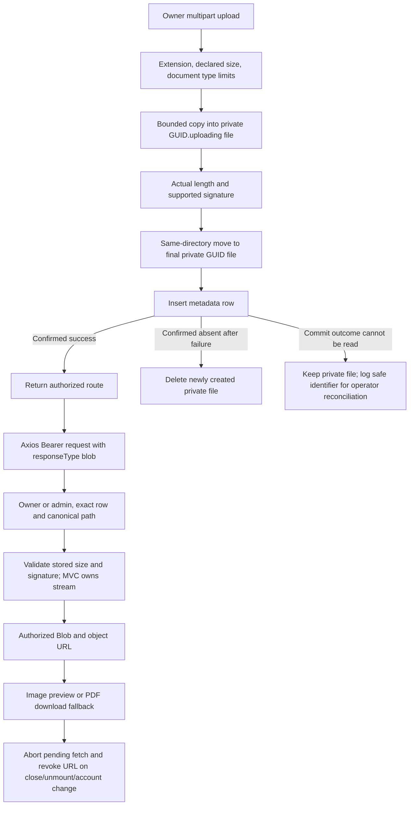

# F7 Secure Private Document Handling

Date: 2026-10-07 (Asia/Dhaka). Status: implemented and verified locally.

The invariant is: only the authorized owner/admin receives validated private document bytes, and those bytes remain private during storage and browser delivery. Supported upload/delivery types remain PDF, JPEG and PNG. Signature validation identifies a format; it is not malware scanning or a complete parser.

## Original failures and new flow

The original F7 run had two working baselines and three real assertion failures: normal `%PDF-` was rejected, `%FDP` was accepted, and an owner received an unusable MVC response because the action disposed its stream before result execution. Browser img/iframe/links also issued bare URL requests without Axios's Bearer header. Uploads ignored the configured root, accepted up to 5 MiB while the client advertised 10 MB, and left a file after failed SQL insertion.



## Exact implementation

`FileValidationService` now checks all five `%PDF-` bytes. JPEG and PNG branches and caller stream-position restoration remain. WebP's old helper branch was not enabled as an upload format; the delivery allowlist now matches the actual supported upload set.

`WorkerDocumentLimits` defines **5,242,880 file bytes (5 MiB)** and **5,308,416 whole-request bytes (file plus 64 KiB multipart allowance)**. The upload action bounds whole-request and multipart section sizes, field lengths/count and multipart headers. IIS web.config uses the same whole-request limit. The client constant and English/Bengali messages match the file limit. Client checks improve feedback; the server enforces the rule.

`PrivateUploadPathProvider` resolves a configured absolute path, or a relative path against ContentRoot; absence means `App_Data/Uploads/WorkerDocuments`. Program validates/creates it once and registers this same provider for both consumers. Canonical paths equal to/inside default or effective public web roots are rejected. Existing linked ancestors in private/public root paths are rejected, including Windows junctions. Upload/delivery also reject linked worker directories; delivery rejects a linked file. Trusted operator filesystem ownership remains necessary to prevent a replacement race after those checks.

`WorkerService.UploadDocumentAsync` writes only a generated same-directory `.uploading` staging file using CreateNew. Its bounded copy counts actual bytes, rejects declared-length mismatches and supports non-seekable input by validating the staged file afterward. Format/length must pass before the same-directory move to the final GUID path and SQL insertion. The action's original stream remains caller-owned.

Cleanup tracks which staging/final files this attempt created. A GUID collision cannot authorize deleting somebody else's existing file. On SQL failure it detaches the failed entity and reads the exact worker/FileUrl pair. Confirmed absence triggers deletion. A found row retains its file; an unavailable outcome check also retains the private file and logs only safe worker/file identifiers. No success is returned on either failure. This is compensation and reconciliation, not a transaction spanning SQL and the filesystem.

`WorkerDocumentFileController` preserves JWT owner/admin authorization and exact worker/FileUrl row matching. It strengthens filename anchors to reject trailing newlines, trims the canonical root separator, retains path-prefix checks and rejects unsupported types. Before returning, the same open stream is checked for 1..5 MiB and its declared-format signature. MVC owns/disposes the transferred FileStreamResult; invalid/error paths dispose before return/throw. `nosniff`, `no-store`, and the allowlisted Content-Type/Content-Disposition remain.

Program reserves `/uploads/worker-documents` from UseStaticFiles. A synthetic legacy public copy cannot bypass authorization. No unknown production file was inspected, moved, deleted or relabeled.

`fetchPrivateDocument` accepts only a rooted worker-document GUID path, uses `apiClient` with `baseURL: '/'` (overriding its `/api` default), `responseType: 'blob'` and an AbortSignal. It reuses the existing 401 refresh interceptor. It rejects arbitrary origins, query-token URLs, unsupported response MIME types and empty/oversized blobs before URL creation.

`PrivateDocumentViewer` creates object URLs only from successful authorized bytes. It displays loading/error states, previews JPEG/PNG and supplies a download link for all formats. **PDFs are download-only in this UI** because cross-browser embedded isolation was not verified. No bare private img/iframe/a URL remains in the two consumers.

The effect aborts its request, ignores late completion and revokes its URL on cleanup. Render state is matched to both account ID and document path, preventing a previous-user image flashing before cleanup. Admin and worker panels are keyed by account ID; their metadata query keys also include that ID. Closing, switching accounts, signing out and unmounting clear the selected preview. Blob bytes are not stored in a query cache, localStorage or tokenized URL.

## Files changed for F7

| Files | Change |
|---|---|
| backend/Karigor.Application/Worker/FileValidationService.cs | Correct PDF prefix; accurate format-only documentation |
| backend/Karigor.Application/Worker/WorkerDocumentLimits.cs | Shared file/request limits |
| backend/Karigor.Application/Worker/WorkerService.cs | Bounded staging, actual-byte validation and file/SQL compensation |
| backend/Karigor.Infrastructure/Upload/PrivateUploadPathProvider.cs | Validated effective configured/default root |
| backend/Karigor.Api/Program.cs | Shared provider and reserved static namespace; also contains F3 policy/expiry changes |
| backend/Karigor.Api/Controllers/WorkerController.cs; web.config | Multipart/request/IIS limits |
| backend/Karigor.Api/Controllers/WorkerDocumentFileController.cs | Preserve authorization/path/headers; revalidate stored bytes; transfer stream ownership |
| karigor-client/src/api/privateDocumentApi.ts; src/components/PrivateDocumentViewer.tsx | Authenticated blob transport and scoped URL/request lifetime |
| karigor-client/src/pages/admin/AdminVerificationsTab.tsx; src/pages/worker/WorkerDocumentsTab.tsx | Replace bare document URLs; isolate panel/query/selection per account |
| karigor-client/src/locales/en.json; src/locales/bn.json | 5 MiB messages and private-viewer text |
| tests/Karigor.Security.Tests/PrivateDocumentSecurityTests.cs | Format/root/HTTP/SQL/filesystem/failure tests |
| tests/Karigor.Security.Tests/UnitSecurityTests.cs; ApiSecurityTests.cs; tests/known-security-defects.json | Promote three unchanged original F7 bodies and remove only their verified exceptions |
| tests/Karigor.Security.Tests/Infrastructure/SecurityApplicationFixture.cs | Remove the fake path provider; test Program's real provider with fixture-only configuration |
| karigor-client/e2e/documents.security.spec.ts; e2e/fixtures/documents.html; e2e/fixtures/documents.tsx | Eleven real-browser admin/worker cases with controlled local HTTP |
| docs/security/SECURITY_WORKDONE.md; docs/testing/PHASE1_SECURITY_TEST_HARNESS.md; this guide | Study, current gates, implementation evidence |

## Tests and actual results

F7 backend: **38 passes, zero failures/skips**, including 13 new format/root/request-metadata unit cases, 20 new hosted SQL/filesystem cases and the five original F7 cases. The strict security accounting gate also passes 38. Original PDF/FDP/MVC assertion bodies were preserved byte-for-byte after newline normalization; only their classification changed.

| Test family | Evidence |
|---|---|
| Signatures | `%PDF-` accepted; `%FDP`, missing hyphen/truncated PDF, mismatched PNG/PDF and unsupported EXE/SVG rejected; JPEG/JPEG-alias and PNG behavior/stream position preserved. |
| MVC owner/admin | Upload through actual HTTP, exact private disk bytes and complete downloaded bytes, MIME/no-store/nosniff; Windows deletion afterward confirms released response handle. |
| Authorization | Anonymous 401, unrelated worker/customer 404; unrelated customer cannot upload as worker. Wrong worker/file pair fails even for admin. |
| Path/delivery | Six malformed/traversal/encoded/newline segments return 404 without path disclosure; missing file and replaced invalid stored bytes are denied. |
| Size/fields | 5 MiB file plus normal multipart overhead succeeds and downloads exactly; 5 MiB+1 and excessive field length fail; no extra file remains. Request-limit metadata proves the configured cap, not actual IIS/Kestrel transport enforcement. |
| Storage | Host uses real provider and fixture configured root for both writes/reads; default and relative resolution work; default/effective public roots and canonical traversal into them rejected. |
| Write/SQL faults | Interrupted write, forged lengths and actual oversized stream leave no file/row. Real SQL CHECK failure compensates the final file. Injected unavailable insert/outcome read retains one inaccessible private file for reconciliation without a success/row. |
| Legacy public path | A synthetic public copy in a generated web root cannot bypass MVC; owner still receives private bytes after a derived host restart. This is not a production migration or redeploy proof. |

Chrome: **11 F7 cases passed**. They exercise the actual AdminVerificationsTab/WorkerDocumentsTab, Axios client, AuthContext and PrivateDocumentViewer, with controlled HTTP and blocked external origins:

- Worker PNG preview, natural image dimensions, Bearer header, exact downloaded bytes and close revocation.
- Admin PNG preview with Bearer bytes and cleanup.
- Authenticated PDF fallback with exact downloaded bytes and no iframe/object/embed.
- Denied fetch produces an error and no object URL.
- 401 uses the existing refresh path and retry's new Bearer token; no token in URL.
- Pending close cancels retrieval; the released late route cannot create/show bytes.
- Account switch clears ready bytes and revokes their URL; pending old-account response also cannot appear.
- Unmount and sign-out revoke URLs.
- Arbitrary-origin document metadata is rejected before authenticated retrieval.
- Client rejects 5 MiB+1 and sends the exact 5 MiB boundary with bounded normal multipart overhead.

The initial browser run had four new-fixture failures: the admin mock omitted `/pending`, and a year-2099 expiry caused unintended proactive refresh/timer behavior. Correcting the mock path and using a one-hour test expiry restored the intended scenario. The original security assertions were not weakened. One new SQL fault test initially expected the inner exception directly; it now asserts EF's actual DbUpdateException and its exact inner type. These were fixture/test assumptions, not reclassified Phase 0 failures.

Commands executed:

```text
dotnet test tests/Karigor.Security.Tests/Karigor.Security.Tests.csproj --configuration Release --no-build --filter "Finding=F7" --logger "trx;LogFileName=f7-before.trx" --results-directory TestResults/f7-before
dotnet test tests/Karigor.Security.Tests/Karigor.Security.Tests.csproj --configuration Release --filter "Finding=F7" --logger "trx;LogFileName=f7-after.trx" --results-directory TestResults/f7-after
python scripts/run-security-tests.py --strict --filter "Finding=F7"
npm --prefix karigor-client run typecheck:security
npm --prefix karigor-client run test:security -- documents.security.spec.ts
dotnet build Karigor.slnx --configuration Release --no-restore
python scripts/run-security-tests.py --no-build
python -m unittest discover -s scripts/tests -v
npm --prefix karigor-client run test:security
npm --prefix karigor-client run build
npm --prefix karigor-client run lint
git diff --check
```

Combined backend: **117 executed, 116 passed, one exact unchanged F5 failure**, raw dotnet exit 1/accounting exit 0. Combined browser: **30 actual passes**, zero failures/expected failures/skips. Solution build has zero warnings/errors; frontend typechecking/build/lint pass with 20 existing lint warnings and existing Vite config/bundle warnings. Classifier self-tests: six passes. Chrome used `KARIGOR_TEST_BROWSER_CHANNEL=chrome` and the real Program Files Node/npm binaries in PATH.

Reports: `TestResults/f7-before/f7-before.trx`, `TestResults/f7-after/f7-after.trx`, strict F7 `TestResults/security/ed3b9f897bcd405685fdf535f1a8c25e/security.trx`, combined `TestResults/security/1757007ad9044c5baf4269f8eba241b8/security.trx`, browser `karigor-client/test-results/security-browser/results.json` and `TestResults/f7-browser.log`.

## Controlled legacy migration and crash recovery procedure

This is a future operator procedure, **not an executed migration**. Actual production legacy state is unknown.

1. Back up document metadata and relevant storage; stop document writes or use a controlled maintenance window. Inventory exact worker/owner/row/FileUrl relationships, the previously effective private root, configured root and any public copies. Record size/hash; never infer a valid owner from a filename alone.
2. Choose a persistent private root outside every serving root, with restricted operator/service ACLs. Verify deploy tooling preserves this configured directory; project skip-rule comments are not sufficient proof. Remove any separate reverse-proxy/IIS/static mapping capable of bypassing ASP.NET's reserved namespace.
3. Copy only mapped, validated supported files into a private staging area. Check 5 MiB limit, signatures and byte hash. Quarantine unmapped, unsupported, invalid or ambiguous files for operator review; do not manufacture provenance or automatically delete them.
4. Preserve valid GUID routes where possible. If a legacy name needs a new GUID/FileUrl, apply an explicit reviewed row mapping inside a short SQL transaction only after the private copy is verified. Keep copy/mapping manifests for compensation; SQL cannot undo a copy.
5. Cut over root configuration and coordinated app version. Test owner/admin exact bytes, nonowner/anonymous denial and public-copy denial. Test restart and a real redeploy with a synthetic authorized file to prove persistence before release.
6. After verified cutover/backups, explicitly remove or quarantine legacy public copies and unwanted old private duplicates. Keep a rollback/reconciliation record. No code here moves or deletes those unknown files.

Crash recovery uses the same inventory discipline. Stop writes or use a defined quiescent window; enumerate only the validated private root. Compare final GUID files against exact committed rows using worker/FileUrl and hashes. Confirm absence before removing an orphan; preserve files whenever SQL cannot establish the outcome. Review stale `.uploading` files only after excluding active uploads. Investigate rows with missing/invalid bytes instead of silently marking them successful. There is no automatic orphan scheduler in this task.

## Alternatives and remaining risks

PhysicalFile after authorization would simplify lifetime but reopen the path after validation. The transferred validated stream keeps validation/delivery on the same handle. Cookie-authenticated or signed-URL document routes would add a separate authentication/exposure design; existing Bearer retrieval meets this scope. Re-publicizing files is unacceptable. Antivirus/object storage can be future operational additions, but signatures alone are not proof of harmless content.

PDF inline previews were replaced with download fallback. Blob previews consume browser memory up to the bounded file size; URL cleanup releases application references, but a downloaded file is under the user's control and cannot be revoked by signing out. Retrying after a lost upload response can create another document; upload idempotency is separate work.

SQL/filesystem crash gaps, unavailable cleanup permissions and uncertain commit recovery require the documented operator process. No distributed transaction or universal no-orphan guarantee is claimed. Linked paths are rejected, but a privileged filesystem actor changing directories between checks is outside the trust model.

Respecting configuration can reveal a previously ignored public/incorrect root and refuse startup. Existing files are not relocated automatically. Production legacy files, alternate serving paths, backup/redeploy persistence, IIS/Kestrel transport caps, WebP legacy compatibility, hosted CI and Firefox/Safari were not verified. Browsers use controlled HTTP, while the separate backend tests use real JWT/SQL/MVC; this is not a full browser-to-live-API E2E journey.

F6 session-family/revocation architecture, F5 offer rules and payment concurrency remain unimplemented. No commit/push/merge/deploy or production data/file change occurred. Local F3/F7 gates are ready for the schema-authority reconciliation and F5 implementation task; the existing F5 failure remains visible.

Concept references: [ASP.NET upload validation](https://learn.microsoft.com/en-us/aspnet/core/mvc/models/file-uploads?view=aspnetcore-10.0), [MDN object URL lifecycle](https://developer.mozilla.org/en-US/docs/Web/URI/Reference/Schemes/blob), and [revokeObjectURL](https://developer.mozilla.org/en-US/docs/Web/API/URL/revokeObjectURL_static).
