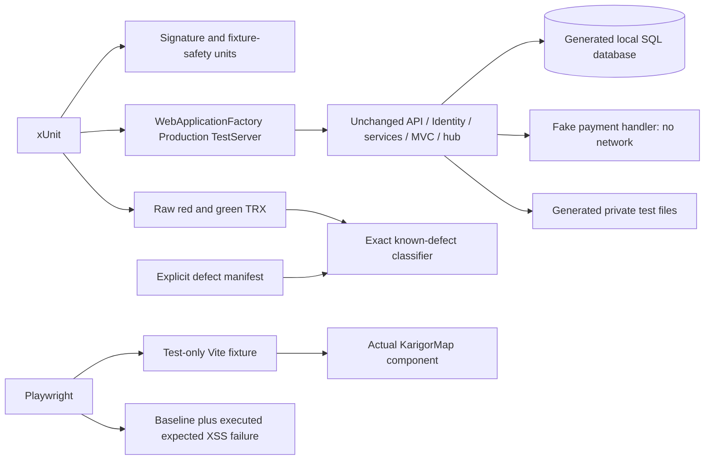

# Phase 1 security test harness: Order 0

**Current F1 concurrency state (2026-10-07):** Implemented with SQL 007 after 001/005/006, exact EF mappings and startup metadata verification. Full strict backend: **213 passes**; targeted payment concurrency: **17 passes**; PaymentSchema: **45 passes** (35 frozen 006 + 10 new 007). Full browser: **39 passes**, including three new real booking-page initiation cases. Zero final failures/expected failures/skips. Provider-trust test bodies and defect/classifier rules are unchanged. Actual SQL contexts/barriers prove callback and initiation races, rollback, unknown responses and retained extra settlements; [implemented F1 guide](../security/implementation/F1_PAYMENT_CONCURRENCY_AND_IDEMPOTENCY.md) and [study evidence](../security/SECURITY_WORKDONE.md#f1-payment-concurrency-idempotency-and-settlement-allocation) record commands and intermediate failures. Older counts below are historical stages.

**Current Payment schema state (2026-10-07):** The fixture now provisions production 001, F5 005 and Payment 006 explicitly before hosting the API. Startup verifies Payment metadata and does not CREATE Payments or ADD PaymentStatus/ServiceCharge. Final backend: **186 passes**, including **35 PaymentSchema** and **47 F1** cases; browser: **36 passes**; zero failures/expected failures/skips. New real-SQL schema cases cover fresh mappings, valid audited upgrades, dirty-history refusal, unknown financial-field preservation and actual startup refusal. Immediate F1/F2/F3/F5/F7 assertions are unchanged. [Payment authority](../database/PAYMENT_SCHEMA_AUTHORITY.md) records the exact flow and local-development findings; the appended study entry records final results. Older counts below describe their historical stages.

**Current F5 state (2026-10-07):** F5 and its narrow SQL authority gate are implemented locally. Full backend: **151 passes**, including **35 F5 cases**, zero failures/expected failures/skips. Full browser: **36 passes**, including six F5 cases. The original exploit assertion is green and the defect manifest is empty; its and two existing SignalR tests' requests now send returned offer versions without weakening assertions. New race tests use separate real-SQL DbContexts and an explicit read/write barrier. The SQL fixture applies baseline production 001 followed by the sole F5 005 script before real startup. Read-only local KarigorDev preflight reports two unknown active legacy authors; no application/production data was migrated. See [F5 implementation](../security/implementation/F5_NEGOTIATION_INTEGRITY.md), [schema/preflight](../database/F5_SCHEMA_AUTHORITY_AND_MIGRATION.md) and [ADR 0003](../adr/0003-f5-sql-authority-and-immutable-negotiation.md). Earlier entries below describe their historical stages.

**Current F3/F7 state (2026-10-07):** Both boundaries are implemented and locally verified. F3 has 13 passing hosted SignalR cases; F7 has 38 passing backend cases and 11 real-browser document cases. Combined: 117 backend cases, 116 passes and only the exact unchanged F5 expected assertion failure; raw dotnet exit 1/accounting gate exit 0. Browser: 30 actual passes, zero failures/expected failures/skips. The original F3 membership and three F7 PDF/FDP/MVC test bodies are unchanged; their four exceptions were removed only after passing. Six classifier self-tests, solution/frontend builds, browser typecheck, lint and diff checks pass. See [F3](../security/implementation/F3_SIGNALR_AUTHORIZATION.md), [F7](../security/implementation/F7_PRIVATE_DOCUMENT_SECURITY.md) and the separately appended study sections. F6 refresh-session families and F5 offer/domain rules are not implemented. Schema-authority reconciliation is the prerequisite for beginning F5 schema work.

The current fixture now uses Program's **real PrivateUploadPathProvider** with the generated Storage:UploadPath configuration; the fake path-provider override was removed. Other fixture isolation and result-classifier rules are preserved. Historical Order 0/F1/F2/F4 results below remain evidence of those earlier tasks, not current unresolved-finding counts.

**Current F2/F4 state (2026-10-07):** F2 and F4 are locally verified in J:/Karigor-F2-F4 on fix/admin-bootstrap-and-xss-on-f1, based on c43176d. F2 has 17 passing backend cases and one login browser case; all 13 map cases pass. Combined backend: 68 passes and five unrelated expected F3/F5/F7 failures. Combined browser: 19 passes, zero failures/skips. The original F2 exception and F4 expected-failure annotation are removed. See [F2](../security/implementation/F2_SECURE_ADMIN_BOOTSTRAP.md) and [F4](../security/implementation/F4_STORED_XSS_PREVENTION.md).

**Prior F1 completion record:** all 47 F1 backend cases and five payment-return browser cases remain green in the combined suite. The four F1 exceptions were removed in that earlier task. See the [F1 implementation guide](../security/implementation/F1_PAYMENT_TRUST_AND_VERIFICATION.md). Order 0 results below remain historical evidence.

Date: 2026-10-07 (Asia/Dhaka).
Implementation base: cda8059b77ceec591a3b6d1305c83749df95bcb1 on test/phase1-security-harness.

This implements only Order 0 of the [approved remediation plan](../security/PHASE1_SECURITY_REMEDIATION_PLAN.md). The referenced ADR 0001 exists but is zero bytes in this checkout; no content was invented or overwritten. [ADR 0002](../adr/0002-phase1-security-test-harness.md) records the actual harness decisions.

**No production vulnerability was remediated.** API/application/infrastructure source, frontend src, and database scripts remain unchanged. F6 session redesign is untouched. The study entry is in [SECURITY_WORKDONE.md](../security/SECURITY_WORKDONE.md).

## 1. What was missing, and why tests come before fixes

An audit can describe a bug; a regression test repeats the failure automatically and checks the security rule that should hold. Writing the test first shows that it reaches the vulnerable path. Later, the same assertion must pass after remediation. A test that was green before the fix might never have exercised the bug.

Example: a caller submits VALID without provider proof. The assertion is that neither Payment.Completed nor Booking.Paid can result. That assertion currently fails. We preserve the failure rather than asserting that fraudulent settlement is acceptable.

This task fixes missing executable evidence. It does not fix payment trust, administrator provisioning, chat membership, map rendering, offer consent, or file delivery.

## 2. Smallest chosen foundation

One xUnit project contains cheap unit tests and selected integration tests, separated by Layer traits. One actual-browser component fixture covers Leaflet. A small standard-library Python classifier accounts for known backend failures.

Local SQL Server Express 2022 was already running. The fixture uses it without introducing Docker locally. Ubuntu CI needs a SQL engine, so its existing backend job gets one disposable SQL Server 2022 service container. No Testcontainers library, Docker Compose, mock framework, EF InMemory, Vitest, broker or cache was added.

CI's container is justified by the real SQL requirements and Linux runner; it is not a production infrastructure change. The actual GitHub Actions/container run has not been executed from this session.

## 3. Previous and implemented test flows

Before: build commands -> dotnet test with no suite and allowed failures -> no executable security evidence.

Now:
1. xUnit creates a random loopback SQL database and applies the unchanged production schema.
2. WebApplicationFactory starts the actual API in Production mode. Real startup adds its existing payment DDL and creates the unsafe default administrator inside the fixture DB only.
3. Test-only configuration supplies a signing key, SQL connection and generated private-file root.
4. Tests seed synthetic users/requests/bookings, use real JWT validation and call the real HTTP/hub pipeline.
5. SSLCommerz calls use a deterministic HttpMessageHandler without a socket-backed transport.
6. Security assertions pass or fail; raw failures are retained in TRX.
7. The classifier accepts only named current assertion failures; other outcomes block.
8. The host stops, generated files are removed, and only the fixture DB is dropped.

Browser flow: test-only Vite HTML -> actual ThemeProvider/i18n/KarigorMap -> DTO-shaped request -> popup action -> harmless execution flag -> safe-rendering assertion. It does not boot the backend or reproduce request persistence end to end.

## 4. Testing layers, in plain language

A **unit test** checks a small behavior without its surrounding systems. The signature validator needs bytes, not SQL or a browser.

An **integration test** checks components working together. Payment callback -> controller -> service -> EF -> real SQL needs integration coverage because a status assertion alone could miss committed database changes.

A **browser component test** mounts a real component in a browser. Leaflet uses browser HTML/image behavior, so a mock string helper or a DOM emulator would not prove this XSS path. This is smaller than a full end-to-end journey involving registration, request creation and worker navigation.

A full **E2E test** exercises an entire user journey across frontend/backend/storage. None was added here; targeted component and API integrations are sufficient for this order.

**WebApplicationFactory** boots the API assembly and gives tests a TestServer. The server processes the real middleware, authentication, routing, controllers and MVC results without binding a public port. The public PaymentsController identifies the API assembly, so no public Program class or production startup branch was needed. Tests replace external provider transport and file-root configuration, not the security rules being tested.

**EF InMemory** stores objects but is not SQL Server. It cannot prove SQL unique indexes, locking, rollback, foreign keys, collation or rowversion semantics. This fixture uses the SQL Server EF provider. The duplicate-transaction baseline checks SQL error 2601/2627, not merely any DbUpdateException.

## 5. SQL and provider isolation

KARIGOR_TEST_SQLSERVER accepts only a loopback server and an empty/master catalog. Its default is the existing `.\SQLEXPRESS` with Windows authentication. A supplied application catalog such as KarigorDev or a remote hostname is rejected.

Every run creates Karigor_SecurityTests_ plus a random GUID. Cleanup validates that exact generated name. Credentials are not printed. Generated file storage also has a checked private temporary prefix; cleanup never targets configured production uploads.

Only database/production/001_schema.sql is applied initially. The real unchanged Program then performs its current payment DDL. The fixture rejects database-switch/create/drop directives in the schema script. It does not run 004_add_payments.sql because that file contains USE KarigorDev.

This mirrors the current startup/provisioning combination. It is not a schema-authority reconciliation or a fresh migration framework. Additive schema changes later must update/test the fixture deliberately.

The payment fake returns a valid or mismatched receipt, or throws a configured availability error. Unknown method/path/unconfigured calls are counted and rejected. Test guards ensure an unexpected fake error cannot be accepted as the known security assertion failure. The live-mode client path is tested without contacting the live gateway.

## 6. Red -> Green strategy

**GREEN BASELINE:** a working existing control. Its failure blocks immediately.

**EXPECTED-FAIL REGRESSION:** the desired security assertion currently fails at a documented known-defect point. It still executes. It is not skipped and does not assert vulnerable behavior as success.

xUnit has no native expected-failure annotation suitable for this approach. Therefore:
- dotnet test produces real red tests and a raw TRX report.
- tests/known-security-defects.json lists exact method names and assertion markers.
- scripts/run-security-tests.py only accounts for a listed Failed result whose message starts with that exact marker.
- Database startup, provider-fixture errors, unexpected exceptions, unlisted failures, skipped/aborted tests, incomplete reports and missing expected scenarios block the gate.
- If a known test passes, the gate deliberately blocks with UNEXPECTED PASS until its manifest entry is removed and classification is promoted.
- --strict accepts no known failure. --filter selects an explicitly documented subset; full CI has no filter.

Playwright has native test.fail. The annotation is applied only after fixture navigation, rendering, popup action and probe initialization succeed. Its safe assertion still fails. Setup failures block normally. After a rendering fix, the unexpected pass blocks until the annotation is removed.

A harness gate returning zero means “all working controls passed, and only documented defects were reproduced.” It does not mean “all security requirements pass.”

### Turning an F1 regression green

1. Run strict F1 tests to see the current red assertions.
2. Implement only the separately authorized F1 fix.
3. Preserve safe-state assertions, matching-provider baseline and SQL constraints.
4. Add missing F1 cases from the plan as the fix grows.
5. Once the relevant assertion passes, remove its exact known-defect entry and change its Classification trait to GreenBaseline.
6. Run the full harness. F2/F3/F5/F7 expected failures remain visible.
7. Document actual remediation behavior and test results; do not remove tests to hide a failure.

## 7. All tests added

Table results below are actual classifications from local execution. EXPECTED-FAIL means the safe assertion failed and the defect remains.

| Test name | Finding | Setup | Action | Expected safe result | Invariant | Why this layer | Actual classification |
|---|---|---|---|---|---|---|---|
| CallerValidStatusAloneCannotSettlePayment | F1 | Initiated BDT attempt; provider unconfigured | Anonymous VALID callback without ValId | Payment not Completed and booking not Paid | Only independent verification grants payment privilege | HTTP + SQL | EXPECTED-FAIL |
| UnavailableProviderCannotFallBackToCallerValid | F1 | Initiated attempt; configured fake outage | VALID callback with ValId | No Completed/Paid despite provider exception | Dependency failure fails closed | HTTP + SQL | EXPECTED-FAIL |
| ReceiptForAnotherTransactionCannotSettlePayment | F1 | Fake VALID receipt for another transaction | Callback naming this attempt | No Completed/Paid | Receipt must bind exact attempt | HTTP + SQL | EXPECTED-FAIL |
| ReceiptWithWrongCurrencyCannotSettlePayment | F1 | Stored BDT; fake USD receipt | Callback with correct transaction | No Completed/Paid | Amount alone does not bind currency | HTTP + SQL | EXPECTED-FAIL |
| MatchingProviderReceiptUpdatesPaymentAndBooking | F1 | Matching fake transaction/amount/currency | Valid callback | Completed and Paid; exactly one fake call | Retain valid provider path during fixes | HTTP + SQL | GREEN BASELINE |
| SqlServerRejectsDuplicatePaymentTransaction | F1/foundation | Existing legitimate transaction | Insert valid duplicate transaction | SQL 2601/2627 uniqueness error | Transaction ID remains unique | Real SQL | GREEN BASELINE |
| OrdinaryProductionStartupDoesNotProvisionDefaultAdministrator | F2 | Fresh generated DB; real Production host | Start unchanged API | No implicit default account | Admin requires explicit operator intent | Startup + SQL | EXPECTED-FAIL |
| UnrelatedAuthenticatedUserCannotJoinBooking | F3 | Actual booking; unrelated signed customer JWT | Invoke JoinBooking over Long Polling | Hub denies invocation | Authentication does not imply ownership | Hosted hub + SQL | EXPECTED-FAIL |
| BookingParticipantCanJoinAndReceiveGroupEvent | F3 | Actual worker participant; event listener ready | Join and emit test-only group probe | Participant receives probe | Keep legitimate realtime access | Hosted hub + SQL | GREEN BASELINE |
| WorkerCannotOverwriteAndAcceptCustomerCounterOffer | F5 | Own customer/worker/request and real JWTs | Worker 1000 -> customer 800 -> worker initial 5000 -> accept | Customer price remains 800; no altered agreement | Preserve customer intent | HTTP + SQL | EXPECTED-FAIL |
| DocumentOwnerReceivesCompleteFileThroughMvc | F7 | Private PNG bytes + matching metadata; owner JWT | GET through full MVC pipeline | 200 and identical bytes | Authorization must lead to usable complete delivery | HTTP + SQL/files | EXPECTED-FAIL |
| NonOwnerCannotDownloadPrivateDocument | F7 | Private document; unrelated customer JWT | GET private URL | 404, no document | Only owner/admin may retrieve private document | HTTP + SQL/files | GREEN BASELINE |
| ValidPdfSignatureIsAccepted | F7 | Memory stream beginning %PDF- | Call actual validator | True | Valid supported input works | Unit: no DB/browser needed | EXPECTED-FAIL |
| InvalidFdpSignatureIsRejected | F7 | Memory stream beginning %FDP | Call actual validator | False | Incorrect signature is rejected | Unit | EXPECTED-FAIL |
| ValidPngSignatureIsAcceptedAndStreamPositionIsPreserved | F7 | PNG signature; stream offset 3 | Call actual validator | True; offset still 3 | Keep working format and caller resource state | Unit | GREEN BASELINE |
| SqlFixtureRejectsRemoteServersAndApplicationDatabases | Harness safety | Remote/master and local/KarigorDev strings | Validate fixture target | Both rejected before SQL | Never target app/remote DB | Unit | GREEN BASELINE |
| plain request popup and quote callback work | F4 baseline | Actual map with ordinary fixture DTO | Open popup; press quote | Text shown; callback outputs request 123 | Safe ordinary interactions survive rendering changes | Browser component | GREEN BASELINE |
| stored map text cannot execute HTML | F4 | Actual map with harmless img/onerror DTO | Open popup; await image completion | Execution probe stays false | Stored text cannot become executable HTML | Browser component | EXPECTED-FAIL |

The browser test names include their classification/finding prefix in code. Backend methods have Finding/Layer/Classification traits. Setup failures occur before the specifically marked security assertions.

### Classifier's own tests

All six are GREEN BASELINE, use synthetic TRX input, invoke classify, and run as Python unit tests. They protect the test gate rather than production endpoints.

| Test name | Setup/action | Expected result | Why it matters |
|---|---|---|---|
| test_exact_known_assertion_is_reported_as_expected | Synthetic failed TRX with exact name/marker | One accounted-for expected failure | Known failure is explicit rather than silently skipped |
| test_fixture_error_is_not_accepted_as_known_failure | Known test name but SQL-unavailable message | Blocking error | Infrastructure failure cannot masquerade as security reproduction |
| test_unregistered_failure_blocks | Failure absent from manifest | Blocking error | New defects cannot enter the allowlist silently |
| test_unexpected_pass_requires_promotion | Known regression now passes | Blocking promotion message | A fix must remove its exception and become blocking |
| test_skipped_test_blocks | TRX outcome NotExecuted | Blocking error | No silent test skips |
| test_strict_mode_keeps_known_regression_red | Exact known failure with strict=true | Blocking error | Strict mode exposes real red security assertions |

No concurrency guarantee is claimed by these tests. No rowversion was added. Future coordinated acceptance/callback tests should use separate DbContexts and an explicit synchronization point.

## 8. Why barriers instead of Thread.Sleep?

A **barrier** waits until competing operations have reached a chosen phase before releasing them. A sleep guesses how fast the machine will be. A race test using a sleep can pass accidentally on a fast machine and fail unpredictably in CI.

Starting two tasks together also does not prove both read the same old state. Future tests must coordinate the relevant read/commit window and assert the final SQL invariant. This order does not implement those race tests.

The hub baseline uses TaskCompletionSource, an asynchronous signal, to await an actual delivered event with a bounded timeout. That timeout bounds a hung test; it is not evidence of concurrency. The SQL readiness retry is a startup retry, not a substitute for a concurrency barrier.

## 9. Minimal CI changes

Backend CI:
- Watch tests and classifier paths.
- Start one SQL Server 2022 service with a public, fixture-only credential.
- Build the solution, run six classifier tests, run the full security suite through the strict result classifier, and upload raw reports.
- Remove blanket continue-on-error.

Frontend CI:
- Build as before.
- Install managed Chromium, typecheck browser fixtures, execute both browser cases, upload results.

Existing Windows deployment:
- Run the explicit Layer=Unit subset, including both executed PDF regressions.
- It has no SQL fixture; full integration remains in Backend CI.
- This small change prevents newly added raw failing SQL tests from unexpectedly breaking the existing deploy workflow.
- It does not add workflow dependencies, branch protection or a release redesign. Main still needs appropriate required checks if the owner wants enforced merge gating.

## 10. Commands and actual verification

Environment: Windows; .NET SDK 10.0.301/runtime 10.0.9; SQL Server Express 2022 16.0.1000.6; Node 22.17.0; npm 10.9.2; Playwright 1.63.0; installed Chrome 154.0.8037.98.

Important executed commands:
- dotnet sln Karigor.slnx add tests/Karigor.Security.Tests/Karigor.Security.Tests.csproj
- dotnet build tests/Karigor.Security.Tests/Karigor.Security.Tests.csproj --configuration Release
- dotnet build Karigor.slnx --configuration Release --no-restore
- python scripts/run-security-tests.py
- python scripts/run-security-tests.py --no-build --filter "Layer=Unit"
- python scripts/run-security-tests.py --no-build --strict --filter "Finding=F1"
- python -m unittest discover -s scripts/tests -v
- npm --prefix karigor-client install --save-dev --save-exact @playwright/test
- npm --prefix karigor-client run typecheck:security
- npm --prefix karigor-client run test:security (KARIGOR_TEST_BROWSER_CHANNEL=chrome)
- npm --prefix karigor-client run build
- npm --prefix karigor-client run lint
- Read-only sqlcmd query counting databases with the generated fixture prefix: zero remaining after runs.

On this machine, empty system32 node/npm files shadowed the real installation. Commands used `C:\Program Files\nodejs` binaries and prepended that directory to the process PATH. No system files were altered. The npm install used a workspace TestResults cache.

| Verification | Actual result |
|---|---|
| Full solution/test project build | Passed; zero warnings/errors |
| Full xUnit run | 16 executed: 6 passed, 10 failed at exact known assertions, 0 skipped |
| Accounted-for full backend gate | Exit 0; no unclassified failures |
| Unit subset | 4 executed: 2 passed, 2 expected failures, 0 skipped; gate exit 0 |
| Strict F1 gate | 6 executed: 2 passed, 4 failed; exit 1 as required |
| Python gate self-tests | 6 passed |
| Browser component suite | 1 baseline passed, 1 expected assertion failure; 0 skipped/unexpected/flaky |
| Playwright overall process | Exit 0 because expected failure matched; “2 passed” summary includes the expected-fail case |
| Browser fixture TypeScript | Passed |
| Existing frontend build | Passed; existing bundle/config warnings remain |
| Existing lint | Exit 0; warnings remain in existing production files, no new fixture warning |
| SQL cleanup | Generated database count zero after validation |
| Final file/document checks | git diff --check passed; three workflow YAML files parsed; documentation links, fences and required study sections checked |

Raw backend reports/summary JSON are in ignored TestResults/security/<run-id>. Browser JSON/traces are in ignored karigor-client/test-results/security-browser. CI is configured to upload these.

The gate and browser cases were run more than once while refining fixture safety; counts refer to unique cases in the final suite, not cumulative executions. No tests were skipped. CI YAML syntax and artifact paths were checked. Backend production source, frontend src and database SQL have no diff. The actual hosted CI/container job is not verified locally.

## 11. Failure scenarios and limitations

- SQL unavailable or permissions missing: fixture setup fails; classifier blocks rather than declaring an expected defect.
- Simultaneous harness processes: generated DB/file names isolate them. Tests within the SQL collection are serial because they share a host/fake; no business-race proof is claimed.
- Malicious text: a harmless local flag demonstrates execution; no credential theft or external exfiltration is attempted.
- Provider unavailable: fake throws locally; the unchanged API currently still settles, which is an expected red F1 regression.
- Retry: cases do not yet prove duplicate-callback/idempotency behavior.
- Auth/session changes: real valid JWTs are used; F6 rotation/revocation and cross-tab tests are deferred.
- A crashed test process can leave an orphan fixture DB/directory; investigate only its generated prefix with an authorized operator. Normal cleanup was verified.
- Global private broadcasts, anonymous hub rejection, account-email promotion, upload limits/traversal/browser document previews, amount parsing/tolerance/ValueA fallback, and coordinated races remain outside this small set.
- TestServer uses Long Polling for the actual hub; live WebSocket/IIS behavior remains unverified.
- Only installed Chrome was executed locally. Managed CI Chromium and other browsers are not claimed tested.
- npm installation reported nine dependency advisory findings; no unrelated npm audit fix was applied.
- Mermaid diagrams are text; no renderer was run.

## 12. Files changed

| File | Change | Reason |
|---|---|---|
| .github/workflows/backend-ci.yml | Local SQL service in Ubuntu CI; run classifier tests/full suite; upload raw artifacts | Make regressions executable without blanket continue-on-error |
| .github/workflows/frontend-ci.yml | Install Chromium; typecheck/run browser fixture; upload results | Run actual map rendering in CI |
| .github/workflows/deploy-monsterasp.yml | Run explicit Layer=Unit subset through classifier | Avoid raw known failures/SQL dependency breaking the existing Windows deploy job; full SQL suite runs in backend CI |
| .gitignore | Ignore generated browser results and Python bytecode | Keep test artifacts out of source |
| Karigor.slnx | Add the security test project | Include test code in normal builds |
| karigor-client/package.json | Playwright dev dependency and three security scripts | Test-only browser tooling |
| karigor-client/package-lock.json | Lock the three added Playwright packages | Reproducible dependency resolution |
| karigor-client/e2e/vite.config.ts | Separate loopback test entry/server | No production route or API dependency |
| karigor-client/e2e/playwright.config.ts | One browser/worker; explicit results and expected-failure handling | Small deterministic browser runner |
| karigor-client/e2e/tsconfig.json | Typecheck test fixtures/config/spec | Catch TS errors that Playwright transpilation alone would miss |
| karigor-client/e2e/fixtures/map.html | Test-only HTML entry | Mount actual component outside application flows |
| karigor-client/e2e/fixtures/map.tsx | Theme/i18n/map fixture; harmless XSS probe; quote output | Real component rendering without copying production HTML |
| karigor-client/e2e/map.security.spec.ts | Baseline and executed XSS regression | Protect F4 |
| scripts/run-security-tests.py | Run dotnet; validate exact TRX outcomes/manifest; emit summary; strict/subset modes | Account for known red assertions without accepting unrelated failures |
| scripts/tests/test_security_runner.py | Six classifier self-tests | Prove the gate's rejection rules |
| tests/known-security-defects.json | Ten named assertions explicitly accepted as current defects | Auditable promotion list |
| tests/Karigor.Security.Tests/Karigor.Security.Tests.csproj | Single net10.0 xUnit/WAF/SignalR project | Minimum backend dependency set |
| tests/Karigor.Security.Tests/Infrastructure/DisposableSqlDatabase.cs | Loopback/master guard; unique database; current SQL script; guarded cleanup | Real SQL behavior without touching application databases |
| tests/Karigor.Security.Tests/Infrastructure/FakePaymentHandler.cs | Deterministic valid/mismatched/unavailable receipt modes; deny unexpected calls | No production payment transport |
| tests/Karigor.Security.Tests/Infrastructure/SecurityApplicationFixture.cs | Production TestServer host; isolated SQL/files; real JWTs and graph fixtures | Test unchanged pipeline and Identity/ownership behavior |
| tests/Karigor.Security.Tests/UnitSecurityTests.cs | Four signature/fixture-safety tests | Cheap deterministic boundaries |
| tests/Karigor.Security.Tests/PaymentSecurityTests.cs | Six callback/binding/provider/constraint tests | F1 starting evidence |
| tests/Karigor.Security.Tests/ApiSecurityTests.cs | Six startup/hub/negotiation/document tests | F2/F3/F5/F7 evidence |
| docs/testing/PHASE1_SECURITY_TEST_HARNESS.md | How to run, interpret and extend this small harness | Implementation and learning reference |
| docs/security/SECURITY_WORKDONE.md | Dated study entry (new file; no prior entries existed) | Human-readable security learning history |
| docs/adr/0002-phase1-security-test-harness.md | Implemented harness architecture decision | Record SQL and expected-failure tradeoffs |

Existing production source/database scripts and approved plan/empty ADR 0001 were not edited. No commit, push, deployment, production transaction or credential rotation was performed.

## 13. Test architecture

## 14. Interview explanations

### 30-second explanation

I added a small security harness before fixing Karigor's audited defects. It runs the real API against a generated SQL Server database and replaces payment HTTP with a deterministic fake. Leaflet runs in a real browser fixture. Known security assertions remain red and are explicitly accounted for, while setup errors and new failures block CI. When a fix makes a regression pass, its exception must be removed so it becomes a normal blocking test.

### 2-minute explanation

The audit found payment trust, administrator provisioning, SignalR ownership, stored XSS, mutable negotiation and document delivery problems. I wanted executable evidence before changing behavior. The harness therefore checks the desired security rules; it does not rewrite assertions to say the bugs are acceptable.

One xUnit project uses unit traits for signatures and fixture safety, and integration traits for the real Production API pipeline. WebApplicationFactory supplies an in-process server. The fixture creates a loopback-only random SQL database, uses the existing production schema plus actual startup, and cleans up only generated resources. This gives real constraint and transaction behavior without using EF InMemory or adding Testcontainers locally. Ubuntu CI gets a SQL service container because it needs a real engine.

Payment validation uses a fake handler with no network transport, explicit receipts and availability errors. For XSS, a small Vite page mounts the actual map and observes a harmless onerror flag in Chrome.

The tradeoff is handling known red assertions without disabling CI. A Python classifier accepts only named assertion markers, rejects setup/new/skipped failures and flags unexpected passes for promotion. Playwright handles expected failure natively after setup succeeds. The suite currently reproduces defects; it proves the foundation works, not that the application is secure.

### Five questions and answers

1. **Why not make the bug reproduction assert the unsafe result?** That would preserve the bug as desired behavior. The safe assertion should fail before the fix and pass afterward.
2. **Why not EF InMemory?** It cannot enforce SQL Server's actual constraints, transactions or locking. The duplicate transaction test checks a real SQL uniqueness error.
3. **How do you stop tests from charging money?** The tested SSLCommerz client receives an HttpMessageHandler that has no socket transport. Receipt/outage behavior is configured in memory; unexpected calls block.
4. **How does CI stay useful with red tests?** It accounts for exact known assertions, publishes their raw failures, and blocks anything else. An unexpected pass requires removing the exception rather than quietly hiding a completed fix.
5. **Why a browser for a component test?** The failure depends on Leaflet inserting HTML and the browser executing an image handler. A copied string helper or mocked component would not prove that path.

## 15. Is Karigor ready to begin F1 remediation?

**Yes, locally.** The provider fake, real callback/SQL path, four red payment assertions, matching-receipt baseline and uniqueness baseline are working. The strict F1 command is red for the documented reasons. The next authorized task can implement fail-closed payment validation and use those tests immediately.

Before declaring F1 complete, expand coverage for missing/malformed/mismatched amount, callback booking fallback, fail/cancel ordering, receipt-field provenance and other selected plan requirements. Payment initiation/concurrency/schema changes need their own coordinated tests. Hosted CI still needs its first actual run. None of the current vulnerabilities is fixed by this task.

Primary references: [ASP.NET integration testing](https://learn.microsoft.com/en-us/aspnet/core/test/integration-tests?view=aspnetcore-10.0), [Playwright expected-failure annotations](https://playwright.dev/docs/test-annotations). The implementation choices above are specific to this repository and the verified local environment.
